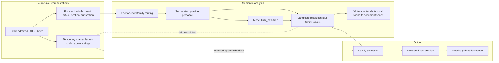
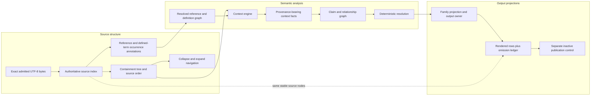

# Stage 2Y extraction architecture review

Date: 2026-08-10, amended 2026-08-11
Start-state commit: `853b9e83b1bf067eabb5b2c86a10918e47a7d7e6`
Initial report commit: `7ba2b9d4612cf95be5d0da4b06a56773e33d2f4e`
Original review branch: `codex/extraction-architecture-review-2026-08-10`
Amendment branch: `codex/stage-2y-structure-m2`
M2 implementation commit: `9a0bb6479f56ba4d17ad134fad7da27b75ba31d2`
Original authority: architecture recommendation only. Later authority permitted
the bounded shadow-only M2 implementation and canonical-document
reconciliation. It did not permit a production extractor change, model call,
pin-manifest change, baseline change, product write, serving or publication
change, pull request or merge.

> **Decision 18 amendment, 2026-08-11.** Sections 3 to 8 remain the evidence
> record reviewed on 2026-08-10. This amendment changes no measurement or
> historical finding. Decision 18 updates the target contracts, acceptance
> tests, technical work-order specification and Ben-ruling status in sections
> 11, 16, 18 and 20.
> Where older recommendation text conflicts with this amendment, the amendment
> controls. M0 to M2 are now complete. M3 remains unauthorised.

## 1. Executive decision

Precedent Machine needs an **incremental restructuring**. This means moving responsibilities behind new interfaces in stages while preserving reusable code and existing extracted results with their source support. It does not mean replacing the full system.

The present system preserves the exact source bytes accepted by its source checks. It also has useful code for articles, sections, source support, extracted statements, provision categories, rows and publication control. It does not have one complete representation of the agreement as written. Its stored outline covers agreements, articles, sections and some labelled subsections. It does not store sentences, list introductions, list items and qualifications in one complete hierarchy. Separate later code creates temporary list structure. Model output can create another grouping of list items. The code that decides each extracted statement's status then reconstructs missing context with rules written for individual provision categories. The system adds some structure after that decision. As a result, some parent context and its source record are removed or never reach output.

The target is one source index built by fixed rules, plus graphs. A **source index** is the ordered set of written blocks, each with an exact byte span and stable identifier. Its main relationship is a **containment tree**, which records what is written inside what. A **graph** is a set of named relationships that can connect written blocks outside that tree. Graphs are needed for cross-references, defined terms, control relationships, context passed from parent to child, and extracted statements. The claim-analysis stage should consume this structure. Rendered rows should consume its results. Rows must never define the contract structure.

The recommended module exposes three main entry points:

```text
indexAgreement(exactSource, structuralPolicy) -> AgreementIndex
analyseAgreement(AgreementIndex, analysisTask) -> AgreementAnalysis
projectAgreement(AgreementAnalysis, viewPolicy) -> AgreementProjection
```

This design does not authorise publication. Publication remains separate and requires a later approval.

A **shadow prototype** is an isolated comparison tool. It cannot alter current
extracted statements, product data, the extractor in use or publication. At the
time of this review, the first implementation experiment was to test five real
source sets: Concho 6.9(a), TopBuild 6.2, Red Hat 3.01 and 3.02 as one set,
Metsera 7.04, and Concho 4.10 with its Annex A knowledge definition. M1 and M2
have now completed that structural falsification work. They extended the
useful deterministic parser code and proved that a shared source index is
required. The proof keeps authored blocks in a containment tree and accounts
for every byte in a separate byte ledger. Parent and child spans may overlap.
Page or conversion bytes belong to source artefacts, not invented legal
blocks. This evidence confirms incremental restructuring. It does not support
targeted repair of the selected legacy extractor.

## 2. Terms and representations

This report uses these terms:

- **UTF-8** is the text encoding used by the system. A byte is one encoded unit used to locate source text exactly.
- **Canonical text** is the UTF-8 text accepted by the conversion process. Its byte positions are the extraction coordinate system.
- **Deterministic** means that the same input and rule versions always produce the same output.
- **Digest** is a fixed-length value calculated from content. The system uses it to detect a changed file or result.
- **Authored block** is one block written by the drafter. Examples are an
  article, annex, section, sentence, chapeau, limb, proviso or heading.
- **Source node** is the stable record for one authored block.
- **Chapeau** is introductory text that governs a following list. For example, “Parent shall” can govern limbs `(i)` to `(iv)`.
- **Limb** is one item in a written list. A **sub-limb** is a list item inside another limb.
- **Proviso** is a qualification introduced by language such as “provided that”.
- **Evidence span** is an exact half-open byte interval, from an included start byte to an excluded end byte.
- **Claim** is a structured statement of legal meaning extracted from source text.
- **Complete proposition** is a claim that contains every semantic role
  required by its versioned family rule. A role is one necessary part of the
  meaning, such as actor, restriction, object, threshold or qualification.
- **Claim vocabulary** is the approved list of claim types and values that the system can resolve.
- **Provision family** is a category of agreement terms handled together, such as Termination or Employee Matters.
- **Resolution** is the deterministic decision that a proposed claim is resolved, remains for review, or is open-world under the current approved extraction rules.
- **Open-world** means source-backed content for which the approved claim vocabulary has no complete mapping.
- **Projection** is a view of claims, such as a review card or comparison table row.
- **Provenance** is the record of where a value came from and how it reached its target.
- **Route registry** is the approved list that maps each provision family to its output code.
- **Output owner** means an approved entry in the current route registry. There is no separate owner registry in the measured code.
- **Fail closed** means return a named unresolved result instead of guessing.
- **Private internal extraction** means use of an extractor by authorised internal users without changing claim publication state.
- **External serving** means making claims available outside the approved private internal extraction path. Private internal extraction does not activate external serving.
- **Pin manifest** means an immutable, versioned list of saved run paths and digests selected as an input. A **selector** is a versioned configuration value that chooses an extractor or pin manifest.

Three representations must remain separate:

1. **Source structure.** The agreement as written, with exact bytes, labels, headings, sentences, lists, parent-child links and source order.
2. **Semantic analysis.** Facts, claims and legal relationships derived from source nodes. An inherited fact cites the node and span that supplied it.
3. **Output projections.** Review cards, rendered rows and later publication output. They select and arrange semantic facts. They do not create source structure or repair missing meaning.

The current system does not keep these representations fully separate. It has source structure at several incompatible levels. It sometimes creates structural meaning from model output. It attaches general structural context after claims have been resolved. It also asks some family resolvers and row projections to reconstruct detail that earlier stages did not preserve.

## 3. Review basis and start-state control

I ran `git fetch origin --prune` before reading project files. The remote branch `origin/claude/codex-handoff-plan-status-77wn7n` still pointed to the expected commit:

```text
853b9e83b1bf067eabb5b2c86a10918e47a7d7e6
```

The remote branch had not moved. There were no intervening commits to inspect. I created the report branch from that exact commit and confirmed `HEAD` before reading `CLAUDE.md` or project files.

The starting worktree was clean. It had no uncommitted files. The prior branch, `codex/m3-employee-dno-build`, was two commits ahead of its upstream. Those unpushed commits were:

```text
348edcae fix(stage-2y): isolate corrected Phase B V2 protocol
b8bac00f docs(canonical-v2): diagnose termination row loss
```

They are unpushed work, not part of this review. Switching branches preserved them. This report does not alter them.

### Sources read

The review read the required sources before reaching its decision:

- `CLAUDE.md`;
- `docs/core/PLAN.md`;
- `docs/core/DECISIONS.md`, including Decision 17 and all addenda;
- the strict Phase C/D/E measurement set: `evidence/canonical-v2/stage-2y-cd-baseline-manifest.json`, `evidence/canonical-v2/stage-2y-cd-baseline.json`, `evidence/canonical-v2/stage-2y-n-rendered-rows.json`, `evidence/canonical-v2/stage-2y-cd-report.json` and `evidence/canonical-v2/stage-2y-cd-known-loss-adjustment.json`, together with their producing scripts;
- the supporting Phase D/E reports: `evidence/canonical-v2/stage-2y-f-terra-adjudication.json`, `evidence/canonical-v2/stage-2y-g-duplicate-suppression.json`, `evidence/canonical-v2/stage-2y-h-representation-topic-replay.json`, `evidence/canonical-v2/stage-2y-h-representation-topic-comparison.json`, `evidence/canonical-v2/stage-2y-h-representation-topic-decision-ledger.json` and `evidence/canonical-v2/stage-2y-i-qualifier-dispatch-measurement.json`;
- the separate Step 2Y-C/D/E evidence: `evidence/canonical-v2/stage-2y-registry-substrate-replay.json`, `evidence/canonical-v2/stage-2y-registry-substrate-head-baseline.json`, `evidence/canonical-v2/stage-2y-parent-approval-resolution-set-diff-fixed.json`, `evidence/canonical-v2/stage-2y-registry-near-miss.json`, `evidence/canonical-v2/stage-2y-registry-near-miss.md`, `evidence/canonical-v2/stage-2y-d-defined-term-replay.json` and `evidence/canonical-v2/stage-2y-e-numeral-ladder-replay.json`, together with their producing scripts;
- `evidence/review-feedback/2026-08-10/README.md`, read before `evidence/review-feedback/2026-08-10/ben-row-feedback.json`; that JSON contains all 65 review-feedback records;
- the exact-source, parser, sectionizer, subclause, governing-context, evidence, claim, resolution, limb, routing, projection, row and publication implementations;
- focused tests and real saved fixtures for those stages; and
- the prior Phase B records without running Phase B or calling a model.

The three independent architecture papers and the audit papers are in `docs/codex-program/notes/stage-2y/extraction-architecture-review-evidence/`.

### Evidence method

The main test was not whether a unit test passed. It was whether a fact in exact source bytes survived this path:

```text
source bytes
  -> source node
  -> inherited context
  -> evidence span
  -> claim
  -> resolution
  -> family route
  -> rendered row
  -> publication control
```

Counts were traced to their scripts, manifests and saved artefacts. The measurement audit independently checked 263 file hashes and four self-identifiers. No discrepancy was found. See `extraction-architecture-review-evidence/measurement-audit.md`.

## 4. Current architecture, based on code

### Current architecture diagram



### 4.1 Contract structure parsing

`lib/parser-v2/structural.js` detects article and section headings and enriches section records with hierarchy metadata. It returns flat arrays of articles, sections and regions. It does not create stable child nodes for sentences, chapeaux, limbs, provisos or qualifications. Some offsets use JavaScript character positions rather than the canonical UTF-8 byte system.

`lib/canonical-v2/native-producer/deterministic-sectionizer.js` is the stronger persistent structure. It emits a root, articles, sections and generic subsections with UTF-8 spans and content-derived identifiers. Each record has `parent_section_id`, but callers receive a flat array rather than child arrays. The identifier includes the parent, span and text digest. This makes the result deterministic, but a corrected parent or boundary can change identity. The recognised kinds are only `ROOT`, `ARTICLE`, `SECTION` and `SUBSECTION`. See `deterministic-sectionizer.js:740-803` and `:835-1079`.

The sectionizer does not create nodes for:

- paragraphs or independent unnumbered sentences;
- chapeaux;
- inline limbs and sub-limbs that do not meet its line-start rules;
- provisos, exceptions or trailing qualifications;
- headings and outline-marker tokens as separately typed source blocks; or
- cross-reference and defined-term links.

`findSectionByReference` returns the first exact reference match. It does not represent a reference occurrence or report a collision as a graph ambiguity.

### 4.2 Temporary subclause and governing structure

`lib/parser-v2/subclauses.js` applies a different, more permissive marker grammar. It returns ordered leaf spans with a marker path, depth, character start, character end and text. A null marker means text before the first marker or a parent chapeau. It has no durable node identifier or parent-node record. A markerless section becomes one leaf, even when it contains several independent sentences. See `subclauses.js:391-443`.

`lib/canonical-v2/native-producer/governing-structure.js` converts those leaves to UTF-8 spans. It derives parent paths by splitting marker strings. It can return the containing leaf and a chain of chapeau spans. It fails closed for crossing spans and known same-style ambiguity. Marker corroboration checks that a token exists. It does not prove its parent. See `governing-structure.js:166-208`, `:211-258` and `:294-366`.

This is useful parsing logic. It is not an authoritative agreement tree. Its contract states that the result is annotation-only. The termination adapter also shortens a chapeau at the first colon, semicolon or newline. That family-specific boundary can omit governing text after the chosen punctuation.

### 4.3 Context creation and evidence spans

`candidate-governing-context.js` builds a report-only context ladder. It can expose the operative quote, rendered line, whole section, containing leaf, chapeau chain, siblings and trailing text. It accepts only one evidence edge and requires it to be the sole `OPERATIVE_TEXT` edge. This excludes claims that require several source spans. It records section metadata, but not stable source-node links for every fact. See `candidate-governing-context.js:77-168`.

`structure-placement.js` attaches `structure_context` after resolution. The module says this annotation must never affect identity or model input. It takes the minimum and maximum of evidence edges, so separate spans can form one artificial envelope that crosses leaves and fails closed. Its `absolute_start` and `absolute_end` values are section-local in this path despite their names. Some projection bridges call `withoutStructureContext`, which removes the annotation. See `structure-placement.js:51-85`, `:118-231` and `:221-225`.

`source-structure.js` is a sound exact-source base. It validates UTF-8 bytes, binds immutable source identities and creates exact semantic spans. Its provisions are semantic occurrences. A structural provision is concept-specific, not a complete written node. Components are flat children of a provision rather than a complete agreement hierarchy. See `source-structure.js:43-111`, `:148-215` and `:308-402`.

`native-write-set-adapter.js` repairs the coordinate seam at persistence. Producer evidence is section-local. The adapter adds the section start, verifies the source slice and creates new document-level evidence and claim revision identifiers. This preserves exact output evidence, but it means a claim can have one identity during resolution and another after writing. The architecture should declare coordinate type before resolution instead of repairing an ambiguously named field later.

### 4.4 Claim production and resolution

Provider prompts receive a selected section as flat text plus family instructions and some definitions. The general provider can propose a `limb_path`. It then locates returned evidence quotes in source. The general quote locator selects the first occurrence, although a separate all-occurrence helper exists. A repeated quote can therefore bind to the wrong location unless another check catches it.

`candidate-resolution.js` is a large, all-family resolver. It groups candidates by section, concept and party. It often creates a provision over the whole section. General structure is attached only after resolved, review and open-world lists exist. The file also contains valuable family-specific recovery logic. Interim operating covenants search backwards for a party and governing verb. Termination uses separate chapeau, direction and fallback grammars. Those repairs demonstrate the need for inherited context, but they do not provide one general provenance-bearing model. See `candidate-resolution.js:21-59`, `:1561-1855`, `:5161-5258`, `:5861-5957`, `:10384-10612` and `:11808-11818`.

Claim resolution is therefore compensating for inadequate structural parsing. It should keep its proven legal rules, but it should consume explicit context rather than reconstruct source hierarchy inside each family.

### 4.5 Limb production

`limb-components.js` creates a semantic component tree from compiled model candidates and their `limb_path` values. A path-node identifier is based on the semantic provision and path. Path nodes have no source span. Missing ancestors are invented mechanically. Assertion nodes can have exact evidence. Qualifier attachment distinguishes one assertion, several assertions and an empty structural path. See `limb-components.js:19-57` and `:236-398`.

This module is useful for semantic grouping. It is not proof of source structure. A descriptive model label can become a spanless path node. `derived-limb-identity.js` is a design stub and is not wired into extraction. `limb-enumeration-scan.js` is reporting-only.

The repository also has reusable graph primitives. `definition-graph.js`, `entity-subject.js`, `deal-participant-relationship.js` and `transaction-structure-resolution.js` model definitions, subjects, participants and transaction roles. They are tested. The measured `candidate-resolution.js` path does not integrate the last three as one agreement-wide relationship graph. The target should integrate these modules, not rebuild their working primitives.

### 4.6 Family routing, rows and publication

`section-family-classifier.js`, `family-detection-profiles.js`, `family-section-ref-generator.js` and `producer-prompt-registry.js` route whole sections and select family providers. `native-extraction-run.js` sends exact selected section text to the provider. It does not send a complete source subtree with governing ancestors and linked targets.

Cross-reference support is also split. `bare-citation-trigger-parser.js` recognises citation text. `citation-constructibility.js` helps attach a citation to a containing structural record. `native-extraction-run-citation-followup.js` schedules one bounded follow-up hop for the current Termination Fee path. These are useful detectors and receipt checks. The family-specific scheduling is a workaround, not a general agreement reference graph.

`rendered-row-preview-contract.js` lists the approved family routes. Seventeen families have routes. Seven measured families do not. `rendered-row-preview.js` requires a routed claim to project to one card and one exact lineage-bearing row. It fails closed when there are zero or several matches. A weak content check treats any non-empty cell other than four exact absence phrases as content. `See provision` passes. A pass does not prove that party, exception, period or operative detail survived.

Publication is correctly separate. Current V2 control can mark data withheld or eligible, but it cannot publish it. External serving remains disabled until a future authorised adapter exists. The architecture review made no publication change. This responsibility should remain.

### 4.7 Current seam assessment

The current responsibilities are wrong at three seams:

1. Source hierarchy is incomplete before semantic analysis. Two later parsers and model paths create competing structure.
2. Inherited context is an annotation after resolution. Family resolvers reconstruct it before or during claim formation.
3. Output modules receive incomplete semantic facts. They either omit detail, group it, or use family-specific logic to recover part of it.

These are structural seam defects. They are more than incomplete implementation inside one correct module. Exact source and resolved claims remain reusable, so they do not justify a full replacement.

## 5. Current measurements

The fixed measurement cohort contains 130 saved family-deal runs. For each family and deal, the manifest selects the eligible saved run with the highest resolved count, then the lexically first directory on a tie. Runs with zero resolved claims are excluded. This is a fixed regression cohort. It is not an unbiased measure of corpus recall.

### 5.1 Extraction states

| State | Count | What it measures |
|---|---:|---|
| Attempted | 2,201 | Resolved claims plus review rows whose `has_resolution` is exactly false. |
| Resolved | 1,526 | Claim revisions in `resolution.resolved`. |
| Review | 675 | Attempted items without a resolution. |
| Open-world | 1,701 | Entries in the separate `resolution.open_world` arrays. No deduplication is applied. |

The equations are:

```text
attempted = resolved + review = 1,526 + 675 = 2,201
open-world = separate list = 1,701
```

Do not add all four numbers. They are not four disjoint parts of one recovery total. See `scripts/stage-2y-cd-measurement.mjs:71-77` and `extraction-architecture-review-evidence/measurement-audit.md:45-72`.

### 5.2 Claim-to-row funnel

| Stage | Count | Exact meaning |
|---|---:|---|
| Resolved input | 1,526 | Claim revisions submitted to the output measurement. |
| No family route | 175 | Resolved claims in families absent from `FAMILY_ROUTES`. |
| Approved route available | 1,351 | `1,526 - 175`. |
| Feature-row lineage not unique | 109 | The expected feature matched zero or more than one row. |
| Routed claim produced no row | 1 | A row selector returned no row. |
| Mechanical claim-to-row success | 1,241 | One routed claim reached one exact lineage-bearing row with at least one weakly non-empty cell. |

The correct statement is: **1,241 of 1,526 resolved claim revisions, or 81.3%, pass the current route, card, exact-row-lineage and weak content checks.** This is not 1,241 distinct physical rows. There are 981 distinct full-output signatures in that result. It is not source recall, legal completeness, human acceptance or publication.

The 109 failures split into 100 MAE Definition claims, 7 Antitrust or
Regulatory claims and 2 Employee Matters claims. The saved aggregate proves
only that the match count was not one. It does not retain member identifiers,
feature keys or observed match counts, so it does not prove grouping as the
cause. M6 must reproduce all 109 at member level before assigning a cause or
changing output.

The one routed no-row case is corroborated as TopBuild section 6.3, `TERMINATION_RIGHT_GRANT`, `TERMR-NOSOL-BREACH`, claim revision `0259692458a71a8817779823b10936ebfce9beb047a6232d0a28113f7cc4f9d3`. The aggregate retains the error count, not the failed claim identifier.

The 175 claims without an approved route split as follows:

| Family | Count |
|---|---:|
| Key Defined Terms | 76 |
| Representations | 70 |
| Tax Matters | 17 |
| Appraisal or Dissenters' Rights | 5 |
| Financing Covenants | 5 |
| Dividends | 1 |
| Guaranty or Financing Party | 1 |

### 5.3 The 1,097 adjusted count

Four stated loss rules identify 244 affected claims:

| Loss rule | Identified | Additional deduction from 1,241 |
|---|---:|---:|
| D&O mechanic not rendered | 25 | 25 |
| No Shop information loss | 75 | 75 |
| No Other Reps or Fraud party not rendered | 36 | 36 |
| MAE party not rendered | 108 | 8 |
| Total | 244 | 144 |

One hundred MAE claims already failed the mechanical row gate. The calculation is therefore:

```text
1,241 mechanical claim-level successes
- 144 additional known-loss deductions
= 1,097 cautious known-loss-adjusted successes

1,097 / 1,526 = 71.8873%, displayed as 71.9%
```

The 1,097 is explicitly `KNOWN_LOSS_ADJUSTED_NOT_HUMAN_ACCEPTED`. It does not say that a lawyer accepted 1,097 rows. It does not include every possible lost relationship or qualification.

### 5.4 What the measurements establish

They establish deterministic transport counts for a fixed saved cohort. They do not establish complete source parsing, claim recall, legal correctness, row completeness, human acceptance or mission readiness. The measurement process itself made zero model calls. Its saved input claims can still have model provenance.

## 6. End-to-end traces

Each trace follows exact source through publication control. “Should inherit” states the structural reading that deterministic analysis should make available. It does not decide a disputed legal meaning.

Every trace is report-only and blocked from publication. A claim field such as `publication_state: VALIDATED` is a validation state. It is not publication permission. The current `REQUIRE_PUBLISHED` filter returns no product claims.

### 6.1 Concho section 6.9(a), list chapeau and employee limbs

**Source.** The subsection starts with a time limit and obligation: until 31 December of the year of the Effective Time, Parent must cause each Company Employee to receive stated treatment. It then lists `(i)` cash compensation, `(ii)` equity compensation, `(iii)` benefits and `(iv)` severance. Limbs `(i)` and `(ii)` include local provisos.

| Step | Result |
|---|---|
| Structural parent | Section 6.9, under Article VI. The written parent of `(i)` is the list-bearing sentence in subsection `(a)`. |
| Structural children | Target: sentence, chapeau, limbs `(i)` to `(iv)`, and local provisos. Current persistent result: section 6.9 has children `(a)` to `(g)`, but `(a)` has no children. |
| Should inherit | Each list item receives `Parent`, `shall`, `cause ... to be provided with`, the employee scope and the 31 December period from the chapeau. Each value retains its chapeau node and span. A local proviso does not flow to a sibling. |
| Actually inherited | The post-resolution `structure_context` contains all of subsection `(a)`. It does not materialise party, period or governing verb as provenance-bearing facts on the compensation claim. The provider separately proposed the period as `CONTINUATION_PERIOD`; resolution retained it for review with `MONTH_COUNT_UNRESOLVED`. |
| Evidence | Claim `21ed619a3633dcd6356f284abfcb8aa0c3f6b59de6c7f2eccca39be98a882170` cites only the direct `(i)` compensation phrase, at section-local bytes 392 to 634. |
| Claims | The resolved `EMPLOYEE_COMP_ITEM_STANDARD` has base salary, no-less-favourable, item-by-item and buyer-comparator attributes. It has no party, period or governing verb attribute. A separate period proposal, original occurrence `763260be023ca4cb9627767607db25c11a0f409179122637de6e9f3ce058e115`, remains unresolved review. |
| Resolution and route | Resolved. Routed through Employee Matters. |
| Rendered row | Base salary; similarly situated buyer employees; no less favourable; `Period: Not specified`. |
| Loss | The period, Parent, `shall cause`, and list relationship do not survive as row facts. The period was extracted but stopped at resolution and was never composed with the compensation claim. The employee producer schema has no party or governing-verb fields. This proves missing context composition. It does not prove that inheritance alone caused the period loss. |
| Publication | Inactive. No publication authority. |

Evidence: `extraction-architecture-review-evidence/hierarchy-first.md:110-171`; `evidence/review-feedback/2026-08-10/README.md:12-21`; `evidence/review-feedback/2026-08-10/ben-row-feedback.json:23`.

### 6.2 TopBuild section 6.2, termination chapeau and causation provisos

**Source.** The section says that, before the Effective Time, either Parent or the Company may terminate the agreement on four lettered grounds. Limb `(d)` concerns a permanent, final and non-appealable legal restraint. A proviso limits the right where the terminating party's failure caused the restraint.

| Step | Result |
|---|---|
| Structural parent | Section 6.2 under Article VI. The list-bearing termination grant is parent to limbs `(a)` to `(d)`. |
| Structural children | Current sectionizer creates `(a)` to `(d)`. It does not create a stable chapeau node or stable proviso children. |
| Should inherit | Each limb receives the right holders, `may terminate`, the agreement object and the pre-Effective-Time scope from the chapeau. Each proviso attaches only to its governed limb. |
| Actually inherited | The general model does not provide typed inheritance. Termination-specific code separately derives the mutual grant, directions and party source span. |
| Evidence | The trigger claim cites its limb. `termination_grant_context` and `party_source_span` separately cite the chapeau. The provision instance spans the whole section. |
| Claims | Two party-scoped termination-right claims can be produced, one for Parent and one for Company. |
| Resolution and route | Resolved and routed through Termination. |
| Rendered row | A mutual legal-restraint termination row reaches output and retains the permanent and final trigger. |
| Loss | The causation proviso is not a separate governed evidence edge on the right-grant claim and is not shown. `party_source_span` cannot round-trip through the current staging write set. |
| Publication | Inactive. |

This is a successful local repair and an unsuccessful general architecture. It recovers party identity for this family, but later persistence and projection can still lose the provenance and exception.

The Parent claim is `3ccd0cd6650e6d4b94b65e8cb16edd70c659bd9e07de1b5242d810a0dcbe61ec`. Its direct evidence is `b51339f6338c1879e4ea8ef7cc69313f822d1cffe7a8fd0b3ea8e3e89485be64`, section-local bytes 984 to 1133, ending before the proviso. The Company twin is `6eec69a40657eb5f627df4344a392cc71603c285729bf0386b11fe3452fcd8a0`.

### 6.3 TopBuild section 6.3, nested limbs and a resolved claim with no row

**Source.** Section 6.3 grants the Company a termination right. Subsection `(a)` contains alternative nested grounds, including `(i)` with sub-limbs `(A)` and `(B)`, and `(ii)` with sub-limbs `(A)` and `(B)`. The relevant ground concerns a material breach by Parent or its Representatives of section 4.4. It is subject to cure and notice timing before the Outside Date.

The separate settled proviso-scope example is the full 6.3(b) block. The
governing chapeau is bytes `[365813, 365953)`:

> This Agreement may be terminated and the Mergers may be abandoned at any time prior to the Titanium Merger Effective Time by the Company if:

The complete 6.3(b) node is
`9f447b48d4ba8907edbf078abd719875bb6e9b47b63bbdd459a4f36f951d275b`,
bytes `[366615, 367588)`, in the sealed TopBuild M2 index:
`evidence/canonical-v2/stage-2y-structure-migration/shadow/m2/3888fa7618bbd9fd6530b657aaa18c7e85ff515acf80edb1fc78a190af86e9cb.agreement-index.json`.
For readable display, the quote omits three invisible U+200E directional marks
before the section references. The sealed node and span are authoritative.

> (b) there has been a breach or inaccuracy of any representation, warranty, covenant or agreement made by Parent, Titanium Merger Sub or Forward Merger Sub in this Agreement, or any such representation or warranty shall have become untrue after the date of this Agreement, such that (i) such breach or inaccuracy or failure to be true would result in the failure to satisfy one or more of the conditions set forth in Sections 5.3(a)(i) or 5.3(a)(ii) and (ii) such breach or inaccuracy or failure to be true is not curable by the Outside Date or, if capable of being cured by the Outside Date, shall not have been cured prior to the earlier of (x) thirty (30) days after written notice thereof is given by the Company to Parent or (y) the Outside Date (provided that the Company is not then in breach of any representation, warranty, covenant or agreement under this Agreement such that Parent would have the right to terminate this Agreement under Section 6.4(b)).

The qualification node is
`da4732d59d811adfc7cda5ab4ce1fe4d40fe0b4bef9e3a5c8a29b094708d52e0`,
bytes `[367372, 367587)`. Ben's ruling is that it conditions the complete
6.3(b) termination right. Its written location beneath `(y)` does not limit its
semantic scope to `(y)`.

| Step | Result |
|---|---|
| Structural parent | Section 6.3 under Article VI. The current direct children are 6.3(a) and 6.3(b). |
| Structural children | Target: grant chapeau, `(a)`, `(a)(i)`, `(a)(i)(A/B)`, `(a)(ii)`, `(a)(ii)(A/B)`, plus qualification blocks. Current persistent `(a)` has no such descendants. The temporary parser treats most of `(a)` as one leaf. |
| Should inherit | The nested breach ground receives Company as right holder and the governing termination verb from the section chapeau. The cure, notice and Outside Date limits govern that ground and must keep their own spans. The cross-reference to 4.4 is a reference edge, not copied local text. |
| Actually inherited | Termination-specific resolution reconstructs grant context. It stores governing text, but not as a general node-to-node inheritance record. |
| Evidence | Claim `025969...f9d3` uses section-local bytes 423 to 548 before persistence. The write adapter shifts them to document bytes 366204 to 366329 and rekeys the claim. |
| Claim | `TERMINATION_RIGHT_GRANT`, concept `TERMR-NOSOL-BREACH`, party Company. The raw ground identifies Parent or Representatives and material breach of section 4.4. |
| Resolution and route | Resolved. Its concept routes to the No Shop output configuration. |
| Rendered row | None. The preview fails with `CLAIM_RENDERED_NO_ROW`. |
| Loss | The claim exists but output has no row. Nested written parentage, grant provenance and qualification scope remain distributed across temporary context and family-specific fields. |
| Publication | Inactive. |

This case covers nested subsections, sub-limbs, a chapeau, defined dates, a cross-reference, party inheritance, qualifications and the single measured no-row result.

### 6.4 Red Hat sections 3.01 and 3.02, markers, headings and three bare sentences

**Source.** Section 3.01 includes a top-level `(h)` headed “Contracts”, followed by a roman `(i)` item that belongs below it. Section 3.02(b)(i) contains three independent unnumbered sentences about corporate power, authorisation, and execution or enforceability. The 69-item workload comes from the historical `redhat-representations-20260808-2xl-replay`, not the Red Hat run selected in the current 130-run measurement manifest.

| Step | Result |
|---|---|
| Structural parent | Target: the roman `(i)` is a child of `(h)`. Each of the three section 3.02 sentences is a child of its containing source block. |
| Structural children | Current section scan creates a 15-byte 3.01(h) and then treats 3.01(i) as a top-level sibling. It creates no sentence children for 3.02. |
| Should inherit | A child inherits only proven grammar from its written ancestor. A heading can classify a block but is not a grammatical subject or verb. |
| Actually inherited | The model path records `[(h),(i)]`, which disagrees with the persistent parentage. For 3.02 it creates three spanless paths named “Corporate power and authority”, “Due authorization” and “Due execution and enforceability”. |
| Evidence | Six of the 69 reviewed inputs have exact semantic assertion nodes. The remaining model paths do not establish source nodes. |
| Claims | Across the 69 cases: 62 are open-world only, 6 are open-world plus an assertion node, and 1 has an unverified residual quote. |
| Resolution and route | None of these 69 selected items resolves: 68 are open-world and 1 is a residual. They therefore do not enter a family route. Separately, the measured cohort contains 70 other resolved Representations claims, and that family has no approved route. |
| Rendered row | None for the selected 69 because they are not resolved. The separate 70 resolved Representations claims also have no row owner. |
| Loss | Written parentage is wrong in 3.01. The three real sentences in 3.02 have no source identity. Model summaries are treated like structural paths even though they are not authored headings or markers. |
| Publication | Inactive. |

The marker-path audit found 66 marker paths, 3 descriptive paths and no mixed paths. That is path hygiene, not source-tree completeness. All 69 paths need source binding. Six additionally have byte-verified semantic assertion nodes, but those assertion nodes are not source nodes. Their open-world or claim disposition remains a separate question. The current pinned Red Hat Representations run is `redhat-representations-20260809-2xk-final`; it has a different population. See `docs/codex-program/notes/step-2x-l1-limb-disposition.md:55-132`.

### 6.5 Red Hat section 5.07, separate bare sentences and trailing exception

**Source.** The section contains an initial press-release sentence. A separate reciprocal sentence requires consultation, review and an opportunity to comment before a public announcement, subject to Law and stock-listing exceptions. A proviso concerns statements that are substantially similar to earlier approved statements.

The full section node is
`631099a608f1824b31839d66fbe93ca77465d041e327c11d08d36c4fc76bb090`,
bytes `[197134, 198597)`, in the sealed Red Hat M2 index:
`evidence/canonical-v2/stage-2y-structure-migration/shadow/m2/06ec301641939fe0ac6e6ba598a33b40f16b1acc3ffb29109c7227b14bf1025a.agreement-index.json`.

> Section 5.07 Public Announcements. The parties agree that the initial press release to be issued with respect to the transactions contemplated by this Agreement shall be in the form heretofore agreed to by the parties. Thereafter, the Company, on the one hand, and Parent and Sub, on the other hand, shall, to the extent at all reasonably practicable, consult with the other parties to this Agreement before making, and give such other parties to this Agreement a reasonable opportunity to review and comment upon, any press release or other public statements with respect to this Agreement, the Merger and the other transactions contemplated by this Agreement, and shall not issue any such press release or make any such public statement prior to such reasonably practicable consultation, except as may be required by applicable Law, court process or by obligations pursuant to any listing agreement with any national securities exchange or national securities quotation system; provided that the foregoing shall not apply to any press release or public statement so long as the statements contained therein concerning this Agreement, the Merger and the other transactions contemplated by this Agreement are substantially similar to previous releases or statements made by the applicable party with respect to which such party has complied with the provisions of this sentence and would not otherwise require the other party to make additional public disclosure

The complete second operative block is `[197353, 198596)`. The qualification
node is `42a47173ff9ec87207abdda6167430f1f9668ad99a20d97746c1b6961d58316a`,
bytes `[198114, 198596)`. Ben's ruling is that the substantially-similar proviso
governs every operative duty before it in the second block. It does not govern
the initial-release sentence.

| Step | Result |
|---|---|
| Structural parent | Section 5.07 under Article V. |
| Structural children | Target: at least two independent sentence nodes, with the exception and trailing proviso attached to their governed sentence. Current: no direct source children and one 1,463-byte markerless leaf. |
| Should inherit | Reciprocal actors and governing verbs remain on their sentence. The Law and listing exception limits the relevant consultation obligation. The substantially-similar proviso keeps its scope. |
| Actually inherited | The whole section is the markerless context after resolution. There are no field-level inherited links. |
| Evidence | The resolved claim's direct raw evidence contains only the second sentence's operative core. |
| Claim | A Public Announcements or Disclosure claim with a joint party label. |
| Resolution and route | Resolved and routed through General Covenants. |
| Rendered row | `Public Announcements; Disclosure`, plus Party. |
| Loss | The press-release branch, consultation mechanics, review and comment right, no-issue obligation, Law and listing exception, and substantially-similar proviso are absent from the row. |
| Publication | Inactive. |

This confirms that separate unnumbered sentences need stable child nodes even where the source has no labels.

The current section node is `4bac29fea087e4301232f88daeff477901159ce251ec3b59fe28ed40dc5cbbaa`. Claim `49be0b7d6130a1a404065492714fdcca7af8ade53037b72a99837676da91b37d` cites evidence `757716df2f0c52999fc053a5696d942d6b40e6983b9ac1462f0eb15ddc472b58`, section-local bytes 231 to 788. Its rendered result is in full-output duplicate group 182.

### 6.6 Metsera section 7.04, reciprocal sentences and cross-references

**Source.** The first sentence prevents Parent and Merger Sub from relying on failure of conditions in sections 7.01 or 7.02 when their material breach primarily caused that failure. The second does the same for the Company and sections 7.01 or 7.03.

| Step | Result |
|---|---|
| Structural parent | Section 7.04 under Article VII. |
| Structural children | Target: two independent unnumbered sentence nodes, each with two reference occurrences. Current: no children; one markerless leaf containing the heading, both sentences and a page footer. |
| Should inherit | No actor or condition set should flow from one sentence into the other. Each causal qualification remains with its branch. Cross-reference occurrences link to all named targets. |
| Actually inherited | The current result labels the first sentence a parent chapeau and the second a child clause. It collapses the parties to `Either Principal Party`. |
| Evidence | Claim `7490a23a...db9` cites the second sentence, while its semantic subject spans the whole section. |
| Claim | A frustration or prevention claim. It records section 7.01 as one explicit cross-reference although its quote also names 7.03. |
| Resolution and route | Resolved and routed through Closing Conditions. |
| Rendered row | `Mutual conditions`, `Frustration / Prevention`, `See provision`, `Party: Either Principal Party`, `Material breach`. |
| Loss | The three named actors in two branch-specific actor sets, different condition sets, `may not rely`, `primarily caused`, full cross-reference set and causal relationship are not preserved in the row. |
| Publication | Inactive. |

The row passes the mechanical gate. It is direct proof that row reachability is not information preservation. See `extraction-architecture-review-evidence/claim-first-counterproposal.md:264-352`.

### 6.7 Metsera section 9.03, defined terms, control and MAE qualifications

**Source.** Section 9.03 contains many separate unnumbered definitions. The affiliate definition states that a Person controls, is controlled by, or is under common control with another Person. “Control” concerns the power to direct management and policies through securities, contract or otherwise. The MAE definition later contains prongs `(i)` and `(ii)`, carve-outs `(A)` to `(J)`, and a trailing disproportionate-effects qualification.

| Step | Result |
|---|---|
| Structural parent | Section 9.03 under Article IX. Each definition should be an independent child block. The MAE list belongs under the MAE definition sentence. |
| Structural children | Target: definition blocks, MAE chapeau, prongs, carve-out sub-limbs and trailing qualification. Current: no persistent definition children. The temporary parser begins a large marker leaf at `(i)` and can extend `(J)` through later unrelated definitions. |
| Should inherit | MAE carve-outs inherit only the MAE governing grammar. The disproportionate-effects qualification attaches to the stated carve-outs. Defined-term references link to their definition blocks. Control relations become semantic edges, not parent-child edges. |
| Actually inherited | Several MAE carve-out claims are structurally undetermined. One trailing MAE claim is placed in an oversized `i.J` leaf that extends to the section end. The definition and use relationships are not one stable graph. |
| Defined-term evidence and claims | In the separate Key Defined Terms run, `affiliate` and `control` are exact-evidence `OPEN_WORLD_PROPOSITION` items. They do not become resolved MAE claims. |
| MAE evidence and claims | The trailing qualification claim uses the correct narrower local span, while the structural leaf is much larger. Fifteen resolved MAE claims include carve-outs and a disproportionate-effects claim. The latter carries applicable labels, comparison baseline and incremental-impact attributes. |
| Resolution and route | The defined-term items remain open-world and have no row. The MAE claims resolve and route through MAE Definition. |
| Rendered row | The disproportionate-effects claim reaches `Disproportionality relationships; Disproportionality carveback`. The `affiliate` and `control` items do not reach a row. |
| Loss | The row omits the applicable carve-out labels, comparison baseline and incremental-impact detail. This claim is among the 8 of 108 MAE claims that reach a row. Its arrival does not prove that its legal detail survived. The separate control definition never enters current output. |
| Publication | Inactive. |

This case shows why a containment tree needs a reference and relationship graph. Control is not containment. A definition use can point to a distant definition. A qualification can govern several non-contiguous semantic facts. It also shows why results from Key Defined Terms and MAE must not be presented as one pipeline.

### 6.8 Concho section 6.20, party and cause-to-perform relationship

**Source.** One sentence requires Parent to take all action necessary to cause Merger Sub and the Surviving Corporation to perform their obligations.

| Step | Result |
|---|---|
| Structural parent | Section 6.20 under Article VI. |
| Structural children | Target: one unnumbered sentence node. Current: no child; one markerless section leaf. |
| Should inherit | No downward list inheritance is required. Semantic analysis should preserve Parent as actor, Merger Sub and the Surviving Corporation as performance entities, the `cause ... to perform` relationship and the obligations object. |
| Actually inherited | Whole-section context only. The cause-to-perform relation is not represented as a typed relationship. |
| Evidence and claim | Resolved claim `7d9243...` cites the full sentence and has party Parent. |
| Resolution and route | Resolved and routed through General Covenants. |
| Rendered row | `Merger Sub Compliance`, `Party: Parent`. |
| Loss | The Surviving Corporation and the express cause-to-perform relationship disappear. |
| Publication | Inactive. |

This provision disproves a strict tree-only semantic design. The sentence is a tree node. The cause-to-perform relations between the three parties belong in a semantic graph. This source alone does not prove a corporate-control status.

### 6.9 Concho section 4.10 and Annex A, a defined-term use

**Source.** Section 4.10 uses “to the knowledge of the Company”. Annex A separately defines `knowledge` by reference to actual knowledge. The definition does not occur inside the use sentence.

| Step | Result |
|---|---|
| Structural parent | The use belongs to section 4.10 and its article. The definition belongs to its separate Annex A definition block. Neither is the other's containment parent. |
| Structural children | Target: a stable containing sentence node, an exact `REFERENCE_OCCURRENCE` anchor for the use, and a stable definition node for `knowledge`. `USES_DEFINITION` belongs in the reference or semantic graph, not the source tree. Current definition and use records exist in separate paths. |
| Should inherit | Definition text must not be inherited as local wording. A `USES_DEFINITION` edge should link the exact use occurrence to the exact Annex A definition occurrence. |
| Actually inherited | A deterministic Stage D replay proves the join and resolves the effective code as `ACTUAL`. The current final Representations resolution does not consume that join. |
| Evidence | The use has exact document bytes 62777 to 62808. The definition has separate head and operative evidence at document bytes 325127 to 325148 and 325149 to 325172. |
| Claim | The use candidate remains open-world with `REPRESENTATION_KNOWLEDGE_STANDARD_UNCORROBORATED` in the current final path. |
| Resolution and route | The Stage D defined-term result is replay-only. It is not a canonical resolved relationship. Representations also has no approved output owner. |
| Rendered row | None. |
| Loss | The system can prove the use-to-definition join in a separate ledger, but ordinary resolution and output cannot use it. |
| Publication | Inactive. |

Evidence: `evidence/canonical-v2/stage-2y-d-defined-term-replay.json`, ledger row `6a81aec50323e0c1fc3c9d8c52997c3581cdd752728be2feb1edcfb15010e932`.

### 6.10 Concho section 6.11, a trailing proviso detached from its sentence

**Source.** The section has two independent unnumbered sentences. The second gives Parent participation and consultation rights in Transaction Litigation. It ends with a proviso that restricts the Company's ability to stop defending, consent to judgment or settle without Parent's written consent, which may not be unreasonably withheld, conditioned or delayed.

The full section node is
`8a7edf9909a731e67073c585e5d2fed139bf3601a8a4423c37563fb7ea06c02f`,
bytes `[242010, 243106)`, in the sealed Concho M2 index:
`evidence/canonical-v2/stage-2y-structure-migration/shadow/m2/1d6bba9ac993f72340d048742f995eb515a50cdfadb9bc86b3f36847baed9116.agreement-index.json`.

> 6.11 Transaction Litigation. In the event any Proceeding by any Governmental Entity or other Person is commenced or, to the knowledge of the Company or Parent, as applicable, threatened, that questions the validity or legality of the Transactions or seeks damages in connection therewith, including stockholder litigation (“Transaction Litigation”), the Company or Parent, as applicable, shall promptly notify the other Party of such Transaction Litigation and shall keep the other Party reasonably informed with respect to the status thereof. The Company shall give Parent a reasonable opportunity to participate in the defense or settlement of any Transaction Litigation and shall consult regularly with Parent in good faith and give reasonable consideration to Parent’s advice with respect to such Transaction Litigation; provided, that the Company shall not cease to defend, consent to the entry of any judgment, settle or offer to settle any Transaction Litigation without the prior written consent of Parent (which consent shall not be unreasonably withheld, conditioned or delayed).

Sentence one is `[242039, 242557)`. Sentence two is node
`be2cf74eac8f1cd81be57c57799f7b465d68333d79f0b6b345e7d86222782302`,
bytes `[242558, 243105)`. The qualification node is
`9c0669b13907004d1c48aa573ab26e9e428f8de0a080f2a42ab6fa557addf285`,
bytes `[242841, 243105)`. Ben's ruling is that it is an additional Company
covenant attached to sentence two. It is not an exception to the participation
and consultation covenant, and it is not part of sentence one.

| Step | Result |
|---|---|
| Structural parent | Section 6.11 under Article VI. The proviso is a child or scoped qualification of sentence two, not of sentence one. |
| Structural children | Target: two sentence nodes, with operative and proviso blocks under sentence two. Current: no persistent children and one markerless leaf. |
| Should inherit | The proviso retains Company as its direct or governed actor and attaches to sentence two only. Nothing flows from the reciprocal first sentence merely by adjacency. |
| Actually inherited | The operative part resolves as one claim. The proviso becomes a separate open-world item. No relationship joins them. |
| Evidence | Resolved claim `80aaea2f...fab6` cites section-local bytes 548 to 830. Open-world proviso evidence `60fe9d35...5c80` cites bytes 846 to 1095. |
| Claim | A Transaction Litigation general-covenant claim for the Company. |
| Resolution and route | The operative claim resolves and routes through General Covenants. The proviso remains open-world. |
| Rendered row | `Stockholder / Transaction Litigation`, `Party: The Company`. |
| Loss | Participation, consultation, good-faith consideration, Parent consent and its reasonableness standard are absent. The proviso-to-obligation relationship is lost before output. |
| Publication | Inactive. |

### 6.11 Concho section 6.16, agreement-to-article hierarchy and three sentences

**Source.** Article VI contains section 6.16, “Stock Exchange Listing and Delistings”. Its three independent sentences cover Parent's listing obligation, the Company's delisting and deregistration obligation, and the Company's draft SEC-report delivery obligation. They have different actors, objects and timing.

| Step | Result |
|---|---|
| Structural parent | Agreement root, then Article VI, then section 6.16. The section has current parent identifier `fc504fba...6bebb`. The run receipt does not carry the full parent article payload, so the raw source fixture corroborates the authored heading. |
| Structural children | Target: three ordered sentence nodes. Current: the section node `1deafb...9ae7` has no sentence children; one markerless leaf covers heading, three sentences and a footer. |
| Should inherit | Each sentence inherits navigation ancestry only. It does not inherit another sentence's actor or verb. |
| Actually inherited | No sentence-level context exists. Narrow candidate evidence can still distinguish the three pieces. |
| Evidence and claims | The listing and SEC-report candidates remain open-world. The delisting candidate resolves as claim `4f62e0e9...ea98` on a whole-section provision. |
| Resolution and route | The delisting claim resolves and routes through General Covenants. |
| Rendered row | `Stock Exchange Delisting; Deregistration`, `Party: the Company`. |
| Loss | Reasonable best efforts, the Surviving Corporation actor, prompt timing and the ten-day outside limit are absent. The other two source sentences have no rows. |
| Publication | Inactive. |

This trace corroborates the written agreement, Article VI and section chain and records the section's article parent identifier. It also shows an evidence gap: current run receipts do not retain the article record itself.

### 6.12 Concho section 6.8(b), regulatory strategy control

**Source.** Parent is entitled to direct proceedings with an Antitrust Authority or other stated Person. A proviso requires Parent to give the Company a reasonable opportunity to participate.

| Step | Result |
|---|---|
| Structural parent | Section 6.8 under Article VI, with persistent node `ef05c6e39a691b90ec080130a5ea29ddf6fb61d07c57117e858634b3a0093d75`, document bytes 218261 to 227443. The direct clause is inside subsection `(b)`. |
| Structural children | Target: the control sentence with a scoped participation proviso. Current persistent structure identifies subsection `(b)`, while the late leaf covers most of the long subsection. |
| Should inherit | The claim needs no chapeau actor inheritance because Parent and `direct` occur in its direct sentence. It should preserve Parent as control holder, the exact controlled scope, Company as participation-right holder and the proviso relationship. |
| Actually inherited | The provider and resolver retain `control_holder_party: Parent` and the strategy scope as claim attributes. The whole subsection remains a broad late context. |
| Evidence | Claim `1cbe285b94af36a7d64590c67b4b77745a1db721d2df5ed45c1b8b1cffaed0fa` cites evidence `b142feb777245ae3b910d595fbc8084c85d4c8dbc69199d68868d4bbed0f987d`, section-local bytes 7599 to 7829. The quote includes the participation proviso. |
| Claim | `REGULATORY_STRATEGY_CONTROL`, proposed value `PARENT_CONTROL`, with an exact strategy-scope attribute. |
| Resolution and route | Resolved and routed through Antitrust or Regulatory. |
| Rendered row | `Strategy control`, `Party: Parent Parent`. |
| Loss | The row retains the controller but duplicates Parent and omits the controlled scope, the Company's participation right and the proviso relationship. |
| Publication | Inactive. |

This is the direct controlling-party trace. “Control” here means control of the regulatory strategy. It does not mean corporate control of another legal entity.

## 7. Information-loss table

| Information | First place available | Current loss or combination point | Downstream effect | Required correction |
|---|---|---|---|---|
| Exact source bytes | Immutable source | Preserved, but local and document coordinates share misleading `absolute_*` names | Claim identity changes at write time; wrong-coordinate risk | Declare coordinate type at creation and keep one verified conversion boundary. |
| Article and section hierarchy | Sectionizer | Flat array and parent identifier only | Adequate coarse navigation, incomplete analysis | Deepen into one authoritative ordered tree. |
| Independent bare sentences | Exact section text | Never become persistent nodes | Parties, verbs and qualifications from separate sentences can merge | Create stable sentence children. |
| Chapeau-to-limb relation | Temporary subclause parser | Temporary strings, derived path splitting, late annotation | Resolvers recreate actor and verb by family | Create source nodes and explicit `GOVERNS` context links before claims. |
| Nested sub-limb parentage | Exact text and marker candidates | Persistent and temporary parsers disagree; corroboration proves token, not parent | Wrong parent or oversized leaf | Use one parser authority with typed alternatives on ambiguity. |
| Heading versus marker | Exact text | Model descriptive path and authored marker share `limb_path` channel | Model summary can masquerade as written structure | Separate source roles from semantic proposition labels. |
| Proviso and exception scope | Exact text | Often remains trailing text or inside a broad leaf | Row omits or broadcasts qualification | Create qualification nodes and scoped semantic edges. |
| Defined-term reference | Use text and definition text | Definitions passed as flat prompt context; no complete source graph | Use and definition lineage can detach | Link the occurrence annotation to the exact definition source node. Do not copy definition as local text. |
| Section cross-reference | Exact reference occurrence | Some claims record one reference from a multi-reference sentence | Missing targets and dependency scope | Store every occurrence and target, with unresolved or ambiguous state. |
| Party and capacity | Chapeau or direct sentence | Family-specific resolver recovery; some source spans not persisted | Party omitted, collapsed or untraceable | Context fact with source node, span, path and rule. |
| Corporate or regulatory control | Definition or direct control sentence | Flattened into a label or not represented | Definition-use link or controlled scope disappears | Typed control edges with exact source support. |
| Cause-to-perform relationship | Direct covenant sentence | Flattened into a party or topic label | Performance entity and causal verb disappear | Typed actor-action-object edges. |
| Multi-span claim support | Several source nodes | Governing-context ladder requires one sole operative edge; placement uses min/max envelope | Cross-leaf result fails or claims too broad | Role-tagged evidence links to several nodes and spans. |
| Claim structure context | Temporary parser | Added after resolution, removed by some bridges | Claim formation cannot use it; projection cannot rely on it | Make context an input to claim production and persist it. |
| Semantic limb identity | Model `limb_path` | Spanless path nodes and invented ancestors | Structural authority depends on model output | Bind semantic assertions to source nodes; keep semantic paths non-authoritative. |
| Row lineage | Claim and projection | The expected feature matches zero or more than one row; the aggregate does not preserve the cause | 109 non-unique lineage failures; separately, one routed claim produces no row | Preserve failed members and cardinality. Approve grouped lineage only where proved. |
| Row detail | Claim attributes and relationships | Projection schema selects only part of the meaning | A row can pass while losing party, period or qualification | Field-level completeness checks and declared omissions. |
| Publication authority | Publication module | Not lost | Correctly remains inactive | Keep separate and unchanged. |

## 8. Limb-inheritance findings

### 8.1 What the present plan correctly identifies

The next-step plan names four tasks: preserve exact governing context, derive the limb tree, distinguish headings from outline markers, and decide 69 unresolved limb cases. The 69 are the historical `redhat-representations-20260808-2xl-replay` workload, not the current pinned Red Hat Representations run. The evidence confirms all four needs, with one correction. The limb tree must be derived from source before semantic analysis. It must not be a tree made from model paths after candidate production.

The 69 Red Hat cases are not 69 unexplained failures. Their current dispositions are:

| Disposition | Count |
|---|---:|
| Residual quote unverified | 1 |
| Open-world only | 62 |
| Open-world plus assertion node | 6 |
| Total | 69 |

Their path labels split into 66 marker paths and 3 descriptive paths. There are no mixed paths. Only two semantic limb trees, seven path nodes and six assertion nodes were produced. Sixty-eight candidates also sit under one generic capitalisation limb key in the Representations family. The transport accounting is complete. Source binding and semantic ownership are not.

### 8.2 Did defective inheritance lose party or control information?

It contributed to party and grammatical-context loss. The evidence does not support attributing every party, period or control loss to limb inheritance alone.

Direct proof exists that the general inheritance and composition seam is missing. Concho 6.9(a)(i) has direct limb evidence, while `Parent shall cause ... to be provided with` occurs in the governing chapeau and cannot be represented by the employee producer schema. The provider separately extracted the period. That proposal stopped in review with `MONTH_COUNT_UNRESOLVED` and was never composed with the item claim. The late context annotation holds all the words, but no provenance-bearing context facts reach the claim or row.

Separate proof exists for controlling-party and relationship loss, but it is not proof that limb inheritance caused that loss. Concho 6.20 has no limb inheritance. It retains Parent but drops the Surviving Corporation and the cause-to-perform relationship. This proves an incomplete semantic relationship and projection seam, not corporate control. Metsera's control definition is not connected to uses through one agreement-wide graph. Concho 6.8(b), traced above, preserves Parent as regulatory strategy controller but loses scope detail in its row. TopBuild termination-specific code can recover party identity locally, which shows that governing context is required and that a general inheritance seam is absent.

The defect is not one parser bug. The model is structurally unsound because:

1. written blocks do not all have nodes;
2. persistent section structure and temporary marker structure are separate;
3. the model can supply another path tree;
4. general inheritance occurs after claims are resolved;
5. inherited values are strings, not typed facts with source provenance;
6. persistence does not retain every useful context field; and
7. output can remove the remaining annotation.

### 8.3 Required inheritance rules

A child may inherit a fact only when an explicit, deterministic context link proves that the parent governs the child. The permissible fact types are:

- grammatical subject or legal actor;
- party capacity, such as acting for itself or causing a subsidiary;
- modal, such as `shall`, `may` or `shall not`;
- governing verb and object;
- negation;
- list connective, such as `and`, `or` or `any of`;
- time period;
- condition, trigger or scope limit;
- qualification or exception whose proven scope includes the child; and
- an applicable definition or reference link, as a link rather than copied local wording.

The following must never be inherited merely because it appears above or nearby:

- a sibling's party, verb, threshold, date, exception or qualifier;
- a heading or marker token as grammatical text;
- a row label, taxonomy default or family assumption;
- unresolved or conflicting context;
- the content of a cross-referenced section merely because it is named;
- a definition as though its words occur at the use site;
- a model summary or descriptive path;
- page headers, footers or conversion artefacts;
- grammar that the child expressly replaces; or
- a qualification whose scope is ambiguous.

### 8.4 Provenance contract

An inherited value must be a record, not a copied string:

```text
ContextFact
  fact_type: OBLIGOR
  value: Parent
  status: INHERITED
  source_node_id: <chapeau node>
  source_span: [start_byte, end_byte)
  target_node_id: <limb ii node>
  relationship_path: [chapeau, GOVERNS, limb ii]
  rule_id: CHAPEAU_SUBJECT_FLOW
  rule_version: 1
  alternatives: []
```

If limb `(ii)` inherits “Parent shall”, its claim cites the chapeau span for those fields. Its direct operative evidence still cites limb `(ii)`. It must never state that “Parent shall” occurs inside the limb span.

### 8.5 Qualification and exception flow

A proviso, exception or trailing qualification uses an authored
`QUALIFICATION` source node, when its boundary is admitted, plus an explicit
qualification role and scoped semantic edge. Scope is computed from parentage,
punctuation, connective text and deterministic rules. A local proviso flows
only to its limb. A list-wide qualification can flow to several children. A
trailing qualification can point to non-contiguous claims.

When two readings remain plausible, both scope alternatives must be retained. Dependent claims fail closed. Unrelated claims continue. A model may later propose a semantic reading if authorised, but it may not alter the source boundary or state that the inherited words occur in the child.

## 9. Three independent designs

The designs were produced independently. They use different primary abstractions. Their full papers are:

- `extraction-architecture-review-evidence/minimal-deep-interface.md`;
- `extraction-architecture-review-evidence/hierarchy-first.md`; and
- `extraction-architecture-review-evidence/claim-first-counterproposal.md`.

### 9.1 Design A: minimal deep interface

This design treats the complete extraction system as one deep module. A **deep module** is a module with a small caller interface and substantial behaviour behind it.

#### Modules and interfaces

The public interface has no more than three main calls:

```text
indexAgreement(exactSource, structuralPolicy) -> AgreementIndex
analyseAgreement(index, analysisTask) -> AgreementAnalysis
projectAgreement(analysis, viewPolicy) -> AgreementProjection
```

Internal modules handle byte validation, parsing, stable identity, reference resolution, context, claims, family policy, rows and diagnostics. Publication is deliberately outside the three calls.

#### Source-to-semantic seam

`AgreementIndex` contains immutable source, an ordered authored-node tree,
reference annotations, boundary alternatives and byte-coverage proof.
`analyseAgreement` receives only this index and a versioned semantic task. It
cannot accept unstructured section text as a substitute. M3 resolves the
annotations into reference edges.

#### Semantic-to-output seam

`AgreementAnalysis` contains claims, relationships, provenance and uncertainty. `projectAgreement` may select or group them, but must return lineage and an omission ledger. An **omission ledger** is a list of semantic facts that the selected output schema does not display.

#### Nodes, identifiers and links

It uses authored `AGREEMENT`, `ARTICLE`, `ANNEX`, `SECTION`, `HEADING`,
`PARAGRAPH`, `SENTENCE`, `CHAPEAU`, `LIMB` and `QUALIFICATION` nodes. A nested
sub-limb is a `LIMB` whose parent is another `LIMB`. Proviso, exception and
trailing-qualification are roles on `QUALIFICATION` nodes, not separate node
kinds. Markers and reference occurrences are separate span annotations. Page
and conversion material is separate source-artefact data. Stable occurrence
identifiers are based on canonical text identity, node kind and exact start
anchor. A separate revision identifies boundary or classification changes.
Parent links form a tree. Cross-references and definitions form typed edges.

#### Inheritance and provenance

An internal context engine emits `ContextFact` records. It applies only versioned rules, records direct, inherited, overridden or ambiguous status, and cites source node, exact span, target and relationship path. It never copies a value without this record.

#### Errors and uncertainty

Callers receive typed results such as `BOUNDARY_AMBIGUOUS`, `REFERENCE_UNRESOLVED`, `INHERITANCE_AMBIGUOUS`, `CLAIM_DEPENDENCY_MISSING` and `OUTPUT_OWNER_MISSING`. One local ambiguity does not invalidate the agreement.

#### Worked example

For TopBuild 6.2(d), `indexAgreement` returns section, sentence, chapeau, limb
and qualification nodes. The qualification has a proviso role.
`analyseAgreement` creates two termination-right claims. Their actor and
governing verb facts cite the chapeau. Their trigger cites limb `(d)`. Their
causation limit cites the qualification. `projectAgreement` either displays all
three parts or declares the proviso omitted. The caller never parses a marker
or searches backwards for `may terminate`.

#### Migration risk

The small interface can conceal a large internal migration. It can also become a “god module” if internal seams are not enforced. Risk is moderate because adapters can keep old claims and projections behind the interface.

#### Test strategy

Contract tests cover the three calls. Internal tests cover bytes, tree invariants, reference targets, context rules, claim closure, row lineage and publication exclusion. End-to-end fixtures compare source facts with output facts.

#### Complexity hidden from callers

It hides encoding, marker grammar, sentence splitting, identity aliases, graph traversal, inheritance, evidence composition, family dispatch, row matching and error localisation.

### 9.2 Design B: hierarchy-first

This design makes the faithful, collapsible source tree the main architectural centre. Analysis walks the tree from the highest relevant node down.

#### Modules and interfaces

```text
ImmutableSource.admit(rawCapture) -> AdmittedSource
ContractTree.parse(AdmittedSource) -> ContractDocument
SourceLinks.link(ContractDocument) -> SourceLinkGraph
SourceLinks.resolveReference(SourceLinkGraph, occurrenceId) -> target ids or uncertainty
ContextEngine.compileContext(ContractDocument, SourceLinkGraph, nodeId) -> ContextFrame
SemanticCoordinator.analyse({document, linkGraph, targets, familyPlan, recordedInputs}) -> CandidateSet
ClaimLedger.resolve(CandidateSet, vocabulary, rulings) -> AnalysisSet
Projection.render(AnalysisSet, projectionKey) -> RenderSet
PublicationControl.evaluate(RenderSet, releaseAuthority) -> PublicationDecision
```

A narrow facade can expose the three calls from Design A. Internally, the tree is a first-class module rather than an implementation detail. Publication remains a separate inactive boundary.

#### Source-to-semantic seam

The semantic coordinator receives a source subtree, ordered governing ancestors, relevant siblings, reference targets and context frames. No family can bypass the tree with a raw section string.

#### Semantic-to-output seam

The claim ledger contains individual complete claims, multi-node evidence,
relationships and unresolved dependencies. Projections receive that ledger and
cannot access raw source except through cited nodes.

#### Nodes, identifiers and links

The tree includes all written block types and source order. Every independent
unnumbered sentence is a node. A node occurrence identifier remains anchored to
canonical text and its exact start byte. Parent changes are recorded in a
structure revision and alias ledger. Cross-reference and defined-term
occurrences are annotations. Their resolved targets sit in a separate reference
graph.

#### Inheritance and provenance

Traversal starts at the smallest source node that contains complete governing grammar, often a list-bearing sentence or chapeau. Context flows through explicit `GOVERNS` edges. Child grammar can override an inherited fact. A sibling never supplies context merely because it is adjacent. An expressly scoped trailing qualification can govern another block through an explicit edge. Every value has source provenance.

#### Errors and uncertainty

The parser retains competing boundaries or parent choices as alternatives. Context is `DIRECT`, `INHERITED`, `OVERRIDDEN`, `AMBIGUOUS` or `UNAVAILABLE`. Ambiguity blocks only claims that require that fact.

#### Worked example

For Concho 6.9(a), the tree contains a sentence, chapeau, four limb nodes and
two qualification nodes with proviso roles. The context engine passes the 31
December period, Parent, `shall`, and `cause ... to be provided with` to each
limb. The `(i)` proviso stays local. The compensation claim keeps direct limb
evidence plus inherited chapeau provenance. The row can show the period without
expanding the evidence quote falsely.

#### Migration risk

Risk is moderate. It changes the source-to-semantic seam and introduces many nodes. It can preserve existing exact evidence and claims through aliases. A strict top-down analysis order is insufficient where meaning depends on a distant definition, reciprocal branch or control relationship. The reference and semantic graphs are therefore mandatory.

#### Test strategy

Level 1 proves byte coverage, containment, order, deterministic identity and navigation. Level 2 uses real source-to-context goldens. Level 3 compares claims, relationships and output field-by-field against the current path.

#### Complexity hidden from callers

The tree module hides marker styles, sentence boundaries, page artefacts, child ordering, corrected parentage and navigation. The context engine hides ancestor traversal and qualification scope.

### 9.3 Design C: claim-first semantic graph

This is the strongest counterproposal. It keeps a faithful source tree, but makes a dependency graph of legal propositions the primary analysis structure. Analysis starts from an expected claim slot rather than always from the tree root.

#### Modules and interfaces

```text
SourceIndex.index(source, parserVersion) -> SourceGraphRevision
ClaimGraphBuilder.build(sourceRevision, contractBundle, proposals) -> CandidateClaimGraph
ClaimGraphResolver.resolve(candidateGraph, rules, rulings) -> ResolvedClaimGraph
ProjectionEngine.project(resolvedGraph, view) -> ProjectionResult
```

A **claim slot** is one legal question defined by the contract bundle, such as whether a party may rely on a failed closing condition.

#### Source-to-semantic seam

The claim-graph builder selects one or more source nodes for each expected claim slot. Dependency closure follows ancestors, siblings when expressly linked, definitions, cross-references, qualifications, parties and prior semantic relationships in any direction. Source nodes remain authoritative for bytes and written hierarchy.

#### Semantic-to-output seam

Rows consume a resolved graph. Each claim node has typed edges for actor,
object, condition, qualification, support, definition, cross-reference and
derivation. Grouped rows remain derived nodes with links to their complete
branch claims.

#### Nodes, identifiers and links

Design C uses two disjoint node sets. Source-node types are authored document
blocks only: `AGREEMENT`, `ARTICLE`, `ANNEX`, `SECTION`, `HEADING`, `PARAGRAPH`,
`SENTENCE`, `CHAPEAU`, `LIMB` and `QUALIFICATION`. A nested sub-limb is a
`LIMB` with a `LIMB` parent. Proviso, exception and trailing-qualification are
qualification roles. Outline markers, cross-reference occurrences
and defined-term occurrences are annotations. Page and conversion material are
source artefacts. None is a source-tree child.

Semantic-node types are `CLAIM`, `RELATIONSHIP`, `ENTITY`,
`DEFINED_TERM_MEANING`, `EVENT_OR_CONDITION`, `QUALIFICATION_SCOPE`,
`ALTERNATIVE_READING` and `GROUPED_CLAIM`. Actor, operative act or restriction,
object, trigger, threshold, obligation, qualification and exception are typed
roles or edges. They are not structural children. Fragments such as `material
breach` or `may not rely` cannot resolve or render alone.

Every semantic node and edge cites one or more source-node identifiers and exact
spans. An inherited role also cites its derivation rule and the source block
that contains the words. A source occurrence identifier derives from canonical
text, node type and start anchor. Its revision binds extent, parent, order and
policy version. A semantic occurrence identifier derives from its versioned
definition, governed subject and ordered provenance anchors. Its revision binds
roles, state and relationship closure. Parent-child source links remain a tree.
Legal dependency edges form the primary graph.

#### Inheritance and provenance

This design does not copy a general context frame down every branch. It creates explicit semantic dependency edges from a claim to the source facts it requires. A chapeau actor is one dependency. A distant definition is another. Every edge carries source-node and span provenance.

#### Errors and uncertainty

Missing dependencies produce `REQUIRED_DEPENDENCY_MISSING`. Competing readings produce alternative subgraphs. A human ruling can select one alternative. A model proposal is untrusted until deterministic source and policy checks pass.

#### Worked example

For Metsera 7.04, the source tree has two sentence nodes. The graph builds two
complete branch claims, not one mutual fact. Claim A links Parent and Merger
Sub to conditions 7.01 and 7.02. Claim B links Company to 7.01 and 7.03. Each
claim must contain actor, operative restriction, object of reliance, complete
referenced condition set, causal threshold, breaching actor and breached
obligation. Recognising only `may not rely`, material breach or primary
causation cannot resolve the claim. A reciprocal output node may derive from
both complete claims only under the approved grouping rule and with both
branches retained in lineage and expansion.

#### Migration risk

Risk is the highest of the three. Existing whole-section provision identities can split into several semantic nodes. Graph algorithms and fixtures are less familiar to current code. A graph-first rewrite could also detach legal analysis from source order. This design is acceptable only with the source tree retained as an independent authority.

#### Test strategy

Tests cover graph closure, multi-node evidence, reciprocal branches, definition and reference edges, qualifier scope, alternative interpretations, deterministic proposal ordering and source-to-row loss. They also prove that every semantic node reaches exact source.

#### Complexity hidden from callers

It hides dependency discovery, graph traversal, individual-to-grouped
derivation, relationship identity, alternative interpretations and partial
failure isolation.

## 10. Design comparison

Scores use 1 for weak and 5 for strong. Migration cost uses 1 for low cost and 5 for high cost. Module depth means how much useful behaviour sits behind a small interface.

| Criterion | Minimal deep interface | Hierarchy-first | Claim-first graph |
|---|---:|---:|---:|
| Correctness | 4 | 5 | 5 |
| Preservation of source information | 5 | 5 | 4 |
| Quality of inherited context | 4 | 5 | 5 |
| Determinism | 5 | 5 | 4 |
| Contract navigation | 4 | 5 | 3 |
| Rendered-row support | 5 | 4 | 5 |
| Ease of testing | 5 | 5 | 3 |
| Ease of adding families | 5 | 4 | 5 |
| Migration cost | 3 | 3 | 5 |
| Module depth | 5 | 4 | 4 |
| Locality of future fixes | 4 | 5 | 4 |
| Low risk of silent content loss | 4 | 5 | 4 |

Design A gives the best external interface. It does not, by itself, decide what must be authoritative inside it. Design B best preserves source, provenance, determinism and navigation. Design C best represents many-to-many legal dependencies and is the necessary challenge to a strict tree. Its higher migration cost and risk are not justified as the primary architecture.

The decisive synthesis is: use Design B as the internal centre, add the graph capabilities proved necessary by Design C, and expose them through Design A's three-call facade. This is one architecture, not three equal options.

## 11. Recommended target architecture

### 11.1 Target diagram



### 11.2 Authoritative source index

The index preserves exact source bytes and keeps four collections separate:

1. `nodes` for authored containment;
2. `annotations` for outline markers, section-reference occurrences and
   defined-term occurrences;
3. `source_artefacts` for page and conversion material; and
4. `byte_coverage` for an exact, non-overlapping partition of all admitted
   bytes.

The containment tree contains authored document blocks only. These include the
agreement, article, annex, section, heading, paragraph, sentence, chapeau,
limb, nested limb and an authored qualification clause. A nested sub-limb uses
the `LIMB` kind with a `LIMB` parent. A proviso, exception or trailing
qualification uses the `QUALIFICATION` kind with its authored role recorded.
One node may have more than one authored role. For example, a sentence may
also be a chapeau.

Marker tokens, reference occurrences, defined-term occurrences, page numbers,
conversion artefacts and byte-owner records are not containment-tree nodes.
Extracted meanings such as `may not rely`, `material breach` and `primarily
caused` exist only in semantic analysis. They are not structural children.

Every independent authored block has a stable node, including an unnumbered
sentence. Parent extents may contain descendant extents. The byte ledger, not
the containment tree, proves complete source ownership and reconstruction.

Use two identities:

1. A stable **occurrence identifier**, bound to canonical-text identity, node
   kind and exact start byte.
2. A **structure revision identifier**, which also binds end byte, parent,
   child order, roles and structural-policy version.

A changed parent or end creates a new structure revision without silently
changing occurrence identity. Maintain explicit aliases from current
sectionizer nodes.

### 11.3 Tree plus graphs

The containment tree answers “what is written inside what?” It is the source
for collapse and expansion. The source index records reference and defined-term
occurrences as annotations. M3 resolves those occurrences into a reference
graph that answers “what written block names what other block or definition?”
A semantic graph answers “what actor, condition, qualification or control
relationship belongs to what claim?”

A tree alone is inadequate. Concho 6.20 connects Parent to two performance entities through a cause-to-perform relationship. It does not by itself prove corporate control. Metsera 7.04 points to three other sections. A defined-term use points outside its parent. None of these is a containment relationship.

### 11.4 Analysis order

Deterministic parsing starts at the agreement and walks from higher nodes to lower nodes. Semantic analysis begins at the smallest node that contains the complete governing grammar for the task. This is often a list-bearing sentence or chapeau, not the lowest evidence quote and not always the article root.

Analysis then visits child nodes with an explicit context frame and closes required graph dependencies. This is “highest relevant node down”, not “always analyse every article before every section”. It avoids both an isolated-limb error and unnecessary whole-agreement context.

### 11.5 Claim and evidence contract

Each claim definition has a versioned, family-specific required-role schema. A
role is one necessary part of the legal proposition, such as actor, operative
restriction, object, trigger, condition set, timing, threshold, breaching
actor, breached obligation, qualification or exception.

A claim resolves only when it contains every required role. Each role links to
direct or inherited provenance that names the exact source node and span. An
inherited role cites the node in which the words occur. It does not claim that
those words occur in the child node.

A claim may cite one or several source nodes. Each evidence edge keeps its
semantic role, source-node identifier, coordinate type and exact span. Ordered,
discontiguous spans remain separate. Do not replace them with one
minimum-to-maximum envelope.

If a required role is absent or unresolved, resolution returns
`MISSING_REQUIRED_ROLE`. Fragment recognition is not enough. The claim is not
renderable.

### 11.6 Projection contract

A family projection receives resolved, role-complete claims and relationships.
It does not parse source text, infer missing context or repair an incomplete
claim. It must fail closed and produce no row if required-role validation
fails. A display policy may hide a known role in a compact row, with exact
lineage and an approved omission record. It may not invent a role that the
claim never contained.

Source navigation uses the same source-node identifiers as analysis. No separate navigation hierarchy is needed.

### 11.7 Deterministic and model responsibilities

The following remain deterministic:

- source admission, hashes and byte coordinates;
- source-node boundaries, identities, parentage and order;
- marker and heading classification, including typed ambiguity;
- evidence quote occurrence and exact span validation;
- reference occurrence detection and unambiguous target binding;
- inheritance rule execution and provenance;
- claim validation, state transitions and resolution gates;
- family routing, row lineage and omission reporting;
- migration diffs, stop conditions and publication control.

If model reasoning is later authorised, it may propose novel semantic facts, proposition labels, relationship types or alternative qualification scope within a frozen source envelope. It may not create source nodes, select a repeated quote occurrence, invent inherited text, decide final resolution state, write product data or control publication.

## 12. Direct answers

In answers 1 and 2, **current system** means the extractor selected at the
start-state and still selected now. The completed M2 `AgreementIndex` is
additive shadow code. It does not change those answers or the live extractor.

1. **Does the current system have a complete structural representation?** No. It has exact bytes and a coarse section tree, plus temporary and model-shaped partial structures.
2. **What is missing?** The source structure lacks stable paragraphs, unnumbered sentences, chapeaux, inline and nested limbs, authored qualification nodes with proviso, exception or trailing roles, and distinct heading and marker roles. Cross-reference and provenance-bearing governance links belong in separate reference and semantic graphs. The byte ledger, not leaf-node structure, must prove the non-overlapping source partition.
3. **Should every source block have a stable node, including an unnumbered sentence?** Yes. Source artefacts such as page footers need separate typed records and byte-ledger owners. They are not authored-block nodes.
4. **Should sentences be children of sections when not numbered?** Yes, when they are independent written blocks. Metsera 7.04 and Red Hat 5.07 prove the need.
5. **Can a tree represent the contract adequately?** A tree represents written containment. A tree plus cross-reference and semantic graphs is required for definitions, references, control, reciprocal relationships and multi-node claims.
6. **At what node should analysis begin?** At the smallest node that contains the complete governing grammar for the task, then down its subtree and across declared graph dependencies.
7. **Which context should pass down?** Proven actor, capacity, modal, verb, object, negation, connective, time, condition, scope and governing qualification or exception, but only where an explicit source-proved context edge governs the child.
8. **Which context must never become an effective inherited value?** Sibling facts merely by adjacency, headings as grammar, model summaries, output labels, unresolved facts, definition text or cross-referenced content as local wording, artefacts, overridden grammar and ambiguously scoped qualifications. Retain unresolved, overridden and ambiguous context as provenance-bearing alternatives or override records. Definitions and references pass only as links.
9. **How should inherited context retain provenance?** As a `ContextFact` with source node, exact source span, target node, relationship path, rule and version, plus direct, inherited, overridden or ambiguous status.
10. **How should qualifications and exceptions flow?** Through explicit scoped edges from their own source nodes. Ambiguity creates alternatives and blocks only dependent claims.
11. **How should a claim point to source nodes?** Through one or more role-tagged evidence edges. Each edge names its source node, coordinate system and exact byte span.
12. **Are evidence spans attached at the correct level now?** No complete measure exists. Focused tests prove exact byte round-trip for emitted spans on tested adapter paths. Structural attachment remains coarse or late, and multi-span support is constrained by a single-operative-edge ladder and an artificial envelope.
13. **Is claim resolution compensating for inadequate parsing?** Yes. Interim operating covenant and termination code reconstruct chapeaux, parties, directions and source paragraphs inside family resolution.
14. **Are row modules reconstructing lost information?** Yes, in some families. Some projections aggregate or recover selected fields. Others omit them. No projection is an acceptable source authority.
15. **Did defective limb inheritance cause party or control loss?** The system lacks general provenance-bearing limb inheritance, and this contributes to party, subject and governing-verb loss. The Concho period was extracted separately and then stopped at resolution, so inheritance alone did not cause that loss. Regulatory control and cause-to-perform detail are also lost at semantic and projection seams. The evidence does not support saying that limb inheritance alone caused every party or control loss.
16. **Can the target support collapse and expansion without another navigation model?** Yes. The source containment tree is both the navigation and containment-traversal hierarchy. Semantic analysis also follows reference and semantic graphs, without creating another navigation tree.
17. **What should remain deterministic?** Bytes, nodes, proved parentage, records of alternative parentage, evidence location, inheritance provenance, validation, resolution gates, routing, row lineage, diffs and publication control.
18. **Where should model reasoning be used?** Only for bounded semantic proposals after deterministic structure is sound and Phase B is authorised. It must not compensate for defective structure or inheritance.
19. **Can the architecture be repaired incrementally?** Yes, through additive shadow structure, aliases and adapters. The responsibility seams still need restructuring.
20. **Does any module need replacement?** Replace the temporary subclause and governing-structure paths as independent authorities. Retire late structure placement after parity. Replace the caller-facing `resolveCandidates` interface while migrating its tested family algorithms. Replace family-specific citation-follow-up scheduling with the general reference graph, while reusing its detectors and receipt checks. Do not replace the whole system.

## 13. Phase B input if later resumed

Phase B is deferred and all model-call routes remain locked. This review did not call them. The prior Financing continuation remained 5 resolved, 12 review and 17 attempted, while open-world increased from 35 to 46. Its recorded stop is `OPEN_WORLD_RISE`.

Phase B must not resume against a flat section plus current candidate. It should receive an immutable `PhaseBInputPacket` with:

- exact source, conversion and source-map hashes;
- complete typed focus subtree and ordered governing ancestors;
- exact nodes, roles, bytes, parentage, source order and boundary alternatives;
- provenance-bearing context links;
- all required definition and cross-reference occurrences and targets;
- frozen family and claim definitions;
- proposal-only output schema;
- report-only authority, provider profile and call limits; and
- explicit zero product-write, zero external-serving and no-publication controls.

Historical candidates, current states and human decisions belong in a separate evaluation packet. They must not anchor the extraction input. The model may cite only supplied nodes and spans. Deterministic code validates proposals and decides state. Fifteen detailed resume prerequisites and stop rules are in `extraction-architecture-review-evidence/phase-b-interface-audit.md`.

## 14. Keep, change or replace by current module

“Replace” means replace the module's architectural authority after side-by-side parity. It does not mean discard all of its algorithms or tests.

| Current module or responsibility | Decision | Target responsibility |
|---|---|---|
| SEC intake, source admission and source maps | **Keep** | Continue to bind raw source, conversion and canonical text. |
| `lib/canonical-v2/source-structure.js` immutable source, semantic span and excerpt primitives | **Keep** | Retain exact byte validation and excerpt identity. Source-node evidence links belong in `claims-relationships.js` and `AgreementAnalysis`. |
| `lib/parser-v2/structural.js` | **Keep as an internal detector** | Reuse article and section recognition. It is not the final authority. The source-index adapter declares and converts its character coordinates. |
| `lib/canonical-v2/native-producer/deterministic-sectionizer.js` | **Keep as an internal detector** | Continue article, section and labelled-subsection detection behind `AgreementIndex`. It is not a public source authority. |
| `lib/canonical-v2/agreement-index.js` | **Keep and deepen** | This is the completed M2 source-index facade. M3 must consume its sealed nodes and ledgers, not raw section text. |
| `lib/canonical-v2/agreement-inline-structure.js` | **Keep private** | Reuse the existing marker, style and depth technology behind `indexAgreement`. Keep its closed disposition policy, exact candidate partition and fail-closed ambiguity records. Do not expose it as a fourth main entry point or a second hierarchy. |
| `lib/parser-v2/subclauses.js` | **Replace as an independent representation** | Reuse marker heuristics inside the source-index parser. Do not publish a second leaf hierarchy. |
| `lib/canonical-v2/native-producer/governing-structure.js` | **Replace as a public authority** | Reuse fail-closed reasons and parser tests in a context engine that consumes stable source nodes. |
| `lib/canonical-v2/native-producer/candidate-governing-context.js` | **Replace its public responsibility** | Reuse byte validators and context-record builders in a migration adapter. The target context engine starts from source nodes, not a candidate with one operative edge. |
| `lib/canonical-v2/native-producer/structure-placement.js` | **Retire after migration** | Use it only for shadow comparison until structure is an input to resolution. Remove bridge stripping when consumers use the new contract. |
| `lib/canonical-v2/native-producer/section-family-classifier.js` | **Change input** | Retain deterministic title and term rules. Route source nodes or subtrees without defining their boundaries. |
| `lib/canonical-v2/native-producer/family-detection-profiles.js` | **Keep** | Continue to own governed family-detection profiles. |
| `lib/canonical-v2/native-producer/family-section-ref-generator.js` | **Change** | Query the authoritative index and return node identifiers as well as section references. Remove the Capitalisation compatibility fallback only through a versioned migration. |
| `lib/canonical-v2/native-producer/producer-prompt-registry.js` | **Keep** | Continue fail-closed provider-module registration. |
| `lib/canonical-v2/native-producer/native-extraction-run.js` | **Change** | Orchestrate the three target stages and pass a complete structural packet. Preserve exact-section fail-closed selection. |
| `lib/canonical-v2/native-producer/bare-citation-trigger-parser.js` | **Keep implementation** | Use it as one deterministic reference-occurrence detector inside the reference graph. |
| `lib/canonical-v2/native-producer/citation-constructibility.js` | **Change input** | Validate citations against source nodes and graph occurrences instead of repairing a coarse citation later. |
| `lib/canonical-v2/native-producer/native-extraction-run-citation-followup.js` | **Replace its public scheduling responsibility** | General reference-graph closure replaces the family-specific one-hop scheduler. Reuse its boundedness, identity and receipt checks. |
| `lib/canonical-v2/native-producer/provider-interface.js` | **Change input contract** | Accept a frozen governed source envelope. Preserve provider receipts and call accounting. |
| `lib/canonical-v2/native-producer/anthropic-provider.js` and family prompt builders | **Change authority** | Keep proposal shaping. If later authorised, accept the structural envelope and never create structure or select an ambiguous quote occurrence. |
| Provider record and replay adapters | **Keep** | Continue deterministic replay and transcript binding. Migration and Phase B tests use saved responses only. |
| `lib/canonical-v2/native-producer/candidate-resolution.js` | **Replace its caller-facing interface** | Migrate its tested family algorithms behind `analyseAgreement`. Remove source reparsing only after shadow parity. |
| `lib/canonical-v2/native-producer/ioc-mechanic-resolution.js` | **Change input** | Consume common provenance-bearing context facts. Keep tested legal mapping rules. |
| Qualifier and family parse or corroboration algorithms | **Keep implementations** | Reuse them as deterministic detectors and semantic rules behind the new source and context contracts. They do not remain independent structure authorities. |
| `lib/canonical-v2/native-producer/limb-components.js` | **Change** | Keep semantic assertion and qualification concepts. Bind semantic nodes to source nodes. Keep descriptive paths separate from written markers. |
| `lib/canonical-v2/derived-limb-identity.js` | **Do not activate as written** | Replace the stub with the stable occurrence and revision scheme only after marker-start stability is proved. |
| `lib/canonical-v2/native-producer/limb-enumeration-scan.js` | **Keep temporarily** | Continue as a report-only coverage check. Absorb it into source-index diagnostics when mature. |
| `lib/canonical-v2/claims-relationships.js` | **Keep and extend** | Retain states, evidence roles, claims and relationships. Add source-node links, context facts and wider relationship definitions. |
| `lib/canonical-v2/definition-graph.js` | **Keep and integrate** | Use its definition primitives in the agreement reference graph. |
| `lib/canonical-v2/entity-subject.js`, `deal-participant-relationship.js` and `transaction-structure-resolution.js` | **Keep and integrate** | Use existing subject, party and transaction-role primitives in the agreement-wide semantic graph. |
| `lib/canonical-v2/contract-bundle.js` | **Keep** | Continue to own the governed vocabulary, relationship definitions and policies. |
| `lib/canonical-v2/native-producer/candidate-proposal-compiler.js` | **Change** | Preserve proposal identity until source node, governed subject and context resolution are complete. Require provenance before resolution. |
| `lib/canonical-v2/native-producer/native-write-set-adapter.js` | **Change** | Preserve verification. Move coordinate typing earlier, persist aliases and inherited provenance, and avoid semantic rekey surprises at the final boundary. |
| `lib/canonical-v2/evidence-to-write-set-bridge.js` | **Change** | Carry source-node links, coordinate type, context provenance and relationship edges into the write set. |
| `lib/canonical-v2/validate-write-set.js` | **Change** | Validate the added provenance and alias fields while remaining backward compatible during migration. |
| `lib/canonical-v2/canonical-write-envelope.js` and `canonical-writer.js` | **Keep** | Preserve the canonical write boundary and transactional writer. |
| Staging writers and `local-staging-deal-reader.js` | **Change** | Round-trip party source span, governing context, source citations, node links and inherited facts. |
| Family projection modules | **Change input contract** | Keep mapping algorithms. Format complete semantic facts, stop reparsing source, and emit field lineage plus omission records. |
| `lib/review-parity/rendered-row-preview-contract.js` | **Change** | Keep its route registry and exact selectors. Add explicit owner or no-output status only through a governed decision. |
| `lib/review-parity/rendered-row-preview.js` | **Change** | Preserve fail-closed exact lineage. Add field-level completeness and retain failed member details and cardinality. |
| Review assembly and navigation | **Change** | Navigate the authoritative source tree and link rows to the same source-node identifiers. |
| `lib/canonical-v2/publication-disposition.js` | **Keep inactive** | Preserve the separate product-publication decision and explicit transition contracts. |
| `lib/canonical-v2/publication-serving-filter.js` | **Keep now; change only in a separately authorised activation** | `REQUIRE_PUBLISHED` deliberately returns no product claims until a future receipt-consuming adapter is authorised. Stage 2Y does not implement it. |
| Calibration and human-anchor modules | **Keep** | Preserve governed review and calibration evidence. |
| `lib/programme-gates/publication.js`, `current-publication.js` and `publication-executor.js` | **Keep** | These control programme-status Git artefacts. They are not the product-claim publication adapter. |

No file requires wholesale deletion before its replacement responsibility proves parity. The replaced responsibilities are competing late structure, candidate-first context, the monolithic resolver interface and family-specific citation scheduling. Their tested detectors and family algorithms remain valuable. The exact-source, graph, evidence, claim, routing, writer and publication foundations also remain valuable.

## 15. Safe migration sequence

The migration is additive. **Shadow mode** means the new path runs beside the current path and cannot change the current result.

The M0 to M2 descriptions below are the completed historical sequence. The
only live execution sequence is in `docs/core/PLAN.md`. Its next described
stage is M3, which remains unauthorised.

### M0. Freeze the migration contract

Bind source hashes, manifests, code commit, contract-bundle digest, policy digest, saved provider-response digests, current resolution artefacts, output artefacts and publication state. Define exact diff fields and a pre-approved expected-difference ledger. Do not change any pin manifest or baseline.

Rollback: remove the report-only migration packet. No product state changes.

### M1. Run the smallest useful prototype

Create one read-only shadow artefact for the named real provisions. First try to expose the required result by additive extension of the current sectionizer and context code. Produce nodes, byte coverage, aliases, context facts, claim mappings and source-to-row omissions. Do not modify current claims.

Decision gate:

- targeted repair only if current modules can meet the complete contract without another source authority or moved analysis seam;
- incremental restructuring if a shared source-index and context contract is required but old claims can be aliased;
- Sol escalation towards replacement only if no incremental seam can preserve evidence and semantic equivalence.

### M2. Add the shadow source index

Parse the fixed corpus into versioned source nodes. Seal it as a report-only JSON artefact. Add aliases from current article, section and subsection identifiers. Keep all current extraction and rows unchanged.

Rollback: disable the shadow command or leave the report-only index inert. Current extraction never changed.

### M3. Add reference and context graphs

Resolve cross-reference occurrences and defined-term uses. Compile provenance-bearing context facts and qualification scope. Compare them with current family reconstructions. Do not change resolution.

Rollback: stop reading graph artefacts. Old claims remain untouched.

### M4. Add a shadow claim adapter

Map current evidence and claims to source nodes. Use an in-memory repository to prove that node links and inherited facts round-trip. Seal the result as report-only JSON. Run old and new semantic paths side by side on recorded inputs. Produce a complete resolution-set diff before any separate post-Stage-2Y request for pin-manifest authority.

Rollback: disable the shadow analysis command and leave the sealed JSON inert. Current readers and claims never changed.

### M5. Migrate families in controlled waves

Move one family at a time to the common context input in shadow mode. Start with families that expose inherited context and have strong fixtures. Remove family source reparsing from the shadow path only after exact semantic parity or a pre-approved improvement. Keep the current resolver selected for every product and corpus control path. Keep Phase B locked.

Rollback: disable the affected shadow family adapter in the isolated harness and verify unchanged control digests. Do not change a pin manifest or current selector.

### M6. Tighten projections and assign output owners

Make projections consume complete claims and relationships. Add field lineage and omission ledgers. Address the 109 non-unique lineage failures, the one no-row case and the 175 unowned claims as output work, not source parsing work.

Rollback: disable the shadow route and projection in the isolated harness. Confirm unchanged control row digests. Publication remains inactive.

### M7. Corpus and lawyer acceptance

Run deterministic source-to-output comparisons on the frozen corpus. Then create a governed lawyer-review packet where the row is the unit of judgement under Decision 17. Record acceptance and legal rulings separately from mechanical results.

Rollback: retain the prior accepted artefacts and keep the new result report-only.

### M8. Phase B readiness, still deferred

Only after Ben authorises the exact M8 packet-preparation work order, verify the
structural input packet and experiment comparator. Use recorded responses
only. Do not ask a model to repair structure. Packet preparation does not
authorise Phase B. The current Phase B lock remains binding until Ben
separately authorises a later experiment.

### M9. Stage 2Y certification

Certify the release candidate for source completeness, semantic preservation, output coverage, human acceptance, rollback and operational controls. This is certification, not cutover. Publication requires its own later authorisation.

### M10. Post-Stage-2Y internal deployment

After M9 closes Stage 2Y, request separate authority to make the accepted
extractor authoritative for named private internal consumers. Change one
versioned selector. If a new pin manifest is required, create and select one
new immutable version under that authority. Never overwrite the control
baseline or an existing pin manifest. Run one focused smoke check, verify that
publication and external serving remain inactive, and retain immediate rollback
to the prior selector and manifest. This deployment ends only in
`PRIVATE_INTERNAL_EXTRACTOR_ACTIVE`. Retained Stages 3 to 9 still govern
durable writes, serving, product, security and go-live. This report does not
authorise M10.

## 16. Acceptance tests and measurements

### 16.1 Source-structure tests

- Exact source reconstructs byte-for-byte from the byte ledger and typed source artefacts.
- Every node slice matches its stored digest.
- Every non-root node has one containment parent, lies within that parent and has a deterministic source order.
- Parent extents may overlap descendants. The byte ledger has no gap or overlap.
- Every independent unnumbered sentence in the named fixtures has a stable node.
- Chapeaux and limbs have exact nodes or a typed ambiguity. Nested sub-limbs
  use `LIMB` parentage. Provisos, exceptions and trailing qualifications use
  `QUALIFICATION` nodes with explicit roles or a typed ambiguity.
- A heading is never treated as a marker or grammatical fact without evidence.
- Correcting parentage does not silently change a stable occurrence identity.
- Repeated runs on the same bytes produce identical nodes, revisions and graph edges.
- A real nested provision collapses from sub-limb to section and from section to
  article, then re-expands with identical identifiers, source order and spans.
  The test uses the containment tree directly and creates no second navigation
  hierarchy.

### 16.2 Context and semantic tests

- Concho 6.9(a)(i) receives period, Parent, modal and governing verb from the exact chapeau span.
- Its local proviso does not flow to limbs `(ii)` to `(iv)`.
- TopBuild 6.2(d) retains mutual holders, trigger and causation proviso as separate sourced facts.
- TopBuild 6.3 retains Company grant context, all nested parents, cure timing and section 4.4 reference.
- Red Hat 3.01 gives roman `(i)` the correct written parent.
- Red Hat 3.02 gives the three bare sentences source nodes and keeps descriptive model labels semantic only.
- All 69 Red Hat inputs bind to a source node or have a typed unbound status while preserving the 1, 62 and 6 dispositions.
- Metsera 7.04 produces two complete branch claims. Each branch contains actor,
  operative restriction, object of reliance, complete referenced condition set,
  causal threshold, breaching actor and breached obligation.
- The Metsera golden deletes each required role in turn. Every deletion returns
  `MISSING_REQUIRED_ROLE` and produces no renderable claim or row.
- Metsera acceptance compares the complete branch propositions. Recognising
  `may not rely`, `material breach`, `primarily caused` or another fragment does
  not pass.
- The two branch claims remain separate. One mutual projection is permitted
  only when a family-specific equivalence signature proves that legal
  operation, threshold, breached-obligation standard, timing and qualifications
  do not differ. Expansion retains both actor sets and both condition sets.
- Concho 4.10 and Annex A keep the defined-term use and definition nodes separate and linked. Metsera 9.03 separately scopes the disproportionate-effects qualification.
- Concho 6.20 retains both performance entities and the cause-to-perform relationship without asserting corporate control.
- One complete claim can cite several role-tagged source nodes. One source node
  can support several complete claims.
- An ambiguous required fact blocks only dependent claims.
- Model proposal order cannot change deterministic claims.

### 16.3 End-to-end tests

For each fixture, freeze a ledger:

```text
source fact
  -> source node and span
  -> context fact and provenance
  -> claim and evidence roles
  -> resolution state and value
  -> family owner
  -> rendered field or declared omission
  -> publication state
```

A passing row count is not sufficient. Compare every party, capacity, period, threshold, condition, exception, proviso, reference and relationship.

### 16.4 Migration measurements

Report, by family and agreement:

- admitted byte coverage and typed artefact coverage;
- source blocks with stable nodes;
- boundary and parentage ambiguities;
- inherited facts with complete provenance;
- claims with complete required dependency closure;
- evidence edges with declared coordinate type and valid source node;
- exact old-to-new claim state, value, attribute, evidence and relationship diffs;
- open-world change on the fixed cohort;
- output fields retained, added, removed or deliberately omitted;
- approved route coverage and unowned claims;
- exact-row-lineage failures and no-row failures;
- distinct full-output signatures and duplicate excess;
- human row acceptance, only after lawyer review; and
- model calls, writes, external-serving and publication actions, all required to remain zero during migration.

The current 1,526, 1,241 and 1,097 figures remain control measurements. They are not target success criteria by themselves.

### 16.5 Proportionate check policy

Each implementation packet names its focused fixtures and commands before coding. Run those checks once after the change and once during the rollback rehearsal. Run a wider shared-contract suite only when the changed interface has wider consumers. Run the full suite only at an integration gate or where focused checks cannot bound the risk. Repeating the same check without a code or input change adds no evidence.

For this review, one bounded replay-only batch covered 17 existing test files across the principal seams. It passed 230 of 230 tests in 7.69 seconds, with no skips. The full suite was not run. No selected test used a live provider. This proves that the selected current byte, replay, fail-closed and row-lineage contracts still reproduce. It does not prove source completeness or legal preservation. The exact command and raw Node summary are recorded in `extraction-architecture-review-evidence/test-fixture-audit.md`.

## 17. Risks and stop conditions

### 17.1 Main risks

| Risk | Control |
|---|---|
| Node identity churn hides semantic change | Separate stable occurrences from structure revisions; use an alias ledger with source anchors and cardinality. |
| More complete parsing appears to increase open-world | Report newly discovered blocks separately, but stop on any official family open-world increase as required. |
| Sentence splitting damages abbreviations or definitions | Use real definition and page-artefact fixtures; retain typed boundary alternatives. |
| Qualifications broadcast to siblings | Require scoped edges and negative inheritance tests. |
| A graph detaches claims from written order | Require every semantic node and edge to reach exact source nodes. |
| Family migration changes a legal result silently | Pre-approve expected differences and diff every semantic field, not only state and value. |
| Rows keep counts while losing content | Use field-level source-to-row ledgers and explicit omissions. |
| Dual paths persist indefinitely | Give each migration stage an exit criterion and remove old authority only after parity. |
| Phase B is used as a repair mechanism | Keep shared route lock and zero-call receipt; require complete deterministic input first. |
| Publication changes accidentally | Bind no-authorisation and zero-external-serving receipts into every stage. |
| Excessive verification slows delivery | Use the proportionate check policy in section 16.5. |

### 17.2 Immediate stop conditions

For M0 to M10, a Terra agent stops the current packet and does not refresh
evidence when any of these occurs:

- a control source, manifest, policy, code or saved-response digest differs;
- the byte ledger has a gap, overlap, digest mismatch or undeclared coordinate type;
- an old identifier maps many-to-many without a pre-approved rule;
- a previously resolved claim changes value, state, party, capacity, scope, attributes, evidence or relationship unexpectedly;
- a claim disappears, duplicates or appears without an expected-difference entry;
- open-world increases in any family on the official fixed cohort;
- a material fact disappears from output without an omission record and approved owner;
- a required source example passes only because a family resolver or renderer reparses the raw text;
- rollback cannot restore the prior artefact and output digests without a pin-manifest change;
- any model or Phase B route is invoked;
- any product write, release receipt, external-serving switch or publication authority changes; or
- the work requires a disputed legal interpretation.

Product Stages 3 to 9 use their own signed work orders. Such a work order may
permit only the exact product write, receipt, serving or publication effect
named for that stage. Every unnamed stop condition remains in force.

Terra records the exact failing diff once. It does not rerun unchanged inputs to seek a pass. Sol handles technical architecture, identity and parser escalations. Ben handles legal meaning.

### 17.3 Programme stop conditions

Pause the restructuring programme and reconsider replacement only if the prototype or two successive migration packets show that:

- current evidence cannot be attached to stable source nodes without changing its bytes;
- current resolved claims cannot be preserved through semantic equivalence and aliases;
- family legal rules cannot be separated from source reconstruction without broad unexplained changes; or
- rollback requires destructive data changes.

A cleaner design is not a reason for replacement. Failure of an incremental preservation seam is.

## 18. Ben's rulings after Decision 18

### 18.1 Resolved on 2026-08-11

- Source structure contains authored blocks only. Semantic facts remain in
  analysis.
- Metsera 7.04 remains two source sentences and two complete branch claims. It
  may appear as one mutual row because its two branches use the same operative
  restriction, threshold and breached-obligation standard. Different legal
  standards or qualifications require separate output.
- Red Hat 3.02(b)(i) remains three source sentences and three semantic
  propositions. They may sit under one expandable topic heading.
- Red Hat 3.01 has `3.01(h)(i)` beneath `(h) Contracts`; the later titled `(i)`
  is top-level `3.01(i)`.
- Red Hat 5.07's substantially-similar proviso governs all operative duties
  before it in the second sentence.
- TopBuild 6.3(b)'s cross-default proviso conditions the complete 6.3(b)
  termination right.
- Concho 6.11's proviso is an additional Company covenant attached to sentence
  two. It is not an exception to the participation and consultation covenant,
  and it is not part of sentence one.
- `Parent` may be compact shorthand for a Parent and Merger Sub side only when
  proven party topology shows the subsidiary relationship, no distinct duty or
  remedy is hidden, and expansion shows both actors.
- `CAUSES_TO_PERFORM` does not itself prove ownership or control.
- A cross-reference row must state useful incorporated legal content. The exact
  citation remains available as a label and link. Expansion shows the target
  heading and relevant words.
- Every approved claim definition needs one output owner or an approved
  no-output disposition. TopBuild 6.3 must render as a Termination row.
- Legal review is source-first and family-specific. Use small calibration packs
  of deliberately different full provisions. The earlier roughly 300-row
  pre-launch gate is superseded.

### 18.2 Open legal and legal-review rulings

Ben still needs to decide:

1. each family's and provision subtype's required semantic roles before a
   claim can resolve;
2. the exact size and composition of the modest risk-weighted blind sample
   required before private internal activation;
3. each family's required display roles and approved compact omissions when
   its calibration pack is prepared;
4. each proposed no-output disposition; and
5. any new legal ambiguity that remains after source structure, provenance and
   complete roles are shown in plain English, on the full source provision.

### 18.3 Open authority and operational decisions

Ben still needs to decide or authorise:

1. the exact M3 work order and, later, each subsequent implementation-stage
   work order, including governed deal memberships and SEC source-read scope
   for the M7 generalisation packet;
2. any later Phase B or other model run;
3. the exact M10 selector and named private internal consumers, if M9 passes;
4. later hosted staging and production database operations;
5. whether the live site requires login and whether the exposed service key
   has been rotated before external activation;
6. the exact serving, publication and production-cutover authority packet;
7. whether legacy V1 quotation spans require backfill before V1 retirement;
8. and whether any of the possible 128 legacy database rows may be deleted, or
   must instead remain with an alias or retention record.

Source-node mechanics, byte coordinates, stable identifiers, tree-plus-graph
mechanics, provenance fields, aliases, rollback and deterministic diff format
remain technical decisions.

## 19. Explanation for a non-technical M&A lawyer

The system should first build a reliable outline of the agreement, like a document map. The map includes every article, section, sentence, list introduction, list item and proviso. Each item points to the exact words in the source copy accepted by the system.

The system then reads that map. If a list introduction says “Parent shall” and item `(ii)` contains only the object of the obligation, the analysis can apply Parent and `shall` to item `(ii)`. It also records that those words came from the introduction. It does not pretend that they appear inside item `(ii)`.

Legal links sit beside the outline. A reference to another section links to that section. A defined term links to its definition. A covenant that Parent will cause a subsidiary to act records the relationship between Parent, the subsidiary and the act.

Claims are machine-readable legal statements, each with a status and exact source support. Review tables are selected views of those claims. A table may be shorter than the agreement, but every material omission needs an explicit approved disposition. The table cannot become the source of legal meaning. Publication remains a separate final control.

Each provision family defines the legal parts that a complete claim must
contain. For Metsera 7.04, these include the actor, restriction, reliance
object, condition set, causal threshold, breaching actor and breached
obligation. If any required part is missing, the system withholds both the
claim and the row instead of presenting recognised fragments as a legal answer.

## 20. Detailed implementation specification and dated plan snapshot

This is the complete technical specification delivered with the review. It is
not a second source of execution authority. `docs/core/PLAN.md` is the sole
live executable plan and controls every conflict. A stage becomes executable
only when PLAN incorporates the relevant packet and its named authority gate
passes. Terra must not act on this section alone. This dated specification is
written for Terra-level agents. A **Terra agent** is the standard implementation agent.
A **Sol reviewer** is the escalation owner for difficult technical architecture
or semantic-diff questions. Ben remains the legal judgement owner.

### 20.1 Mission and completion definition

Mission: create a certified extraction system that preserves the agreement as
written, derives complete claims with exact provenance and produces governed
output. Activate it for named private internal consumers under separate
authority. Then complete durable write, serving, corpus, security, product and
production cutover through Product Stages 3 to 9.

Stage 2Y is complete only when all of these are true:

1. The accepted corpus has an exact, deterministic source index with typed ownership of every admitted byte.
2. Every independent written block has a stable source node or a reviewed typed ambiguity.
3. Every inherited semantic fact has exact source provenance.
4. Every resolved claim satisfies its versioned family required-role schema,
   with complete provenance and relationship closure.
5. The old and new paths have a reviewed resolution-set diff, with no unexplained change.
6. Official open-world does not increase in any family on the same fixed
   comparison cohort.
7. Every approved claim definition has exactly one output owner or an approved no-output disposition.
8. Every material fact reaches a rendered field or an approved omission record.
9. Every family has an approved calibration or no-output policy. Every known
   material information loss has a verified fix. All changed or genuinely
   ambiguous results are reviewed. The risk-weighted blind sample approved by
   Ben is complete and passes its pre-approved threshold.
10. Rollback works after every migration stage.
11. Phase B remains deferred unless separately authorised.
12. Publication and external serving remain inactive throughout Stage 2Y.

M9 completes Stage 2Y certification when conditions 1 to 12 pass. M10
separately activates the certified extractor for named private internal
consumers only. The complete product still requires the retained Stages 3 to 9
described below. `docs/core/PLAN.md` remains the sole live authority. M10 does
not authorise product-data writes, publication or external serving.

The complete mission is reached only when Product Stage 9 also passes its
production, security, source-lineage, backup and rollback acceptance gates for
the authorised family set. Capitalisation remains under an approved
non-serving disposition until the separate post-cutover Stage 9F passes.

### 20.2 Fixed authority and prohibitions for M0 to M10

Every M0 to M10 Terra task starts by recording:

- source branch and exact commit;
- allowed files;
- fixed source and fixture hashes;
- expected outputs;
- focused test command;
- time and memory bound where material;
- expected-difference entries, if any;
- rollback action; and
- escalation owner.

Every M0 to M10 Terra task is prohibited from:

- calling a live model or Phase B route;
- changing, selecting or regenerating a pin manifest or baseline during M0 to M9. M10 may create one new immutable pin manifest and select it only when its signed authority names its path and digest. No stage may overwrite a baseline or existing pin manifest;
- changing a saved control result to make a test pass;
- changing the current extractor selector or routing default before separately signed post-Stage-2Y M10 authority;
- writing product data;
- enabling external serving or publication;
- deciding a disputed legal meaning;
- using a family renderer to repair source structure;
- using a model path as source parentage; or
- running the full suite unless the packet is an integration gate.

Product Stages 3 to 9 are outside M0 to M10. Each requires its own signed work
order. That work order may override only a prohibition that it names exactly,
for example a Stage 4 write to one named non-production database. Every
unnamed prohibition remains in force. A live model or Phase B call always
requires separate Ben authority. No later work order may overwrite a baseline,
pin, sealed receipt or production record.

### 20.3 Standard packet output

All Stage 2Y migration files remain report-only. M10 is a separate post-certification deployment. The Stage 2Y files live under:

```text
evidence/canonical-v2/stage-2y-structure-migration/
```

M0 creates these fixed control files:

| Path below the migration root | Schema |
|---|---|
| `control/manifest.json` | `STAGE_2Y_STRUCTURE_MIGRATION_CONTROL/V1` |
| `control/cohort-agreements.json` | `STAGE_2Y_STRUCTURE_COHORT_AGREEMENTS/V1` |
| `control/family-keys.json` | `STAGE_2Y_STRUCTURE_FAMILY_KEYS/V1` |
| `control/prototype-inputs.json` | `STAGE_2Y_STRUCTURE_PROTOTYPE_INPUTS/V1` |
| `control/diff-contract.json` | `STAGE_2Y_STRUCTURE_DIFF_CONTRACT/V1` |
| `control/expected-differences.json` | `STAGE_2Y_STRUCTURE_EXPECTED_DIFFERENCES/V1` |
| `control/authority.json` | `STAGE_2Y_STRUCTURE_AUTHORITY/V1` |

Each packet writes its machine-readable receipt to `receipts/<packet_id>.json` with schema `STAGE_2Y_STRUCTURE_MIGRATION_PACKET_RECEIPT/V1`. It writes any human note under `notes/`. The receipt contains:

```text
packet_id
stage = M0 | M1 | M2 | M3 | M4 | M5 | M6 | M7 | M8 | M9
base_commit
input_digests
changed_files
focused_checks and results
model_calls = 0
phase_b_route_calls = 0
network_calls = 0 | exact authorised M7 source-read count
network_read_bindings = [] | M7-only source-read bindings
product_writes = 0
pin_changes = 0
baseline_changes = 0
saved_control_mutations = 0
database_target = NONE | THROWAWAY_LOCAL
release_receipts_created = 0
internal_cutover_authorisation = NONE
current_selector_changes = 0
publication_authorisation = NONE
serving_changes = 0
old_result_digest
new_shadow_result_digest
expected_differences
unexpected_differences
open_world_by_family
rollback_command and rollback_result
status = PASS | STOPPED | ESCALATED
```

From M3 onward, the final passing stage receipt is the machine trust root for
the next stage. A **trust root** is the exact signed-off file from which later
input authority is checked. Draft receipts, rollback receipts and review files
are evidence, but they are not predecessor trust roots. Each final receipt
uses `sealed_predecessor_bindings`, `output_bindings` and
`output_set_digest`. A predecessor binding records path, schema, byte length,
SHA-256, packet identifier, stage and `status: PASS`. An output binding records
path, schema, byte length and SHA-256. A downstream runner accepts an explicit
receipt for every upstream output root that it reads. It rejects an unbound,
extra, missing or wrong-cohort file, a non-passing receipt or a digest mismatch.
Each final receipt binds its immediate predecessor, which makes the chain
transitive. If a stage also reads an earlier output root, it accepts that
earlier receipt directly. M2 remains sealed.

| Stage output | Final passing receipt | Required predecessor trust root |
|---|---|---|
| M3 context | `receipts/stage-2y-structure-m3-context-compilation.json` | M2 final receipt |
| M4 analysis | `receipts/stage-2y-structure-m4-agreement-analysis.json` | M2 and M3 final receipts |
| M5 families | `receipts/stage-2y-structure-m5-family-adapters.json` | M4 final receipt |
| M6 projection | `receipts/stage-2y-structure-m6-agreement-projection.json` | M5 final receipt, which binds M4 |
| M7 corpus | `receipts/stage-2y-structure-m7-corpus-verification.json` | Direct M2, M3, M5 and M6 final receipts, transitive M4 through M5, and M7 generalisation |
| M8 Phase B readiness | `receipts/stage-2y-structure-m8-phase-b-readiness.json` | Direct M2, M5 and M7 final receipts |
| M9 certification | `shadow/m9/stage-2y-certificate.json` | M7 and, if run, M8 final receipt |

M9 is the one path exception to `receipts/<packet_id>.json`. Its signed
`STAGE_2Y_CERTIFICATE/V1` contains the standard final-receipt fields plus the
certification measurements and is the M10 trust root. Do not create a second
M9 receipt that could disagree with the certificate.

Validate each receipt with:

```bash
node scripts/stage-2y-structure-migration-validate.mjs \
  --receipt evidence/canonical-v2/stage-2y-structure-migration/receipts/<packet_id>.json
```

The validator is a completed M0 deliverable. `serving_changes` means
external-serving changes. For M0 to M8, `database_target` must be `NONE`. M9
may use `THROWAWAY_LOCAL` only for its approved database gate. Production and
staging are never valid values.

At M3, extend the validator to verify each expected predecessor stage and
packet identifier, exact predecessor receipt bytes, passing status, unique and
complete output bindings, canonical output-set digest, absence of unbound
files under each consumed root and the complete transitive chain.

`network_calls` and `network_read_bindings` are prospective stage-specific
fields. They do not reopen or invalidate the sealed M0 to M2 receipts. M3 to
M6 and M8 to M9 require zero calls and an empty binding list. Only the
separately authorised M7 source-admission receipt may record non-zero reads.
The final M7 corpus receipt records zero new reads and binds the source-admission
receipt.

An expected difference records an intended old-new difference. A Terra agent may propose one with exact source evidence. Sol must approve technical identity or equivalence. Ben must approve any changed legal value, scope, grouping or material omission. An entry never authorises a pin-manifest change, baseline change, product write, extractor cutover or publication change.

Terra reports a failed gate once. It must not rerun unchanged work to obtain a different result.

### 20.4 Team pattern

Use four slots where tasks are independent:

| Slot | Normal responsibility |
|---|---|
| Integrator | Own shared contracts, merge order, control digests, final diffs and stop decisions. |
| Terra A | Source-index parser, node identity and byte coverage. |
| Terra B | Context, qualification, reference and semantic relationship graphs. |
| Terra C | Real fixtures, old-new diff, output loss ledger and focused regression tests. |

Agents must not edit the same file concurrently. The integrator freezes interface files before parallel work. When one workstream completes, reassign it to a read-only audit of another stream. Use Sol for the escalations listed below. Use Ben for section 18 questions and the separate M10 authority decision only.

### 20.5 Approved check commands

Use only the command that covers the changed seam. Add an affected family test to the row gate when needed. Saved response replay is allowed. Live provider inference is not.

**Structure and inheritance gate**

```bash
node --test --test-concurrency=4 \
  tests/canonical-v2-source-identity.test.js \
  tests/canonical-v2-admitted-semantic-source.test.js \
  tests/canonical-v2-native-sectionizer.test.js \
  tests/subclauses.test.js \
  tests/canonical-v2-governing-structure.test.js \
  tests/canonical-v2-candidate-governing-context.test.js \
  tests/canonical-v2-limb-components.test.js \
  tests/canonical-v2-qualifier-attachment.test.js
```

**Termination inheritance addition**

```bash
node --test \
  tests/canonical-v2-termination-limb-chapeau-structure-swap.test.js \
  tests/canonical-v2-termination-limb-grant-context.test.js
```

**Evidence and resolution gate**

```bash
node --test --test-concurrency=4 \
  tests/canonical-v2-native-producer-evidence-integrity.test.js \
  tests/canonical-v2-native-extraction-run.test.js \
  tests/canonical-v2-citation-constructibility.test.js \
  tests/canonical-v2-native-write-set-adapter.test.js \
  tests/canonical-v2-candidate-resolution.test.js
```

**Routing gate**

```bash
node --test --test-concurrency=4 \
  tests/canonical-v2-producer-prompt-registry.test.js \
  tests/canonical-v2-section-family-classifier-quarantine.test.js \
  tests/canonical-v2-family-section-ref-generator.test.js \
  tests/canonical-v2-native-provider-family-dispatch.test.js
```

**Row and measurement gate**

```bash
node --test \
  tests/canonical-v2-rendered-row-preview.test.js \
  tests/canonical-v2-claim-scoped-single-row-preview.test.js \
  tests/stage-2y-cd-measurement.test.js \
  tests/stage-2y-cd-known-loss-adjustment.test.js
```

**Publication and Phase B lock gate**

```bash
node --test \
  tests/canonical-v2-resolution-publication-split.test.js \
  tests/canonical-v2-publication-disposition.test.js \
  tests/canonical-v2-publication-serving-filter.test.js \
  tests/stage-2y-phase-b-live-authority.test.js
```

**Database-backed writer gate**

```bash
node --test tests/canonical-v2-writer-excerpt-identity-sql.test.js
```

Run the database gate only against an approved throwaway local database. Never provide production or staging credentials. If no throwaway database is available, record `NOT_RUN`. Stop certification if persistence changed and this gate cannot run.

**Full integration gate**

```bash
bash scripts/ci/run-all-invariants.sh
npm run build
```

Run this gate once at M9. `run-all-invariants.sh` already runs `npm test`; do
not run it separately. Do not repeat either command without a code or
control-input change.

### 20.6 Stage M0: freeze the migration contract

**Owner:** integrator, with one Terra auditor.
**Dependency:** this architecture recommendation accepted.
**Production effect:** none.

#### Tasks

1. Create `control/manifest.json`. Bind the exact source commit, 130-run manifest, source files, contract bundle, policy files, saved provider responses, resolution files, current projections and publication-state artefacts.
2. Create `control/cohort-agreements.json`. List each unique admitted agreement source referenced by the frozen 130-run manifest once. Record its agreement identifier, admitted-source path, source-chain path, UTF-8 length and digest, and the run identifiers that use it.
3. Create `control/family-keys.json` from `listRegisteredSectionFamilies()`. Record the exact 25 registry keys, registry schema and source-file digest. Later stages must reject a family key that is absent from this file.
4. Create `control/prototype-inputs.json`. Name each agreement source path, saved run directory, source hash, section reference and exact byte range used by M1. Later agents must consume this file. They must not rediscover or replace the inputs.
5. Record hashes and byte lengths. Reuse existing manifest rules. Do not select a new highest-resolved run.
6. Create `control/diff-contract.json`. Define claim identity, semantic equivalence, state, raw value, canonical value, party, capacity, scope, attributes, evidence roles and spans, source-node links, context facts, relationships, family route, output fields, omissions and publication state.
7. Create empty `control/expected-differences.json`. Require exact source evidence, the affected fields and the required technical or legal approver before an entry can become approved.
8. Create `control/authority.json`. Set every structure, context, analysis and projection selector to current. Record `pin_changes=0`, `baseline_changes=0`, `saved_control_mutations=0`, `database_target=NONE`, `release_receipts_created=0`, `internal_cutover_authorisation=NONE`, `current_selector_changes=0`, `model_calls=0`, `product_writes=0`, `publication_authorisation=NONE` and `serving_changes=0`.
9. Record current counts: 2,201 attempted, 1,526 resolved, 675 review, 1,701 open-world, 1,351 routed, 1,241 mechanical successes, 1,097 adjusted, 109 feature-lineage failures, one no-row case and 175 resolved claims in families absent from the route registry.
10. Implement `scripts/stage-2y-structure-migration-validate.mjs`. It validates the receipt schema and rejects a model call, pin change, baseline change, saved-control mutation, release receipt, product write, external-serving change or publication authority. It requires `database_target=NONE` for M0 to M8. For M9 it accepts only `NONE` or `THROWAWAY_LOCAL`. It rejects every other database target at every stage.

#### Focused checks

Run the row and measurement gate in section 20.5 once. Run the new receipt validator once against the M0 receipt. Verify all bound hashes once.

#### Acceptance

- Every control input has a digest.
- The cohort-agreement list contains every unique source in the 130-run manifest exactly once.
- The family-key list equals the sorted registry output and contains 25 unique keys.
- The prototype input manifest names exact paths, run directories, hashes and byte ranges.
- Counts reproduce exactly.
- The expected-difference ledger starts empty.
- Every selector remains `current`.
- Publication and Phase B locks are recorded.

#### Stop and escalation

Stop on any hash or count mismatch. Sol decides whether the base is wrong or the prior evidence is stale. Do not regenerate it. Sol may approve technical equivalence entries. Ben approves legal value, scope, grouping and material-omission entries. Neither approval permits a pin-manifest or baseline change.

#### Rollback

Revert only the M0 commit on the migration branch, or leave the new validator and control files present with every selector fixed to `current`. Confirm the pre-M0 control digest. Do not delete or alter any current artefact.

### 20.7 Stage M1: build the falsification prototype

**Owner:** the integrator owns the prototype contract and decision file. Three Terra agents own disjoint evidence streams.
**Dependency:** M0 passed.
**Production effect:** none. Use a script and report-only artefact, not a live path.

#### Fixed real cases

1. Concho 6.9(a), chapeau, four limbs and two local provisos. Its period was proposed separately, then stopped at `MONTH_COUNT_UNRESOLVED`.
2. TopBuild 6.2, mutual grant, four limbs and causation provisos.
3. Red Hat 3.01 and 3.02 as one packet, disputed written parentage, three independent unnumbered sentences and descriptive model paths.
4. Metsera 7.04, reciprocal sentences and four reference occurrences.
5. Concho 4.10 plus Annex A, defined-term use, definition target and exact link.

Use the exact inputs in `control/prototype-inputs.json`. After the five cases decide the seam, run TopBuild 6.3, Red Hat 5.07, Metsera 9.03, Concho 6.11, 6.16 and 6.20 as a confirmation set. Confirmation is not a reason to enlarge the first decision gate.

#### Parallel work

- Terra A extends the current sectionizer in prototype code to emit complete nodes and byte coverage.
- Terra B converts current governing-context logic into prototype `ContextFact` and reference edges.
- Terra C builds the frozen source-to-current-claim-to-row ledger and expected target assertions.

Use current algorithms first. Do not create a second durable parser unless the current sectionizer cannot support the contract.

The integrator creates `scripts/stage-2y-structure-prototype.mjs`. It accepts only `--control`, `--inputs` and `--output-root`. It reads the frozen M0 files, invokes the three prototype workstreams and writes every file in the next table. It has no database, model, selector, pin-manifest or product-write operation.

#### Prototype outputs

| Path | Schema and content |
|---|---|
| `prototype/m1/agreement-index.json` | `STAGE_2Y_STRUCTURE_PROTOTYPE_INDEX/V1`; ordered nodes and tree revisions. |
| `prototype/m1/byte-ownership.json` | `STAGE_2Y_STRUCTURE_BYTE_OWNERSHIP/V1`; byte owner, gaps, overlaps and artefact rules. |
| `prototype/m1/node-aliases.json` | `STAGE_2Y_STRUCTURE_NODE_ALIASES/V1`; current-to-shadow aliases and cardinality. |
| `prototype/m1/structure-alternatives.json` | `STAGE_2Y_STRUCTURE_ALTERNATIVES/V1`; boundary and parentage alternatives. |
| `prototype/m1/reference-edges.json` | `STAGE_2Y_STRUCTURE_REFERENCE_EDGES/V1`; section-reference and definition-use edges. |
| `prototype/m1/context-facts.json` | `STAGE_2Y_STRUCTURE_CONTEXT_FACTS/V1`; direct and inherited facts with provenance. |
| `prototype/m1/current-semantic-mapping.json` | `STAGE_2Y_STRUCTURE_SEMANTIC_MAPPING/V1`; current evidence and claim links. |
| `prototype/m1/source-to-row-diff.json` | `STAGE_2Y_STRUCTURE_SOURCE_TO_ROW_DIFF/V1`; field changes and omission ledger. |
| `prototype/m1/decision.json` | `STAGE_2Y_STRUCTURE_PROTOTYPE_DECISION/V1`; signed decision and next action. |

Also write the standard zero-authority receipt.

All paths are below the migration root in section 20.3. The outputs are sealed report-only JSON. They are not a database, pin manifest, baseline or product input.

#### Focused checks

Create `tests/stage-2y-structure-prototype.test.js`. Run these commands once:

```bash
node scripts/stage-2y-structure-prototype.mjs \
  --control evidence/canonical-v2/stage-2y-structure-migration/control/manifest.json \
  --inputs evidence/canonical-v2/stage-2y-structure-migration/control/prototype-inputs.json \
  --output-root evidence/canonical-v2/stage-2y-structure-migration/prototype/m1

node --test tests/stage-2y-structure-prototype.test.js
```

Then run the structure and inheritance gate and the termination inheritance addition in section 20.5 once. Do not run other seam suites yet.

#### Acceptance

- Every selected byte has one leaf or artefact owner.
- Every listed written block has a stable node or typed alternative.
- All required inherited values cite exact source nodes and spans.
- No unlicensed sibling propagation occurs. A sibling fact may govern another sibling only through an explicit source-proved scope edge.
- All current claims map to source nodes without changing state or value.
- The five fixed cases pass their source, context, evidence, claim and output assertions.
- Old rows remain unchanged because the prototype is shadow-only.

#### Decision

- If additive extensions meet every condition and current resolvers can consume them without a new shared contract, the integrator proposes `TARGETED_REPAIR`.
- If a shared pre-resolution source and context seam is required but aliases preserve current claims, the integrator proposes `INCREMENTAL_RESTRUCTURE`. This is the expected result.
- If neither route can preserve evidence and claim equivalence, record `STOP_NEEDS_NEW_ARCH_REVIEW`. This is not authority for replacement.

Sol reviews the evidence and signs the technical decision in `prototype/m1/decision.json`. Ben signs only a legal-scope decision needed by a fixed case. M2 cannot start without the signed technical decision.

If Sol signs `INCREMENTAL_RESTRUCTURE`, continue to M2. If Sol signs `TARGETED_REPAIR`, stop this sequence before M2. The integrator must create `prototype/m1/targeted-repair-plan.json`, schema `STAGE_2Y_TARGETED_REPAIR_PLAN/V1`, with exact modules, files, tasks, checks, acceptance gates, rollback and a mapping to the M2 to M9 safety gates in this report. Sol must sign that plan. Ben must sign any changed legal scope. Work resumes only after an accepted report addendum authorises that replacement sequence. `STOP_NEEDS_NEW_ARCH_REVIEW` also stops all implementation and requires a new architecture review.

#### Rollback

Disable or remove only the prototype command. Confirm current output digests are unchanged.

### 20.8 Stage M2: create the shadow source-index module

**Owner:** Terra A, with Terra C on fixtures and Terra B on API review.
**Dependency:** M1 contains a signed `INCREMENTAL_RESTRUCTURE` decision.
**Production effect:** additive and unused by extraction.
**Status:** completed and sealed on 2026-08-11. `docs/core/COMPLETED.md`
records the implemented result.

#### Public contract

Create one entry point:

```text
indexAgreement(exactSource, structuralPolicy) -> AgreementIndex
```

Implement it in `lib/canonical-v2/agreement-index.js`. The index includes
immutable source binding, authored `nodes`, parent-child order, roles and exact
spans; separate `annotations`; separate `source_artefacts`; `byte_coverage`;
ambiguity records; aliases; and diagnostics. It does not choose cross-reference
or definition targets. M3 owns those edges. Keep internal parsing helpers
private.

#### Tasks

1. Define `AGREEMENT_INDEX/V1` plus source-node, annotation, source-artefact,
   byte-coverage and tree-revision schemas. Authored node kinds include
   agreement, article, annex, section, heading, paragraph, sentence, chapeau,
   limb and qualification. A nested sub-limb is a limb with a limb parent.
2. Implement stable occurrence and revision identifiers.
3. Integrate article and section parsing.
4. Integrate marker detection as span annotations without retaining
   `subclauses.js` as a second authority.
5. Add deterministic authored sentence segmentation and separate
   source-artefact classification.
6. Add chapeau and qualification roles to authored nodes. Add marker,
   reference and defined-term occurrence kinds to annotations.
7. Produce child arrays or an indexed child operation from the same parent records.
8. Generate old section and subsection aliases.
9. Create `control/structural-policy.json`, schema `STAGE_2Y_STRUCTURAL_POLICY/V1`, with a version and digest. Bind both into every index.
10. Create `scripts/stage-2y-agreement-index-shadow.mjs` and `tests/canonical-v2-agreement-index.test.js`. The script accepts only `--control`, `--agreement-manifest`, `--policy` and `--output-root`.
11. Run the script for every entry in `control/cohort-agreements.json`. Seal each result at `shadow/m2/<agreement_id>.agreement-index.json`. Do not use a database, staging writer or product reader. Do not modify current claim records.
12. Add the private deterministic inline-list parser behind `indexAgreement`.
    Reuse the existing parser's marker, style and depth rules, but return
    authored containers and children instead of leaf-only clauses.
13. Give every scanned marker candidate exactly one closed disposition:
    `AUTHORED_INLINE_LIST`, `NON_STRUCTURAL_MARKER` or
    `UNRESOLVED_INLINE_LIST`. Record the exact candidate-to-disposition
    partition in the index identity.
14. Materialise every accepted marker sequence once. Reuse reviewed source
    nodes when they already exist. Do not create a parallel tree. A typed
    unresolved sequence creates no limbs.
15. Bind the private parser, its focused test, policy, runner, finaliser and
    validator into the receipt. Regenerate all seven indexes, obtain an
    independent Sol review, then seal a new receipt. Preserve the superseded
    historical receipt as evidence.

#### Focused checks

Run these commands once:

```bash
node scripts/stage-2y-agreement-index-shadow.mjs \
  --control evidence/canonical-v2/stage-2y-structure-migration/control/manifest.json \
  --agreement-manifest evidence/canonical-v2/stage-2y-structure-migration/control/cohort-agreements.json \
  --policy evidence/canonical-v2/stage-2y-structure-migration/control/structural-policy.json \
  --output-root evidence/canonical-v2/stage-2y-structure-migration/shadow/m2

node --test \
  tests/canonical-v2-agreement-inline-structure.test.js \
  tests/canonical-v2-agreement-index.test.js
```

The new test must cover real fixture round trips and repeated-run determinism. Then run the structure and inheritance gate in section 20.5 once.

#### Acceptance

- Exact byte coverage is 100% for every agreement in `control/cohort-agreements.json`.
- Every agreement in that file has exactly one sealed index with the expected source digest.
- Every containment-tree node is an authored block. Marker, reference,
  defined-term, artefact and byte-owner records do not appear in `nodes`.
- Node and parent invariants pass. The six authored annexes are retained and
  synthetic Annex article or section wrappers are retired through one-to-one
  aliases.
- Unnumbered sentence fixtures pass.
- Heading and marker roles are separate.
- Concho 6.9(a) has one sentence, one chapeau, four sibling limbs and two local
  provisos. The provisos do not reach limbs `(iii)` or `(iv)`.
- Concho 4.19(a) keeps outer Roman `(i)` to `(xiii)`, nested `(A)/(B)` and
  nested `(x)/(y)` under `(ix)`. The true outer `(x)` remains separate.
- The Concho Annex A definitions keep outer, nested and trailing blocks once,
  with no duplicate occurrence identifiers.
- Red Hat 6.01(b) creates two authored limbs. Its later words `each of (i) and
  (ii)` remain non-structural markers.
- Skechers 4.10 keeps separate nested `(i)/(ii)` sequences under outer `(a)`
  and `(b)`.
- Same-style restarts, missing sequence members, excess depth and uncertain
  scope fail closed with a typed disposition.
- Candidate spans equal disposition spans exactly. Accepted marker sets equal
  produced limb and outline-marker sets exactly.
- Alias collisions are zero.
- Current extraction output digest is unchanged.

#### Implemented result

The first local seal attempt was reopened before delivery after a generic
inline-list audit found that the authored-block hierarchy was incomplete. The
corrective M2 implementation reused the existing deterministic section and
marker parser rules behind the private `AgreementIndex` interface. It did not
replace or activate the current extractor.

| Frozen M2 inventory | Count |
|---|---:|
| agreements | 7 |
| exact source references | 130 |
| exact source bytes | 2,547,781 |
| authored nodes | 15,730 |
| annotations | 37,591 |
| source artefacts | 1,397 |
| current-structure aliases | 2,878 |
| marker-sequence dispositions | 5,184 |
| mechanically admitted authored inline lists | 1,376 |
| non-structural marker records | 3,785 |
| unresolved inline lists and linked ambiguities | 23 |
| authored inline limbs produced or reused | 3,963 |
| diagnostics | 2 |

The separate raw marker-token count is 7,871. A disposition is one deterministic
parser decision about a candidate sequence. These counts are not human legal
acceptance. The 23 parser ambiguities are not the historical 69 Red Hat
semantic limb cases.

The final cohort has zero duplicate primary identifiers, marker spans or
produced limb identifiers, and zero authored inline limbs without an owning
disposition. The exact Concho 6.9(a), Red Hat 3.01 and Skechers nested-list
goldens pass. The private parser tests pass 27 of 27. The AgreementIndex tests
pass 9 of 9. The structure and inheritance gate passes 120 of 120. An
independent Sol review approved the packet with no exception.

The output-set digest is
`5746d28d800d83f60619e947677f70d65c7c4daf902a88c4ec3515adf069be30`.
The corrective M2 commit is
`9a0bb6479f56ba4d17ad134fad7da27b75ba31d2`.
The review SHA-256 is
`f4681de2e43e447cc2d376e630303903989e8cdbdd77621fb336a40b62f8fd3d`.
The final receipt SHA-256 is
`dde0fdcf5f92c08c2522ea3847cd53450949691f93141a15b677d90b55819585`.
The receipt records zero model, Phase B, network, product, selector, pin,
baseline, serving and publication effects. Phase B remains locked.

#### Stop and escalation

Stop on byte gaps, parser nondeterminism, alias collisions or unresolved many-to-many identities. Sol owns identity and boundary-policy decisions. Ben is not needed unless two parses change legal scope.

#### Rollback

Revert only the M2 stage commit, or leave `agreement-index.js` and its sealed outputs unused. Verify the current extraction and row digests. No runtime selector exists at this stage.

### 20.9 Stage M3: add source links and context engine

**Owner:** Terra B, with Terra A on node API and Terra C on legal fixtures.
**Dependency:** M2 passed, Ben authorises the exact M3 work order, and Sol
freezes the contracts listed in section 20.20.
**Production effect:** additive and shadow-only.
**Status:** not authorised.

#### Public contract

The internal context call is:

```text
compileContext(focusNodeIds, AgreementIndex, semanticPolicy) -> ContextCompilation
```

Implement it in `lib/canonical-v2/context-compilation.js`. It remains behind `analyseAgreement` when integration begins. `ContextCompilation` is a keyed result with `frames_by_focus_node_id`, `ambiguities`, `residuals`, `reference_edges`, `definition_edges` and `semantic_relationships`.

Before Terra writes the module, Sol seals
`control/m3-authority.json`, schema `STAGE_2Y_M3_AUTHORITY/V1`, and
`control/semantic-policy.json`, schema `STAGE_2Y_SEMANTIC_POLICY/V1`. The
authority binds the exact base commit, allowed files, M2 receipt and policy,
semantic-policy digest, TopBuild index and 6.2 golden nodes, commands, outputs,
expected zero effects and rollback. The first experiment implements only the
TopBuild 6.2 fixture defined in `docs/core/PLAN.md`. Run it once:

```bash
node --test --test-name-pattern="TopBuild 6.2" \
  tests/canonical-v2-context-compilation.test.js
```

Do not run the seven-agreement command until that exact fixture passes and Sol
confirms that the frozen interface did not change.

#### Tasks

1. Define context-fact states and provenance schema.
2. Implement ancestor subject, capacity, modal, verb, object, negation, connective, time, condition and scope rules.
3. Implement child override and unlicensed sibling isolation. A sibling edge requires direct source proof of shared scope.
4. Create proviso, exception and trailing-qualification scope edges.
5. Resolve every section-reference occurrence from M2 to a target edge or typed unresolved target.
6. Resolve every defined-term use to a definition edge or typed unresolved target.
7. Create typed control and reciprocal-party relationships where direct source supports them.
8. Retain competing scope or target alternatives. Do not choose silently.
9. Compare common context with current family-specific chapeau and party repairs.
10. Validate the frozen `control/semantic-policy.json`. It defines
    `focusNodeIds` as the source-ordered identifiers of every `PARAGRAPH`,
    `SENTENCE`, `CHAPEAU`, `LIMB` and `QUALIFICATION` node, plus any `SECTION`
    with none of those descendants. Derive nested limb depth from parentage.
    M3 classifies proviso, exception and trailing scope from qualification roles
    and exact source provenance. Bind the policy and derived focus list into
    every compilation.
11. After the bounded experiment passes, create
    `scripts/stage-2y-context-compilation-shadow.mjs`. The script accepts only
    `--authority`, `--m2-receipt`, `--control`, `--agreement-manifest`,
    `--index-root`, `--policy` and `--output-root`. It validates the authority
    and M2 receipt before reading an index.
12. Compile context for every sealed M2 index named by `control/cohort-agreements.json`. Seal each result at `shadow/m3/<agreement_id>.context-compilation.json` with schema `CONTEXT_COMPILATION/V1`.
13. Seal
    `receipts/stage-2y-structure-m3-context-compilation.json` under the standard
    receipt contract. It binds the M2 receipt, authority, semantic policy,
    implementation and test digests, all seven context outputs, diagnostics,
    independent Sol review and unchanged current-state digests.

#### Focused checks

Run these commands once:

```bash
node scripts/stage-2y-context-compilation-shadow.mjs \
  --authority evidence/canonical-v2/stage-2y-structure-migration/control/m3-authority.json \
  --m2-receipt evidence/canonical-v2/stage-2y-structure-migration/receipts/stage-2y-structure-m2-agreement-index.json \
  --control evidence/canonical-v2/stage-2y-structure-migration/control/manifest.json \
  --agreement-manifest evidence/canonical-v2/stage-2y-structure-migration/control/cohort-agreements.json \
  --index-root evidence/canonical-v2/stage-2y-structure-migration/shadow/m2 \
  --policy evidence/canonical-v2/stage-2y-structure-migration/control/semantic-policy.json \
  --output-root evidence/canonical-v2/stage-2y-structure-migration/shadow/m3

node --test tests/canonical-v2-context-compilation.test.js

node scripts/stage-2y-structure-migration-validate.mjs \
  --receipt evidence/canonical-v2/stage-2y-structure-migration/receipts/stage-2y-structure-m3-context-compilation.json
```

Then run the structure and inheritance gate and the termination inheritance addition in section 20.5 once. Do not run row tests.

#### Acceptance

- Every inherited field has complete provenance.
- No value claims false local evidence.
- No unlicensed sibling fact propagates.
- Child override retains both old and new provenance.
- All named reference occurrences are represented.
- Every agreement in `control/cohort-agreements.json` has exactly one sealed context compilation bound to its M2 index digest.
- The passing M3 receipt re-hashes the M2 trust root and every M3 output.
- Ambiguity blocks only dependent facts.
- Current claims and rows remain unchanged.

#### Stop and escalation

Sol reviews any general rule that changes more than one family or creates competing parentage. Ben decides only the ambiguous legal scope examples in section 18.

#### Rollback

Revert only the M3 stage commit, or leave `context-compilation.js` and its sealed outputs unused. Confirm current claim and row digests. The M2 source index remains report-only.

### 20.10 Stage M4: create the base AgreementAnalysis and proposition validator

**Owner:** integrator and Terra C.
**Dependency:** the final M3 context-compilation receipt passes and a separate
M4 work order exists.
**Production effect:** none. This stage uses shadow memory and sealed JSON only.

M4 proves the common claim schema, Metsera complete-proposition golden and
current-state diff. It is not projection-ready for families whose required-role
schema remains `SCHEMA_APPROVAL_PENDING`. M5 produces the consolidated
AgreementAnalysis after family approval.

#### Tasks

1. Freeze `control/analysis-policy.json`. Bind the accepted M2 and M3 outputs,
   diff contract, contract bundle and current resolver configuration.
   `analysisTask` names the requested scope and binds the exact analysis-policy
   digest. Policy is a controlled dependency of the task, not a second public
   argument.
2. Define the versioned required-role schema contract. It records claim
   definition, required roles, role types, provenance requirements and legal
   authority. M4 does not invent the role list for every family.
3. Define `MISSING_REQUIRED_ROLE` as a fail-closed resolution result and a
   non-renderable state. Build the common validator.
4. Create `lib/canonical-v2/agreement-analysis.js` with
   `analyseAgreement(index, analysisTask) -> AgreementAnalysis`.
5. Create an in-memory `ShadowAgreementRepository` for tests. Do not connect it
   to a database, staging writer or product reader.
6. Give each shadow claim two separate states. `legacy_resolution_state`
   preserves the immutable current state for parity and never authorises a
   shadow row. `proposition_validation_state` is `COMPLETE`,
   `SCHEMA_APPROVAL_PENDING`, `MISSING_REQUIRED_ROLE` or `UNRESOLVED`. Only
   `COMPLETE` can reach projection.
7. Permit one claim to cite one or more source nodes and ordered,
   discontiguous evidence spans. Do not replace them with one envelope.
8. Link every semantic role to direct or inherited source provenance.
9. Link claims to context facts, definitions, references, qualifications and
   party-topology relationships.
10. Preserve an existing claim revision identifier only when the complete legal
   proposition is unchanged. Otherwise create an explicit alias and
   equivalence record.
11. Round-trip every claim, role, evidence edge, relationship and provenance
    record through the in-memory shadow repository.
12. Implement `scripts/stage-2y-structure-analysis-shadow.mjs` and
    `tests/stage-2y-structure-analysis-shadow.test.js`. The script accepts only
    `--m2-receipt`, `--m3-receipt`, `--control`, `--agreement-manifest`,
    `--index-root`, `--context-root`, `--policy` and `--output-root`. It
    validates both receipts and rejects any input whose path, schema, byte
    length or digest is not bound by them and the control files.
13. Seal one `AGREEMENT_ANALYSIS/V1` per agreement and a field-level
    resolution-set diff before any later selector or pin decision.
14. Seal `receipts/stage-2y-structure-m4-agreement-analysis.json` under the
    standard receipt contract. It binds the final M2 and M3 receipts, analysis
    policy, all seven analyses, the field-level diff, implementation and test
    digests, independent Sol review and unchanged current-state digests.

#### Metsera 7.04 golden

Produce two complete branch propositions. Each branch requires actor,
operative restriction, object of reliance, complete referenced condition set,
causal threshold, breaching actor and breached obligation. Delete each role in
turn. Every deletion must return `MISSING_REQUIRED_ROLE` and no renderable
claim. Fragment recognition does not pass.

#### Focused checks

Run this command once:

```bash
node scripts/stage-2y-structure-analysis-shadow.mjs \
  --m2-receipt evidence/canonical-v2/stage-2y-structure-migration/receipts/stage-2y-structure-m2-agreement-index.json \
  --m3-receipt evidence/canonical-v2/stage-2y-structure-migration/receipts/stage-2y-structure-m3-context-compilation.json \
  --control evidence/canonical-v2/stage-2y-structure-migration/control/manifest.json \
  --agreement-manifest evidence/canonical-v2/stage-2y-structure-migration/control/cohort-agreements.json \
  --index-root evidence/canonical-v2/stage-2y-structure-migration/shadow/m2 \
  --context-root evidence/canonical-v2/stage-2y-structure-migration/shadow/m3 \
  --policy evidence/canonical-v2/stage-2y-structure-migration/control/analysis-policy.json \
  --output-root evidence/canonical-v2/stage-2y-structure-migration/shadow/m4

node scripts/stage-2y-structure-migration-validate.mjs \
  --receipt evidence/canonical-v2/stage-2y-structure-migration/receipts/stage-2y-structure-m4-agreement-analysis.json
```

Run `node --test tests/stage-2y-structure-analysis-shadow.test.js`, the evidence and resolution gate, and `node --test tests/canonical-v2-agreement-index.test.js` once each. The new analysis test must round-trip every new field in memory.

#### Acceptance

- Every current exact evidence slice still matches the same bytes.
- All 1,526 resolved claim revisions are accounted for by identifier or approved alias.
- No unexpected `legacy_resolution_state`, value, party, attribute, evidence
  or relationship change exists.
- Official family open-world counts do not rise.
- Metsera 7.04 satisfies its approved golden schema and records
  `proposition_validation_state: COMPLETE`. Other family claims retain their
  immutable legacy comparison state and record
  `proposition_validation_state: SCHEMA_APPROVAL_PENDING` until their M5 family
  pack is approved. They are not shadow-renderable.
- No claim with a missing required role is renderable.
- The Metsera complete-proposition and role-deletion golden passes.
- The current records, readers, rows, selectors, pins and baselines are
  unchanged. The shadow reader round-trips every new field.
- Rollback reproduces the old result digest.
- The passing M4 receipt re-hashes its M3 trust root and every M4 output.

#### Stop and escalation

Any semantic difference not in the expected ledger stops the stage. Stop if
Metsera 7.04 lacks a required role, if a claim marked
`SCHEMA_APPROVAL_PENDING` is called resolved, or if any renderer accepts an
incomplete claim. Sol decides technical identity equivalence. Ben decides
legal value, scope and family required roles.

#### Rollback

Revert only the M4 stage commit, or disable the shadow analysis command. Confirm the current reader, writer, claim and row digests. Leave sealed shadow JSON inert. Do not delete it or write it to staging.

### 20.11 Stage M5: migrate family resolution in waves

**Owner:** one integrator. Give each Terra agent disjoint family files.
**Dependency:** the final M4 agreement-analysis receipt passes.
**Production effect:** shadow-only. The current resolver remains the default throughout M5 to M9.

#### Common family packet

For each family:

1. Inventory every current source-reconstruction rule in its provider, resolver and projection.
2. State the equivalent source node or context fact.
3. Prepare a source-first legal calibration pack with three to ten materially
   different full provisions and one proposed required-role schema.
4. Obtain Ben's approval of that family schema. Until approval, mapped claims
   remain `SCHEMA_APPROVAL_PENDING` and are not resolved complete propositions.
5. Ben seals the approved schema before the comparison run as
   `control/family-role-schemas/<family_key>.json`, schema
   `STAGE_2Y_FAMILY_REQUIRED_ROLE_SCHEMA/V1`. It records the family key,
   versioned schema identifier, exact required roles and types, provenance
   rules, ruling identifiers, Ben approval identifier and complete payload
   digest. Compare the complete legal proposition, not recognised fragments.
6. Make the shadow family adapter return `MISSING_REQUIRED_ROLE` before
   resolution when a required role is absent or unresolved. The adapter may
   not reconstruct that role from detached raw text or a renderer.
7. Change the shadow family adapter to consume the common context. The product default remains current.
8. Replay saved responses. Do not call a model.
9. The M5 integrator creates `scripts/stage-2y-structure-family-compare.mjs`.
   It accepts only `--family`, `--family-manifest`, `--control`,
   `--role-schema`, `--m4-receipt`, `--analysis-root` and `--output-root`. It
   validates the signed role-schema identifier, digest and Ben approval before
   analysis, validates the M4 receipt, rejects keys absent from
   `control/family-keys.json`, runs both isolated engines and has no product
   write mode or runtime-selector effect.
10. For each exact registry key in the wave table, run:

   ```bash
   node scripts/stage-2y-structure-family-compare.mjs \
     --family <family_key> \
     --family-manifest evidence/canonical-v2/stage-2y-structure-migration/control/family-keys.json \
     --control evidence/canonical-v2/stage-2y-structure-migration/control/manifest.json \
     --role-schema evidence/canonical-v2/stage-2y-structure-migration/control/family-role-schemas/<family_key>.json \
     --m4-receipt evidence/canonical-v2/stage-2y-structure-migration/receipts/stage-2y-structure-m4-agreement-analysis.json \
     --analysis-root evidence/canonical-v2/stage-2y-structure-migration/shadow/m4 \
     --output-root evidence/canonical-v2/stage-2y-structure-migration/shadow/m5/<family_key>
   ```

   Here `<family_key>` means one exact uppercase key in the next table. The command writes every packet file in the schema table below that output root.
11. Verify that the diff covers every claim and row field in
   `control/diff-contract.json`, every required role, its direct or inherited
   provenance and its role-validation result.
12. Propose intended improvements with exact source evidence. Apply only entries with the approvals required by section 20.3.
13. Run only the common seam tests and affected family tests.
14. Rehearse rollback in the isolated comparison harness and write the standard rollback receipt.
15. Remove duplicate source reparsing from the shadow implementation only after two-path parity.
16. Seal `shadow/m5/<family_key>/current.json`, `shadow.json`, `adapter.json`,
    `claim-diff.json`, `row-diff.json`,
    `reparse-retirement.json`, `open-world.json`, `selector-state.json` and the
    standard rollback receipt. Bind the adapter, schema and policy digests in
    every file.
17. Seal one standard packet receipt at
    `receipts/stage-2y-structure-m5-<family_key>.json`. It binds the exact
    signed role-schema input, M4 receipt and every file in that family packet.
18. After all 25 registered family receipts pass, create
    `scripts/stage-2y-structure-family-aggregate.mjs` and
    `tests/stage-2y-structure-family-aggregate.test.js`. The bounded aggregate
    finaliser accepts only `--m4-receipt`, `--family-manifest`,
    `--receipt-root`, `--family-root` and `--output`. It derives one receipt
    filename from each registered family key and rejects a missing, duplicate
    or extra family before it writes
    `receipts/stage-2y-structure-m5-family-adapters.json`. The aggregate receipt
    binds the M4 receipt, all 25 packet receipts, their output sets,
    implementation and test digests and independent Sol review.
19. Create `lib/canonical-v2/agreement-analysis-consolidation.js` with one
    internal call:
    `consolidateAnalysis(baseAnalysis, approvedFamilyPackets) -> AgreementAnalysis`.
    It is the only module that applies M5 family results to M4 analysis. The
    aggregate finaliser and M7 generalisation runner must both call it.
20. The aggregate finaliser also writes one consolidated
    `shadow/m5/analysis/<agreement_id>.agreement-analysis.json`, schema
    `AGREEMENT_ANALYSIS/V1`, for each agreement. It begins from the exact M4
    analysis, preserves `legacy_resolution_state`, and applies only the
    approved family required-role schema and result bound by that family's
    receipt. It changes `proposition_validation_state` only through that
    governed family result. It preserves exact role provenance and records the
    M4 analysis revision plus every applied family packet. It rejects a
    duplicate family claim, an unapproved schema, a missing family packet or an
    attempt to obtain a semantic role from projection. Every governed claim
    records its applied required-role schema identifier and digest. This
    consolidated AgreementAnalysis, not a hidden combination of M4 analysis
    and family packets, is the semantic input to M6.

Run the aggregate finaliser and validator once after wave 4:

```bash
node --test tests/stage-2y-structure-family-aggregate.test.js

node scripts/stage-2y-structure-family-aggregate.mjs \
  --m4-receipt evidence/canonical-v2/stage-2y-structure-migration/receipts/stage-2y-structure-m4-agreement-analysis.json \
  --family-manifest evidence/canonical-v2/stage-2y-structure-migration/control/family-keys.json \
  --receipt-root evidence/canonical-v2/stage-2y-structure-migration/receipts \
  --family-root evidence/canonical-v2/stage-2y-structure-migration/shadow/m5 \
  --output evidence/canonical-v2/stage-2y-structure-migration/receipts/stage-2y-structure-m5-family-adapters.json

node scripts/stage-2y-structure-migration-validate.mjs \
  --receipt evidence/canonical-v2/stage-2y-structure-migration/receipts/stage-2y-structure-m5-family-adapters.json
```

| File below `shadow/m5/<family_key>/` | Schema |
|---|---|
| `current.json` | `STAGE_2Y_FAMILY_CURRENT_RESULT/V1` |
| `shadow.json` | `STAGE_2Y_FAMILY_SHADOW_RESULT/V1` |
| `adapter.json` | `STAGE_2Y_FAMILY_ADAPTER/V1` |
| `claim-diff.json` | `STAGE_2Y_FAMILY_CLAIM_DIFF/V1` |
| `row-diff.json` | `STAGE_2Y_FAMILY_ROW_DIFF/V1` |
| `reparse-retirement.json` | `STAGE_2Y_FAMILY_REPARSE_RETIREMENT/V1` |
| `open-world.json` | `STAGE_2Y_FAMILY_OPEN_WORLD/V1` |
| `selector-state.json` | `STAGE_2Y_FAMILY_SELECTOR_STATE/V1` |

#### Wave order

| Wave | Exact family keys | Reason |
|---|---|---|
| 1 | `EMPLOYEE_MATTERS`, `TERMINATION`, `GENERAL_COVENANTS` | Direct proof of chapeau, period, party, proviso and bare-sentence loss, plus a separate cause-to-perform relationship loss. |
| 2 | `CLOSING_CONDITIONS`, `MAE_DEFINITION`, `KEY_DEFINED_TERMS`, `REPRESENTATIONS` | Exercises reciprocal branches, references, definitions, nested carve-outs and the 69 cases. |
| 3 | `INTERIM_OPERATING`, `NO_SHOP`, `DNO_INDEMNIFICATION`, `NO_OTHER_REPS_FRAUD`, `ANTITRUST_REGULATORY` | Exercises current family-specific repairs and the main known-loss classes. |
| 4 | `APPRAISAL_DISSENTERS_RIGHTS`, `CAPITALISATION`, `CONSIDERATION`, `DIVIDENDS`, `FINANCING_COVENANTS`, `GUARANTY_FINANCING_PARTY`, `MATERIAL_CONTRACTS`, `MERGER_STRUCTURE_CLOSING`, `MISC_BOILERPLATE`, `PROXY_MEETING`, `SPECIFIC_PERFORMANCE_REMEDIES`, `TAX_MATTERS`, `TERMINATION_FEE` | Completes the registered family set after shared structural patterns are stable. |

#### Acceptance for every wave

- Zero unexpected resolved changes.
- Zero official open-world increase in every family.
- Every inherited field is source-provenanced.
- Every resolved shadow claim satisfies its bound family required-role schema.
- Every missing or unresolved required role returns `MISSING_REQUIRED_ROLE` and
  remains non-renderable.
- No family adapter or projection fills a missing role by reparsing raw source.
- No family source parser remains the only source of a material fact.
- Every material output change has an expected-difference entry or omission record.
- The current control claims, rows, selector and pin manifest remain unchanged.
- Rollback returns exact prior output.
- The aggregate M5 receipt accounts for every registered family exactly once
  and re-hashes the M4 trust root, all family packet outputs and every
  consolidated AgreementAnalysis.

#### Stop and escalation

Stop the affected family only. Stop it if a fragment-only claim resolves, an
incomplete claim becomes renderable or required-role provenance is absent. Do
not block unrelated family analysis unless a shared contract failed. Sol
handles shared or identity changes. Ben handles legal meaning and grouping.

#### Rollback

Keep the current resolver selected. Disable the affected shadow adapter in the isolated harness. Verify the prior claim and row digests. Leave the shadow artefacts inert.

### 20.12 Stage M6: complete output ownership and rows

**Owner:** the integrator owns the output contract. Terra C prepares the ledgers and focused tests.
**Dependency:** the aggregate M5 family-adapter receipt passes.
**Production effect:** shadow-only throughout M6 to M9.

#### Tasks

1. Create `control/output-decisions.json`, schema `STAGE_2Y_OUTPUT_DECISIONS/V1`. Freeze Ben's answers on output ownership, no-output dispositions, material detail, omissions and permitted grouping. Each answer names its section 18 question, source evidence, affected claim definitions and signature. If an answer is missing, record a legal blocker. Terra must not infer it.
2. Create `control/view-policy.json`, schema `STAGE_2Y_VIEW_POLICY/V1`. It binds `control/output-decisions.json`, the claim vocabulary, route registry, projection versions, source-index version and `control/diff-contract.json`. This file is the `viewPolicy` input below.
3. Create `lib/canonical-v2/agreement-projection.js` with the public call `projectAgreement(analysis, viewPolicy) -> AgreementProjection`.
4. Create `scripts/stage-2y-structure-projection-shadow.mjs` and
   `tests/stage-2y-structure-projection-shadow.test.js`. The script accepts
   only `--control`, `--m5-receipt`, `--analysis-root`, `--view-policy` and
   `--output-root`. It validates the M5 receipt and its transitive M4, M3 and
   M2 trust roots before reading a consolidated AgreementAnalysis. The call to
   `projectAgreement` receives only that analysis and the view policy.
5. Validate every input claim against its bound required-role schema before
   routing or projection. Route and project only
   `proposition_validation_state: COMPLETE`. Treat `legacy_resolution_state`
   as comparison evidence only. Produce no row for `MISSING_REQUIRED_ROLE`,
   `SCHEMA_APPROVAL_PENDING`, `UNRESOLVED` or any incomplete claim.
6. Recompute the current row outcome for every one of the 1,526 resolved claim identifiers by using the same current projection and exact row-matching functions. Do not derive members from the saved aggregate. Record each observed match count, including all reproduced 109 non-unique results, the one no-row result and the 175 no-route results.
7. Add explicit output-owner or approved no-output status for every governed claim definition.
8. Resolve the current 175 claims in families absent from the route registry through the signed output decisions. Do not infer approval from an existing user interface.
9. Give the TopBuild 6.3 claim an explicit row owner or approved no-output disposition.
10. Make every row field name its contributing claims and source nodes.
11. For grouped rows, retain every complete branch-claim identity. Group only
    after a family-specific equivalence signature proves that the relevant
    legal operation, threshold, timing, qualifications and breached-obligation
    standard do not differ.
12. Emit an omission ledger for known roles that an approved compact display
    does not show. A missing required role is not an omission and cannot be
    repaired by projection.
13. Add lawyer-approved completeness fixtures for the four known-loss classes and the traces in section 6.
14. Seal the outputs in the next table. Bind the claim vocabulary, projection, source-index, analysis, family-adapter, view-policy and output-decision digests.
15. Seal `receipts/stage-2y-structure-m6-agreement-projection.json` under the
    standard receipt contract. It binds the aggregate M5 receipt, every M6
    output, implementation and test digests, independent Sol review and
    unchanged current-state digests.

| Path below `shadow/m6/` | Schema |
|---|---|
| `<agreement_id>.agreement-projection.json` | `AGREEMENT_PROJECTION/V1` |
| `output-owner-registry.json` | `STAGE_2Y_OUTPUT_OWNER_REGISTRY/V1` |
| `feature-lineage-members.json` | `STAGE_2Y_FEATURE_LINEAGE_MEMBERS/V1` |
| `row-lineage-ledger.json` | `STAGE_2Y_ROW_LINEAGE_LEDGER/V1` |
| `omission-ledger.json` | `STAGE_2Y_OMISSION_LEDGER/V1` |
| `row-diff.json` | `STAGE_2Y_PROJECTION_ROW_DIFF/V1` |

#### Focused checks

Run these commands once:

```bash
node scripts/stage-2y-structure-projection-shadow.mjs \
  --control evidence/canonical-v2/stage-2y-structure-migration/control/manifest.json \
  --m5-receipt evidence/canonical-v2/stage-2y-structure-migration/receipts/stage-2y-structure-m5-family-adapters.json \
  --analysis-root evidence/canonical-v2/stage-2y-structure-migration/shadow/m5/analysis \
  --view-policy evidence/canonical-v2/stage-2y-structure-migration/control/view-policy.json \
  --output-root evidence/canonical-v2/stage-2y-structure-migration/shadow/m6

node --test tests/stage-2y-structure-projection-shadow.test.js

node scripts/stage-2y-structure-migration-validate.mjs \
  --receipt evidence/canonical-v2/stage-2y-structure-migration/receipts/stage-2y-structure-m6-agreement-projection.json
```

Then run the generic row and measurement gate and only the affected family previews. Do not regenerate the 130-run baseline. Compare field content, not only counts.

#### Acceptance

- Zero approved claim definitions lack an owner or no-output disposition.
- Zero silent no-row results.
- Zero rows derive from claims that fail required-role validation.
- Every row field traces to a role-complete claim and exact role provenance.
- Every grouped row retains all complete member claims and its approved
  equivalence signature.
- The member ledger contains 1,526 unique claim identifiers and reproduces the 109 non-unique, one no-row and 175 no-route aggregate counts before approved changes.
- Exact row lineage is unique or has an approved grouped-lineage contract.
- Every material fact is rendered or deliberately omitted.
- The current control resolution set and rows are unchanged. The shadow set may contain only approved expected improvements.
- Publication remains inactive.
- The passing M6 receipt re-hashes its M5 trust root, its transitive M4 chain,
  every consolidated AgreementAnalysis and every M6 output.

#### Stop and escalation

Stop if any incomplete claim renders, a grouped row hides a material difference
or projection reconstructs a missing semantic role. Ben must answer row
grouping and material-detail questions. Sol handles lineage mechanics. Terra
may not choose a legal display rule.

#### Rollback

Disable the shadow route and projection in the isolated harness. Confirm unchanged control row digests. Leave the M6 ledgers report-only.

### 20.13 Stage M7: corpus verification and governed lawyer review

**Owner:** integrator for machine packet, Ben or delegated qualified lawyer for legal review.
**Dependency:** M6 passed for all families.
**Production effect:** report-only.

#### M7 entry packet: add three fully admitted generalisation agreements

M7 cannot claim ten-agreement coverage from the seven agreements sealed by M2.
Before the lawyer sample is frozen, this packet must pass. Passing this packet
does not amend or reopen M2. Ben may later revise the numeric gate, but that
decision must update `docs/core/PLAN.md` and the M7 runner contract before work
continues. The current work order has no fewer-than-ten fallback.

The exact three candidates are:

| Candidate | Fixed evidence now | Required admission before it counts |
|---|---|---|
| Lilly / Verve | `VERVE_AGREEMENT`; locator deal ID `320a3899-0d74-42d6-a412-3a962997d6ca`; SEC URL `https://www.sec.gov/Archives/edgar/data/1840574/000119312525141748/d30505dex21.htm`; raw SHA-256 `0c5317d92be7616364e801ecff9b90c950e466d3e4787f6821294b6bf095317c`, 600,876 bytes; canonical SHA-256 `90242bd60f9a28464c42344f4f92a7e024b0c5825ca9b8374f72e7dc754203a4`, 369,081 bytes; canonical ID `0ec7f053b719c7091b24f3ccee8df3a5290e53f9cb895ccfbb6264587d98fdff`; immutable-source ID `3b0819e1c9e115b08f68ab0c7c782d55ad2488ba612cf11491ccc0f41f390199`; verified bundle `887fb7b4bd52a148bcb65543440153dc36782fc526906776690ac6aee7df7f39` | Its source chain is verified, but `deal_membership_status` is `NOT_ATTEMPTED`. Ben must approve a governed deal membership. Do not invent a `deal:*` key. |
| AbbVie / Landos | `__fixtures__/demo-deal/landos-abbvie-agreement.txt`; SEC URL `https://www.sec.gov/Archives/edgar/data/1785345/000119312524075991/d779916dex21.htm`; canonical SHA-256 `fa2c0a883c64001e792cbed7b03077cfc4fc31909ac7a1d9e63c0e67b2c233be`, 394,336 bytes; canonical ID `2af56ad568b4a7464599380182021dc74fa6d4a64329427472c46427bf7365bd`; immutable-source ID `0c90f2297654b4549fadea120e0b5e15a1fd81230c6a2173d48398cf49097163`; governed key `deal:landos-abbvie` | The complete real agreement has fixture-level admission only. Re-admit it through the verified SEC source route and bind the new receipt. |
| Rocket / Redfin | Candidate `455b0ad3-b798-4bfb-9d1a-9dc4d87459f4` in `docs/ingest/seed-50-manifest-2026-07-05.json`; proposed key `rocket-redfin-2025`; SEC URL `https://www.sec.gov/Archives/edgar/data/1382821/000162828025011457/exhibit21-8xk31025.htm`; selection fingerprint `c2a12299a2d24b7a671b91640f09faf0d82d5fdfb305ec3ce00d163fb79286fb` | Candidate metadata is not source admission. Acquire and admit the full exhibit, create its source map and approve governed deal membership. Do not treat the selection fingerprint as a source receipt. |

Ben first authorises the exact source-admission and generalisation work order.
Sol freezes `control/m7-generalisation-authority.json`, schema
`STAGE_2Y_M7_GENERALISATION_AUTHORITY/V1`. It binds the base commit, allowed
files, exact SEC URLs and existing fingerprints, permitted evidence-only reads,
source-chain commands, M2-M6 implementation and policy digests, output paths,
time and memory limits, prohibited effects, rollback and approvers. The only
network effects are reads from the named SEC URLs. Model and Phase B calls,
database and product writes, selectors, pins, baselines, serving and
publication remain prohibited.

Implement `scripts/stage-2y-generalisation-source-admit.mjs` and
`tests/stage-2y-generalisation-source-admit.test.js`. Reuse
`scripts/lib/canonical-v2-staging-sec-source.mjs`. Preserve the exact raw
response, canonical UTF-8 text and source map under
`source/m7-generalisation/<candidate>/`. Produce a source receipt that binds
the governed deal key, source role `AGREEMENT`, URL, local paths, byte lengths,
SHA-256 values, converter and verifier digests, canonical-text ID,
immutable-source ID, source-map digest and admission-manifest ID. Rebuild twice
from fixed local bytes and require byte-identical canonical output. Reject a
redirect or content change, incomplete document, amendment uncertainty,
missing deal membership, duplicate identity or missing source-map coverage.

The source-admission runner takes no URL argument. It reads URLs only from the
signed M7 authority. Each candidate source receipt records
`network_read_status`, the authority path and SHA-256, requested URL, final
URL, redirect count, HTTP status, response byte length and SHA-256, and the
preserved raw path, byte length and SHA-256. `network_read_status` is
`PERFORMED` or `NOT_PERFORMED_BOUND_EXISTING_SOURCE`. `PERFORMED` requires HTTP
200, zero redirects, identical requested and final URLs, and response bytes
identical to the preserved raw bytes. `NOT_PERFORMED_BOUND_EXISTING_SOURCE`
requires a prior verified source receipt bound by path, schema, byte length and
SHA-256. It cannot be inferred from a fixture or candidate record.

The generalisation receipt records `network_calls` as the exact count of
`PERFORMED` reads. Its `network_read_bindings` are sorted bytewise by requested
URL and bind every candidate source receipt, status and response. Extend the
migration validator and source-admission test in this packet. The validator
re-hashes the authority and each source receipt; requires one status per
candidate, exact call-count equality, zero redirects and matching response and
raw bytes; and rejects an unbound URL, call, receipt or source. The later M7
corpus receipt records zero new calls and binds this receipt.

After all three source receipts pass, Sol seals
`control/m7-generalisation-cohort.json`, schema
`STAGE_2Y_M7_GENERALISATION_COHORT/V1`. It contains exactly three unique full
agreements not present in M2. Each member binds its source receipt and one input
status for every registered family. The status is an exact recorded-input
binding, `DETERMINISTIC_NO_PROVIDER` or `INPUT_NOT_AVAILABLE`. The last state
does not authorise a model call and does not count as semantic family coverage.

Implement only `scripts/stage-2y-structure-generalisation-shadow.mjs` and
`tests/stage-2y-structure-generalisation-shadow.test.js`. Run:

```bash
node --test tests/stage-2y-generalisation-source-admit.test.js

node scripts/stage-2y-generalisation-source-admit.mjs \
  --authority evidence/canonical-v2/stage-2y-structure-migration/control/m7-generalisation-authority.json \
  --output-root evidence/canonical-v2/stage-2y-structure-migration/source/m7-generalisation

node --test tests/stage-2y-structure-generalisation-shadow.test.js

node scripts/stage-2y-structure-generalisation-shadow.mjs \
  --authority evidence/canonical-v2/stage-2y-structure-migration/control/m7-generalisation-authority.json \
  --agreement-manifest evidence/canonical-v2/stage-2y-structure-migration/control/m7-generalisation-cohort.json \
  --output-root evidence/canonical-v2/stage-2y-structure-migration/shadow/m7-generalisation

node scripts/stage-2y-structure-migration-validate.mjs \
  --receipt evidence/canonical-v2/stage-2y-structure-migration/receipts/stage-2y-structure-m7-generalisation.json
```

The second runner imports and calls the frozen M2-M6 interfaces and policies:
`indexAgreement(exactSource, structuralPolicy)`, the M3 context compiler,
`analyseAgreement(index, analysisTask)`, the approved M5 adapters,
`consolidateAnalysis(baseAnalysis, approvedFamilyPackets)` and then
`projectAgreement(consolidatedAnalysis, viewPolicy)`. It must not call the sealed M2 runner,
which deliberately binds the original seven and their output root. It must not
change an accepted M2-M6 module or policy. Such a need returns to the owning
stage under a new work order.

Write only:

- `shadow/m7-generalisation/m2/<agreement_id>.agreement-index.json`;
- `shadow/m7-generalisation/m3/<agreement_id>.context-compilation.json`;
- `shadow/m7-generalisation/m4/<agreement_id>.agreement-analysis.json`;
- the M5 family packet files under
  `shadow/m7-generalisation/m5/<family_key>/<agreement_id>/`;
- `shadow/m7-generalisation/m5/analysis/<agreement_id>.agreement-analysis.json`,
  the consolidated M5 semantic input to projection;
- `shadow/m7-generalisation/m6/<agreement_id>.agreement-projection.json`;
- `shadow/m7-generalisation/generalisation-ledger.json`, ambiguity ledger,
  claim-closure ledger, resolution-set diff and open-world-by-family ledger
  under matching V1 schemas;
- `reviews/stage-2y-structure-m7-generalisation-sol-review.json`; and
- `receipts/stage-2y-structure-m7-generalisation.json`, using the standard
  receipt contract with `stage=M7`.

The generalisation receipt binds every additive output, the three additive
agreement identities, the unchanged sealed-seven cohort digest and one
combined ten-agreement corpus digest.

The generalisation runner records `NO_LEGACY_BASELINE` where a comparable
current result does not exist. The no-increase check compares current and
shadow results only for the same sealed seven agreements, by family. Record
every unresolved additive occurrence in the combined ten-agreement ledger.
Do not add it to, subtract it from or compare it with the historical
seven-agreement total of 1,701. `shadow/m7/open-world-by-family.json` has two
explicit views: the sealed-seven current-to-shadow comparison by family, and
the combined-ten absolute members and counts by family. Every combined member
has one unique `open_world_occurrence_id`; do not deduplicate. M7 fails if a
sealed-seven family delta is positive. An additive occurrence is not a
migration increase, but it remains in the combined ledger and any dependent
incomplete claim still fails closed. M9 consumes the combined-ten members, not
the seven-agreement comparator. A candidate counts towards ten only if its full
structure and context pass, every family has an explicit input state, and at
least one complete role-valid proposition reaches a fully lineaged projection
without a model call.

Run the standard receipt validator once. Do not repeat unchanged M2-M6 test
suites. M9 remains the one full-suite gate.

Acceptance requires exactly ten distinct agreement identities, seven sealed
plus three additive; complete source receipts; exact byte reconstruction;
deterministic identifiers; valid parentage; exact marker partitions; typed
ambiguities; proven or typed-unresolved context for every focus node; zero
incomplete rendered claims; zero unexpected differences where a baseline
exists; explicit no-baseline states elsewhere; at least one complete
source-to-row proposition per new agreement; all new ambiguities in the M7
lawyer packet; byte-identical sealed-seven digests; and a passing Sol review and
receipt. If any source or deal membership is missing, fewer than three qualify,
a required accepted module would change, or an agreement lacks the end-to-end
proposition, stop below ten. Ben may approve a replacement agreement or revise
the numeric gate. A replacement requires an updated exact work order,
authority and cohort contract before execution. A numeric revision requires a
new PLAN entry and work order. Terra and Sol may not infer either decision.
Rollback excludes the additive receipt from M9 and leaves all failed evidence
inert.

#### Machine tasks

1. Implement `scripts/stage-2y-structure-corpus-compare.mjs` and
   `tests/stage-2y-structure-corpus-compare.test.js`. The script accepts only
   `--control`, `--agreement-manifest`, `--m2-receipt`, `--index-root`,
   `--m3-receipt`, `--context-root`, `--m5-receipt`, `--analysis-root`,
   `--family-root`, `--m6-receipt`, `--projection-root`,
   `--generalisation-receipt`, `--generalisation-root` and `--output-root`. It
   validates each sealed-seven root against its own passing receipt, uses saved
   responses and runs both isolated paths for the sealed seven, then verifies
   and imports the passing additive receipt and outputs into one combined M7
   measurement set without changing them. Every output binds the same combined
   corpus digest. `--family-root` is audit evidence only. Claim, resolution and
   projection results come only from the consolidated AgreementAnalysis under
   `--analysis-root`; the runner fails if a family packet is used as a second
   semantic input.
2. Run the full frozen seven-agreement cohort through current and shadow paths
   with the exact command below. Bind the separate M7 generalisation receipt
   and combined ten-agreement corpus digest.
3. Produce source-node coverage, context provenance, claim closure, resolution diffs, open-world counts, output owners, row fields and omission measurements at the exact paths in the next table.
4. Verify the 69 Red Hat cases, all 244 known-loss claims and all 23 M2 inline
   parser ambiguities individually. For each M2 ambiguity, record its source
   span, parser reason, competing structure, affected claims, dependent-claim
   block and reviewed disposition.
5. Before any lawyer answer is opened, create `control/lawyer-sample-policy.json`, schema `STAGE_2Y_LAWYER_SAMPLE_POLICY/V1`. Freeze the combined seven-plus-three corpus digest, strata, sample sizes, random seed, acceptance threshold, Decision 17 error-class rule and the identity and authority of any delegated qualified lawyer. Include at least one source-to-row case from each additive agreement.
6. Select the sample under that frozen policy. Cover every family, every structure type, every known-loss class, grouped rows, no-output dispositions and ambiguity.
7. Seal `shadow/m7/lawyer-review-packet.json`, schema `STAGE_2Y_LAWYER_REVIEW_PACKET/V1`, before review. Keep source excerpt, row and lineage visible in each record.
8. Store answers separately in `shadow/m7/lawyer-decision-ledger.json`, schema `STAGE_2Y_LAWYER_DECISION_LEDGER/V1`. Do not modify the sealed packet.

| Machine output | Schema |
|---|---|
| `shadow/m7/corpus-comparison.json` | `STAGE_2Y_CORPUS_COMPARISON/V1` |
| `shadow/m7/source-coverage.json` | `STAGE_2Y_SOURCE_COVERAGE/V1` |
| `shadow/m7/context-provenance.json` | `STAGE_2Y_CONTEXT_PROVENANCE/V1` |
| `shadow/m7/claim-closure.json` | `STAGE_2Y_CLAIM_CLOSURE/V1` |
| `shadow/m7/resolution-set-diff.json` | `STAGE_2Y_CORPUS_RESOLUTION_SET_DIFF/V1` |
| `shadow/m7/open-world-by-family.json` | `STAGE_2Y_OPEN_WORLD_BY_FAMILY/V1` |
| `shadow/m7/output-ownership.json` | `STAGE_2Y_OUTPUT_OWNERSHIP/V1` |
| `shadow/m7/row-field-preservation.json` | `STAGE_2Y_ROW_FIELD_PRESERVATION/V1` |
| `shadow/m7/omission-measurement.json` | `STAGE_2Y_OMISSION_MEASUREMENT/V1` |
| `shadow/m7/red-hat-69-ledger.json` | `STAGE_2Y_RED_HAT_LIMB_LEDGER/V1` |
| `shadow/m7/known-loss-244-ledger.json` | `STAGE_2Y_KNOWN_LOSS_LEDGER/V1` |
| `shadow/m7/m2-inline-23-ledger.json` | `STAGE_2Y_M2_INLINE_AMBIGUITY_LEDGER/V1` |

#### Focused checks

Run these commands once:

```bash
node --test tests/stage-2y-structure-corpus-compare.test.js

node scripts/stage-2y-structure-corpus-compare.mjs \
  --control evidence/canonical-v2/stage-2y-structure-migration/control/manifest.json \
  --agreement-manifest evidence/canonical-v2/stage-2y-structure-migration/control/cohort-agreements.json \
  --m2-receipt evidence/canonical-v2/stage-2y-structure-migration/receipts/stage-2y-structure-m2-agreement-index.json \
  --index-root evidence/canonical-v2/stage-2y-structure-migration/shadow/m2 \
  --m3-receipt evidence/canonical-v2/stage-2y-structure-migration/receipts/stage-2y-structure-m3-context-compilation.json \
  --context-root evidence/canonical-v2/stage-2y-structure-migration/shadow/m3 \
  --m5-receipt evidence/canonical-v2/stage-2y-structure-migration/receipts/stage-2y-structure-m5-family-adapters.json \
  --analysis-root evidence/canonical-v2/stage-2y-structure-migration/shadow/m5/analysis \
  --family-root evidence/canonical-v2/stage-2y-structure-migration/shadow/m5 \
  --m6-receipt evidence/canonical-v2/stage-2y-structure-migration/receipts/stage-2y-structure-m6-agreement-projection.json \
  --projection-root evidence/canonical-v2/stage-2y-structure-migration/shadow/m6 \
  --generalisation-receipt evidence/canonical-v2/stage-2y-structure-migration/receipts/stage-2y-structure-m7-generalisation.json \
  --generalisation-root evidence/canonical-v2/stage-2y-structure-migration/shadow/m7-generalisation \
  --output-root evidence/canonical-v2/stage-2y-structure-migration/shadow/m7
```

#### Lawyer tasks

1. Judge the rendered row as required by Decision 17.
2. Record correct, incorrect or cannot judge.
3. State the exact missing or wrong legal fact.
4. Resolve only the legal questions in section 18.2.

#### Final M7 receipt

After the machine and lawyer gates pass, Sol seals
`reviews/stage-2y-structure-m7-sol-technical-review.json` and
`receipts/stage-2y-structure-m7-corpus-verification.json`. The receipt uses the
standard packet schema with `stage=M7`. It binds the generalisation receipt,
the direct final M2, M3, M5 and M6 receipts, the M4 receipt transitively through
M5, the combined ten-agreement corpus
digest, every machine output path, schema, byte length and SHA-256, the sample
policy, sealed lawyer packet, lawyer decision ledger, legal rulings, technical
review and Ben's legal sign-off. The receipt must bind
`shadow/m7/open-world-by-family.json`,
`shadow/m7/claim-closure.json` and `shadow/m7/source-coverage.json` as combined
ten-agreement outputs. It also binds `control/family-keys.json` by path, schema,
byte length and SHA-256. Run the standard receipt validator once after sealing.

#### Acceptance

- Every M0 to M6 machine gate passes.
- All twelve M7 machine outputs validate against their named schemas and account for every frozen cohort member.
- The separate M7 generalisation receipt proves three distinct admitted
  additions and the combined corpus has ten agreements.
- The final M7 receipt and Sol review pass and bind the same combined corpus
  digest as every M7 output and the lawyer sample.
- Unexpected semantic differences on the sealed-seven current-to-shadow
  comparison are zero.
- No sealed-seven family has a positive open-world delta. Every additive-three
  unresolved occurrence appears in the combined-ten ledger with
  `NO_LEGACY_BASELINE`; the combined absolute count is not compared with
  1,701.
- Each of the 69 Red Hat cases and 23 M2 parser ambiguities has a reviewed
  member-level disposition. Every known material information loss in the 244
  known-loss set has a verified fix. A non-material or false-positive member
  has an evidenced disposition.
- Every family has an approved calibration policy or approved no-output policy.
- Ben approves the sample policy and threshold before answers are opened.
- The frozen blind sample is complete and passes its pre-approved threshold.
- Human acceptance is labelled as human acceptance, not inferred from 1,097.
- Any error class is tracked under Decision 17. No class is hidden by an overall average.

#### Stop and escalation

A failed legal floor returns the affected class to M5 or M6. Do not compensate by changing sample membership.

#### Rollback

No cutover has occurred. Retain both sealed result sets.

### 20.14 Stage M8: Phase B readiness, still locked

**Owner:** Sol reviewer. Terra may prepare deterministic packets only under an
explicit M8 work order.
**Dependency:** M7 machine and legal gates passed, and Ben authorises the exact
M8 work order.
**Production effect:** none.
**Status:** not authorised. M8 packet preparation and a later Phase B model
experiment require separate authority decisions.

#### Tasks after M8 authority and before any Phase B experiment authority

1. Implement the deterministic `PhaseBInputPacket` builder in
   `lib/canonical-v2/phase-b-input-packet.js`, create
   `scripts/stage-2y-phase-b-packet-shadow.mjs` and
   `tests/stage-2y-phase-b-input-packet.test.js`. Freeze
   `control/m8-recorded-inputs.json`, schema
   `STAGE_2Y_M8_RECORDED_INPUTS/V1`, with every saved evaluation-input path,
   schema, byte length and SHA-256. The runner accepts only `--m2-receipt`,
   `--index-root`, `--m5-receipt`, `--analysis-root`, `--m7-receipt`,
   `--recorded-inputs` and `--output-root`. Seal one no-call example at
   `shadow/m8/phase-b-input-packet.json`, schema
   `STAGE_2Y_PHASE_B_INPUT_PACKET/V1`.
2. Consume the final M5 family-adapter receipt and prove source, tree, context,
   definition, reference and approved required-role-schema closure. Reject a
   `SCHEMA_APPROVAL_PENDING` or unbound family schema.
3. Keep historical candidates and decisions in `shadow/m8/phase-b-evaluation-packet.json`, schema `STAGE_2Y_PHASE_B_EVALUATION_PACKET/V1`.
4. Verify proposal-only output and deterministic evidence anchoring.
5. Use recorded responses for interface tests.
6. Sol records the technical comparator decision between the prior Terra and Sol protocol versions in `shadow/m8/comparator-decision.json`, schema `STAGE_2Y_PHASE_B_COMPARATOR_DECISION/V1`.
7. Present `shadow/m8/experiment-plan.json`, schema `STAGE_2Y_PHASE_B_EXPERIMENT_PLAN/V1`, with one bounded experiment, call cap, cost cap and stop conditions, to Ben.
8. Seal `receipts/stage-2y-structure-m8-phase-b-readiness.json` under the
   standard receipt contract. It binds the direct final M2, M5 and M7 receipts,
   every M8 packet file, builder and test digests, zero model and provider
   calls, and the passing Phase B route-lock proof.

Every file binds the accepted M7 artefact digests, final M5 receipt and the
exact source-index, consolidated analysis and projection versions proposed for
M9. M9 must stop if its candidate does not match them. Preparing these files
grants no authority to run Phase B.

#### Focused checks

Run this command once with recorded responses only:

```bash
node scripts/stage-2y-phase-b-packet-shadow.mjs \
  --m2-receipt evidence/canonical-v2/stage-2y-structure-migration/receipts/stage-2y-structure-m2-agreement-index.json \
  --index-root evidence/canonical-v2/stage-2y-structure-migration/shadow/m2 \
  --m5-receipt evidence/canonical-v2/stage-2y-structure-migration/receipts/stage-2y-structure-m5-family-adapters.json \
  --analysis-root evidence/canonical-v2/stage-2y-structure-migration/shadow/m5/analysis \
  --m7-receipt evidence/canonical-v2/stage-2y-structure-migration/receipts/stage-2y-structure-m7-corpus-verification.json \
  --recorded-inputs evidence/canonical-v2/stage-2y-structure-migration/control/m8-recorded-inputs.json \
  --output-root evidence/canonical-v2/stage-2y-structure-migration/shadow/m8

node --test \
  tests/stage-2y-phase-b-input-packet.test.js \
  tests/canonical-v2-provider-record-replay.test.js \
  tests/canonical-v2-recorded-provider-response-replay.test.js
```

Then run the publication and Phase B lock gate in section 20.5 once. Do not call a provider.

#### Acceptance

- All prerequisites in `extraction-architecture-review-evidence/phase-b-interface-audit.md` pass.
- The packet cannot write claims, rows or publication state.
- The shared deferral still blocks every route.

#### Stop and escalation

Do not run Phase B without new explicit authority from Ben. Any structural defect returns to M2 or M3. Any open-world rise stops the authorised experiment immediately.

#### Rollback

No model call or live route exists to roll back. Disable the packet builder if required.

### 20.15 Stage M9: certify cutover readiness

**Owner:** Sol integrator, with Terra evidence agents and Ben for legal sign-off.
**Dependency:** M7 passed. M8 is optional and is not a dependency unless Ben authorises it.
**Production effect:** shadow certification only. No extractor cutover or publication activation.

#### Tasks

1. Implement `scripts/stage-2y-remaining-open-world-ledger.mjs` and `tests/stage-2y-remaining-open-world-ledger.test.js`. The builder accepts only `--m7-receipt`, `--open-world`, `--claim-closure`, `--source-coverage`, `--family-manifest` and `--output`. It validates the M7 receipt itself as the signed passing trust root, then computes and records that receipt's path, schema, byte length and SHA-256. The receipt must bind the other four input paths, schemas, byte lengths and SHA-256 values. The builder also verifies the combined certified agreement-ID set and corpus digest. An arbitrary file with the right schema is rejected.
2. Build `shadow/m9/remaining-open-world.json`, schema `STAGE_2Y_PRIVATE_INTERNAL_REMAINING_OPEN_WORLD/V1`, once. Its exact top-level keys are `schema_version`, `ledger_id`, `source_corpus_digest`, `input_bindings`, `items`, `total` and `by_family`. `input_bindings` is sorted bytewise by path and records the path, schema, byte length and SHA-256 of the M7 receipt, combined open-world, combined claim-closure, combined source-coverage and family-manifest inputs.

   The M7 open-world output must give every upstream member one unique `open_world_occurrence_id`. Preserve exactly one item per upstream member. Do not deduplicate. Each item has the exact keys `item_id`, `upstream_occurrence_id`, `family_key`, `related_family_keys`, `source_anchors`, `claim_ids`, `proposal_ids`, `reason_code` and `state`. Derive `item_id` as `contentId('STAGE_2Y_REMAINING_OPEN_WORLD_ITEM/V1', { upstream_occurrence_id })`. `state` is exactly `OPEN_WORLD`. `family_key` is one registered governed family or `UNOWNED`; related families do not affect the primary count.

   Each `source_anchors` member has the exact keys `source_node_id`, `start_byte`, `end_byte` and `text_sha256`, in canonical UTF-8 half-open byte coordinates. Validate the node, bounds and slice hash against the exact sources bound by `source-coverage.json`. Sort anchors by source-node ID, start byte, end byte and hash. Sort related-family, claim and proposal identifier arrays bytewise. Require at least one source anchor and at least one claim or proposal identifier. Reject duplicate item or upstream identifiers.

   Sort `items` bytewise by `item_id`. `by_family` is an array sorted by `family_key` with one row for every registered family plus `UNOWNED`; its counts form an exact one-bucket partition and sum to `total`, which equals `items.length`. Derive `ledger_id` with domain `STAGE_2Y_PRIVATE_INTERNAL_REMAINING_OPEN_WORLD/V1` from the complete payload excluding `ledger_id`. Emit canonical JSON bytes. The test requires byte-identical repeated output, exact receipt-bound inputs, slice validation, duplicate rejection and a complete partition.
3. Run the ledger test once:

   ```bash
   node --test tests/stage-2y-remaining-open-world-ledger.test.js

   node scripts/stage-2y-remaining-open-world-ledger.mjs \
     --m7-receipt evidence/canonical-v2/stage-2y-structure-migration/receipts/stage-2y-structure-m7-corpus-verification.json \
     --open-world evidence/canonical-v2/stage-2y-structure-migration/shadow/m7/open-world-by-family.json \
     --claim-closure evidence/canonical-v2/stage-2y-structure-migration/shadow/m7/claim-closure.json \
     --source-coverage evidence/canonical-v2/stage-2y-structure-migration/shadow/m7/source-coverage.json \
     --family-manifest evidence/canonical-v2/stage-2y-structure-migration/control/family-keys.json \
     --output evidence/canonical-v2/stage-2y-structure-migration/shadow/m9/remaining-open-world.json
   ```

4. Implement `scripts/stage-2y-structure-candidate-harness.mjs` and `tests/stage-2y-structure-candidate-harness.test.js`. The script accepts a required `--candidate`, the flag `--rehearse-rollback`, and a required `--output`. It can select current and shadow adapters only inside an isolated in-memory harness. It has no runtime-selector, pin-manifest, database or product-write operation.
5. Seal `shadow/m9/release-candidate.json`, schema `STAGE_2Y_RELEASE_CANDIDATE/V1`. Bind the exact commit, source-index version, policy digests, family-adapter versions, projection versions, candidate-harness and test digests, remaining-open-world builder and test digests, M0 to M7 receipts, the M7 generalisation receipt and combined ten-agreement corpus digest, and the remaining-open-world ledger path, schema, byte length, SHA-256, `ledger_id`, total and family counts. Bind the M8 receipt if M8 ran. Otherwise record `M8_NOT_RUN_PHASE_B_LOCKED` in the release candidate.
6. Run `node --test tests/stage-2y-structure-candidate-harness.test.js` once.
7. Run each required focused seam gate once on that exact candidate only if it has not already run against the same commit and input digests. Do not repeat an unchanged check.
8. Run `bash scripts/ci/run-all-invariants.sh` once, then `npm run build` once.
   The invariants script already runs `npm test`; do not run it separately.
9. If shadow persistence changed, run the database-backed writer gate once against an approved throwaway local database. If none is available, record `NOT_RUN` and stop certification.
10. Verify control hashes and all migration receipts.
11. Run this isolated rollback rehearsal once:

   ```bash
   node scripts/stage-2y-structure-candidate-harness.mjs \
     --candidate evidence/canonical-v2/stage-2y-structure-migration/shadow/m9/release-candidate.json \
     --rehearse-rollback \
     --output evidence/canonical-v2/stage-2y-structure-migration/shadow/m9/rollback-receipt.json
   ```

   The command must select current, then shadow, then current inside the harness and record all claim, row and open-world digests. It must not change the current runtime selector or pin manifest.
12. Verify and seal `shadow/m9/rollback-receipt.json`, schema `STAGE_2Y_ROLLBACK_RECEIPT/V1`.
13. Seal `shadow/m9/stage-2y-certificate.json`, schema `STAGE_2Y_CERTIFICATE/V1`, with all measurements and legal sign-off. Bind the remaining-open-world ledger path, schema, byte length, SHA-256, `ledger_id`, total and family counts.
14. Record remaining typed ambiguities and approved no-output cases.
15. Confirm internal cutover authority remains `NONE`, publication authorisation remains `NONE` and external serving remains disabled.

#### Acceptance

- Completion conditions 1 to 12 in section 20.1 pass.
- At least ten agreements pass certification.
- The certificate proves seven sealed plus three additive agreement identities
  and binds the passing M7 generalisation receipt.
- All unexpected-difference lists are empty.
- Every expected difference has technical and, where needed, legal approval.
- Full rollback restores the old claim, row and open-world digests.
- The final certificate states whether Phase B was unused or separately authorised.
- The certificate states that M10 is ready for an authority decision. It does not grant that authority.

#### Final stop

If any gate fails, do not certify and do not publish. Return only the affected work to its owning stage. Publication becomes a separate programme after a separate decision.

### 20.16 Post-Stage-2Y M10: deploy the private internal extractor

**Owner:** the programme integrator performs the cutover. Sol verifies the technical packet. Ben supplies the legal sign-off and separate cutover authority.
**Dependency:** M9 passed and its certificate digest is unchanged.
**Production effect:** one versioned private internal extractor selector may change. Publication and external serving remain inactive.

#### Pre-authority packet

Before Ben decides whether to authorise M10, the integrator creates `tests/stage-2y-internal-extractor-cutover.test.js`. The integrator then creates `evidence/canonical-v2/stage-2y-internal-cutover/smoke-plan.json`, schema `STAGE_2Y_INTERNAL_CUTOVER_SMOKE_PLAN/V1`. It names the test path and digest, one saved-response case from each M5 wave, the exact commands, the expected claim, row and open-world digests, and controls that require zero model calls, zero product-data writes, no publication authority and no external serving.

The M9 certificate already binds `evidence/canonical-v2/stage-2y-structure-migration/shadow/m9/remaining-open-world.json`, schema `STAGE_2Y_PRIVATE_INTERNAL_REMAINING_OPEN_WORLD/V1`. The smoke plan repeats its path, schema, byte length, SHA-256, `ledger_id`, total and counts by family. M10 does not rebuild or copy it.

If the proposed selector requires a new pin manifest, the integrator also creates `scripts/stage-2y-internal-pin-manifest-build.mjs`, `scripts/stage-2y-internal-pin-manifest-install.mjs` and `tests/stage-2y-internal-pin-manifest.test.js`. The builder accepts only `--release-candidate` and `--output`. It writes the complete proposed bytes to `evidence/canonical-v2/stage-2y-internal-cutover/candidate-pin-manifest.json`, schema `STAGE_2Y_INTERNAL_EXTRACTOR_PIN_MANIFEST/V1`. It uses only the sorted saved-run paths and digests bound by the M9 release candidate. Run the builder and test once before authority:

This evidence file contains inert proposed bytes. Before Ben grants the exact
M10 authority, it is not installed, registered or selected as a pin manifest,
and the packet records `pin_changes: 0`. Only the post-authority atomic install
to the named immutable target counts as pin-manifest creation.

```bash
node scripts/stage-2y-internal-pin-manifest-build.mjs \
  --release-candidate evidence/canonical-v2/stage-2y-structure-migration/shadow/m9/release-candidate.json \
  --output evidence/canonical-v2/stage-2y-internal-cutover/candidate-pin-manifest.json

node --test tests/stage-2y-internal-pin-manifest.test.js
```

The installer accepts only `--candidate`, `--target` and `--expected-digest`. It fails if the target exists and writes atomically, so it cannot leave a partial target. No target pin manifest is created before authority. If no new manifest is needed, the smoke plan records `new_pin_manifest=NOT_REQUIRED` and no builder or installer is used.

Sol verifies the smoke plan, optional candidate manifest, builders and tests. Sol also attaches the M9 candidate-harness script, its test and `evidence/canonical-v2/stage-2y-structure-migration/shadow/m9/rollback-receipt.json`, with their paths and digests. The receipt proves selector restoration in the isolated M9 harness. It is not an M10 cutover rehearsal.

#### Required authority

Before any selector, pin-manifest, runtime or product-state change, Ben signs `evidence/canonical-v2/stage-2y-internal-cutover/authority.json` with schema `STAGE_2Y_INTERNAL_CUTOVER_AUTHORITY/V1`. It names:

- the M9 certificate and release-candidate digests;
- the exact smoke-plan path and digest;
- the exact cutover-test path and digest;
- the M9 candidate-harness script and test paths, digests and approved commands;
- the M9 rollback-receipt path, digest and restored control digests;
- the exact current and target selector values;
- the selector file and key;
- the exact current and target extractor, source-index, analysis and projection versions;
- the exact remaining-open-world ledger path, schema, byte length, SHA-256,
  `ledger_id`, total and counts by family;
- whether creation and selection of one new immutable pin manifest is authorised. If yes, it names the candidate-manifest, builder, installer and test paths and digests, the approved build and install commands, the exact target path, schema and expected digest. If no, it records `NOT_REQUIRED`;
- the exact private internal consumers in scope;
- publication authority `NONE` and external serving authority `NONE`; and
- the rollback command, prior selector, prior manifest and expected old claim,
  row and open-world digests.

This report is not that authority. If the selector or its consumers cannot be identified exactly, stop and escalate to Sol.

#### Tasks

1. Verify the M9 commit and all named digests. Reject stale authority.
2. Rehearse the selector change and rollback in the signed isolated harness. Run the signed cutover test with the publication and Phase B lock gate in section 20.5.
3. If the authority permits it, run the signed installer command to install the exact signed candidate bytes at the named new immutable target. Verify the schema and digest. The installer must fail if the target exists. Never overwrite the M0 control manifest, the 130-run baseline or an existing pin manifest.
4. Change only the named versioned selector for the authorised private internal consumers. If a new pin manifest was authorised, select only that named manifest.
5. Run the cutover test once against the changed selector with the publication and Phase B lock gate. This is a new selector state, not a repeat of the isolated rehearsal.
6. Run one saved-response private extraction smoke case from each M5 wave. Do not call a model. Compare exact claim, row and open-world results with the M9 candidate.
7. Verify that the sealed M9 `remaining-open-world.json` still matches the M9 candidate and the signed path, schema, byte length, SHA-256, `ledger_id`, total and family counts. Bind those unchanged measurements in both the cutover receipt and activation certificate. The historical 1,701 count is the M0 comparison baseline, not this ledger's required size.
8. Confirm zero unexpected semantic changes, zero family open-world increase, zero product-data write, publication authority `NONE` and external serving disabled.
9. Seal `evidence/canonical-v2/stage-2y-internal-cutover/cutover-receipt.json`,
   schema `STAGE_2Y_INTERNAL_CUTOVER_RECEIPT/V1`, and
   `evidence/canonical-v2/stage-2y-internal-cutover/private-internal-extractor-active-certificate.json`,
   schema `STAGE_2Y_PRIVATE_INTERNAL_EXTRACTOR_ACTIVE_CERTIFICATE/V1`. Record
   the old and new selectors, optional new manifest, commands, digests and
   rollback result. The activation certificate binds the exact signed M10
   authority and final M9 certificate by path, schema, byte length and SHA-256,
   and records the M9 packet identifier and candidate digest. Reject any
   mismatch between authority, M9 trust root, installed target and observed
   selector.

Both M10 outputs also bind the M9 release candidate and smoke plan by path,
schema, byte length and SHA-256. The cutover receipt records the authority ID,
old and new selector, optional manifest, commands, results and rollback proof.
The activation certificate binds the cutover receipt and repeats the same
authority ID, M9 certificate digest and release-candidate digest. The validator
rejects any mismatch. Product Stage 3 validates this equality before reading
the activation certificate.

#### Acceptance

- The authorised private internal path selects the certified extractor version.
- All four smoke cases match the M9 candidate exactly.
- The prior extractor and any prior manifest remain available.
- Rollback restores the old claim, row and open-world digests.
- No current control baseline was modified.
- No model route, publication path or external serving path was activated.
- The activation certificate binds the exact path, schema, byte length,
  SHA-256, `ledger_id`, total and family counts of the remaining M10 open-world
  ledger.
- The achieved state is only `PRIVATE_INTERNAL_EXTRACTOR_ACTIVE`.

#### Stop and escalation

Stop before task 3 on stale authority, unknown consumer scope, a selector or pin manifest outside the signed file, a failed isolated rollback rehearsal, a model call, a data write, or any publication or external-serving change. A task 3 failure, existing target, schema error or digest mismatch stops before task 4. Do not change the selector. After task 4, an unexpected claim or row difference, an open-world increase or any authority violation requires immediate rollback under the next subsection. Do not rerun unchanged smoke inputs. Sol may diagnose a selector, identity or rollback problem. Sol cannot expand the signed authority. Ben must sign any changed legal scope, consumer scope or pin-manifest authority.

#### Rollback

Restore the exact prior selector and prior versioned manifest named in the authority. Run `node --test tests/stage-2y-internal-extractor-cutover.test.js` once. Confirm the old claim, row, open-world, publication and external-serving digests. Record the result in `evidence/canonical-v2/stage-2y-internal-cutover/rollback-receipt.json`, schema `STAGE_2Y_INTERNAL_CUTOVER_ROLLBACK_RECEIPT/V1`. Do not delete the failed candidate or overwrite evidence.

#### Product work retained after M10

M10 ends at `PRIVATE_INTERNAL_EXTRACTOR_ACTIVE`. It does not write product
data, serve new data, complete product views, security or operations, enable
publication, or make the product ready for external use. The retained route in
`docs/core/PLAN.md`, section 16, still follows: Stage 3 semantic and taxonomy
work; Stage 4 durable validation and import; Stage 5 database reading, serving
and rendered rows; Stage 6 source integrity and corpus certification; Stage 7
security and operations; Stage 8 product features; and Stage 9 production
cutover and rollback. Each stage requires its own work order and any authority
named by that stage.

### 20.17 Product Stages 3 to 9

The following packets continue from M10 to a mission-ready product. They are
proposed only. No stage below is currently authorised. Before Terra starts a
stage, the integrator freezes the exact base commit, allowed files, input and
policy digests, output paths, commands, expected differences, prohibited
effects and rollback. No model or Phase B call is permitted without separate
Ben authority. No stage may overwrite a baseline, pin, sealed receipt or
production record. Run focused checks once. Run the full suite only at the
Stage 9 integration gate, or when focused checks cannot bound the change.

Each Product Stage has one final machine trust root. It uses schema
`PRODUCT_STAGE_PACKET_RECEIPT/V1` and records the stage, exact base commit,
authority binding, predecessor receipt bindings, input and output bindings,
environment, permitted effects, focused checks, rollback result and
`status: PASS | STOPPED | ESCALATED`. Each binding records path, schema, byte
length and SHA-256. A downstream work order accepts and validates the final
receipt for every earlier output root that it reads. It rejects a missing,
extra or changed file. A prose statement that a stage passed is not enough.

| Product Stage | Final trust root | Required predecessor trust root |
|---|---|---|
| 3 | `evidence/canonical-v2/product-stage-3/receipt.json` | Direct M9 certificate, Stage 2Y M6 receipt and M10 activation certificate |
| 4 | `evidence/canonical-v2/product-stage-4/receipt.json` | Stage 3 receipt |
| 5 | `evidence/canonical-v2/product-stage-5/receipt.json` | Direct Stage 3 and Stage 4 receipts |
| 6 | `evidence/canonical-v2/product-stage-6/receipt.json` | Direct Stage 3, Stage 4 and Stage 5 receipts; binds `corpus-certificate.json` and `certified-corpus-candidate.json` |
| 7 | `evidence/canonical-v2/product-stage-7/receipt.json` | Stage 6 receipt |
| 8 | `evidence/canonical-v2/product-stage-8/receipt.json` | Stages 5, 6 and 7 receipts; binds `preview-import-state.json` |
| 9 | `evidence/canonical-v2/product-stage-9/production-cutover-receipt.json` | Stages 3 to 8 receipts and the exact one-use production authority |
| 9F | `evidence/canonical-v2/product-stage-9f/receipt.json` | Direct Stage 6 and Stage 9 receipts, separate Capitalisation work order and exact one-use Stage 9F authority |

Sol reviews every final receipt. Ben signs any legal ruling or external effect
required by that stage. Rollback keeps the failed receipt and outputs as inert
evidence; it never rewrites an earlier passing receipt.

An additive product-stage revision writes
`evidence/canonical-v2/product-stage-<stage>/revisions/<revision_id>/receipt.json`.
It binds the exact prior receipt and never overwrites it. Every downstream work
order names the exact base or revision receipt that it consumes. There is no
mutable `current` alias.

#### Product Stage 3: close semantic and taxonomy work

**Owner:** one integrator; Terra agents on disjoint families; Sol for shared
schemas; Ben for legal roles and dispositions.

**Dependency:** unchanged final M9 certificate, final Stage 2Y M6 receipt,
unchanged M10 activation certificate, its exact bound
`remaining-open-world.json` ledger and an approved Stage 3 work order. Stage 3
stops if a trust root changes or if the ledger path, schema, byte length,
SHA-256, `ledger_id`, total or family counts do not match.

**Permitted effect:** versioned shadow semantic policies, claim definitions,
decision ledgers and additive output-owner and view-policy extensions only. Do
not change the active extractor selector, sealed M6 controls, product data,
serving or publication.

Tasks:

1. Apply the approved payment-trigger and structured-delay rulings inside
   complete Termination Fee propositions.
2. Cluster every member of the M10-bound remaining-open-world ledger by
   proposed legal or comparison type. The 1,701 figure is the historical M0
   baseline only. It is not the Stage 3 input count.
3. For each cluster, prepare a source-first family pack. Record an approved
   claim definition, approved no-output disposition or typed unresolved legal
   question.
4. Require a family required-role schema and exact provenance before any new
   claim resolves.
5. Keep Capitalisation parked until Stage 9F.
6. Produce a field-level current-to-shadow resolution diff and open-world counts
   by family.
7. Before decisions are sealed, Ben seals
   `evidence/canonical-v2/product-stage-3/semantic-disposition-targets.json`,
   schema `PRODUCT_STAGE_3_SEMANTIC_DISPOSITION_TARGETS/V1`. Its three sorted
   collections are `claim_definitions`, `no_output_dispositions` and
   `legal_questions`. Every target has exactly `target_id`, `target_kind`,
   `family_key`, `definition`, `required_roles`, `provenance_rules`,
   `ruling_ids` and `approver_ids`. A claim-definition target has a non-empty
   family required-role schema and provenance rules. The other target kinds
   have an empty required-role list. Derive each target ID under its versioned
   target-kind domain, sort each collection by target ID and reject an ID that
   appears twice or in more than one collection. The top-level target-set ID
   binds the complete payload. This is the legal authority for target meaning;
   the builder cannot create it.
8. Seal `evidence/canonical-v2/product-stage-3/open-world-decisions.json`,
   schema `PRODUCT_STAGE_3_OPEN_WORLD_DECISIONS/V1`. It contains one proposed
   decision for every M10 `item_id` and no other item. Its exact top-level keys
   are `schema_version`, `decision_set_id`, `input_binding`, `items` and
   `total`. The input binding records the activation certificate, M10 ledger
   and semantic-target-set paths, schemas, byte lengths, SHA-256 values and
   identifiers. Sort items by
   `item_id`; require `total=items.length`; and derive `decision_set_id` under
   domain `PRODUCT_STAGE_3_OPEN_WORLD_DECISIONS/V1` from the complete payload
   excluding that ID. Each decision has the exact keys `item_id`,
   `disposition`, `target_id`, `ruling_ids` and `approver_ids`. The closed disposition values are
   `APPROVED_CLAIM_DEFINITION`, `APPROVED_NO_OUTPUT` and
   `OPEN_LEGAL_QUESTION`. `target_id` identifies the approved claim definition,
   no-output disposition or legal-question record of the matching target kind.
   Reject an unknown, duplicate or wrong-kind target. Sort ruling and approver
   identifiers bytewise and require both arrays to be non-empty. Approval of an
   open-question disposition does not answer the legal question. Require every
   target in the target set to be referenced by at least one M10 item. Reject
   an extra unreferenced target.
9. Implement `scripts/product-stage-3-open-world-disposition.mjs` and
   `tests/product-stage-3-open-world-disposition.test.js`. The builder accepts
   only `--activation-certificate`, `--input-ledger`, `--targets`,
   `--decisions` and `--output`. It verifies the exact M10 ledger path, schema, byte length,
   SHA-256 and `ledger_id` against the activation certificate. It writes
   `evidence/canonical-v2/product-stage-3/open-world-disposition-ledger.json`,
   schema `PRODUCT_STAGE_3_OPEN_WORLD_DISPOSITION_LEDGER/V1`. Its exact
   top-level keys are `schema_version`, `ledger_id`, `input_binding`,
   `targets_binding`, `decisions_binding`, `items`, `total` and
   `by_disposition`. Sort items by
   `item_id`. Each item has exactly the five decision keys `item_id`,
   `disposition`, `target_id`, `ruling_ids` and `approver_ids`; it preserves the
   validated decision bytes. `by_disposition` has exactly one
   `{ disposition, count }` row for each of the three closed values, sorted
   bytewise by `disposition`, including zero counts. Require a one-to-one match
   with the M10 input and reject every duplicate, missing or extra item. Derive
   `ledger_id` under domain
   `PRODUCT_STAGE_3_OPEN_WORLD_DISPOSITION_LEDGER/V1` from the complete payload
   excluding `ledger_id` and emit canonical JSON.
   `input_binding` records the activation-certificate and remaining-open-world
   paths, schemas, byte lengths, SHA-256 values and ledger ID.
   `decisions_binding` records the decisions path, schema, byte length, SHA-256
   and decision-set ID.
   `targets_binding` records the target-set path, schema, byte length, SHA-256
   and target-set ID.
10. Seal
   `evidence/canonical-v2/product-stage-3/output-owner-extension.json`, schema
   `PRODUCT_STAGE_3_OUTPUT_OWNER_EXTENSION/V1`, and
   `evidence/canonical-v2/product-stage-3/view-policy-extension.json`, schema
   `PRODUCT_STAGE_3_VIEW_POLICY_EXTENSION/V1`. For every
   `APPROVED_CLAIM_DEFINITION`, record exactly one approved output owner or an
   approved no-output disposition. Bind each projected field to its complete
   claim and exact source lineage. Record each approved compact omission. These
   files extend the sealed M6 controls. They do not mutate them.
   The two extensions contain exactly one governed entry for every reachable
   `APPROVED_CLAIM_DEFINITION` target and no extra entry.
11. Implement `scripts/product-stage-3-semantic-candidate.mjs` and
    `tests/product-stage-3-semantic-candidate.test.js`. The builder accepts only
    `--activation-certificate`, `--m9-certificate`, `--m6-receipt`,
    `--base-owner-registry`, `--base-view-policy`, `--disposition-ledger`,
    `--targets`, `--owner-extension`, `--view-extension` and `--output-root`.
    It uses only the M9-bound deterministic inputs and accepted M5/M6 modules.
    It makes no provider call. It writes role-complete claims, relationships,
    projections, resolution diff and open-world-by-family outputs. It also
    applies the approved Stage 3 extensions to the sealed M6 controls and
    writes one consolidated output-owner registry and one consolidated view
    policy. Later product stages read these consolidated controls, not the base
    and extension as separate semantic inputs. It then seals
    `evidence/canonical-v2/product-stage-3/semantic-candidate.json`, schema
    `PRODUCT_STAGE_3_SEMANTIC_CANDIDATE/V1`. That manifest binds every output by
    path, schema, byte length and SHA-256, the exact source corpus, semantic
    target set, disposition ledger and owner/view-policy extensions. A claim
    that is not `COMPLETE` cannot enter its projection set. A candidate claim
    may arise only from a reachable matching-kind claim-definition target.
    Bind this candidate and all outputs in the final Stage 3 receipt.

**Focused check:** run the affected family tests,
`tests/canonical-v2-open-world-promotion-gate.test.js`,
`tests/canonical-v2-canonical-contract-bundle-current-root.test.js` and the
registry drift test once. Then run this focused disposition check once:

```bash
node --test tests/product-stage-3-open-world-disposition.test.js
node scripts/product-stage-3-open-world-disposition.mjs \
  --activation-certificate evidence/canonical-v2/stage-2y-internal-cutover/private-internal-extractor-active-certificate.json \
  --input-ledger evidence/canonical-v2/stage-2y-structure-migration/shadow/m9/remaining-open-world.json \
  --targets evidence/canonical-v2/product-stage-3/semantic-disposition-targets.json \
  --decisions evidence/canonical-v2/product-stage-3/open-world-decisions.json \
  --output evidence/canonical-v2/product-stage-3/open-world-disposition-ledger.json

node --test tests/product-stage-3-semantic-candidate.test.js
node scripts/product-stage-3-semantic-candidate.mjs \
  --activation-certificate evidence/canonical-v2/stage-2y-internal-cutover/private-internal-extractor-active-certificate.json \
  --m9-certificate evidence/canonical-v2/stage-2y-structure-migration/shadow/m9/stage-2y-certificate.json \
  --m6-receipt evidence/canonical-v2/stage-2y-structure-migration/receipts/stage-2y-structure-m6-agreement-projection.json \
  --base-owner-registry evidence/canonical-v2/stage-2y-structure-migration/shadow/m6/output-owner-registry.json \
  --base-view-policy evidence/canonical-v2/stage-2y-structure-migration/control/view-policy.json \
  --disposition-ledger evidence/canonical-v2/product-stage-3/open-world-disposition-ledger.json \
  --targets evidence/canonical-v2/product-stage-3/semantic-disposition-targets.json \
  --owner-extension evidence/canonical-v2/product-stage-3/output-owner-extension.json \
  --view-extension evidence/canonical-v2/product-stage-3/view-policy-extension.json \
  --output-root evidence/canonical-v2/product-stage-3
```

**Acceptance:** the disposition ledger validates; every member of the bound
ledger is accounted for exactly once and its digest is unchanged; every
remaining proposed concept has one governed disposition; incomplete
propositions remain non-renderable; unexpected resolved changes are zero; no
family open-world count rises; every new approved claim definition passes the
M6-equivalent output-owner, lineage and omission checks before Stage 4; the
semantic candidate and its complete output bindings validate; the M10 selector
is unchanged.

**Stop and escalation:** stop on a missing or mismatched M10 ledger binding.
Stop the affected family on a missing role schema, legal ambiguity or
unexpected diff. Ben decides legal meaning. Sol decides shared identity or
bundle mechanics.

**Rollback:** disable the Stage 3 shadow policy and reproduce the M10 claim,
row, open-world and selector digests. Reverify the unchanged
`remaining-open-world` path, schema, byte length, SHA-256, `ledger_id`, total
and family-count binding. Leave the Stage 3 decision, disposition, output-owner
and view-policy extension files, semantic target set, semantic candidate and
candidate output set inert as evidence.

#### Product Stage 4: validate and import safely

**Owner:** one import integrator, one Terra writer agent and one independent
audit agent.

**Dependency:** the final Stage 3 receipt and its exact bound
`semantic-candidate.json` pass, and Ben authorises one exact non-production
database target.

**Permitted effect:** writes only to the named throwaway or approved
non-production database. No production, serving or publication effect.

Tasks:

1. Make the import driver require `--stage-3-receipt` and `--candidate`. Reject
   any candidate path, schema, byte length, SHA-256, corpus or output binding
   that differs from the receipt. Then harden batching, restart and
   partial-failure handling.
2. Prove idempotency and resume against the named database.
3. Refuse unresolved, quarantined and role-incomplete claims. Review-queue
   presence alone is not a refusal rule.
4. Persist the import receipt, complete claim, relationships, source nodes and
   evidence spans.
5. Close the conditional-termination-fee deal-scope defect before a second deal
   writes.
6. Prove backup and restore, then write a second deal.
7. Seal `evidence/canonical-v2/product-stage-4/import-state.json`, schema
   `PRODUCT_STAGE_4_IMPORT_STATE/V1`. It binds the exact Stage 3 candidate,
   non-secret authorised database target and namespace identity, one stable
   `import_run_id`, before and after snapshot and table digests, source-lineage
   checks, both deal identities, idempotency and resume results and backup and
   rollback proof. Derive `import_state_id` from the complete payload excluding
   that ID. Imported rows store `import_run_id`, not the later stage-receipt ID.
   Bind it and the same post-import digest in the final Stage 4 receipt.

**Focused check:** run `tests/canonical-v2-candidate-release-import.test.js`,
`tests/ingest-local-dedupe.test.js`, the affected canonical-writer tests and the
SQL identity gate once against the authorised database.

**Acceptance:** the exact Stage 3 candidate is the only imported source; the
immutable import-state file and final Stage 4 receipt validate;
repeated and resumed imports are byte-equivalent; incomplete claims are
refused; two deals remain isolated; every row is traceable; backup restore
reproduces the pre-import digest.

**Stop and escalation:** stop on production credentials, identity collision,
partial commit, non-idempotency or failed restore. Sol owns writer and identity
faults. Ben owns any destructive legacy-row decision.

**Rollback:** restore the named pre-stage database snapshot and prior writer
version. Retain failed receipts. Do not delete evidence.

#### Product Stage 5: read, serve and render certified data

**Owner:** one serving integrator; Terra agents on reader and row fixtures.

**Dependency:** the final Stage 3 and Stage 4 receipts and Stage 4 import-state
file pass. Stage 5 rejects a live database state that differs from the bound
post-import digest. The bounded first slice contains two deals.

**Permitted effect:** protected local or preview serving only under a signed
Stage 5 work order. No production selector, publication or external activation.

Tasks:

1. Read complete claims and relationship graphs without reparsing raw text.
2. Serve a second deal without a hand-written serving file.
3. Prove database to HTTP response to rendered row for one family, then a
   second family.
4. Migrate each approved serving family through the consolidated output-owner
   registry and view policy bound by the Stage 3 semantic candidate. Do not
   combine the sealed M6 base and Stage 3 extension in the serving layer.
5. Keep compact and expanded source lineage accessible.

**Focused check:** run `tests/canonical-v2-serving-client.test.js`,
`tests/canonical-v2-serving-projection.test.js`,
`tests/canonical-v2-shared-serving-row.test.js`,
`tests/canonical-v2-serving-exact-detail.test.js` and only the affected family
serving tests.

**Acceptance:** two deals and two families first pass as the bounded initial
slice. Stage 5 completes only after every approved serving family has the same
database-to-HTTP-to-row proof and uses its governed M6 or Product Stage 3 owner
or approved no-output disposition. No hand-written deal source remains on
those paths; every displayed field reaches a complete claim and exact source;
publication filtering remains closed.

**Stop and escalation:** stop on source reparsing, missing lineage, stale data,
cross-deal leakage or an unapproved route. Sol owns serving seams. Ben owns
display omissions or grouping.

**Rollback:** restore the prior reader and preview route selection. Confirm the
prior HTTP and row digests.

#### Product Stage 6: certify identity, source integrity and the product corpus

**Owner:** one corpus integrator; Terra agents on identity, source QA and corpus
evidence; Sol reviews.

**Dependency:** the final Stage 3, Stage 4 and Stage 5 receipts pass. Validate
all three before reading their controls, import state or results.

**Permitted effect:** report-only corpus runs and approved non-production
reads. No production import, serving or publication.

Tasks:

1. Freeze `evidence/canonical-v2/product-stage-6/product-corpus-manifest.json`,
   schema `PRODUCT_STAGE_6_CORPUS_MANIFEST/V1`. It contains exactly 40 unique,
   fully admitted agreement identities. Each member binds its source receipt,
   canonical text and source-map digests, governed deal key and recorded input
   state for every family. Forty is the retained product target from the prior
   roadmap, not a current measured cohort. A different number requires an
   evidenced PLAN revision before this stage starts.
2. Decide whether legacy V1 quote spans need backfill before V1 retirement.
3. Bind M4 and M5 aliases to future claim identity. List the possible 128
   legacy rows. Do not delete one without Ben approval.
4. Make amendment and restatement warnings reach a human and close bypasses.
5. Run all 25 families over the exact 40-member manifest using the sealed Stage
   3 semantic-target, schema and policy contract and approved deterministic or
   recorded inputs. The ten-agreement Stage 3 candidate is evidence, not
   40-agreement coverage.
6. Write
   `evidence/canonical-v2/product-stage-6/discovery/<discovery_id>/corpus-open-world-ledger.json`,
   schema `PRODUCT_STAGE_6_CORPUS_OPEN_WORLD_LEDGER/V1`, with one
   source-anchored item for every new drafting variant or open-world occurrence
   outside the governed Stage 3 contract. Each item has one stable identifier
   and one closed `governance_state`: `UNREVIEWED`, `COMPLETE_CLAIM`,
   `APPROVED_NO_OUTPUT` or `OPEN_LEGAL_QUESTION`. An `UNREVIEWED` member stops
   Stage 6. Seal
   `evidence/canonical-v2/product-stage-6/discovery/<discovery_id>/receipt.json`,
   schema `PRODUCT_STAGE_6_DISCOVERY_RECEIPT/V1`, with
   `status: RETURN_TO_STAGE_3`. It binds the exact Stage 3, Stage 4 and Stage 5 inputs,
   40-member manifest and corpus digest, run outputs and ledger. Feed those
   members to `scripts/product-stage-3-revision.mjs`. Its closed inputs are the
   prior Stage 3 receipt, discovery receipt, fixed manifest, ledger, successor
   target and decision files and one revision output root. It applies the same one-to-one target,
   disposition, complete-proposition, owner and view-policy gates as the base
   Stage 3 packet. It writes a successor semantic candidate and
   `evidence/canonical-v2/product-stage-3/revisions/<revision_id>/receipt.json`.
   Rerun the affected Stage 4 packet into
   `evidence/canonical-v2/product-stage-4/revisions/<revision_id>/receipt.json`,
   which binds the Stage 3 revision, and the Stage 5 packet into
   `evidence/canonical-v2/product-stage-5/revisions/<revision_id>/receipt.json`,
   which binds both revision receipts. Then rerun this fixed 40-agreement pass
   against those exact successors and the unchanged manifest and corpus digest.
   Never mutate an earlier receipt. A typed legal question remains non-serving.
7. Run ingest QA, exact quote verification and the golden evaluation harness.
8. Seal
   `evidence/canonical-v2/product-stage-6/certified-corpus-candidate.json`,
   schema `PRODUCT_STAGE_6_CERTIFIED_CORPUS_CANDIDATE/V1`. It lists every
   importable 40-agreement claim, relationship, source-node, evidence-span and
   projection file by path, schema, byte length and SHA-256. It binds the
   consolidated controls, exact corpus digest and complete open-world ledger,
   total and counts by family.
9. Seal `evidence/canonical-v2/product-stage-6/corpus-certificate.json`, schema
   `PRODUCT_STAGE_6_CORPUS_CERTIFICATE/V1`. It binds the Stage 5 receipt, exact
   manifest and corpus digest, all 25 family results, source, identity and QA
   measurements, certified corpus candidate, every file that it lists,
   implementation and test digests and independent Sol review. Bind both files
   and the exact final Stage 3, Stage 4 and Stage 5 base-or-revision receipt
   paths in the final Stage 6 receipt.

**Focused check:** run the source-identity, deal-source-binding, ingest-QA,
quote-span and corpus-review tests once, plus the governed 40-deal corpus
command named by the stage authority.

**Acceptance:** all 40 manifest members and 25 families are accounted for; the
open-world ledger is fully governed; every served claim is complete; the
certified corpus candidate, certificate and Stage 6 receipt pass against the
same corpus and open-world digests; exact quotes have zero unexplained flags;
aliases have no unresolved collision; amendment warnings cannot be bypassed;
every result reaches exact admitted source.

**Stop and escalation:** stop on source drift, an identity collision, an
unreviewed amendment, a missing deal or any proposed deletion. Sol owns
technical identity. Ben decides backfill and deletion.

**Rollback:** retain the prior corpus certificate and disable the new candidate.
Restore no database because this stage writes none.

#### Product Stage 7: close security and operating controls

**Owner:** one security integrator; Terra agents on authentication and hostile
tests; Sol reviews security architecture; Ben decides the open security
rulings.

**Dependency:** Stage 6 passes and the exact Stage 7 authority names a protected
non-production environment.

**Permitted effect:** code and protected preview configuration only. No
production credential, production route or publication change.

Tasks:

1. Record Ben's login requirement and service-key rotation decision.
2. Configure authentication in the named environment and prove outside refusal.
3. Repair and hostile-test the four contained routes before any re-enable
   decision.
4. Preserve the completed dispositions of the seven deferred security gates.
5. Prepare incident, monitoring and credential-rotation procedures.

**Focused check:** run `tests/auth-route-enforcement.test.js`,
`tests/auth-route-scan.test.js`, `tests/auth-critical-routes-repair.test.js`,
the auth session and credential tests, and
`tests/programme-gates/security-dispositions.spec.js` once.

**Acceptance:** unauthorised requests fail; no service credential reaches
browser code; all four routes pass hostile tests or remain contained; rotation
and incident procedures have named owners.

**Stop and escalation:** stop on any production credential, external exposure,
bypass or unresolved key state. Ben decides login and rotation. Sol owns
technical security defects.

**Rollback:** re-contain affected routes, restore the prior protected-preview
configuration and rotate any credential exposed during testing.

#### Product Stage 8: prove product features in protected preview

**Owner:** one product integrator; Terra agents on market statistics, search and
comparison.

**Dependency:** the final Stage 5, Stage 6 and Stage 7 receipts pass. Stage 8
validates the Stage 6 corpus certificate through the Stage 6 receipt and proves
that preview reads the same certified corpus digest.

**Permitted effect:** protected preview features and a write of the exact Stage
6 certified corpus candidate to one named protected-preview data namespace.
No production, publication or external activation.

Tasks:

1. Run `scripts/product-stage-8-preview-import.mjs` with the exact Stage 6
   receipt, certified corpus candidate, named protected-preview target and one
   output path. It rejects a candidate not bound by that receipt. Seal
   `evidence/canonical-v2/product-stage-8/preview-import-state.json`, schema
   `PRODUCT_STAGE_8_PREVIEW_IMPORT_STATE/V1`, with the candidate, namespace,
   import-run identity, before and after state digests, idempotency, lineage and
   rollback proof. Bind it in the Stage 8 receipt.
2. Enable market statistics with corpus and selected-deal scopes.
3. Enable search only after load and query guards pass.
4. Build comparison with selected terms, no three-deal limit, horizontal
   scrolling and source-completeness indicators.
5. Prove every feature reads that same certified corpus and open-world digest
   and exposes compact and expanded source lineage.

**Focused check:** run the market-statistics API and numeric tests,
`tests/search.test.js`, query registry parity, derived-comparison and
hostile-comparison tests, and `tests/hover-source-context.test.js` once.

**Acceptance:** each feature works in protected preview on certified data;
scopes are correct; search guards hold; comparison has no three-deal cap; every
result opens its source context.

**Stop and escalation:** stop on uncertified data, scope leakage, an unbounded
query, missing lineage or an authority-boundary failure. Sol owns query and
data-path faults. Ben owns material display choices.

**Rollback:** disable the affected preview feature flag or route and restore the
prior preview digest.

#### Product Stage 9: production cutover and rollback

**Owner:** programme integrator; Sol verifies; Ben signs the exact one-use
production authority after the hosted-staging rehearsal and staging backup
procedure gates pass.

**Dependency:** Stages 3 to 8 pass; one hosted-staging target and Stage 9
rehearsal work order are approved; draft backup, rollback and production
authority packets are sealed. Hosted-staging rehearsal is an in-stage gate,
not a dependency already assumed to have passed.

**Permitted effect:** tasks 1 and 2 may affect only the named hosted-staging
target. Production remains
prohibited. After task 3, only the production writes, selectors, families and
publication transitions named in Ben's signed one-use authority are allowed.
No model call.

Before hosted-staging work, derive `candidate_id` from the complete payload
excluding that field and seal
`evidence/canonical-v2/product-stage-9/candidates/<candidate_id>/production-candidate.json`,
schema
`PRODUCT_STAGE_9_PRODUCTION_CANDIDATE/V1`. It binds the final Stage 3 to Stage 8
receipts, Stage 4 import state, Stage 6 corpus certificate and certified corpus
candidate, Stage 8 preview import state, corpus and family set, expected claim,
row and open-world digests and open-world counts by family, current and target
reader and extractor selectors, serving-family allow-list, publication
transition, import command and rollback command. It accepts no independent
import-file list. Every import file must be listed in and bound by the Stage 6
candidate. It records `CAPITALISATION=PARKED`, with zero Capitalisation import,
serving or publication effect.

Tasks 1 and 2 derive `rehearsal_id` from the complete receipt payload excluding
that field and seal
`evidence/canonical-v2/product-stage-9/rehearsals/<rehearsal_id>/receipt.json`,
schema `PRODUCT_STAGE_9_STAGING_REHEARSAL_RECEIPT/V1`. It binds the candidate,
named staging target, commands, backup and restore proof, state digests and
results. Ben then signs
`evidence/canonical-v2/product-stage-9/attempts/<authority_id>/production-authority.json`,
schema
`PRODUCT_STAGE_9_PRODUCTION_AUTHORITY/V1`. It binds the candidate and staging
receipt, exact production target and dark namespace, allowed commands and
files, selector changes, serving families, publication transition, backup,
rollback and move-forward scope, expiry and unique one-use `authority_id`. It
prohibits every unnamed effect and repeats `CAPITALISATION=PARKED`. Authority
permits one cutover run, not one command.
`scripts/product-stage-9-cutover.mjs` atomically creates
`evidence/canonical-v2/product-stage-9/attempts/<authority_id>/authority-consumption.json`,
schema
`PRODUCT_STAGE_9_AUTHORITY_CONSUMPTION/V1`, before the first production effect.
It binds the authority, candidate and one `cutover_run_id` to an append-only
expected-state sequence for tasks 4 to 9. No second run may start under the
same authority ID. A new attempt requires a new authority. After a
crash, allow only `--resume <cutover_run_id>` at the next signed state or
`--rollback <cutover_run_id>`. Expiry blocks a new run but never safety
rollback. Every command and selector state records the same run ID.

Tasks:

1. Rehearse the exact import and rollback against hosted staging.
2. Prove the proposed production backup and restore procedure against hosted
   staging. Do not access production.
3. Seal the named staging rehearsal receipt. Stop. Ben reviews that exact
   receipt and signs or rejects the named one-use production authority. A changed
   receipt or authority field requires a new signature.
4. Under that signed authority, perform and verify the production backup and
   restore drill.
5. Import only the exact Stage 6 certified-corpus files named by the production
   candidate into the authorised dark
   production namespace that no live reader uses.
6. Verify counts, identities, source lineage, security and the bound open-world
   total and family counts at dark import and after every selector state.
7. Enable V2 serving only for the authorised families.
8. Run signed outside-in smoke tests.
9. Roll back once in production, prove restoration, then move forward only if
   the authority permits it.
10. Seal
    `evidence/canonical-v2/product-stage-9/attempts/<authority_id>/production-cutover-receipt.json`.
    It uses schema `PRODUCT_STAGE_9_CUTOVER_ATTEMPT_RECEIPT/V1` and binds the
    authority, production candidate, staging receipt, production backup,
    attempt-scoped `authority-consumption.json`, the single
    `cutover_run_id` and full state sequence, every selector state, command,
    open-world comparison, result and rollback or move-forward result. On PASS,
    install the top-level
    `evidence/canonical-v2/product-stage-9/production-cutover-receipt.json` once
    under `PRODUCT_STAGE_PACKET_RECEIPT/V1`. That immutable final trust root
    directly binds, by path, schema, byte length and SHA-256, the production
    authority, attempt authority-consumption record, attempt cutover receipt,
    rollback receipt and `cutover_run_id`. Never overwrite a failed or
    successful attempt.

**Focused check:** run the signed cutover test, publication and serving-boundary
tests, authentication gate and one full integration suite on the exact
candidate. Run the signed outside-in HTTP checks after each selector state.

**Acceptance:** production writes, serves and renders only the authorised V2
data; every field retains lineage; no unexpected semantic change or family
open-world rise occurs; backup and rollback restore exact prior digests;
security remains closed; Capitalisation remains parked; the final receipt
records the real selector states. Stage 9 is mission-ready for its authorised
family set. Stage 9F is a governed post-cutover extension, not a hidden Stage 9
dependency.

**Stop and escalation:** before authority, any production action stops. After
cutover, immediately roll back on a digest mismatch, missing row, lineage loss,
security failure, unexpected claim change, open-world rise or unauthorised
publication. Sol may diagnose. Only Ben may expand production scope.

**Rollback:** restore the exact prior database namespace and reader, extractor
selector, serving-family allow-list and routes, publication state, feature
flags and security configuration. Verify their exact prior digests and the
prior open-world total and family counts. Leave the dark namespace intact,
restore from the verified backup only if the signed rollback requires it, run
outside-in proof and seal
`evidence/canonical-v2/product-stage-9/attempts/<authority_id>/rollback-receipt.json`,
schema
`PRODUCT_STAGE_9_ROLLBACK_RECEIPT/V1`, against the same `cutover_run_id`. Do
not destructively delete the failed candidate.

#### Product Stage 9F: Capitalisation

Stage 9F is separate from Stage 9. Stage 9 grants it no authority.

**Dependency:** the direct Stage 6 and Stage 9 receipts, the exact Stage 6
40-member manifest, a separate Ben-approved Capitalisation required-role
schema and a signed Stage 9F work order.

**Permitted effect:** candidate construction and the same bounded
non-production effects used in Product Stages 3 to 8. Production remains
prohibited until a separate one-use authority passes.

Tasks:

1. Derive `candidate_id` from the complete payload excluding that field and
   build
   `evidence/canonical-v2/product-stage-9f/candidates/<candidate_id>/capitalisation-candidate.json`,
   schema `PRODUCT_STAGE_9F_CAPITALISATION_CANDIDATE/V1`, from every parked
   Capitalisation member in the Stage 6 manifest.
2. Bind complete propositions, exact provenance, output owner and view policy,
   40-agreement results, same-cohort open-world comparison and exact import
   files.
3. Pass the semantic, non-production import, serving, corpus, security,
   protected-preview, hosted-staging and rollback gates used in Product Stages
   3 to 9.
4. Derive `rehearsal_id` from the complete receipt payload excluding that
   field and seal
   `evidence/canonical-v2/product-stage-9f/rehearsals/<rehearsal_id>/receipt.json`,
   schema `PRODUCT_STAGE_9F_STAGING_REHEARSAL_RECEIPT/V1`, after the
   Capitalisation candidate imports, serves and rolls back on the named
   hosted-staging target.
5. Seal
   `evidence/canonical-v2/product-stage-9f/rehearsals/<rehearsal_id>/readiness-receipt.json`,
   schema
   `PRODUCT_STAGE_9F_READINESS_RECEIPT/V1`, after the non-production and
   hosted-staging gates pass. It binds the staging receipt.
6. Ben signs
   `evidence/canonical-v2/product-stage-9f/attempts/<authority_id>/production-authority.json`,
   schema `PRODUCT_STAGE_9F_PRODUCTION_AUTHORITY/V1`. It binds the candidate and
   readiness receipt, exact production target and dark namespace, allowed
   commands and files, current and target selectors and routes,
   Capitalisation serving and publication scope, backup, rollback and
   move-forward scope, expiry and one unique `authority_id`. It prohibits every
   other effect.
7. Run `scripts/product-stage-9f-cutover.mjs`. It accepts only the Stage 9F
   candidate and authority schemas and writes
   `evidence/canonical-v2/product-stage-9f/attempts/<authority_id>/authority-consumption.json`,
   schema `PRODUCT_STAGE_9F_AUTHORITY_CONSUMPTION/V1`,
   `production-cutover-receipt.json`, schema
   `PRODUCT_STAGE_9F_CUTOVER_ATTEMPT_RECEIPT/V1`, and
   `rollback-receipt.json`, schema `PRODUCT_STAGE_9F_ROLLBACK_RECEIPT/V1`, under
   the same attempt root, using Stage 9's one-run and safety-rollback state
   model.
8. After the authorised cutover, real rollback and authorised move-forward all
   pass, seal
   `evidence/canonical-v2/product-stage-9f/receipt.json` under
   `PRODUCT_STAGE_PACKET_RECEIPT/V1`, binding all three Stage 9F control
   receipts, the signed Stage 9F production authority, staging and readiness
   receipts, the single cutover run, the final active Capitalisation selector,
   serving-family allow-list and publication state, all final digests and the
   signed outside-in result.

**Acceptance:** every governed Capitalisation claim is complete, traceable,
owned or expressly omitted; the independent cutover and rollback receipts
pass; and the authorised move-forward leaves Capitalisation actively serving.
Without move-forward approval, status remains `PARKED`, not `PASS`.

**Stop and escalation:** stop on a missing role, source lineage, owner,
same-cohort comparison, receipt or authority. Ben owns the legal role schema.
Sol owns shared identity and cutover mechanics.

**Rollback:** keep Capitalisation under its approved non-serving disposition,
leave the failed candidate inert and restore the exact Stage 9 production
digests.

### 20.18 Sol escalation list

Terra must escalate to Sol when:

- two parser interpretations remain technically plausible;
- a shared context rule affects more than one family;
- identifier aliasing is one-to-many or many-to-many;
- a claim keeps its value but changes evidence or semantic dependencies;
- a current family rule cannot consume the common context contract;
- a proposed interface adds a fourth public entry point;
- a focused test set cannot bound the affected consumers;
- a rollback appears to need schema repair or a pin-manifest change. Sol diagnoses it but cannot approve that change;
- the Phase B comparator is disputed. Sol decides the technical comparator policy, but only Ben can authorise a Phase B run; or
- replacement of a current module is proposed before shadow parity. Record `STOP_NEEDS_NEW_ARCH_REVIEW`; Sol cannot treat the proposal as replacement authority.

Sol cannot approve a disputed legal meaning. It must split that question and send only the legal part to Ben.

### 20.19 Ben escalation list

For a legal-meaning question in M0 to M9, Terra or Sol sends Ben only:

- the exact source text;
- the competing legal readings;
- the affected claim and row;
- the practical output effect; and
- the narrow question from section 18.2.

Do not ask Ben to decide byte coordinates, parser class names, identifier formats, graph storage, diff mechanics or rollback design.

M10 uses a separate authority packet, not the legal-question format. The integrator sends Ben the complete draft authority file defined in section 20.16, plus the M9 certificate, M10 smoke plan and M9 rollback receipt named by that file. Ben may approve or reject that exact packet. A change to any authority field requires a new signed file.

### 20.20 Current next work order

M0 to M2 are complete. M3 is next, but it is not authorised. Before a Terra
agent starts M3, Sol must freeze the `ContextCompilation` schema, identity and
ordering rules, semantic-role vocabulary, scope-edge proof rule, reference and
definition resolution rules, topology identity rules, diagnostic vocabulary
and complete receipt contract.

The smallest M3 experiment is TopBuild 6.2. It passes the exact chapeau object,
modal, verb, time, actor and connective to four child limbs, with source-node
and span provenance, while proving that the local provisos in limbs `(a)` and
`(d)` do not reach siblings. Concho 6.9(a) is now a required regression case.
M3 consumes its sealed sentence, chapeau, four limb nodes and two local
provisos. It must not reconstruct them from raw text. `docs/core/PLAN.md`,
section 8, is the live work order.
