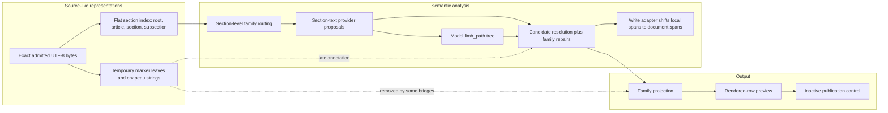
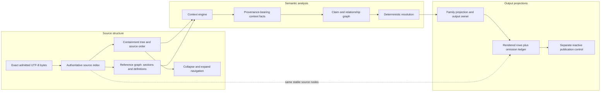

# Stage 2Y extraction architecture review

Date: 2026-08-10
Review commit: `853b9e83b1bf067eabb5b2c86a10918e47a7d7e6`
Review branch: `codex/extraction-architecture-review-2026-08-10`
Authority: architecture recommendation only. No production implementation, model call, pin-manifest change, baseline change, product write, publication change, pull request or merge.

## 1. Executive decision

Precedent Machine needs an **incremental restructuring**. This means moving responsibilities behind new interfaces in stages while preserving reusable code and existing extracted results with their source support. It does not mean replacing the full system.

The present system preserves the exact source bytes accepted by its source checks. It also has useful code for articles, sections, source support, extracted statements, provision categories, rows and publication control. It does not have one complete representation of the agreement as written. Its stored outline covers agreements, articles, sections and some labelled subsections. It does not store sentences, list introductions, list items and qualifications in one complete hierarchy. Separate later code creates temporary list structure. Model output can create another grouping of list items. The code that decides each extracted statement's status then reconstructs missing context with rules written for individual provision categories. The system adds some structure after that decision. As a result, some parent context and its source record are removed or never reach output.

The target is one source index built by fixed rules, plus graphs. A **source index** is the ordered set of written blocks, each with an exact byte span and stable identifier. Its main relationship is a **containment tree**, which records what is written inside what. A **graph** is a set of named relationships that can connect written blocks outside that tree. Graphs are needed for cross-references, defined terms, control relationships, context passed from parent to child, and extracted statements. The claim-analysis stage should consume this structure. Rendered rows should consume its results. Rows must never define the contract structure.

The recommended module exposes three main entry points:

```text
indexAgreement(exactSource) -> AgreementIndex
analyseAgreement(AgreementIndex, task) -> AgreementAnalysis
projectAgreement(AgreementAnalysis, view) -> AgreementProjection
```

This design does not authorise publication. Publication remains separate and requires a later approval.

A **shadow prototype** is an isolated comparison tool. It cannot alter current extracted statements, product data, the extractor in use or publication. The first implementation experiment should use this prototype on five real sets of source text: Concho 6.9(a), TopBuild 6.2, Red Hat 3.01 and 3.02 as one set, Metsera 7.04, and Concho 4.10 with its Annex A knowledge definition. It should extend the strongest useful parts of the current article-and-section parser and context code before creating a new module. It must prove a complete map in which every selected source byte belongs to one written block, separate sentence blocks, correct passage of a list introduction's actor and verb to its list items with an exact source record, cross-reference and defined-term links, links from extracted statements to source blocks, and every source detail lost before the comparison row. If the existing modules can meet these technical requirements by adding behaviour without changing their responsibilities, the programme should change the decision to **targeted repair**, which means correcting behaviour within the current module responsibilities. The evidence makes that result unlikely.

## 2. Terms and representations

This report uses these terms:

- **UTF-8** is the text encoding used by the system. A byte is one encoded unit used to locate source text exactly.
- **Canonical text** is the UTF-8 text accepted by the conversion process. Its byte positions are the extraction coordinate system.
- **Deterministic** means that the same input and rule versions always produce the same output.
- **Digest** is a fixed-length value calculated from content. The system uses it to detect a changed file or result.
- **Source node** is one stable written block. Examples are an article, section, sentence, chapeau, limb, proviso or heading.
- **Chapeau** is introductory text that governs a following list. For example, “Parent shall” can govern limbs `(i)` to `(iv)`.
- **Limb** is one item in a written list. A **sub-limb** is a list item inside another limb.
- **Proviso** is a qualification introduced by language such as “provided that”.
- **Evidence span** is an exact half-open byte interval, from an included start byte to an excluded end byte.
- **Claim** is a structured statement of legal meaning extracted from source text.
- **Claim vocabulary** is the approved list of claim types and values that the system can resolve.
- **Provision family** is a category of agreement terms handled together, such as Termination or Employee Matters.
- **Resolution** is the deterministic decision that a proposed claim is resolved, remains for review, or is open-world under the current approved extraction rules.
- **Open-world** means source-backed content for which the approved claim vocabulary has no complete mapping.
- **Projection** is a view of claims, such as a review card or comparison table row.
- **Provenance** is the record of where a value came from and how it reached its target.
- **Route registry** is the approved list that maps each provision family to its output code.
- **Output owner** means an approved entry in the current route registry. There is no separate owner registry in the measured code.
- **Fail closed** means return a named unresolved result instead of guessing.
- **Private internal extraction** means use of an extractor by authorised internal users without changing claim publication state.
- **External serving** means making claims available outside the approved private internal extraction path. Private internal extraction does not activate external serving.
- **Pin manifest** means an immutable, versioned list of saved run paths and digests selected as an input. A **selector** is a versioned configuration value that chooses an extractor or pin manifest.

Three representations must remain separate:

1. **Source structure.** The agreement as written, with exact bytes, labels, headings, sentences, lists, parent-child links and source order.
2. **Semantic analysis.** Facts, claims and legal relationships derived from source nodes. An inherited fact cites the node and span that supplied it.
3. **Output projections.** Review cards, rendered rows and later publication output. They select and arrange semantic facts. They do not create source structure or repair missing meaning.

The current system does not keep these representations fully separate. It has source structure at several incompatible levels. It sometimes creates structural meaning from model output. It attaches general structural context after claims have been resolved. It also asks some family resolvers and row projections to reconstruct detail that earlier stages did not preserve.

## 3. Review basis and start-state control

I ran `git fetch origin --prune` before reading project files. The remote branch `origin/claude/codex-handoff-plan-status-77wn7n` still pointed to the expected commit:

```text
853b9e83b1bf067eabb5b2c86a10918e47a7d7e6
```

The remote branch had not moved. There were no intervening commits to inspect. I created the report branch from that exact commit and confirmed `HEAD` before reading `CLAUDE.md` or project files.

The starting worktree was clean. It had no uncommitted files. The prior branch, `codex/m3-employee-dno-build`, was two commits ahead of its upstream. Those unpushed commits were:

```text
348edcae fix(stage-2y): isolate corrected Phase B V2 protocol
b8bac00f docs(canonical-v2): diagnose termination row loss
```

They are unpushed work, not part of this review. Switching branches preserved them. This report does not alter them.

### Sources read

The review read the required sources before reaching its decision:

- `CLAUDE.md`;
- `docs/core/PLAN.md`;
- `docs/core/DECISIONS.md`, including Decision 17 and all addenda;
- the strict Phase C/D/E measurement set: `evidence/canonical-v2/stage-2y-cd-baseline-manifest.json`, `evidence/canonical-v2/stage-2y-cd-baseline.json`, `evidence/canonical-v2/stage-2y-n-rendered-rows.json`, `evidence/canonical-v2/stage-2y-cd-report.json` and `evidence/canonical-v2/stage-2y-cd-known-loss-adjustment.json`, together with their producing scripts;
- the supporting Phase D/E reports: `evidence/canonical-v2/stage-2y-f-terra-adjudication.json`, `evidence/canonical-v2/stage-2y-g-duplicate-suppression.json`, `evidence/canonical-v2/stage-2y-h-representation-topic-replay.json`, `evidence/canonical-v2/stage-2y-h-representation-topic-comparison.json`, `evidence/canonical-v2/stage-2y-h-representation-topic-decision-ledger.json` and `evidence/canonical-v2/stage-2y-i-qualifier-dispatch-measurement.json`;
- the separate Step 2Y-C/D/E evidence: `evidence/canonical-v2/stage-2y-registry-substrate-replay.json`, `evidence/canonical-v2/stage-2y-registry-substrate-head-baseline.json`, `evidence/canonical-v2/stage-2y-parent-approval-resolution-set-diff-fixed.json`, `evidence/canonical-v2/stage-2y-registry-near-miss.json`, `evidence/canonical-v2/stage-2y-registry-near-miss.md`, `evidence/canonical-v2/stage-2y-d-defined-term-replay.json` and `evidence/canonical-v2/stage-2y-e-numeral-ladder-replay.json`, together with their producing scripts;
- `evidence/review-feedback/2026-08-10/README.md`, read before `evidence/review-feedback/2026-08-10/ben-row-feedback.json`; that JSON contains all 65 review-feedback records;
- the exact-source, parser, sectionizer, subclause, governing-context, evidence, claim, resolution, limb, routing, projection, row and publication implementations;
- focused tests and real saved fixtures for those stages; and
- the prior Phase B records without running Phase B or calling a model.

The three independent architecture papers and the audit papers are in `docs/codex-program/notes/stage-2y/extraction-architecture-review-evidence/`.

### Evidence method

The main test was not whether a unit test passed. It was whether a fact in exact source bytes survived this path:

```text
source bytes
  -> source node
  -> inherited context
  -> evidence span
  -> claim
  -> resolution
  -> family route
  -> rendered row
  -> publication control
```

Counts were traced to their scripts, manifests and saved artefacts. The measurement audit independently checked 263 file hashes and four self-identifiers. No discrepancy was found. See `extraction-architecture-review-evidence/measurement-audit.md`.

## 4. Current architecture, based on code

### Current architecture diagram



### 4.1 Contract structure parsing

`lib/parser-v2/structural.js` detects article and section headings and enriches section records with hierarchy metadata. It returns flat arrays of articles, sections and regions. It does not create stable child nodes for sentences, chapeaux, limbs, provisos or qualifications. Some offsets use JavaScript character positions rather than the canonical UTF-8 byte system.

`lib/canonical-v2/native-producer/deterministic-sectionizer.js` is the stronger persistent structure. It emits a root, articles, sections and generic subsections with UTF-8 spans and content-derived identifiers. Each record has `parent_section_id`, but callers receive a flat array rather than child arrays. The identifier includes the parent, span and text digest. This makes the result deterministic, but a corrected parent or boundary can change identity. The recognised kinds are only `ROOT`, `ARTICLE`, `SECTION` and `SUBSECTION`. See `deterministic-sectionizer.js:740-803` and `:835-1079`.

The sectionizer does not create nodes for:

- paragraphs or independent unnumbered sentences;
- chapeaux;
- inline limbs and sub-limbs that do not meet its line-start rules;
- provisos, exceptions or trailing qualifications;
- headings and outline-marker tokens as separately typed source blocks; or
- cross-reference and defined-term links.

`findSectionByReference` returns the first exact reference match. It does not represent a reference occurrence or report a collision as a graph ambiguity.

### 4.2 Temporary subclause and governing structure

`lib/parser-v2/subclauses.js` applies a different, more permissive marker grammar. It returns ordered leaf spans with a marker path, depth, character start, character end and text. A null marker means text before the first marker or a parent chapeau. It has no durable node identifier or parent-node record. A markerless section becomes one leaf, even when it contains several independent sentences. See `subclauses.js:391-443`.

`lib/canonical-v2/native-producer/governing-structure.js` converts those leaves to UTF-8 spans. It derives parent paths by splitting marker strings. It can return the containing leaf and a chain of chapeau spans. It fails closed for crossing spans and known same-style ambiguity. Marker corroboration checks that a token exists. It does not prove its parent. See `governing-structure.js:166-208`, `:211-258` and `:294-366`.

This is useful parsing logic. It is not an authoritative agreement tree. Its contract states that the result is annotation-only. The termination adapter also shortens a chapeau at the first colon, semicolon or newline. That family-specific boundary can omit governing text after the chosen punctuation.

### 4.3 Context creation and evidence spans

`candidate-governing-context.js` builds a report-only context ladder. It can expose the operative quote, rendered line, whole section, containing leaf, chapeau chain, siblings and trailing text. It accepts only one evidence edge and requires it to be the sole `OPERATIVE_TEXT` edge. This excludes claims that require several source spans. It records section metadata, but not stable source-node links for every fact. See `candidate-governing-context.js:77-168`.

`structure-placement.js` attaches `structure_context` after resolution. The module says this annotation must never affect identity or model input. It takes the minimum and maximum of evidence edges, so separate spans can form one artificial envelope that crosses leaves and fails closed. Its `absolute_start` and `absolute_end` values are section-local in this path despite their names. Some projection bridges call `withoutStructureContext`, which removes the annotation. See `structure-placement.js:51-85`, `:118-231` and `:221-225`.

`source-structure.js` is a sound exact-source base. It validates UTF-8 bytes, binds immutable source identities and creates exact semantic spans. Its provisions are semantic occurrences. A structural provision is concept-specific, not a complete written node. Components are flat children of a provision rather than a complete agreement hierarchy. See `source-structure.js:43-111`, `:148-215` and `:308-402`.

`native-write-set-adapter.js` repairs the coordinate seam at persistence. Producer evidence is section-local. The adapter adds the section start, verifies the source slice and creates new document-level evidence and claim revision identifiers. This preserves exact output evidence, but it means a claim can have one identity during resolution and another after writing. The architecture should declare coordinate type before resolution instead of repairing an ambiguously named field later.

### 4.4 Claim production and resolution

Provider prompts receive a selected section as flat text plus family instructions and some definitions. The general provider can propose a `limb_path`. It then locates returned evidence quotes in source. The general quote locator selects the first occurrence, although a separate all-occurrence helper exists. A repeated quote can therefore bind to the wrong location unless another check catches it.

`candidate-resolution.js` is a large, all-family resolver. It groups candidates by section, concept and party. It often creates a provision over the whole section. General structure is attached only after resolved, review and open-world lists exist. The file also contains valuable family-specific recovery logic. Interim operating covenants search backwards for a party and governing verb. Termination uses separate chapeau, direction and fallback grammars. Those repairs demonstrate the need for inherited context, but they do not provide one general provenance-bearing model. See `candidate-resolution.js:21-59`, `:1561-1855`, `:5161-5258`, `:5861-5957`, `:10384-10612` and `:11808-11818`.

Claim resolution is therefore compensating for inadequate structural parsing. It should keep its proven legal rules, but it should consume explicit context rather than reconstruct source hierarchy inside each family.

### 4.5 Limb production

`limb-components.js` creates a semantic component tree from compiled model candidates and their `limb_path` values. A path-node identifier is based on the semantic provision and path. Path nodes have no source span. Missing ancestors are invented mechanically. Assertion nodes can have exact evidence. Qualifier attachment distinguishes one assertion, several assertions and an empty structural path. See `limb-components.js:19-57` and `:236-398`.

This module is useful for semantic grouping. It is not proof of source structure. A descriptive model label can become a spanless path node. `derived-limb-identity.js` is a design stub and is not wired into extraction. `limb-enumeration-scan.js` is reporting-only.

The repository also has reusable graph primitives. `definition-graph.js`, `entity-subject.js`, `deal-participant-relationship.js` and `transaction-structure-resolution.js` model definitions, subjects, participants and transaction roles. They are tested. The measured `candidate-resolution.js` path does not integrate the last three as one agreement-wide relationship graph. The target should integrate these modules, not rebuild their working primitives.

### 4.6 Family routing, rows and publication

`section-family-classifier.js`, `family-detection-profiles.js`, `family-section-ref-generator.js` and `producer-prompt-registry.js` route whole sections and select family providers. `native-extraction-run.js` sends exact selected section text to the provider. It does not send a complete source subtree with governing ancestors and linked targets.

Cross-reference support is also split. `bare-citation-trigger-parser.js` recognises citation text. `citation-constructibility.js` helps attach a citation to a containing structural record. `native-extraction-run-citation-followup.js` schedules one bounded follow-up hop for the current Termination Fee path. These are useful detectors and receipt checks. The family-specific scheduling is a workaround, not a general agreement reference graph.

`rendered-row-preview-contract.js` lists the approved family routes. Seventeen families have routes. Seven measured families do not. `rendered-row-preview.js` requires a routed claim to project to one card and one exact lineage-bearing row. It fails closed when there are zero or several matches. A weak content check treats any non-empty cell other than four exact absence phrases as content. `See provision` passes. A pass does not prove that party, exception, period or operative detail survived.

Publication is correctly separate. Current V2 control can mark data withheld or eligible, but it cannot publish it. External serving remains disabled until a future authorised adapter exists. The architecture review made no publication change. This responsibility should remain.

### 4.7 Current seam assessment

The current responsibilities are wrong at three seams:

1. Source hierarchy is incomplete before semantic analysis. Two later parsers and model paths create competing structure.
2. Inherited context is an annotation after resolution. Family resolvers reconstruct it before or during claim formation.
3. Output modules receive incomplete semantic facts. They either omit detail, group it, or use family-specific logic to recover part of it.

These are structural seam defects. They are more than incomplete implementation inside one correct module. Exact source and resolved claims remain reusable, so they do not justify a full replacement.

## 5. Current measurements

The fixed measurement cohort contains 130 saved family-deal runs. For each family and deal, the manifest selects the eligible saved run with the highest resolved count, then the lexically first directory on a tie. Runs with zero resolved claims are excluded. This is a fixed regression cohort. It is not an unbiased measure of corpus recall.

### 5.1 Extraction states

| State | Count | What it measures |
|---|---:|---|
| Attempted | 2,201 | Resolved claims plus review rows whose `has_resolution` is exactly false. |
| Resolved | 1,526 | Claim revisions in `resolution.resolved`. |
| Review | 675 | Attempted items without a resolution. |
| Open-world | 1,701 | Entries in the separate `resolution.open_world` arrays. No deduplication is applied. |

The equations are:

```text
attempted = resolved + review = 1,526 + 675 = 2,201
open-world = separate list = 1,701
```

Do not add all four numbers. They are not four disjoint parts of one recovery total. See `scripts/stage-2y-cd-measurement.mjs:71-77` and `extraction-architecture-review-evidence/measurement-audit.md:45-72`.

### 5.2 Claim-to-row funnel

| Stage | Count | Exact meaning |
|---|---:|---|
| Resolved input | 1,526 | Claim revisions submitted to the output measurement. |
| No family route | 175 | Resolved claims in families absent from `FAMILY_ROUTES`. |
| Approved route available | 1,351 | `1,526 - 175`. |
| Feature-row lineage not unique | 109 | The expected feature matched zero or more than one row. |
| Routed claim produced no row | 1 | A row selector returned no row. |
| Mechanical claim-to-row success | 1,241 | One routed claim reached one exact lineage-bearing row with at least one weakly non-empty cell. |

The correct statement is: **1,241 of 1,526 resolved claim revisions, or 81.3%, pass the current route, card, exact-row-lineage and weak content checks.** This is not 1,241 distinct physical rows. There are 981 distinct full-output signatures in that result. It is not source recall, legal completeness, human acceptance or publication.

The 109 failures split into 100 MAE Definition claims, 7 Antitrust or Regulatory claims and 2 Employee Matters claims. The saved aggregate proves only that the match count was not one. PLAN diagnoses grouped feature claims, but the aggregate does not retain enough member data to prove grouping as the cause in every case.

The one routed no-row case is corroborated as TopBuild section 6.3, `TERMINATION_RIGHT_GRANT`, `TERMR-NOSOL-BREACH`, claim revision `0259692458a71a8817779823b10936ebfce9beb047a6232d0a28113f7cc4f9d3`. The aggregate retains the error count, not the failed claim identifier.

The 175 claims without an approved route split as follows:

| Family | Count |
|---|---:|
| Key Defined Terms | 76 |
| Representations | 70 |
| Tax Matters | 17 |
| Appraisal or Dissenters' Rights | 5 |
| Financing Covenants | 5 |
| Dividends | 1 |
| Guaranty or Financing Party | 1 |

### 5.3 The 1,097 adjusted count

Four stated loss rules identify 244 affected claims:

| Loss rule | Identified | Additional deduction from 1,241 |
|---|---:|---:|
| D&O mechanic not rendered | 25 | 25 |
| No Shop information loss | 75 | 75 |
| No Other Reps or Fraud party not rendered | 36 | 36 |
| MAE party not rendered | 108 | 8 |
| Total | 244 | 144 |

One hundred MAE claims already failed the mechanical row gate. The calculation is therefore:

```text
1,241 mechanical claim-level successes
- 144 additional known-loss deductions
= 1,097 cautious known-loss-adjusted successes

1,097 / 1,526 = 71.8873%, displayed as 71.9%
```

The 1,097 is explicitly `KNOWN_LOSS_ADJUSTED_NOT_HUMAN_ACCEPTED`. It does not say that a lawyer accepted 1,097 rows. It does not include every possible lost relationship or qualification.

### 5.4 What the measurements establish

They establish deterministic transport counts for a fixed saved cohort. They do not establish complete source parsing, claim recall, legal correctness, row completeness, human acceptance or mission readiness. The measurement process itself made zero model calls. Its saved input claims can still have model provenance.

## 6. End-to-end traces

Each trace follows exact source through publication control. “Should inherit” states the structural reading that deterministic analysis should make available. It does not decide a disputed legal meaning.

Every trace is report-only and blocked from publication. A claim field such as `publication_state: VALIDATED` is a validation state. It is not publication permission. The current `REQUIRE_PUBLISHED` filter returns no product claims.

### 6.1 Concho section 6.9(a), list chapeau and employee limbs

**Source.** The subsection starts with a time limit and obligation: until 31 December of the year of the Effective Time, Parent must cause each Company Employee to receive stated treatment. It then lists `(i)` cash compensation, `(ii)` equity compensation, `(iii)` benefits and `(iv)` severance. Limbs `(i)` and `(ii)` include local provisos.

| Step | Result |
|---|---|
| Structural parent | Section 6.9, under Article VI. The written parent of `(i)` is the list-bearing sentence in subsection `(a)`. |
| Structural children | Target: sentence, chapeau, limbs `(i)` to `(iv)`, and local provisos. Current persistent result: section 6.9 has children `(a)` to `(g)`, but `(a)` has no children. |
| Should inherit | Each list item receives `Parent`, `shall`, `cause ... to be provided with`, the employee scope and the 31 December period from the chapeau. Each value retains its chapeau node and span. A local proviso does not flow to a sibling. |
| Actually inherited | The post-resolution `structure_context` contains all of subsection `(a)`. It does not materialise party, period or governing verb as provenance-bearing facts on the compensation claim. The provider separately proposed the period as `CONTINUATION_PERIOD`; resolution retained it for review with `MONTH_COUNT_UNRESOLVED`. |
| Evidence | Claim `21ed619a3633dcd6356f284abfcb8aa0c3f6b59de6c7f2eccca39be98a882170` cites only the direct `(i)` compensation phrase, at section-local bytes 392 to 634. |
| Claims | The resolved `EMPLOYEE_COMP_ITEM_STANDARD` has base salary, no-less-favourable, item-by-item and buyer-comparator attributes. It has no party, period or governing verb attribute. A separate period proposal, original occurrence `763260be023ca4cb9627767607db25c11a0f409179122637de6e9f3ce058e115`, remains unresolved review. |
| Resolution and route | Resolved. Routed through Employee Matters. |
| Rendered row | Base salary; similarly situated buyer employees; no less favourable; `Period: Not specified`. |
| Loss | The period, Parent, `shall cause`, and list relationship do not survive as row facts. The period was extracted but stopped at resolution and was never composed with the compensation claim. The employee producer schema has no party or governing-verb fields. This proves missing context composition. It does not prove that inheritance alone caused the period loss. |
| Publication | Inactive. No publication authority. |

Evidence: `extraction-architecture-review-evidence/hierarchy-first.md:110-171`; `evidence/review-feedback/2026-08-10/README.md:12-21`; `evidence/review-feedback/2026-08-10/ben-row-feedback.json:23`.

### 6.2 TopBuild section 6.2, termination chapeau and causation provisos

**Source.** The section says that, before the Effective Time, either Parent or the Company may terminate the agreement on four lettered grounds. Limb `(d)` concerns a permanent, final and non-appealable legal restraint. A proviso limits the right where the terminating party's failure caused the restraint.

| Step | Result |
|---|---|
| Structural parent | Section 6.2 under Article VI. The list-bearing termination grant is parent to limbs `(a)` to `(d)`. |
| Structural children | Current sectionizer creates `(a)` to `(d)`. It does not create a stable chapeau node or stable proviso children. |
| Should inherit | Each limb receives the right holders, `may terminate`, the agreement object and the pre-Effective-Time scope from the chapeau. Each proviso attaches only to its governed limb. |
| Actually inherited | The general model does not provide typed inheritance. Termination-specific code separately derives the mutual grant, directions and party source span. |
| Evidence | The trigger claim cites its limb. `termination_grant_context` and `party_source_span` separately cite the chapeau. The provision instance spans the whole section. |
| Claims | Two party-scoped termination-right claims can be produced, one for Parent and one for Company. |
| Resolution and route | Resolved and routed through Termination. |
| Rendered row | A mutual legal-restraint termination row reaches output and retains the permanent and final trigger. |
| Loss | The causation proviso is not a separate governed evidence edge on the right-grant claim and is not shown. `party_source_span` cannot round-trip through the current staging write set. |
| Publication | Inactive. |

This is a successful local repair and an unsuccessful general architecture. It recovers party identity for this family, but later persistence and projection can still lose the provenance and exception.

The Parent claim is `3ccd0cd6650e6d4b94b65e8cb16edd70c659bd9e07de1b5242d810a0dcbe61ec`. Its direct evidence is `b51339f6338c1879e4ea8ef7cc69313f822d1cffe7a8fd0b3ea8e3e89485be64`, section-local bytes 984 to 1133, ending before the proviso. The Company twin is `6eec69a40657eb5f627df4344a392cc71603c285729bf0386b11fe3452fcd8a0`.

### 6.3 TopBuild section 6.3, nested limbs and a resolved claim with no row

**Source.** Section 6.3 grants the Company a termination right. Subsection `(a)` contains alternative nested grounds, including `(i)` with sub-limbs `(A)` and `(B)`, and `(ii)` with sub-limbs `(A)` and `(B)`. The relevant ground concerns a material breach by Parent or its Representatives of section 4.4. It is subject to cure and notice timing before the Outside Date.

| Step | Result |
|---|---|
| Structural parent | Section 6.3 under Article VI. The current direct children are 6.3(a) and 6.3(b). |
| Structural children | Target: grant chapeau, `(a)`, `(a)(i)`, `(a)(i)(A/B)`, `(a)(ii)`, `(a)(ii)(A/B)`, plus qualification blocks. Current persistent `(a)` has no such descendants. The temporary parser treats most of `(a)` as one leaf. |
| Should inherit | The nested breach ground receives Company as right holder and the governing termination verb from the section chapeau. The cure, notice and Outside Date limits govern that ground and must keep their own spans. The cross-reference to 4.4 is a reference edge, not copied local text. |
| Actually inherited | Termination-specific resolution reconstructs grant context. It stores governing text, but not as a general node-to-node inheritance record. |
| Evidence | Claim `025969...f9d3` uses section-local bytes 423 to 548 before persistence. The write adapter shifts them to document bytes 366204 to 366329 and rekeys the claim. |
| Claim | `TERMINATION_RIGHT_GRANT`, concept `TERMR-NOSOL-BREACH`, party Company. The raw ground identifies Parent or Representatives and material breach of section 4.4. |
| Resolution and route | Resolved. Its concept routes to the No Shop output configuration. |
| Rendered row | None. The preview fails with `CLAIM_RENDERED_NO_ROW`. |
| Loss | The claim exists but output has no row. Nested written parentage, grant provenance and qualification scope remain distributed across temporary context and family-specific fields. |
| Publication | Inactive. |

This case covers nested subsections, sub-limbs, a chapeau, defined dates, a cross-reference, party inheritance, qualifications and the single measured no-row result.

### 6.4 Red Hat sections 3.01 and 3.02, markers, headings and three bare sentences

**Source.** Section 3.01 includes a top-level `(h)` headed “Contracts”, followed by a roman `(i)` item that belongs below it. Section 3.02(b)(i) contains three independent unnumbered sentences about corporate power, authorisation, and execution or enforceability. The 69-item workload comes from the historical `redhat-representations-20260808-2xl-replay`, not the Red Hat run selected in the current 130-run measurement manifest.

| Step | Result |
|---|---|
| Structural parent | Target: the roman `(i)` is a child of `(h)`. Each of the three section 3.02 sentences is a child of its containing source block. |
| Structural children | Current section scan creates a 15-byte 3.01(h) and then treats 3.01(i) as a top-level sibling. It creates no sentence children for 3.02. |
| Should inherit | A child inherits only proven grammar from its written ancestor. A heading can classify a block but is not a grammatical subject or verb. |
| Actually inherited | The model path records `[(h),(i)]`, which disagrees with the persistent parentage. For 3.02 it creates three spanless paths named “Corporate power and authority”, “Due authorization” and “Due execution and enforceability”. |
| Evidence | Six of the 69 reviewed inputs have exact semantic assertion nodes. The remaining model paths do not establish source nodes. |
| Claims | Across the 69 cases: 62 are open-world only, 6 are open-world plus an assertion node, and 1 has an unverified residual quote. |
| Resolution and route | None of these 69 selected items resolves: 68 are open-world and 1 is a residual. They therefore do not enter a family route. Separately, the measured cohort contains 70 other resolved Representations claims, and that family has no approved route. |
| Rendered row | None for the selected 69 because they are not resolved. The separate 70 resolved Representations claims also have no row owner. |
| Loss | Written parentage is wrong in 3.01. The three real sentences in 3.02 have no source identity. Model summaries are treated like structural paths even though they are not authored headings or markers. |
| Publication | Inactive. |

The marker-path audit found 66 marker paths, 3 descriptive paths and no mixed paths. That is path hygiene, not source-tree completeness. All 69 paths need source binding. Six additionally have byte-verified semantic assertion nodes, but those assertion nodes are not source nodes. Their open-world or claim disposition remains a separate question. The current pinned Red Hat Representations run is `redhat-representations-20260809-2xk-final`; it has a different population. See `docs/codex-program/notes/step-2x-l1-limb-disposition.md:55-132`.

### 6.5 Red Hat section 5.07, separate bare sentences and trailing exception

**Source.** The section contains an initial press-release sentence. A separate reciprocal sentence requires consultation, review and an opportunity to comment before a public announcement, subject to Law and stock-listing exceptions. A proviso concerns statements that are substantially similar to earlier approved statements.

| Step | Result |
|---|---|
| Structural parent | Section 5.07 under Article V. |
| Structural children | Target: at least two independent sentence nodes, with the exception and trailing proviso attached to their governed sentence. Current: no direct source children and one 1,463-byte markerless leaf. |
| Should inherit | Reciprocal actors and governing verbs remain on their sentence. The Law and listing exception limits the relevant consultation obligation. The substantially-similar proviso keeps its scope. |
| Actually inherited | The whole section is the markerless context after resolution. There are no field-level inherited links. |
| Evidence | The resolved claim's direct raw evidence contains only the second sentence's operative core. |
| Claim | A Public Announcements or Disclosure claim with a joint party label. |
| Resolution and route | Resolved and routed through General Covenants. |
| Rendered row | `Public Announcements; Disclosure`, plus Party. |
| Loss | The press-release branch, consultation mechanics, review and comment right, no-issue obligation, Law and listing exception, and substantially-similar proviso are absent from the row. |
| Publication | Inactive. |

This confirms that separate unnumbered sentences need stable child nodes even where the source has no labels.

The current section node is `4bac29fea087e4301232f88daeff477901159ce251ec3b59fe28ed40dc5cbbaa`. Claim `49be0b7d6130a1a404065492714fdcca7af8ade53037b72a99837676da91b37d` cites evidence `757716df2f0c52999fc053a5696d942d6b40e6983b9ac1462f0eb15ddc472b58`, section-local bytes 231 to 788. Its rendered result is in full-output duplicate group 182.

### 6.6 Metsera section 7.04, reciprocal sentences and cross-references

**Source.** The first sentence prevents Parent and Merger Sub from relying on failure of conditions in sections 7.01 or 7.02 when their material breach primarily caused that failure. The second does the same for the Company and sections 7.01 or 7.03.

| Step | Result |
|---|---|
| Structural parent | Section 7.04 under Article VII. |
| Structural children | Target: two independent unnumbered sentence nodes, each with two reference occurrences. Current: no children; one markerless leaf containing the heading, both sentences and a page footer. |
| Should inherit | No actor or condition set should flow from one sentence into the other. Each causal qualification remains with its branch. Cross-reference occurrences link to all named targets. |
| Actually inherited | The current result labels the first sentence a parent chapeau and the second a child clause. It collapses the parties to `Either Principal Party`. |
| Evidence | Claim `7490a23a...db9` cites the second sentence, while its semantic subject spans the whole section. |
| Claim | A frustration or prevention claim. It records section 7.01 as one explicit cross-reference although its quote also names 7.03. |
| Resolution and route | Resolved and routed through Closing Conditions. |
| Rendered row | `Mutual conditions`, `Frustration / Prevention`, `See provision`, `Party: Either Principal Party`, `Material breach`. |
| Loss | The three named actors in two branch-specific actor sets, different condition sets, `may not rely`, `primarily caused`, full cross-reference set and causal relationship are not preserved in the row. |
| Publication | Inactive. |

The row passes the mechanical gate. It is direct proof that row reachability is not information preservation. See `extraction-architecture-review-evidence/claim-first-counterproposal.md:264-352`.

### 6.7 Metsera section 9.03, defined terms, control and MAE qualifications

**Source.** Section 9.03 contains many separate unnumbered definitions. The affiliate definition states that a Person controls, is controlled by, or is under common control with another Person. “Control” concerns the power to direct management and policies through securities, contract or otherwise. The MAE definition later contains prongs `(i)` and `(ii)`, carve-outs `(A)` to `(J)`, and a trailing disproportionate-effects qualification.

| Step | Result |
|---|---|
| Structural parent | Section 9.03 under Article IX. Each definition should be an independent child block. The MAE list belongs under the MAE definition sentence. |
| Structural children | Target: definition blocks, MAE chapeau, prongs, carve-out sub-limbs and trailing qualification. Current: no persistent definition children. The temporary parser begins a large marker leaf at `(i)` and can extend `(J)` through later unrelated definitions. |
| Should inherit | MAE carve-outs inherit only the MAE governing grammar. The disproportionate-effects qualification attaches to the stated carve-outs. Defined-term references link to their definition blocks. Control relations become semantic edges, not parent-child edges. |
| Actually inherited | Several MAE carve-out claims are structurally undetermined. One trailing MAE claim is placed in an oversized `i.J` leaf that extends to the section end. The definition and use relationships are not one stable graph. |
| Defined-term evidence and claims | In the separate Key Defined Terms run, `affiliate` and `control` are exact-evidence `OPEN_WORLD_PROPOSITION` items. They do not become resolved MAE claims. |
| MAE evidence and claims | The trailing qualification claim uses the correct narrower local span, while the structural leaf is much larger. Fifteen resolved MAE claims include carve-outs and a disproportionate-effects claim. The latter carries applicable labels, comparison baseline and incremental-impact attributes. |
| Resolution and route | The defined-term items remain open-world and have no row. The MAE claims resolve and route through MAE Definition. |
| Rendered row | The disproportionate-effects claim reaches `Disproportionality relationships; Disproportionality carveback`. The `affiliate` and `control` items do not reach a row. |
| Loss | The row omits the applicable carve-out labels, comparison baseline and incremental-impact detail. This claim is among the 8 of 108 MAE claims that reach a row. Its arrival does not prove that its legal detail survived. The separate control definition never enters current output. |
| Publication | Inactive. |

This case shows why a containment tree needs a reference and relationship graph. Control is not containment. A definition use can point to a distant definition. A qualification can govern several non-contiguous semantic facts. It also shows why results from Key Defined Terms and MAE must not be presented as one pipeline.

### 6.8 Concho section 6.20, party and cause-to-perform relationship

**Source.** One sentence requires Parent to take all action necessary to cause Merger Sub and the Surviving Corporation to perform their obligations.

| Step | Result |
|---|---|
| Structural parent | Section 6.20 under Article VI. |
| Structural children | Target: one unnumbered sentence node. Current: no child; one markerless section leaf. |
| Should inherit | No downward list inheritance is required. Semantic analysis should preserve Parent as actor, Merger Sub and the Surviving Corporation as performance entities, the `cause ... to perform` relationship and the obligations object. |
| Actually inherited | Whole-section context only. The cause-to-perform relation is not represented as a typed relationship. |
| Evidence and claim | Resolved claim `7d9243...` cites the full sentence and has party Parent. |
| Resolution and route | Resolved and routed through General Covenants. |
| Rendered row | `Merger Sub Compliance`, `Party: Parent`. |
| Loss | The Surviving Corporation and the express cause-to-perform relationship disappear. |
| Publication | Inactive. |

This provision disproves a strict tree-only semantic design. The sentence is a tree node. The cause-to-perform relations between the three parties belong in a semantic graph. This source alone does not prove a corporate-control status.

### 6.9 Concho section 4.10 and Annex A, a defined-term use

**Source.** Section 4.10 uses “to the knowledge of the Company”. Annex A separately defines `knowledge` by reference to actual knowledge. The definition does not occur inside the use sentence.

| Step | Result |
|---|---|
| Structural parent | The use belongs to section 4.10 and its article. The definition belongs to its separate Annex A definition block. Neither is the other's containment parent. |
| Structural children | Target: a stable containing sentence node, an exact `REFERENCE_OCCURRENCE` anchor for the use, and a stable definition node for `knowledge`. `USES_DEFINITION` belongs in the reference or semantic graph, not the source tree. Current definition and use records exist in separate paths. |
| Should inherit | Definition text must not be inherited as local wording. A `USES_DEFINITION` edge should link the exact use occurrence to the exact Annex A definition occurrence. |
| Actually inherited | A deterministic Stage D replay proves the join and resolves the effective code as `ACTUAL`. The current final Representations resolution does not consume that join. |
| Evidence | The use has exact document bytes 62777 to 62808. The definition has separate head and operative evidence at document bytes 325127 to 325148 and 325149 to 325172. |
| Claim | The use candidate remains open-world with `REPRESENTATION_KNOWLEDGE_STANDARD_UNCORROBORATED` in the current final path. |
| Resolution and route | The Stage D defined-term result is replay-only. It is not a canonical resolved relationship. Representations also has no approved output owner. |
| Rendered row | None. |
| Loss | The system can prove the use-to-definition join in a separate ledger, but ordinary resolution and output cannot use it. |
| Publication | Inactive. |

Evidence: `evidence/canonical-v2/stage-2y-d-defined-term-replay.json`, ledger row `6a81aec50323e0c1fc3c9d8c52997c3581cdd752728be2feb1edcfb15010e932`.

### 6.10 Concho section 6.11, a trailing proviso detached from its sentence

**Source.** The section has two independent unnumbered sentences. The second gives Parent participation and consultation rights in Transaction Litigation. It ends with a proviso that restricts the Company's ability to stop defending, consent to judgment or settle without Parent's written consent, which may not be unreasonably withheld, conditioned or delayed.

| Step | Result |
|---|---|
| Structural parent | Section 6.11 under Article VI. The proviso is a child or scoped qualification of sentence two, not of sentence one. |
| Structural children | Target: two sentence nodes, with operative and proviso blocks under sentence two. Current: no persistent children and one markerless leaf. |
| Should inherit | The proviso retains Company as its direct or governed actor and attaches to sentence two only. Nothing flows from the reciprocal first sentence merely by adjacency. |
| Actually inherited | The operative part resolves as one claim. The proviso becomes a separate open-world item. No relationship joins them. |
| Evidence | Resolved claim `80aaea2f...fab6` cites section-local bytes 548 to 830. Open-world proviso evidence `60fe9d35...5c80` cites bytes 846 to 1095. |
| Claim | A Transaction Litigation general-covenant claim for the Company. |
| Resolution and route | The operative claim resolves and routes through General Covenants. The proviso remains open-world. |
| Rendered row | `Stockholder / Transaction Litigation`, `Party: The Company`. |
| Loss | Participation, consultation, good-faith consideration, Parent consent and its reasonableness standard are absent. The proviso-to-obligation relationship is lost before output. |
| Publication | Inactive. |

### 6.11 Concho section 6.16, agreement-to-article hierarchy and three sentences

**Source.** Article VI contains section 6.16, “Stock Exchange Listing and Delistings”. Its three independent sentences cover Parent's listing obligation, the Company's delisting and deregistration obligation, and the Company's draft SEC-report delivery obligation. They have different actors, objects and timing.

| Step | Result |
|---|---|
| Structural parent | Agreement root, then Article VI, then section 6.16. The section has current parent identifier `fc504fba...6bebb`. The run receipt does not carry the full parent article payload, so the raw source fixture corroborates the authored heading. |
| Structural children | Target: three ordered sentence nodes. Current: the section node `1deafb...9ae7` has no sentence children; one markerless leaf covers heading, three sentences and a footer. |
| Should inherit | Each sentence inherits navigation ancestry only. It does not inherit another sentence's actor or verb. |
| Actually inherited | No sentence-level context exists. Narrow candidate evidence can still distinguish the three pieces. |
| Evidence and claims | The listing and SEC-report candidates remain open-world. The delisting candidate resolves as claim `4f62e0e9...ea98` on a whole-section provision. |
| Resolution and route | The delisting claim resolves and routes through General Covenants. |
| Rendered row | `Stock Exchange Delisting; Deregistration`, `Party: the Company`. |
| Loss | Reasonable best efforts, the Surviving Corporation actor, prompt timing and the ten-day outside limit are absent. The other two source sentences have no rows. |
| Publication | Inactive. |

This trace corroborates the written agreement, Article VI and section chain and records the section's article parent identifier. It also shows an evidence gap: current run receipts do not retain the article record itself.

### 6.12 Concho section 6.8(b), regulatory strategy control

**Source.** Parent is entitled to direct proceedings with an Antitrust Authority or other stated Person. A proviso requires Parent to give the Company a reasonable opportunity to participate.

| Step | Result |
|---|---|
| Structural parent | Section 6.8 under Article VI, with persistent node `ef05c6e39a691b90ec080130a5ea29ddf6fb61d07c57117e858634b3a0093d75`, document bytes 218261 to 227443. The direct clause is inside subsection `(b)`. |
| Structural children | Target: the control sentence with a scoped participation proviso. Current persistent structure identifies subsection `(b)`, while the late leaf covers most of the long subsection. |
| Should inherit | The claim needs no chapeau actor inheritance because Parent and `direct` occur in its direct sentence. It should preserve Parent as control holder, the exact controlled scope, Company as participation-right holder and the proviso relationship. |
| Actually inherited | The provider and resolver retain `control_holder_party: Parent` and the strategy scope as claim attributes. The whole subsection remains a broad late context. |
| Evidence | Claim `1cbe285b94af36a7d64590c67b4b77745a1db721d2df5ed45c1b8b1cffaed0fa` cites evidence `b142feb777245ae3b910d595fbc8084c85d4c8dbc69199d68868d4bbed0f987d`, section-local bytes 7599 to 7829. The quote includes the participation proviso. |
| Claim | `REGULATORY_STRATEGY_CONTROL`, proposed value `PARENT_CONTROL`, with an exact strategy-scope attribute. |
| Resolution and route | Resolved and routed through Antitrust or Regulatory. |
| Rendered row | `Strategy control`, `Party: Parent Parent`. |
| Loss | The row retains the controller but duplicates Parent and omits the controlled scope, the Company's participation right and the proviso relationship. |
| Publication | Inactive. |

This is the direct controlling-party trace. “Control” here means control of the regulatory strategy. It does not mean corporate control of another legal entity.

## 7. Information-loss table

| Information | First place available | Current loss or combination point | Downstream effect | Required correction |
|---|---|---|---|---|
| Exact source bytes | Immutable source | Preserved, but local and document coordinates share misleading `absolute_*` names | Claim identity changes at write time; wrong-coordinate risk | Declare coordinate type at creation and keep one verified conversion boundary. |
| Article and section hierarchy | Sectionizer | Flat array and parent identifier only | Adequate coarse navigation, incomplete analysis | Deepen into one authoritative ordered tree. |
| Independent bare sentences | Exact section text | Never become persistent nodes | Parties, verbs and qualifications from separate sentences can merge | Create stable sentence children. |
| Chapeau-to-limb relation | Temporary subclause parser | Temporary strings, derived path splitting, late annotation | Resolvers recreate actor and verb by family | Create source nodes and explicit `GOVERNS` context links before claims. |
| Nested sub-limb parentage | Exact text and marker candidates | Persistent and temporary parsers disagree; corroboration proves token, not parent | Wrong parent or oversized leaf | Use one parser authority with typed alternatives on ambiguity. |
| Heading versus marker | Exact text | Model descriptive path and authored marker share `limb_path` channel | Model summary can masquerade as written structure | Separate source roles from semantic proposition labels. |
| Proviso and exception scope | Exact text | Often remains trailing text or inside a broad leaf | Row omits or broadcasts qualification | Create qualification nodes and scoped semantic edges. |
| Defined-term reference | Use text and definition text | Definitions passed as flat prompt context; no complete source graph | Use and definition lineage can detach | Link occurrence node to exact definition node. Do not copy definition as local text. |
| Section cross-reference | Exact reference occurrence | Some claims record one reference from a multi-reference sentence | Missing targets and dependency scope | Store every occurrence and target, with unresolved or ambiguous state. |
| Party and capacity | Chapeau or direct sentence | Family-specific resolver recovery; some source spans not persisted | Party omitted, collapsed or untraceable | Context fact with source node, span, path and rule. |
| Corporate or regulatory control | Definition or direct control sentence | Flattened into a label or not represented | Definition-use link or controlled scope disappears | Typed control edges with exact source support. |
| Cause-to-perform relationship | Direct covenant sentence | Flattened into a party or topic label | Performance entity and causal verb disappear | Typed actor-action-object edges. |
| Multi-span claim support | Several source nodes | Governing-context ladder requires one sole operative edge; placement uses min/max envelope | Cross-leaf result fails or claims too broad | Role-tagged evidence links to several nodes and spans. |
| Claim structure context | Temporary parser | Added after resolution, removed by some bridges | Claim formation cannot use it; projection cannot rely on it | Make context an input to claim production and persist it. |
| Semantic limb identity | Model `limb_path` | Spanless path nodes and invented ancestors | Structural authority depends on model output | Bind semantic assertions to source nodes; keep semantic paths non-authoritative. |
| Row lineage | Claim and projection | The expected feature matches zero or more than one row; the aggregate does not preserve the cause | 109 non-unique lineage failures; separately, one routed claim produces no row | Preserve failed members and cardinality. Approve grouped lineage only where proved. |
| Row detail | Claim attributes and relationships | Projection schema selects only part of the meaning | A row can pass while losing party, period or qualification | Field-level completeness checks and declared omissions. |
| Publication authority | Publication module | Not lost | Correctly remains inactive | Keep separate and unchanged. |

## 8. Limb-inheritance findings

### 8.1 What the present plan correctly identifies

The next-step plan names four tasks: preserve exact governing context, derive the limb tree, distinguish headings from outline markers, and decide 69 unresolved limb cases. The 69 are the historical `redhat-representations-20260808-2xl-replay` workload, not the current pinned Red Hat Representations run. The evidence confirms all four needs, with one correction. The limb tree must be derived from source before semantic analysis. It must not be a tree made from model paths after candidate production.

The 69 Red Hat cases are not 69 unexplained failures. Their current dispositions are:

| Disposition | Count |
|---|---:|
| Residual quote unverified | 1 |
| Open-world only | 62 |
| Open-world plus assertion node | 6 |
| Total | 69 |

Their path labels split into 66 marker paths and 3 descriptive paths. There are no mixed paths. Only two semantic limb trees, seven path nodes and six assertion nodes were produced. Sixty-eight candidates also sit under one generic capitalisation limb key in the Representations family. The transport accounting is complete. Source binding and semantic ownership are not.

### 8.2 Did defective inheritance lose party or control information?

It contributed to party and grammatical-context loss. The evidence does not support attributing every party, period or control loss to limb inheritance alone.

Direct proof exists that the general inheritance and composition seam is missing. Concho 6.9(a)(i) has direct limb evidence, while `Parent shall cause ... to be provided with` occurs in the governing chapeau and cannot be represented by the employee producer schema. The provider separately extracted the period. That proposal stopped in review with `MONTH_COUNT_UNRESOLVED` and was never composed with the item claim. The late context annotation holds all the words, but no provenance-bearing context facts reach the claim or row.

Separate proof exists for controlling-party and relationship loss, but it is not proof that limb inheritance caused that loss. Concho 6.20 has no limb inheritance. It retains Parent but drops the Surviving Corporation and the cause-to-perform relationship. This proves an incomplete semantic relationship and projection seam, not corporate control. Metsera's control definition is not connected to uses through one agreement-wide graph. Concho 6.8(b), traced above, preserves Parent as regulatory strategy controller but loses scope detail in its row. TopBuild termination-specific code can recover party identity locally, which shows that governing context is required and that a general inheritance seam is absent.

The defect is not one parser bug. The model is structurally unsound because:

1. written blocks do not all have nodes;
2. persistent section structure and temporary marker structure are separate;
3. the model can supply another path tree;
4. general inheritance occurs after claims are resolved;
5. inherited values are strings, not typed facts with source provenance;
6. persistence does not retain every useful context field; and
7. output can remove the remaining annotation.

### 8.3 Required inheritance rules

A child may inherit a fact only when an explicit, deterministic context link proves that the parent governs the child. The permissible fact types are:

- grammatical subject or legal actor;
- party capacity, such as acting for itself or causing a subsidiary;
- modal, such as `shall`, `may` or `shall not`;
- governing verb and object;
- negation;
- list connective, such as `and`, `or` or `any of`;
- time period;
- condition, trigger or scope limit;
- qualification or exception whose proven scope includes the child; and
- an applicable definition or reference link, as a link rather than copied local wording.

The following must never be inherited merely because it appears above or nearby:

- a sibling's party, verb, threshold, date, exception or qualifier;
- a heading or marker token as grammatical text;
- a row label, taxonomy default or family assumption;
- unresolved or conflicting context;
- the content of a cross-referenced section merely because it is named;
- a definition as though its words occur at the use site;
- a model summary or descriptive path;
- page headers, footers or conversion artefacts;
- grammar that the child expressly replaces; or
- a qualification whose scope is ambiguous.

### 8.4 Provenance contract

An inherited value must be a record, not a copied string:

```text
ContextFact
  fact_type: OBLIGOR
  value: Parent
  status: INHERITED
  source_node_id: <chapeau node>
  source_span: [start_byte, end_byte)
  target_node_id: <limb ii node>
  relationship_path: [chapeau, GOVERNS, limb ii]
  rule_id: CHAPEAU_SUBJECT_FLOW
  rule_version: 1
  alternatives: []
```

If limb `(ii)` inherits “Parent shall”, its claim cites the chapeau span for those fields. Its direct operative evidence still cites limb `(ii)`. It must never state that “Parent shall” occurs inside the limb span.

### 8.5 Qualification and exception flow

A proviso, exception or trailing qualification is a source node with a scoped semantic edge. Scope is computed from parentage, punctuation, connective text and deterministic rules. A local proviso flows only to its limb. A list-wide qualification can flow to several children. A trailing qualification can point to non-contiguous claims.

When two readings remain plausible, both scope alternatives must be retained. Dependent claims fail closed. Unrelated claims continue. A model may later propose a semantic reading if authorised, but it may not alter the source boundary or state that the inherited words occur in the child.

## 9. Three independent designs

The designs were produced independently. They use different primary abstractions. Their full papers are:

- `extraction-architecture-review-evidence/minimal-deep-interface.md`;
- `extraction-architecture-review-evidence/hierarchy-first.md`; and
- `extraction-architecture-review-evidence/claim-first-counterproposal.md`.

### 9.1 Design A: minimal deep interface

This design treats the complete extraction system as one deep module. A **deep module** is a module with a small caller interface and substantial behaviour behind it.

#### Modules and interfaces

The public interface has no more than three main calls:

```text
indexAgreement(exactSource, policy) -> AgreementIndex
analyseAgreement(index, task) -> AgreementAnalysis
projectAgreement(analysis, view) -> AgreementProjection
```

Internal modules handle byte validation, parsing, stable identity, reference resolution, context, claims, family policy, rows and diagnostics. Publication is deliberately outside the three calls.

#### Source-to-semantic seam

`AgreementIndex` contains immutable source, an ordered node tree, reference edges, boundary alternatives and byte-coverage proof. `analyseAgreement` receives only this index and a versioned semantic task. It cannot accept unstructured section text as a substitute.

#### Semantic-to-output seam

`AgreementAnalysis` contains claims, relationships, provenance and uncertainty. `projectAgreement` may select or group them, but must return lineage and an omission ledger. An **omission ledger** is a list of semantic facts that the selected output schema does not display.

#### Nodes, identifiers and links

It uses agreement, article, section, paragraph, sentence, chapeau, limb, sub-limb, proviso, exception, trailing-qualification, heading, marker and source-artefact nodes. Stable occurrence identifiers are based on canonical text identity, node kind and exact start anchor. A separate revision identifies boundary or classification changes. Parent links form a tree. Cross-references and definitions form typed edges.

#### Inheritance and provenance

An internal context engine emits `ContextFact` records. It applies only versioned rules, records direct, inherited, overridden or ambiguous status, and cites source node, exact span, target and relationship path. It never copies a value without this record.

#### Errors and uncertainty

Callers receive typed results such as `BOUNDARY_AMBIGUOUS`, `REFERENCE_UNRESOLVED`, `INHERITANCE_AMBIGUOUS`, `CLAIM_DEPENDENCY_MISSING` and `OUTPUT_OWNER_MISSING`. One local ambiguity does not invalidate the agreement.

#### Worked example

For TopBuild 6.2(d), `indexAgreement` returns section, sentence, chapeau, limb and proviso nodes. `analyseAgreement` creates two termination-right claims. Their actor and governing verb facts cite the chapeau. Their trigger cites limb `(d)`. Their causation limit cites the proviso. `projectAgreement` either displays all three parts or declares the proviso omitted. The caller never parses a marker or searches backwards for `may terminate`.

#### Migration risk

The small interface can conceal a large internal migration. It can also become a “god module” if internal seams are not enforced. Risk is moderate because adapters can keep old claims and projections behind the interface.

#### Test strategy

Contract tests cover the three calls. Internal tests cover bytes, tree invariants, reference targets, context rules, claim closure, row lineage and publication exclusion. End-to-end fixtures compare source facts with output facts.

#### Complexity hidden from callers

It hides encoding, marker grammar, sentence splitting, identity aliases, graph traversal, inheritance, evidence composition, family dispatch, row matching and error localisation.

### 9.2 Design B: hierarchy-first

This design makes the faithful, collapsible source tree the main architectural centre. Analysis walks the tree from the highest relevant node down.

#### Modules and interfaces

```text
ImmutableSource.admit(rawCapture) -> AdmittedSource
ContractTree.parse(AdmittedSource) -> ContractDocument
SourceLinks.link(ContractDocument) -> SourceLinkGraph
SourceLinks.resolveReference(SourceLinkGraph, occurrenceId) -> target ids or uncertainty
ContextEngine.compileContext(ContractDocument, SourceLinkGraph, nodeId) -> ContextFrame
SemanticCoordinator.analyse({document, linkGraph, targets, familyPlan, recordedInputs}) -> CandidateSet
ClaimLedger.resolve(CandidateSet, vocabulary, rulings) -> AnalysisSet
Projection.render(AnalysisSet, projectionKey) -> RenderSet
PublicationControl.evaluate(RenderSet, releaseAuthority) -> PublicationDecision
```

A narrow facade can expose the three calls from Design A. Internally, the tree is a first-class module rather than an implementation detail. Publication remains a separate inactive boundary.

#### Source-to-semantic seam

The semantic coordinator receives a source subtree, ordered governing ancestors, relevant siblings, reference targets and context frames. No family can bypass the tree with a raw section string.

#### Semantic-to-output seam

The claim ledger contains atomic claims, multi-node evidence, relationships and unresolved dependencies. Projections receive that ledger and cannot access raw source except through cited nodes.

#### Nodes, identifiers and links

The tree includes all written block types and source order. Every independent unnumbered sentence is a node. A node occurrence identifier remains anchored to canonical text and marker or start byte. Parent changes are recorded in a structure revision and alias ledger. Cross-references and defined-term uses sit in a separate reference graph.

#### Inheritance and provenance

Traversal starts at the smallest source node that contains complete governing grammar, often a list-bearing sentence or chapeau. Context flows through explicit `GOVERNS` edges. Child grammar can override an inherited fact. A sibling never supplies context merely because it is adjacent. An expressly scoped trailing qualification can govern another block through an explicit edge. Every value has source provenance.

#### Errors and uncertainty

The parser retains competing boundaries or parent choices as alternatives. Context is `DIRECT`, `INHERITED`, `OVERRIDDEN`, `AMBIGUOUS` or `UNAVAILABLE`. Ambiguity blocks only claims that require that fact.

#### Worked example

For Concho 6.9(a), the tree contains a sentence, chapeau, four limb nodes and two provisos. The context engine passes the 31 December period, Parent, `shall`, and `cause ... to be provided with` to each limb. The `(i)` proviso stays local. The compensation claim keeps direct limb evidence plus inherited chapeau provenance. The row can show the period without expanding the evidence quote falsely.

#### Migration risk

Risk is moderate. It changes the source-to-semantic seam and introduces many nodes. It can preserve existing exact evidence and claims through aliases. A strict top-down analysis order is insufficient where meaning depends on a distant definition, reciprocal branch or control relationship. The reference and semantic graphs are therefore mandatory.

#### Test strategy

Level 1 proves byte coverage, containment, order, deterministic identity and navigation. Level 2 uses real source-to-context goldens. Level 3 compares claims, relationships and output field-by-field against the current path.

#### Complexity hidden from callers

The tree module hides marker styles, sentence boundaries, page artefacts, child ordering, corrected parentage and navigation. The context engine hides ancestor traversal and qualification scope.

### 9.3 Design C: claim-first semantic graph

This is the strongest counterproposal. It keeps a faithful source tree, but makes a dependency graph of legal propositions the primary analysis structure. Analysis starts from an expected claim slot rather than always from the tree root.

#### Modules and interfaces

```text
SourceIndex.index(source, parserVersion) -> SourceGraphRevision
ClaimGraphBuilder.build(sourceRevision, contractBundle, proposals) -> CandidateClaimGraph
ClaimGraphResolver.resolve(candidateGraph, rules, rulings) -> ResolvedClaimGraph
ProjectionEngine.project(resolvedGraph, view) -> ProjectionResult
```

A **claim slot** is one legal question defined by the contract bundle, such as whether a party may rely on a failed closing condition.

#### Source-to-semantic seam

The claim-graph builder selects one or more source nodes for each expected claim slot. Dependency closure follows ancestors, siblings when expressly linked, definitions, cross-references, qualifications, parties and prior semantic relationships in any direction. Source nodes remain authoritative for bytes and written hierarchy.

#### Semantic-to-output seam

Rows consume a resolved graph. Each claim node has typed edges for actor, object, condition, qualification, support, definition, cross-reference and derivation. Grouped rows remain derived nodes with links to their atomic branches.

#### Nodes, identifiers and links

Source node identifiers follow the same exact-source scheme. Semantic identifiers derive from claim definition, governed subject, evidence set and semantic attributes. Parent-child source links remain a tree. Legal dependency edges form the primary graph.

#### Inheritance and provenance

This design does not copy a general context frame down every branch. It creates explicit semantic dependency edges from a claim to the source facts it requires. A chapeau actor is one dependency. A distant definition is another. Every edge carries source-node and span provenance.

#### Errors and uncertainty

Missing dependencies produce `REQUIRED_DEPENDENCY_MISSING`. Competing readings produce alternative subgraphs. A human ruling can select one alternative. A model proposal is untrusted until deterministic source and policy checks pass.

#### Worked example

For Metsera 7.04, the source tree has two sentence nodes. The graph builds two atomic prevention claims, not one mutual fact. Claim A links Parent and Merger Sub to conditions 7.01 and 7.02. Claim B links Company to 7.01 and 7.03. Each keeps `may not rely`, material breach and primary causation. A reciprocal output node derives from both claims. A single mutual row is allowed only if it retains branch lineage and declares any omitted branch detail.

#### Migration risk

Risk is the highest of the three. Existing whole-section provision identities can split into several semantic nodes. Graph algorithms and fixtures are less familiar to current code. A graph-first rewrite could also detach legal analysis from source order. This design is acceptable only with the source tree retained as an independent authority.

#### Test strategy

Tests cover graph closure, multi-node evidence, reciprocal branches, definition and reference edges, qualifier scope, alternative interpretations, deterministic proposal ordering and source-to-row loss. They also prove that every semantic node reaches exact source.

#### Complexity hidden from callers

It hides dependency discovery, graph traversal, atomic-to-grouped derivation, relationship identity, alternative interpretations and partial failure isolation.

## 10. Design comparison

Scores use 1 for weak and 5 for strong. Migration cost uses 1 for low cost and 5 for high cost. Module depth means how much useful behaviour sits behind a small interface.

| Criterion | Minimal deep interface | Hierarchy-first | Claim-first graph |
|---|---:|---:|---:|
| Correctness | 4 | 5 | 5 |
| Preservation of source information | 5 | 5 | 4 |
| Quality of inherited context | 4 | 5 | 5 |
| Determinism | 5 | 5 | 4 |
| Contract navigation | 4 | 5 | 3 |
| Rendered-row support | 5 | 4 | 5 |
| Ease of testing | 5 | 5 | 3 |
| Ease of adding families | 5 | 4 | 5 |
| Migration cost | 3 | 3 | 5 |
| Module depth | 5 | 4 | 4 |
| Locality of future fixes | 4 | 5 | 4 |
| Low risk of silent content loss | 4 | 5 | 4 |

Design A gives the best external interface. It does not, by itself, decide what must be authoritative inside it. Design B best preserves source, provenance, determinism and navigation. Design C best represents many-to-many legal dependencies and is the necessary challenge to a strict tree. Its higher migration cost and risk are not justified as the primary architecture.

The decisive synthesis is: use Design B as the internal centre, add the graph capabilities proved necessary by Design C, and expose them through Design A's three-call facade. This is one architecture, not three equal options.

## 11. Recommended target architecture

### 11.1 Target diagram



### 11.2 Authoritative source index

The index preserves exact source bytes. It creates stable nodes for the agreement, article, section, paragraph, sentence, chapeau, limb, sub-limb, proviso, exception, trailing qualification, heading, marker and source artefact where the source requires them. One neutral node can have several source roles. For example, a sentence can also be a chapeau. This avoids copying the same bytes into competing nodes.

Every independent source block gets a stable node, including an unnumbered sentence. Parent nodes can span their descendants. Leaf-owned spans must cover all admitted bytes exactly once or assign a typed source-artefact owner. This permits both exact reconstruction and collapsible navigation.

Use two identities:

1. A stable **occurrence identifier**, anchored to canonical text, node kind and exact start byte or authored marker start.
2. A **structure revision identifier**, which includes current end, parent, roles and parser version.

This keeps an occurrence stable when a parent classification changes, while recording that the structure changed. Follow Decision 15 for marker-derived identity only after marker-start stability is proven. Maintain explicit aliases from current section and subsection identifiers.

### 11.3 Tree plus graphs

The containment tree answers “what is written inside what?” It is the source for collapse and expansion. A reference graph answers “what written block names what other block or definition?” A semantic graph answers “what actor, condition, qualification or control relationship belongs to what claim?”

A tree alone is inadequate. Concho 6.20 connects Parent to two performance entities through a cause-to-perform relationship. It does not by itself prove corporate control. Metsera 7.04 points to three other sections. A defined-term use points outside its parent. None of these is a containment relationship.

### 11.4 Analysis order

Deterministic parsing starts at the agreement and walks from higher nodes to lower nodes. Semantic analysis begins at the smallest node that contains the complete governing grammar for the task. This is often a list-bearing sentence or chapeau, not the lowest evidence quote and not always the article root.

Analysis then visits child nodes with an explicit context frame and closes required graph dependencies. This is “highest relevant node down”, not “always analyse every article before every section”. It avoids both an isolated-limb error and unnecessary whole-agreement context.

### 11.5 Claim and evidence contract

A claim can point to one or several source nodes. Each evidence edge has a role. Existing roles such as `OPERATIVE_TEXT`, `DEFINITION`, `EXCEPTION`, `CROSS_REFERENCE` and `DERIVATION_INPUT` should be kept. Extend each edge with `source_node_id`, coordinate type and exact span.

For example, a termination-right claim can have:

- chapeau evidence for the holder and governing verb;
- limb evidence for the trigger;
- proviso evidence for the exception; and
- reference evidence for section 4.4.

Do not replace these spans with one minimum-to-maximum envelope. Do not state that inherited chapeau words occur in the limb.

### 11.6 Projection contract

A family projection receives resolved claims and relationships. It does not parse source text or infer missing context. It returns rows with exact atomic lineage, field provenance and an omission ledger. If the schema cannot show a material qualification, the row may remain useful, but the omission must be explicit and measurable.

Source navigation uses the same source-node identifiers as analysis. No separate navigation hierarchy is needed.

### 11.7 Deterministic and model responsibilities

The following remain deterministic:

- source admission, hashes and byte coordinates;
- source-node boundaries, identities, parentage and order;
- marker and heading classification, including typed ambiguity;
- evidence quote occurrence and exact span validation;
- reference occurrence detection and unambiguous target binding;
- inheritance rule execution and provenance;
- claim validation, state transitions and resolution gates;
- family routing, row lineage and omission reporting;
- migration diffs, stop conditions and publication control.

If model reasoning is later authorised, it may propose novel semantic facts, proposition labels, relationship types or alternative qualification scope within a frozen source envelope. It may not create source nodes, select a repeated quote occurrence, invent inherited text, decide final resolution state, write product data or control publication.

## 12. Direct answers

1. **Does the current system have a complete structural representation?** No. It has exact bytes and a coarse section tree, plus temporary and model-shaped partial structures.
2. **What is missing?** The source structure lacks stable paragraphs, unnumbered sentences, chapeaux, inline limbs, sub-limbs, provisos, exceptions, trailing qualifications, heading and marker roles, and byte-complete leaf ownership. Cross-reference and provenance-bearing governance links belong in the separate reference and semantic graphs.
3. **Should every source block have a stable node, including an unnumbered sentence?** Yes. Source artefacts such as page footers also need typed ownership so no admitted byte disappears.
4. **Should sentences be children of sections when not numbered?** Yes, when they are independent written blocks. Metsera 7.04 and Red Hat 5.07 prove the need.
5. **Can a tree represent the contract adequately?** A tree represents written containment. A tree plus cross-reference and semantic graphs is required for definitions, references, control, reciprocal relationships and multi-node claims.
6. **At what node should analysis begin?** At the smallest node that contains the complete governing grammar for the task, then down its subtree and across declared graph dependencies.
7. **Which context should pass down?** Proven actor, capacity, modal, verb, object, negation, connective, time, condition, scope and governing qualification or exception, but only where an explicit source-proved context edge governs the child.
8. **Which context must never become an effective inherited value?** Sibling facts merely by adjacency, headings as grammar, model summaries, output labels, unresolved facts, definition text or cross-referenced content as local wording, artefacts, overridden grammar and ambiguously scoped qualifications. Retain unresolved, overridden and ambiguous context as provenance-bearing alternatives or override records. Definitions and references pass only as links.
9. **How should inherited context retain provenance?** As a `ContextFact` with source node, exact source span, target node, relationship path, rule and version, plus direct, inherited, overridden or ambiguous status.
10. **How should qualifications and exceptions flow?** Through explicit scoped edges from their own source nodes. Ambiguity creates alternatives and blocks only dependent claims.
11. **How should a claim point to source nodes?** Through one or more role-tagged evidence edges. Each edge names its source node, coordinate system and exact byte span.
12. **Are evidence spans attached at the correct level now?** No complete measure exists. Focused tests prove exact byte round-trip for emitted spans on tested adapter paths. Structural attachment remains coarse or late, and multi-span support is constrained by a single-operative-edge ladder and an artificial envelope.
13. **Is claim resolution compensating for inadequate parsing?** Yes. Interim operating covenant and termination code reconstruct chapeaux, parties, directions and source paragraphs inside family resolution.
14. **Are row modules reconstructing lost information?** Yes, in some families. Some projections aggregate or recover selected fields. Others omit them. No projection is an acceptable source authority.
15. **Did defective limb inheritance cause party or control loss?** The system lacks general provenance-bearing limb inheritance, and this contributes to party, subject and governing-verb loss. The Concho period was extracted separately and then stopped at resolution, so inheritance alone did not cause that loss. Regulatory control and cause-to-perform detail are also lost at semantic and projection seams. The evidence does not support saying that limb inheritance alone caused every party or control loss.
16. **Can the target support collapse and expansion without another navigation model?** Yes. The source containment tree is both the navigation and containment-traversal hierarchy. Semantic analysis also follows reference and semantic graphs, without creating another navigation tree.
17. **What should remain deterministic?** Bytes, nodes, proved parentage, records of alternative parentage, evidence location, inheritance provenance, validation, resolution gates, routing, row lineage, diffs and publication control.
18. **Where should model reasoning be used?** Only for bounded semantic proposals after deterministic structure is sound and Phase B is authorised. It must not compensate for defective structure or inheritance.
19. **Can the architecture be repaired incrementally?** Yes, through additive shadow structure, aliases and adapters. The responsibility seams still need restructuring.
20. **Does any module need replacement?** Replace the temporary subclause and governing-structure paths as independent authorities. Retire late structure placement after parity. Replace the caller-facing `resolveCandidates` interface while migrating its tested family algorithms. Replace family-specific citation-follow-up scheduling with the general reference graph, while reusing its detectors and receipt checks. Do not replace the whole system.

## 13. Phase B input if later resumed

Phase B is deferred and all model-call routes remain locked. This review did not call them. The prior Financing continuation remained 5 resolved, 12 review and 17 attempted, while open-world increased from 35 to 46. Its recorded stop is `OPEN_WORLD_RISE`.

Phase B must not resume against a flat section plus current candidate. It should receive an immutable `PhaseBInputPacket` with:

- exact source, conversion and source-map hashes;
- complete typed focus subtree and ordered governing ancestors;
- exact nodes, roles, bytes, parentage, source order and boundary alternatives;
- provenance-bearing context links;
- all required definition and cross-reference occurrences and targets;
- frozen family and claim definitions;
- proposal-only output schema;
- report-only authority, provider profile and call limits; and
- explicit zero product-write, zero external-serving and no-publication controls.

Historical candidates, current states and human decisions belong in a separate evaluation packet. They must not anchor the extraction input. The model may cite only supplied nodes and spans. Deterministic code validates proposals and decides state. Fifteen detailed resume prerequisites and stop rules are in `extraction-architecture-review-evidence/phase-b-interface-audit.md`.

## 14. Keep, change or replace by current module

“Replace” means replace the module's architectural authority after side-by-side parity. It does not mean discard all of its algorithms or tests.

| Current module or responsibility | Decision | Target responsibility |
|---|---|---|
| SEC intake, source admission and source maps | **Keep** | Continue to bind raw source, conversion and canonical text. |
| `lib/canonical-v2/source-structure.js` immutable source, semantic span and excerpt primitives | **Keep** | Retain exact byte validation and excerpt identity. Source-node evidence links belong in `claims-relationships.js` and `AgreementAnalysis`. |
| `lib/parser-v2/structural.js` | **Keep as an internal detector** | Reuse article and section recognition. It is not the final authority. The source-index adapter declares and converts its character coordinates. |
| `lib/canonical-v2/native-producer/deterministic-sectionizer.js` | **Change and deepen** | Make this module the one authoritative source index behind the facade. Add all block types, child order, byte ownership, stable occurrence identity and ambiguity records. |
| `lib/parser-v2/subclauses.js` | **Replace as an independent representation** | Reuse marker heuristics inside the source-index parser. Do not publish a second leaf hierarchy. |
| `lib/canonical-v2/native-producer/governing-structure.js` | **Replace as a public authority** | Reuse fail-closed reasons and parser tests in a context engine that consumes stable source nodes. |
| `lib/canonical-v2/native-producer/candidate-governing-context.js` | **Replace its public responsibility** | Reuse byte validators and context-record builders in a migration adapter. The target context engine starts from source nodes, not a candidate with one operative edge. |
| `lib/canonical-v2/native-producer/structure-placement.js` | **Retire after migration** | Use it only for shadow comparison until structure is an input to resolution. Remove bridge stripping when consumers use the new contract. |
| `lib/canonical-v2/native-producer/section-family-classifier.js` | **Change input** | Retain deterministic title and term rules. Route source nodes or subtrees without defining their boundaries. |
| `lib/canonical-v2/native-producer/family-detection-profiles.js` | **Keep** | Continue to own governed family-detection profiles. |
| `lib/canonical-v2/native-producer/family-section-ref-generator.js` | **Change** | Query the authoritative index and return node identifiers as well as section references. Remove the Capitalisation compatibility fallback only through a versioned migration. |
| `lib/canonical-v2/native-producer/producer-prompt-registry.js` | **Keep** | Continue fail-closed provider-module registration. |
| `lib/canonical-v2/native-producer/native-extraction-run.js` | **Change** | Orchestrate the three target stages and pass a complete structural packet. Preserve exact-section fail-closed selection. |
| `lib/canonical-v2/native-producer/bare-citation-trigger-parser.js` | **Keep implementation** | Use it as one deterministic reference-occurrence detector inside the reference graph. |
| `lib/canonical-v2/native-producer/citation-constructibility.js` | **Change input** | Validate citations against source nodes and graph occurrences instead of repairing a coarse citation later. |
| `lib/canonical-v2/native-producer/native-extraction-run-citation-followup.js` | **Replace its public scheduling responsibility** | General reference-graph closure replaces the family-specific one-hop scheduler. Reuse its boundedness, identity and receipt checks. |
| `lib/canonical-v2/native-producer/provider-interface.js` | **Change input contract** | Accept a frozen governed source envelope. Preserve provider receipts and call accounting. |
| `lib/canonical-v2/native-producer/anthropic-provider.js` and family prompt builders | **Change authority** | Keep proposal shaping. If later authorised, accept the structural envelope and never create structure or select an ambiguous quote occurrence. |
| Provider record and replay adapters | **Keep** | Continue deterministic replay and transcript binding. Migration and Phase B tests use saved responses only. |
| `lib/canonical-v2/native-producer/candidate-resolution.js` | **Replace its caller-facing interface** | Migrate its tested family algorithms behind `analyseAgreement`. Remove source reparsing only after shadow parity. |
| `lib/canonical-v2/native-producer/ioc-mechanic-resolution.js` | **Change input** | Consume common provenance-bearing context facts. Keep tested legal mapping rules. |
| Qualifier and family parse or corroboration algorithms | **Keep implementations** | Reuse them as deterministic detectors and semantic rules behind the new source and context contracts. They do not remain independent structure authorities. |
| `lib/canonical-v2/native-producer/limb-components.js` | **Change** | Keep semantic assertion and qualification concepts. Bind semantic nodes to source nodes. Keep descriptive paths separate from written markers. |
| `lib/canonical-v2/derived-limb-identity.js` | **Do not activate as written** | Replace the stub with the stable occurrence and revision scheme only after marker-start stability is proved. |
| `lib/canonical-v2/native-producer/limb-enumeration-scan.js` | **Keep temporarily** | Continue as a report-only coverage check. Absorb it into source-index diagnostics when mature. |
| `lib/canonical-v2/claims-relationships.js` | **Keep and extend** | Retain states, evidence roles, claims and relationships. Add source-node links, context facts and wider relationship definitions. |
| `lib/canonical-v2/definition-graph.js` | **Keep and integrate** | Use its definition primitives in the agreement reference graph. |
| `lib/canonical-v2/entity-subject.js`, `deal-participant-relationship.js` and `transaction-structure-resolution.js` | **Keep and integrate** | Use existing subject, party and transaction-role primitives in the agreement-wide semantic graph. |
| `lib/canonical-v2/contract-bundle.js` | **Keep** | Continue to own the governed vocabulary, relationship definitions and policies. |
| `lib/canonical-v2/native-producer/candidate-proposal-compiler.js` | **Change** | Preserve proposal identity until source node, governed subject and context resolution are complete. Require provenance before resolution. |
| `lib/canonical-v2/native-producer/native-write-set-adapter.js` | **Change** | Preserve verification. Move coordinate typing earlier, persist aliases and inherited provenance, and avoid semantic rekey surprises at the final boundary. |
| `lib/canonical-v2/evidence-to-write-set-bridge.js` | **Change** | Carry source-node links, coordinate type, context provenance and relationship edges into the write set. |
| `lib/canonical-v2/validate-write-set.js` | **Change** | Validate the added provenance and alias fields while remaining backward compatible during migration. |
| `lib/canonical-v2/canonical-write-envelope.js` and `canonical-writer.js` | **Keep** | Preserve the canonical write boundary and transactional writer. |
| Staging writers and `local-staging-deal-reader.js` | **Change** | Round-trip party source span, governing context, source citations, node links and inherited facts. |
| Family projection modules | **Change input contract** | Keep mapping algorithms. Format complete semantic facts, stop reparsing source, and emit field lineage plus omission records. |
| `lib/review-parity/rendered-row-preview-contract.js` | **Change** | Keep its route registry and exact selectors. Add explicit owner or no-output status only through a governed decision. |
| `lib/review-parity/rendered-row-preview.js` | **Change** | Preserve fail-closed exact lineage. Add field-level completeness and retain failed member details and cardinality. |
| Review assembly and navigation | **Change** | Navigate the authoritative source tree and link rows to the same source-node identifiers. |
| `lib/canonical-v2/publication-disposition.js` | **Keep inactive** | Preserve the separate product-publication decision and explicit transition contracts. |
| `lib/canonical-v2/publication-serving-filter.js` | **Keep now; change only in a separately authorised activation** | `REQUIRE_PUBLISHED` deliberately returns no product claims until a future receipt-consuming adapter is authorised. Stage 2Y does not implement it. |
| Calibration and human-anchor modules | **Keep** | Preserve governed review and calibration evidence. |
| `lib/programme-gates/publication.js`, `current-publication.js` and `publication-executor.js` | **Keep** | These control programme-status Git artefacts. They are not the product-claim publication adapter. |

No file requires wholesale deletion before its replacement responsibility proves parity. The replaced responsibilities are competing late structure, candidate-first context, the monolithic resolver interface and family-specific citation scheduling. Their tested detectors and family algorithms remain valuable. The exact-source, graph, evidence, claim, routing, writer and publication foundations also remain valuable.

## 15. Safe migration sequence

The migration is additive. **Shadow mode** means the new path runs beside the current path and cannot change the current result.

### M0. Freeze the migration contract

Bind source hashes, manifests, code commit, contract-bundle digest, policy digest, saved provider-response digests, current resolution artefacts, output artefacts and publication state. Define exact diff fields and a pre-approved expected-difference ledger. Do not change any pin manifest or baseline.

Rollback: remove the report-only migration packet. No product state changes.

### M1. Run the smallest useful prototype

Create one read-only shadow artefact for the named real provisions. First try to expose the required result by additive extension of the current sectionizer and context code. Produce nodes, byte coverage, aliases, context facts, claim mappings and source-to-row omissions. Do not modify current claims.

Decision gate:

- targeted repair only if current modules can meet the complete contract without another source authority or moved analysis seam;
- incremental restructuring if a shared source-index and context contract is required but old claims can be aliased;
- Sol escalation towards replacement only if no incremental seam can preserve evidence and semantic equivalence.

### M2. Add the shadow source index

Parse the fixed corpus into versioned source nodes. Seal it as a report-only JSON artefact. Add aliases from current article, section and subsection identifiers. Keep all current extraction and rows unchanged.

Rollback: disable the shadow command or leave the report-only index inert. Current extraction never changed.

### M3. Add reference and context graphs

Resolve cross-reference occurrences and defined-term uses. Compile provenance-bearing context facts and qualification scope. Compare them with current family reconstructions. Do not change resolution.

Rollback: stop reading graph artefacts. Old claims remain untouched.

### M4. Add a shadow claim adapter

Map current evidence and claims to source nodes. Use an in-memory repository to prove that node links and inherited facts round-trip. Seal the result as report-only JSON. Run old and new semantic paths side by side on recorded inputs. Produce a complete resolution-set diff before any separate post-Stage-2Y request for pin-manifest authority.

Rollback: disable the shadow analysis command and leave the sealed JSON inert. Current readers and claims never changed.

### M5. Migrate families in controlled waves

Move one family at a time to the common context input in shadow mode. Start with families that expose inherited context and have strong fixtures. Remove family source reparsing from the shadow path only after exact semantic parity or a pre-approved improvement. Keep the current resolver selected for every product and corpus control path. Keep Phase B locked.

Rollback: disable the affected shadow family adapter in the isolated harness and verify unchanged control digests. Do not change a pin manifest or current selector.

### M6. Tighten projections and assign output owners

Make projections consume complete claims and relationships. Add field lineage and omission ledgers. Address the 109 non-unique lineage failures, the one no-row case and the 175 unowned claims as output work, not source parsing work.

Rollback: disable the shadow route and projection in the isolated harness. Confirm unchanged control row digests. Publication remains inactive.

### M7. Corpus and lawyer acceptance

Run deterministic source-to-output comparisons on the frozen corpus. Then create a governed lawyer-review packet where the row is the unit of judgement under Decision 17. Record acceptance and legal rulings separately from mechanical results.

Rollback: retain the prior accepted artefacts and keep the new result report-only.

### M8. Phase B readiness, still deferred

Only after Ben separately authorises Phase B, verify the structural input packet and experiment comparator. Use recorded responses first. Do not ask a model to repair structure. The current Phase B lock remains binding until an explicit programme decision changes it.

### M9. Stage 2Y certification

Certify the release candidate for source completeness, semantic preservation, output coverage, human acceptance, rollback and operational controls. This is certification, not cutover. Publication requires its own later authorisation.

### M10. Post-Stage-2Y internal deployment

After M9 closes Stage 2Y, request separate authority to make the accepted extractor authoritative for private internal extraction. Change one versioned selector. If a new pin manifest is required, create and select one new immutable version under that authority. Never overwrite the control baseline or an existing pin manifest. Run one focused smoke check, verify that publication and external serving remain inactive, and retain immediate rollback to the prior selector and manifest. The product is mission ready only after this deployment. This report does not authorise it.

## 16. Acceptance tests and measurements

### 16.1 Source-structure tests

- Exact source reconstructs byte-for-byte from ordered leaf-owned spans and typed source artefacts.
- Every node slice matches its stored digest.
- Every non-root node has one containment parent, lies within that parent and has a deterministic source order.
- Parent extents may overlap descendants. Leaf-owned bytes have no gaps or overlap.
- Every independent unnumbered sentence in the named fixtures has a stable node.
- Chapeaux, limbs, sub-limbs, provisos, exceptions and trailing qualifications have exact nodes or a typed ambiguity.
- A heading is never treated as a marker or grammatical fact without evidence.
- Correcting parentage does not silently change a stable occurrence identity.
- Repeated runs on the same bytes produce identical nodes, revisions and graph edges.

### 16.2 Context and semantic tests

- Concho 6.9(a)(i) receives period, Parent, modal and governing verb from the exact chapeau span.
- Its local proviso does not flow to limbs `(ii)` to `(iv)`.
- TopBuild 6.2(d) retains mutual holders, trigger and causation proviso as separate sourced facts.
- TopBuild 6.3 retains Company grant context, all nested parents, cure timing and section 4.4 reference.
- Red Hat 3.01 gives roman `(i)` the correct written parent.
- Red Hat 3.02 gives the three bare sentences source nodes and keeps descriptive model labels semantic only.
- All 69 Red Hat inputs bind to a source node or have a typed unbound status while preserving the 1, 62 and 6 dispositions.
- Metsera 7.04 retains both branch actors, both condition-reference sets, `may not rely`, material breach and primary causation.
- Concho 4.10 and Annex A keep the defined-term use and definition nodes separate and linked. Metsera 9.03 separately scopes the disproportionate-effects qualification.
- Concho 6.20 retains both performance entities and the cause-to-perform relationship without asserting corporate control.
- One claim can cite several role-tagged source nodes. One source node can support several atomic claims.
- An ambiguous required fact blocks only dependent claims.
- Model proposal order cannot change deterministic claims.

### 16.3 End-to-end tests

For each fixture, freeze a ledger:

```text
source fact
  -> source node and span
  -> context fact and provenance
  -> claim and evidence roles
  -> resolution state and value
  -> family owner
  -> rendered field or declared omission
  -> publication state
```

A passing row count is not sufficient. Compare every party, capacity, period, threshold, condition, exception, proviso, reference and relationship.

### 16.4 Migration measurements

Report, by family and agreement:

- admitted byte coverage and typed artefact coverage;
- source blocks with stable nodes;
- boundary and parentage ambiguities;
- inherited facts with complete provenance;
- claims with complete required dependency closure;
- evidence edges with declared coordinate type and valid source node;
- exact old-to-new claim state, value, attribute, evidence and relationship diffs;
- open-world change on the fixed cohort;
- output fields retained, added, removed or deliberately omitted;
- approved route coverage and unowned claims;
- exact-row-lineage failures and no-row failures;
- distinct full-output signatures and duplicate excess;
- human row acceptance, only after lawyer review; and
- model calls, writes, external-serving and publication actions, all required to remain zero during migration.

The current 1,526, 1,241 and 1,097 figures remain control measurements. They are not target success criteria by themselves.

### 16.5 Proportionate check policy

Each implementation packet names its focused fixtures and commands before coding. Run those checks once after the change and once during the rollback rehearsal. Run a wider shared-contract suite only when the changed interface has wider consumers. Run the full suite only at an integration gate or where focused checks cannot bound the risk. Repeating the same check without a code or input change adds no evidence.

For this review, one bounded replay-only batch covered 17 existing test files across the principal seams. It passed 230 of 230 tests in 7.69 seconds, with no skips. The full suite was not run. No selected test used a live provider. This proves that the selected current byte, replay, fail-closed and row-lineage contracts still reproduce. It does not prove source completeness or legal preservation. The exact command and raw Node summary are recorded in `extraction-architecture-review-evidence/test-fixture-audit.md`.

## 17. Risks and stop conditions

### 17.1 Main risks

| Risk | Control |
|---|---|
| Node identity churn hides semantic change | Separate stable occurrences from structure revisions; use an alias ledger with source anchors and cardinality. |
| More complete parsing appears to increase open-world | Report newly discovered blocks separately, but stop on any official family open-world increase as required. |
| Sentence splitting damages abbreviations or definitions | Use real definition and page-artefact fixtures; retain typed boundary alternatives. |
| Qualifications broadcast to siblings | Require scoped edges and negative inheritance tests. |
| A graph detaches claims from written order | Require every semantic node and edge to reach exact source nodes. |
| Family migration changes a legal result silently | Pre-approve expected differences and diff every semantic field, not only state and value. |
| Rows keep counts while losing content | Use field-level source-to-row ledgers and explicit omissions. |
| Dual paths persist indefinitely | Give each migration stage an exit criterion and remove old authority only after parity. |
| Phase B is used as a repair mechanism | Keep shared route lock and zero-call receipt; require complete deterministic input first. |
| Publication changes accidentally | Bind no-authorisation and zero-external-serving receipts into every stage. |
| Excessive verification slows delivery | Use the proportionate check policy in section 16.5. |

### 17.2 Immediate stop conditions

A Terra agent stops the current packet and does not refresh evidence when any of these occurs:

- a control source, manifest, policy, code or saved-response digest differs;
- admitted bytes have a gap, overlap, digest mismatch or undeclared coordinate type;
- an old identifier maps many-to-many without a pre-approved rule;
- a previously resolved claim changes value, state, party, capacity, scope, attributes, evidence or relationship unexpectedly;
- a claim disappears, duplicates or appears without an expected-difference entry;
- open-world increases in any family on the official fixed cohort;
- a material fact disappears from output without an omission record and approved owner;
- a required source example passes only because a family resolver or renderer reparses the raw text;
- rollback cannot restore the prior artefact and output digests without a pin-manifest change;
- any model or Phase B route is invoked;
- any product write, release receipt, external-serving switch or publication authority changes; or
- the work requires a disputed legal interpretation.

Terra records the exact failing diff once. It does not rerun unchanged inputs to seek a pass. Sol handles technical architecture, identity and parser escalations. Ben handles legal meaning.

### 17.3 Programme stop conditions

Pause the restructuring programme and reconsider replacement only if the prototype or two successive migration packets show that:

- current evidence cannot be attached to stable source nodes without changing its bytes;
- current resolved claims cannot be preserved through semantic equivalence and aliases;
- family legal rules cannot be separated from source reconstruction without broad unexplained changes; or
- rollback requires destructive data changes.

A cleaner design is not a reason for replacement. Failure of an incremental preservation seam is.

## 18. Questions that require Ben's legal judgement

These questions affect legal presentation or meaning. Code should not decide them:

1. Which qualifications must every lawyer-facing row display? Examples include `primarily caused`, `material breach`, `permanent`, `final and nonappealable`, and `having jurisdiction`.
2. May the two reciprocal branches in Metsera 7.04 appear as one “mutual” row, or must both named party branches and their different condition sets remain visible?
3. When may a defined group such as `Either Principal Party` replace the named source actors without losing material allocation?
4. When, if ever, does a cause-to-perform covenant support a corporate-control conclusion? In all cases, should the causing party and each performance entity remain separate comparison facts?
5. Where punctuation and indentation permit more than one reading, which limbs does a proviso or trailing qualification govern?
6. For a cross-reference, should a lawyer-facing row show the citations, the incorporated legal content, or both? Does the answer differ by family?
7. Which atomic claims may be combined into one market-comparison row, and which must remain separate?
8. Which open-world proposition types should receive new approved claim definitions and output owners, including Representations, Key Defined Terms, Tax, Appraisal, Financing, Dividends and Guaranty?
9. For Red Hat 3.02, should the three independent source sentences also remain three legal assertions for comparison, or may a topic rule group them?
10. What governed human-review sample and acceptance threshold defines “mission ready”, subject to Decision 17's rendered-row unit and 1% tracking rule?
11. For the 175 resolved claims without an approved output owner, and the TopBuild 6.3 claim that produces no row, which should receive a named output owner and which should receive an approved no-output disposition?
12. Apart from qualifications, which facts may a lawyer-facing row omit? This includes parties, capacities, periods, thresholds, relationships, remedies and operative mechanics. What explicit omission label is required in each permitted case?
13. For each proposed migration difference that changes legal value or scope, which old or new reading is correct on the exact source? Approval must be recorded for that member. A general migration approval is not enough.
14. When two source hierarchies are technically plausible and they change legal meaning, which parentage governs? This includes the Red Hat 3.01 relationship between paragraph `(h)` and the following roman `(i)` item.

The following are technical decisions and do not require Ben: source-node types, byte coordinates, stable identifier mechanics, tree plus graph structure, provenance fields, alias validation, rollback mechanics and deterministic diff format.

## 19. Explanation for a non-technical M&A lawyer

The system should first build a reliable outline of the agreement, like a document map. The map includes every article, section, sentence, list introduction, list item and proviso. Each item points to the exact words in the source copy accepted by the system.

The system then reads that map. If a list introduction says “Parent shall” and item `(ii)` contains only the object of the obligation, the analysis can apply Parent and `shall` to item `(ii)`. It also records that those words came from the introduction. It does not pretend that they appear inside item `(ii)`.

Legal links sit beside the outline. A reference to another section links to that section. A defined term links to its definition. A covenant that Parent will cause a subsidiary to act records the relationship between Parent, the subsidiary and the act.

Claims are machine-readable legal statements, each with a status and exact source support. Review tables are selected views of those claims. A table may be shorter than the agreement, but every material omission needs an explicit approved disposition. The table cannot become the source of legal meaning. Publication remains a separate final control.

## 20. Complete executable plan from Stage 2Y to a mission-ready product

This is the implementation plan. It is written for Terra-level agents. A **Terra agent** is the standard implementation agent. A **Sol reviewer** is the escalation owner for difficult technical architecture or semantic-diff questions. Ben remains the legal judgement owner.

### 20.1 Mission and completion definition

Mission: create a mission-ready extraction system that preserves the agreement as written, derives claims with exact provenance, produces complete governed output, and remains safely withheld until publication is separately authorised.

Stage 2Y is complete only when all of these are true:

1. The accepted corpus has an exact, deterministic source index with typed ownership of every admitted byte.
2. Every independent written block has a stable source node or a reviewed typed ambiguity.
3. Every inherited semantic fact has exact source provenance.
4. Every resolved claim has complete required evidence and relationship closure.
5. The old and new paths have a reviewed resolution-set diff, with no unexplained change.
6. Official open-world does not increase in any family during migration.
7. Every approved claim definition has exactly one output owner or an approved no-output disposition.
8. Every material fact reaches a rendered field or an approved omission record.
9. The governed human review meets the threshold Ben approves under Decision 17.
10. Rollback works after every migration stage.
11. Phase B remains deferred unless separately authorised.
12. Publication and external serving remain inactive throughout Stage 2Y.

M9 completes Stage 2Y certification when conditions 1 to 12 pass. The complete product mission also requires the separately authorised M10 internal deployment. M10 is outside Stage 2Y. It does not authorise publication.

### 20.2 Fixed authority and prohibitions for every work packet

Every Terra task starts by recording:

- source branch and exact commit;
- allowed files;
- fixed source and fixture hashes;
- expected outputs;
- focused test command;
- time and memory bound where material;
- expected-difference entries, if any;
- rollback action; and
- escalation owner.

Every Terra task is prohibited from:

- calling a live model or Phase B route;
- changing, selecting or regenerating a pin manifest or baseline during M0 to M9. M10 may create one new immutable pin manifest and select it only when its signed authority names its path and digest. No stage may overwrite a baseline or existing pin manifest;
- changing a saved control result to make a test pass;
- changing the current extractor selector or routing default before separately signed post-Stage-2Y M10 authority;
- writing product data;
- enabling external serving or publication;
- deciding a disputed legal meaning;
- using a family renderer to repair source structure;
- using a model path as source parentage; or
- running the full suite unless the packet is an integration gate.

### 20.3 Standard packet output

All Stage 2Y migration files remain report-only. M10 is a separate post-certification deployment. The Stage 2Y files live under:

```text
evidence/canonical-v2/stage-2y-structure-migration/
```

M0 creates these fixed control files:

| Path below the migration root | Schema |
|---|---|
| `control/manifest.json` | `STAGE_2Y_STRUCTURE_MIGRATION_CONTROL/V1` |
| `control/cohort-agreements.json` | `STAGE_2Y_STRUCTURE_COHORT_AGREEMENTS/V1` |
| `control/family-keys.json` | `STAGE_2Y_STRUCTURE_FAMILY_KEYS/V1` |
| `control/prototype-inputs.json` | `STAGE_2Y_STRUCTURE_PROTOTYPE_INPUTS/V1` |
| `control/diff-contract.json` | `STAGE_2Y_STRUCTURE_DIFF_CONTRACT/V1` |
| `control/expected-differences.json` | `STAGE_2Y_STRUCTURE_EXPECTED_DIFFERENCES/V1` |
| `control/authority.json` | `STAGE_2Y_STRUCTURE_AUTHORITY/V1` |

Each packet writes its machine-readable receipt to `receipts/<packet_id>.json` with schema `STAGE_2Y_STRUCTURE_MIGRATION_PACKET_RECEIPT/V1`. It writes any human note under `notes/`. The receipt contains:

```text
packet_id
stage = M0 | M1 | M2 | M3 | M4 | M5 | M6 | M7 | M8 | M9
base_commit
input_digests
changed_files
focused_checks and results
model_calls = 0
phase_b_route_calls = 0
product_writes = 0
pin_changes = 0
baseline_changes = 0
saved_control_mutations = 0
database_target = NONE | THROWAWAY_LOCAL
release_receipts_created = 0
internal_cutover_authorisation = NONE
current_selector_changes = 0
publication_authorisation = NONE
serving_changes = 0
old_result_digest
new_shadow_result_digest
expected_differences
unexpected_differences
open_world_by_family
rollback_command and rollback_result
status = PASS | STOPPED | ESCALATED
```

Validate each receipt with:

```bash
node scripts/stage-2y-structure-migration-validate.mjs \
  --receipt evidence/canonical-v2/stage-2y-structure-migration/receipts/<packet_id>.json
```

That validator is a required M0 deliverable. Until it exists, the first M0 receipt must be checked against the schema by the integrator and Sol. `serving_changes` means external-serving changes. For M0 to M8, `database_target` must be `NONE`. M9 may use `THROWAWAY_LOCAL` only for its approved database gate. Production and staging are never valid values.

An expected difference records an intended old-new difference. A Terra agent may propose one with exact source evidence. Sol must approve technical identity or equivalence. Ben must approve any changed legal value, scope, grouping or material omission. An entry never authorises a pin-manifest change, baseline change, product write, extractor cutover or publication change.

Terra reports a failed gate once. It must not rerun unchanged work to obtain a different result.

### 20.4 Team pattern

Use four slots where tasks are independent:

| Slot | Normal responsibility |
|---|---|
| Integrator | Own shared contracts, merge order, control digests, final diffs and stop decisions. |
| Terra A | Source-index parser, node identity and byte coverage. |
| Terra B | Context, qualification, reference and semantic relationship graphs. |
| Terra C | Real fixtures, old-new diff, output loss ledger and focused regression tests. |

Agents must not edit the same file concurrently. The integrator freezes interface files before parallel work. When one workstream completes, reassign it to a read-only audit of another stream. Use Sol for the escalations listed below. Use Ben for section 18 questions and the separate M10 authority decision only.

### 20.5 Approved check commands

Use only the command that covers the changed seam. Add an affected family test to the row gate when needed. Saved response replay is allowed. Live provider inference is not.

**Structure and inheritance gate**

```bash
node --test --test-concurrency=4 \
  tests/canonical-v2-source-identity.test.js \
  tests/canonical-v2-admitted-semantic-source.test.js \
  tests/canonical-v2-native-sectionizer.test.js \
  tests/subclauses.test.js \
  tests/canonical-v2-governing-structure.test.js \
  tests/canonical-v2-candidate-governing-context.test.js \
  tests/canonical-v2-limb-components.test.js \
  tests/canonical-v2-qualifier-attachment.test.js
```

**Termination inheritance addition**

```bash
node --test \
  tests/canonical-v2-termination-limb-chapeau-structure-swap.test.js \
  tests/canonical-v2-termination-limb-grant-context.test.js
```

**Evidence and resolution gate**

```bash
node --test --test-concurrency=4 \
  tests/canonical-v2-native-producer-evidence-integrity.test.js \
  tests/canonical-v2-native-extraction-run.test.js \
  tests/canonical-v2-citation-constructibility.test.js \
  tests/canonical-v2-native-write-set-adapter.test.js \
  tests/canonical-v2-candidate-resolution.test.js
```

**Routing gate**

```bash
node --test --test-concurrency=4 \
  tests/canonical-v2-producer-prompt-registry.test.js \
  tests/canonical-v2-section-family-classifier-quarantine.test.js \
  tests/canonical-v2-family-section-ref-generator.test.js \
  tests/canonical-v2-native-provider-family-dispatch.test.js
```

**Row and measurement gate**

```bash
node --test \
  tests/canonical-v2-rendered-row-preview.test.js \
  tests/canonical-v2-claim-scoped-single-row-preview.test.js \
  tests/stage-2y-cd-measurement.test.js \
  tests/stage-2y-cd-known-loss-adjustment.test.js
```

**Publication and Phase B lock gate**

```bash
node --test \
  tests/canonical-v2-resolution-publication-split.test.js \
  tests/canonical-v2-publication-disposition.test.js \
  tests/canonical-v2-publication-serving-filter.test.js \
  tests/stage-2y-phase-b-live-authority.test.js
```

**Database-backed writer gate**

```bash
node --test tests/canonical-v2-writer-excerpt-identity-sql.test.js
```

Run the database gate only against an approved throwaway local database. Never provide production or staging credentials. If no throwaway database is available, record `NOT_RUN`. Stop certification if persistence changed and this gate cannot run.

**Full integration gate**

```bash
npm test
```

Run the full integration gate once at M9. Do not repeat it without a code or control-input change.

### 20.6 Stage M0: freeze the migration contract

**Owner:** integrator, with one Terra auditor.
**Dependency:** this architecture recommendation accepted.
**Production effect:** none.

#### Tasks

1. Create `control/manifest.json`. Bind the exact source commit, 130-run manifest, source files, contract bundle, policy files, saved provider responses, resolution files, current projections and publication-state artefacts.
2. Create `control/cohort-agreements.json`. List each unique admitted agreement source referenced by the frozen 130-run manifest once. Record its agreement identifier, admitted-source path, source-chain path, UTF-8 length and digest, and the run identifiers that use it.
3. Create `control/family-keys.json` from `listRegisteredSectionFamilies()`. Record the exact 25 registry keys, registry schema and source-file digest. Later stages must reject a family key that is absent from this file.
4. Create `control/prototype-inputs.json`. Name each agreement source path, saved run directory, source hash, section reference and exact byte range used by M1. Later agents must consume this file. They must not rediscover or replace the inputs.
5. Record hashes and byte lengths. Reuse existing manifest rules. Do not select a new highest-resolved run.
6. Create `control/diff-contract.json`. Define claim identity, semantic equivalence, state, raw value, canonical value, party, capacity, scope, attributes, evidence roles and spans, source-node links, context facts, relationships, family route, output fields, omissions and publication state.
7. Create empty `control/expected-differences.json`. Require exact source evidence, the affected fields and the required technical or legal approver before an entry can become approved.
8. Create `control/authority.json`. Set every structure, context, analysis and projection selector to current. Record `pin_changes=0`, `baseline_changes=0`, `saved_control_mutations=0`, `database_target=NONE`, `release_receipts_created=0`, `internal_cutover_authorisation=NONE`, `current_selector_changes=0`, `model_calls=0`, `product_writes=0`, `publication_authorisation=NONE` and `serving_changes=0`.
9. Record current counts: 2,201 attempted, 1,526 resolved, 675 review, 1,701 open-world, 1,351 routed, 1,241 mechanical successes, 1,097 adjusted, 109 feature-lineage failures, one no-row case and 175 resolved claims in families absent from the route registry.
10. Implement `scripts/stage-2y-structure-migration-validate.mjs`. It validates the receipt schema and rejects a model call, pin change, baseline change, saved-control mutation, release receipt, product write, external-serving change or publication authority. It requires `database_target=NONE` for M0 to M8. For M9 it accepts only `NONE` or `THROWAWAY_LOCAL`. It rejects every other database target at every stage.

#### Focused checks

Run the row and measurement gate in section 20.5 once. Run the new receipt validator once against the M0 receipt. Verify all bound hashes once.

#### Acceptance

- Every control input has a digest.
- The cohort-agreement list contains every unique source in the 130-run manifest exactly once.
- The family-key list equals the sorted registry output and contains 25 unique keys.
- The prototype input manifest names exact paths, run directories, hashes and byte ranges.
- Counts reproduce exactly.
- The expected-difference ledger starts empty.
- Every selector remains `current`.
- Publication and Phase B locks are recorded.

#### Stop and escalation

Stop on any hash or count mismatch. Sol decides whether the base is wrong or the prior evidence is stale. Do not regenerate it. Sol may approve technical equivalence entries. Ben approves legal value, scope, grouping and material-omission entries. Neither approval permits a pin-manifest or baseline change.

#### Rollback

Revert only the M0 commit on the migration branch, or leave the new validator and control files present with every selector fixed to `current`. Confirm the pre-M0 control digest. Do not delete or alter any current artefact.

### 20.7 Stage M1: build the falsification prototype

**Owner:** the integrator owns the prototype contract and decision file. Three Terra agents own disjoint evidence streams.
**Dependency:** M0 passed.
**Production effect:** none. Use a script and report-only artefact, not a live path.

#### Fixed real cases

1. Concho 6.9(a), chapeau, four limbs and two local provisos. Its period was proposed separately, then stopped at `MONTH_COUNT_UNRESOLVED`.
2. TopBuild 6.2, mutual grant, four limbs and causation provisos.
3. Red Hat 3.01 and 3.02 as one packet, disputed written parentage, three independent unnumbered sentences and descriptive model paths.
4. Metsera 7.04, reciprocal sentences and four reference occurrences.
5. Concho 4.10 plus Annex A, defined-term use, definition target and exact link.

Use the exact inputs in `control/prototype-inputs.json`. After the five cases decide the seam, run TopBuild 6.3, Red Hat 5.07, Metsera 9.03, Concho 6.11, 6.16 and 6.20 as a confirmation set. Confirmation is not a reason to enlarge the first decision gate.

#### Parallel work

- Terra A extends the current sectionizer in prototype code to emit complete nodes and byte coverage.
- Terra B converts current governing-context logic into prototype `ContextFact` and reference edges.
- Terra C builds the frozen source-to-current-claim-to-row ledger and expected target assertions.

Use current algorithms first. Do not create a second durable parser unless the current sectionizer cannot support the contract.

The integrator creates `scripts/stage-2y-structure-prototype.mjs`. It accepts only `--control`, `--inputs` and `--output-root`. It reads the frozen M0 files, invokes the three prototype workstreams and writes every file in the next table. It has no database, model, selector, pin-manifest or product-write operation.

#### Prototype outputs

| Path | Schema and content |
|---|---|
| `prototype/m1/agreement-index.json` | `STAGE_2Y_STRUCTURE_PROTOTYPE_INDEX/V1`; ordered nodes and tree revisions. |
| `prototype/m1/byte-ownership.json` | `STAGE_2Y_STRUCTURE_BYTE_OWNERSHIP/V1`; byte owner, gaps, overlaps and artefact rules. |
| `prototype/m1/node-aliases.json` | `STAGE_2Y_STRUCTURE_NODE_ALIASES/V1`; current-to-shadow aliases and cardinality. |
| `prototype/m1/structure-alternatives.json` | `STAGE_2Y_STRUCTURE_ALTERNATIVES/V1`; boundary and parentage alternatives. |
| `prototype/m1/reference-edges.json` | `STAGE_2Y_STRUCTURE_REFERENCE_EDGES/V1`; section-reference and definition-use edges. |
| `prototype/m1/context-facts.json` | `STAGE_2Y_STRUCTURE_CONTEXT_FACTS/V1`; direct and inherited facts with provenance. |
| `prototype/m1/current-semantic-mapping.json` | `STAGE_2Y_STRUCTURE_SEMANTIC_MAPPING/V1`; current evidence and claim links. |
| `prototype/m1/source-to-row-diff.json` | `STAGE_2Y_STRUCTURE_SOURCE_TO_ROW_DIFF/V1`; field changes and omission ledger. |
| `prototype/m1/decision.json` | `STAGE_2Y_STRUCTURE_PROTOTYPE_DECISION/V1`; signed decision and next action. |

Also write the standard zero-authority receipt.

All paths are below the migration root in section 20.3. The outputs are sealed report-only JSON. They are not a database, pin manifest, baseline or product input.

#### Focused checks

Create `tests/stage-2y-structure-prototype.test.js`. Run these commands once:

```bash
node scripts/stage-2y-structure-prototype.mjs \
  --control evidence/canonical-v2/stage-2y-structure-migration/control/manifest.json \
  --inputs evidence/canonical-v2/stage-2y-structure-migration/control/prototype-inputs.json \
  --output-root evidence/canonical-v2/stage-2y-structure-migration/prototype/m1

node --test tests/stage-2y-structure-prototype.test.js
```

Then run the structure and inheritance gate and the termination inheritance addition in section 20.5 once. Do not run other seam suites yet.

#### Acceptance

- Every selected byte has one leaf or artefact owner.
- Every listed written block has a stable node or typed alternative.
- All required inherited values cite exact source nodes and spans.
- No unlicensed sibling propagation occurs. A sibling fact may govern another sibling only through an explicit source-proved scope edge.
- All current claims map to source nodes without changing state or value.
- The five fixed cases pass their source, context, evidence, claim and output assertions.
- Old rows remain unchanged because the prototype is shadow-only.

#### Decision

- If additive extensions meet every condition and current resolvers can consume them without a new shared contract, the integrator proposes `TARGETED_REPAIR`.
- If a shared pre-resolution source and context seam is required but aliases preserve current claims, the integrator proposes `INCREMENTAL_RESTRUCTURE`. This is the expected result.
- If neither route can preserve evidence and claim equivalence, record `STOP_NEEDS_NEW_ARCH_REVIEW`. This is not authority for replacement.

Sol reviews the evidence and signs the technical decision in `prototype/m1/decision.json`. Ben signs only a legal-scope decision needed by a fixed case. M2 cannot start without the signed technical decision.

If Sol signs `INCREMENTAL_RESTRUCTURE`, continue to M2. If Sol signs `TARGETED_REPAIR`, stop this sequence before M2. The integrator must create `prototype/m1/targeted-repair-plan.json`, schema `STAGE_2Y_TARGETED_REPAIR_PLAN/V1`, with exact modules, files, tasks, checks, acceptance gates, rollback and a mapping to the M2 to M9 safety gates in this report. Sol must sign that plan. Ben must sign any changed legal scope. Work resumes only after an accepted report addendum authorises that replacement sequence. `STOP_NEEDS_NEW_ARCH_REVIEW` also stops all implementation and requires a new architecture review.

#### Rollback

Disable or remove only the prototype command. Confirm current output digests are unchanged.

### 20.8 Stage M2: create the shadow source-index module

**Owner:** Terra A, with Terra C on fixtures and Terra B on API review.
**Dependency:** M1 contains a signed `INCREMENTAL_RESTRUCTURE` decision.
**Production effect:** additive and unused by extraction.

#### Public contract

Create one entry point:

```text
indexAgreement(exactSource, structuralPolicy) -> AgreementIndex
```

Implement it in `lib/canonical-v2/agreement-index.js`. The index includes immutable source binding, nodes, parent-child order, roles, exact spans, reference-occurrence nodes, ambiguity records, aliases, diagnostics and byte-coverage proof. It does not choose cross-reference or definition targets. M3 owns those edges. Keep internal parsing helpers private.

#### Tasks

1. Define `AGREEMENT_INDEX/V1`, source-node and tree-revision schemas.
2. Implement stable occurrence and revision identifiers.
3. Integrate article and section parsing.
4. Integrate marker parsing without retaining `subclauses.js` as a second authority.
5. Add deterministic sentence and source-artefact segmentation.
6. Add chapeau, qualification and marker roles.
7. Produce child arrays or an indexed child operation from the same parent records.
8. Generate old section and subsection aliases.
9. Create `control/structural-policy.json`, schema `STAGE_2Y_STRUCTURAL_POLICY/V1`, with a version and digest. Bind both into every index.
10. Create `scripts/stage-2y-agreement-index-shadow.mjs` and `tests/canonical-v2-agreement-index.test.js`. The script accepts only `--control`, `--agreement-manifest`, `--policy` and `--output-root`.
11. Run the script for every entry in `control/cohort-agreements.json`. Seal each result at `shadow/m2/<agreement_id>.agreement-index.json`. Do not use a database, staging writer or product reader. Do not modify current claim records.

#### Focused checks

Run these commands once:

```bash
node scripts/stage-2y-agreement-index-shadow.mjs \
  --control evidence/canonical-v2/stage-2y-structure-migration/control/manifest.json \
  --agreement-manifest evidence/canonical-v2/stage-2y-structure-migration/control/cohort-agreements.json \
  --policy evidence/canonical-v2/stage-2y-structure-migration/control/structural-policy.json \
  --output-root evidence/canonical-v2/stage-2y-structure-migration/shadow/m2

node --test tests/canonical-v2-agreement-index.test.js
```

The new test must cover real fixture round trips and repeated-run determinism. Then run the structure and inheritance gate in section 20.5 once.

#### Acceptance

- Exact byte coverage is 100% for every agreement in `control/cohort-agreements.json`.
- Every agreement in that file has exactly one sealed index with the expected source digest.
- Node and parent invariants pass.
- Unnumbered sentence fixtures pass.
- Heading and marker roles are separate.
- Alias collisions are zero.
- Current extraction output digest is unchanged.

#### Stop and escalation

Stop on byte gaps, parser nondeterminism, alias collisions or unresolved many-to-many identities. Sol owns identity and boundary-policy decisions. Ben is not needed unless two parses change legal scope.

#### Rollback

Revert only the M2 stage commit, or leave `agreement-index.js` and its sealed outputs unused. Verify the current extraction and row digests. No runtime selector exists at this stage.

### 20.9 Stage M3: add source links and context engine

**Owner:** Terra B, with Terra A on node API and Terra C on legal fixtures.
**Dependency:** M2 passed.
**Production effect:** additive and shadow-only.

#### Public contract

The internal context call is:

```text
compileContext(focusNodeIds, AgreementIndex, semanticPolicy) -> ContextCompilation
```

Implement it in `lib/canonical-v2/context-compilation.js`. It remains behind `analyseAgreement` when integration begins. `ContextCompilation` is a keyed result with `frames_by_focus_node_id`, `ambiguities`, `residuals`, `reference_edges`, `definition_edges` and `semantic_relationships`.

#### Tasks

1. Define context-fact states and provenance schema.
2. Implement ancestor subject, capacity, modal, verb, object, negation, connective, time, condition and scope rules.
3. Implement child override and unlicensed sibling isolation. A sibling edge requires direct source proof of shared scope.
4. Create proviso, exception and trailing-qualification scope edges.
5. Resolve every section-reference occurrence from M2 to a target edge or typed unresolved target.
6. Resolve every defined-term use to a definition edge or typed unresolved target.
7. Create typed control and reciprocal-party relationships where direct source supports them.
8. Retain competing scope or target alternatives. Do not choose silently.
9. Compare common context with current family-specific chapeau and party repairs.
10. Create `control/semantic-policy.json`, schema `STAGE_2Y_SEMANTIC_POLICY/V1`, with a version and digest. It defines `focusNodeIds` as the source-ordered identifiers of every paragraph, sentence, chapeau, limb, sub-limb, proviso, exception and trailing-qualification node, plus any section with none of those descendants. Bind the policy and derived focus list into every compilation.
11. Create `scripts/stage-2y-context-compilation-shadow.mjs` and `tests/canonical-v2-context-compilation.test.js`. The script accepts only `--control`, `--agreement-manifest`, `--index-root`, `--policy` and `--output-root`.
12. Compile context for every sealed M2 index named by `control/cohort-agreements.json`. Seal each result at `shadow/m3/<agreement_id>.context-compilation.json` with schema `CONTEXT_COMPILATION/V1`.

#### Focused checks

Run these commands once:

```bash
node scripts/stage-2y-context-compilation-shadow.mjs \
  --control evidence/canonical-v2/stage-2y-structure-migration/control/manifest.json \
  --agreement-manifest evidence/canonical-v2/stage-2y-structure-migration/control/cohort-agreements.json \
  --index-root evidence/canonical-v2/stage-2y-structure-migration/shadow/m2 \
  --policy evidence/canonical-v2/stage-2y-structure-migration/control/semantic-policy.json \
  --output-root evidence/canonical-v2/stage-2y-structure-migration/shadow/m3

node --test tests/canonical-v2-context-compilation.test.js
```

Then run the structure and inheritance gate and the termination inheritance addition in section 20.5 once. Do not run row tests.

#### Acceptance

- Every inherited field has complete provenance.
- No value claims false local evidence.
- No unlicensed sibling fact propagates.
- Child override retains both old and new provenance.
- All named reference occurrences are represented.
- Every agreement in `control/cohort-agreements.json` has exactly one sealed context compilation bound to its M2 index digest.
- Ambiguity blocks only dependent facts.
- Current claims and rows remain unchanged.

#### Stop and escalation

Sol reviews any general rule that changes more than one family or creates competing parentage. Ben decides only the ambiguous legal scope examples in section 18.

#### Rollback

Revert only the M3 stage commit, or leave `context-compilation.js` and its sealed outputs unused. Confirm current claim and row digests. The M2 source index remains report-only.

### 20.10 Stage M4: attach current claims and persist provenance

**Owner:** integrator and Terra C.
**Dependency:** M3 passed.
**Production effect:** none. This stage uses shadow memory and sealed JSON only.

#### Tasks

1. Create `control/analysis-policy.json`, schema `STAGE_2Y_STRUCTURE_ANALYSIS_POLICY/V1`. It binds the exact `control/semantic-policy.json`, `control/diff-contract.json`, `control/expected-differences.json`, contract-bundle and current resolver-configuration digests. This file is the `analysisPolicy` input below.
2. Create `lib/canonical-v2/agreement-analysis.js` with the public call `analyseAgreement(index, analysisPolicy) -> AgreementAnalysis`.
3. Create an in-memory `ShadowAgreementRepository` for tests. Do not connect it to a database, staging writer or product reader.
4. Extend shadow evidence edges with source-node identifier and coordinate type.
5. Permit ordered multi-node evidence without a min-to-max envelope.
6. Extend shadow claims with context-fact and relationship links.
7. Preserve existing claim revision identifiers where the semantic result is unchanged. Otherwise use an explicit alias and semantic-equivalence record.
8. Round-trip `party_source_span`, governing context, source citation, inherited facts and reference edges in the shadow repository.
9. Implement `scripts/stage-2y-structure-analysis-shadow.mjs` and `tests/stage-2y-structure-analysis-shadow.test.js`. The script accepts only `--control`, `--agreement-manifest`, `--index-root`, `--context-root`, `--policy` and `--output-root`. It rejects any input whose digest is not bound by the control files.
10. Run the script for every agreement in `control/cohort-agreements.json`. Seal each result at `shadow/m4/<agreement_id>.agreement-analysis.json` with schema `AGREEMENT_ANALYSIS/V1`.
11. Seal the complete old-to-shadow diff at `shadow/m4/resolution-set-diff.json`, schema `STAGE_2Y_STRUCTURE_RESOLUTION_SET_DIFF/V1`. It contains member identifiers and every field in `control/diff-contract.json`. Stage 2Y does not change or select a pin manifest. Any later request requires separate post-Stage-2Y authority after M9 certification.

#### Focused checks

Run this command once:

```bash
node scripts/stage-2y-structure-analysis-shadow.mjs \
  --control evidence/canonical-v2/stage-2y-structure-migration/control/manifest.json \
  --agreement-manifest evidence/canonical-v2/stage-2y-structure-migration/control/cohort-agreements.json \
  --index-root evidence/canonical-v2/stage-2y-structure-migration/shadow/m2 \
  --context-root evidence/canonical-v2/stage-2y-structure-migration/shadow/m3 \
  --policy evidence/canonical-v2/stage-2y-structure-migration/control/analysis-policy.json \
  --output-root evidence/canonical-v2/stage-2y-structure-migration/shadow/m4
```

Run `node --test tests/stage-2y-structure-analysis-shadow.test.js`, the evidence and resolution gate, and `node --test tests/canonical-v2-agreement-index.test.js` once each. The new analysis test must round-trip every new field in memory.

#### Acceptance

- Every current exact evidence slice still matches the same bytes.
- All 1,526 resolved claim revisions are accounted for by identifier or approved alias.
- No unexpected state, value, party, attribute, evidence or relationship change exists.
- Official family open-world counts do not rise.
- The current readers and records are unchanged. The shadow reader round-trips every new field.
- Rollback reproduces the old result digest.

#### Stop and escalation

Any semantic difference not in the expected ledger stops the stage. Sol decides technical identity equivalence. Ben decides legal-value or scope changes.

#### Rollback

Revert only the M4 stage commit, or disable the shadow analysis command. Confirm the current reader, writer, claim and row digests. Leave sealed shadow JSON inert. Do not delete it or write it to staging.

### 20.11 Stage M5: migrate family resolution in waves

**Owner:** one integrator. Give each Terra agent disjoint family files.
**Dependency:** M4 passed.
**Production effect:** shadow-only. The current resolver remains the default throughout M5 to M9.

#### Common family packet

For each family:

1. Inventory every current source-reconstruction rule in its provider, resolver and projection.
2. State the equivalent source node or context fact.
3. Change the shadow family adapter to consume the common context. The product default remains current.
4. Replay saved responses. Do not call a model.
5. The M5 integrator creates `scripts/stage-2y-structure-family-compare.mjs`. It accepts required `--family`, `--family-manifest`, `--control` and `--output-root` arguments. It rejects keys absent from `control/family-keys.json`. It runs both isolated engines and has no product write mode or runtime-selector effect.
6. For each exact registry key in the wave table, run:

   ```bash
   node scripts/stage-2y-structure-family-compare.mjs \
     --family <family_key> \
     --family-manifest evidence/canonical-v2/stage-2y-structure-migration/control/family-keys.json \
     --control evidence/canonical-v2/stage-2y-structure-migration/control/manifest.json \
     --output-root evidence/canonical-v2/stage-2y-structure-migration/shadow/m5/<family_key>
   ```

   Here `<family_key>` means one exact uppercase key in the next table. The command writes every packet file in the schema table below that output root.
7. Verify that the diff covers every claim and row field in `control/diff-contract.json`.
8. Propose intended improvements with exact source evidence. Apply only entries with the approvals required by section 20.3.
9. Run only the common seam tests and affected family tests.
10. Rehearse rollback in the isolated comparison harness and write the standard rollback receipt.
11. Remove duplicate source reparsing from the shadow implementation only after two-path parity.
12. Seal `shadow/m5/<family_key>/current.json`, `shadow.json`, `adapter.json`, `claim-diff.json`, `row-diff.json`, `reparse-retirement.json`, `open-world.json`, `selector-state.json` and the standard rollback receipt. Bind the adapter version and policy digests in every file.

| File below `shadow/m5/<family_key>/` | Schema |
|---|---|
| `current.json` | `STAGE_2Y_FAMILY_CURRENT_RESULT/V1` |
| `shadow.json` | `STAGE_2Y_FAMILY_SHADOW_RESULT/V1` |
| `adapter.json` | `STAGE_2Y_FAMILY_ADAPTER/V1` |
| `claim-diff.json` | `STAGE_2Y_FAMILY_CLAIM_DIFF/V1` |
| `row-diff.json` | `STAGE_2Y_FAMILY_ROW_DIFF/V1` |
| `reparse-retirement.json` | `STAGE_2Y_FAMILY_REPARSE_RETIREMENT/V1` |
| `open-world.json` | `STAGE_2Y_FAMILY_OPEN_WORLD/V1` |
| `selector-state.json` | `STAGE_2Y_FAMILY_SELECTOR_STATE/V1` |

#### Wave order

| Wave | Exact family keys | Reason |
|---|---|---|
| 1 | `EMPLOYEE_MATTERS`, `TERMINATION`, `GENERAL_COVENANTS` | Direct proof of chapeau, period, party, proviso and bare-sentence loss, plus a separate cause-to-perform relationship loss. |
| 2 | `CLOSING_CONDITIONS`, `MAE_DEFINITION`, `KEY_DEFINED_TERMS`, `REPRESENTATIONS` | Exercises reciprocal branches, references, definitions, nested carve-outs and the 69 cases. |
| 3 | `INTERIM_OPERATING`, `NO_SHOP`, `DNO_INDEMNIFICATION`, `NO_OTHER_REPS_FRAUD`, `ANTITRUST_REGULATORY` | Exercises current family-specific repairs and the main known-loss classes. |
| 4 | `APPRAISAL_DISSENTERS_RIGHTS`, `CAPITALISATION`, `CONSIDERATION`, `DIVIDENDS`, `FINANCING_COVENANTS`, `GUARANTY_FINANCING_PARTY`, `MATERIAL_CONTRACTS`, `MERGER_STRUCTURE_CLOSING`, `MISC_BOILERPLATE`, `PROXY_MEETING`, `SPECIFIC_PERFORMANCE_REMEDIES`, `TAX_MATTERS`, `TERMINATION_FEE` | Completes the registered family set after shared structural patterns are stable. |

#### Acceptance for every wave

- Zero unexpected resolved changes.
- Zero official open-world increase in every family.
- Every inherited field is source-provenanced.
- No family source parser remains the only source of a material fact.
- Every material output change has an expected-difference entry or omission record.
- The current control claims, rows, selector and pin manifest remain unchanged.
- Rollback returns exact prior output.

#### Stop and escalation

Stop the affected family only. Do not block unrelated family analysis unless a shared contract failed. Sol handles shared or identity changes. Ben handles legal meaning and grouping.

#### Rollback

Keep the current resolver selected. Disable the affected shadow adapter in the isolated harness. Verify the prior claim and row digests. Leave the shadow artefacts inert.

### 20.12 Stage M6: complete output ownership and rows

**Owner:** the integrator owns the output contract. Terra C prepares the ledgers and focused tests.
**Dependency:** relevant family passed M5.
**Production effect:** shadow-only throughout M6 to M9.

#### Tasks

1. Create `control/output-decisions.json`, schema `STAGE_2Y_OUTPUT_DECISIONS/V1`. Freeze Ben's answers on output ownership, no-output dispositions, material detail, omissions and permitted grouping. Each answer names its section 18 question, source evidence, affected claim definitions and signature. If an answer is missing, record a legal blocker. Terra must not infer it.
2. Create `control/view-policy.json`, schema `STAGE_2Y_VIEW_POLICY/V1`. It binds `control/output-decisions.json`, the claim vocabulary, route registry, projection versions, source-index version and `control/diff-contract.json`. This file is the `viewPolicy` input below.
3. Create `lib/canonical-v2/agreement-projection.js` with the public call `projectAgreement(analysis, viewPolicy) -> AgreementProjection`.
4. Create `scripts/stage-2y-structure-projection-shadow.mjs` and `tests/stage-2y-structure-projection-shadow.test.js`. The script accepts only `--control`, `--analysis-root`, `--family-root`, `--view-policy` and `--output-root`.
5. Recompute the current row outcome for every one of the 1,526 resolved claim identifiers by using the same current projection and exact row-matching functions. Do not derive members from the saved aggregate. Record each observed match count, including all reproduced 109 non-unique results, the one no-row result and the 175 no-route results.
6. Add explicit output-owner or approved no-output status for every governed claim definition.
7. Resolve the current 175 claims in families absent from the route registry through the signed output decisions. Do not infer approval from an existing user interface.
8. Give the TopBuild 6.3 claim an explicit row owner or approved no-output disposition.
9. Make every row field name its contributing claims and source nodes.
10. For grouped rows, retain all atomic branch identities.
11. Emit an omission ledger for material facts that the row schema cannot display.
12. Add lawyer-approved completeness fixtures for the four known-loss classes and the traces in section 6.
13. Seal the outputs in the next table. Bind the claim vocabulary, projection, source-index, analysis, family-adapter, view-policy and output-decision digests.

| Path below `shadow/m6/` | Schema |
|---|---|
| `<agreement_id>.agreement-projection.json` | `AGREEMENT_PROJECTION/V1` |
| `output-owner-registry.json` | `STAGE_2Y_OUTPUT_OWNER_REGISTRY/V1` |
| `feature-lineage-members.json` | `STAGE_2Y_FEATURE_LINEAGE_MEMBERS/V1` |
| `row-lineage-ledger.json` | `STAGE_2Y_ROW_LINEAGE_LEDGER/V1` |
| `omission-ledger.json` | `STAGE_2Y_OMISSION_LEDGER/V1` |
| `row-diff.json` | `STAGE_2Y_PROJECTION_ROW_DIFF/V1` |

#### Focused checks

Run these commands once:

```bash
node scripts/stage-2y-structure-projection-shadow.mjs \
  --control evidence/canonical-v2/stage-2y-structure-migration/control/manifest.json \
  --analysis-root evidence/canonical-v2/stage-2y-structure-migration/shadow/m4 \
  --family-root evidence/canonical-v2/stage-2y-structure-migration/shadow/m5 \
  --view-policy evidence/canonical-v2/stage-2y-structure-migration/control/view-policy.json \
  --output-root evidence/canonical-v2/stage-2y-structure-migration/shadow/m6

node --test tests/stage-2y-structure-projection-shadow.test.js
```

Then run the generic row and measurement gate and only the affected family previews. Do not regenerate the 130-run baseline. Compare field content, not only counts.

#### Acceptance

- Zero approved claim definitions lack an owner or no-output disposition.
- Zero silent no-row results.
- The member ledger contains 1,526 unique claim identifiers and reproduces the 109 non-unique, one no-row and 175 no-route aggregate counts before approved changes.
- Exact row lineage is unique or has an approved grouped-lineage contract.
- Every material fact is rendered or deliberately omitted.
- The current control resolution set and rows are unchanged. The shadow set may contain only approved expected improvements.
- Publication remains inactive.

#### Stop and escalation

Ben must answer row grouping and material-detail questions. Sol handles lineage mechanics. Terra may not choose a legal display rule.

#### Rollback

Disable the shadow route and projection in the isolated harness. Confirm unchanged control row digests. Leave the M6 ledgers report-only.

### 20.13 Stage M7: corpus verification and governed lawyer review

**Owner:** integrator for machine packet, Ben or delegated qualified lawyer for legal review.
**Dependency:** M6 passed for all families.
**Production effect:** report-only.

#### Machine tasks

1. Implement `scripts/stage-2y-structure-corpus-compare.mjs` and `tests/stage-2y-structure-corpus-compare.test.js`. The script accepts only `--control`, `--agreement-manifest`, `--index-root`, `--context-root`, `--analysis-root`, `--family-root`, `--projection-root` and `--output-root`. It uses saved responses and runs both isolated paths.
2. Run the full frozen cohort through current and shadow paths with the exact command below.
3. Produce source-node coverage, context provenance, claim closure, resolution diffs, open-world counts, output owners, row fields and omission measurements at the exact paths in the next table.
4. Verify the 69 Red Hat cases and all 244 known-loss claims individually.
5. Before any lawyer answer is opened, create `control/lawyer-sample-policy.json`, schema `STAGE_2Y_LAWYER_SAMPLE_POLICY/V1`. Freeze the corpus digest, strata, sample sizes, random seed, acceptance threshold, Decision 17 error-class rule and the identity and authority of any delegated qualified lawyer.
6. Select the sample under that frozen policy. Cover every family, every structure type, every known-loss class, grouped rows, no-output dispositions and ambiguity.
7. Seal `shadow/m7/lawyer-review-packet.json`, schema `STAGE_2Y_LAWYER_REVIEW_PACKET/V1`, before review. Keep source excerpt, row and lineage visible in each record.
8. Store answers separately in `shadow/m7/lawyer-decision-ledger.json`, schema `STAGE_2Y_LAWYER_DECISION_LEDGER/V1`. Do not modify the sealed packet.

| Machine output | Schema |
|---|---|
| `shadow/m7/corpus-comparison.json` | `STAGE_2Y_CORPUS_COMPARISON/V1` |
| `shadow/m7/source-coverage.json` | `STAGE_2Y_SOURCE_COVERAGE/V1` |
| `shadow/m7/context-provenance.json` | `STAGE_2Y_CONTEXT_PROVENANCE/V1` |
| `shadow/m7/claim-closure.json` | `STAGE_2Y_CLAIM_CLOSURE/V1` |
| `shadow/m7/resolution-set-diff.json` | `STAGE_2Y_CORPUS_RESOLUTION_SET_DIFF/V1` |
| `shadow/m7/open-world-by-family.json` | `STAGE_2Y_OPEN_WORLD_BY_FAMILY/V1` |
| `shadow/m7/output-ownership.json` | `STAGE_2Y_OUTPUT_OWNERSHIP/V1` |
| `shadow/m7/row-field-preservation.json` | `STAGE_2Y_ROW_FIELD_PRESERVATION/V1` |
| `shadow/m7/omission-measurement.json` | `STAGE_2Y_OMISSION_MEASUREMENT/V1` |
| `shadow/m7/red-hat-69-ledger.json` | `STAGE_2Y_RED_HAT_LIMB_LEDGER/V1` |
| `shadow/m7/known-loss-244-ledger.json` | `STAGE_2Y_KNOWN_LOSS_LEDGER/V1` |

#### Focused checks

Run these commands once:

```bash
node --test tests/stage-2y-structure-corpus-compare.test.js

node scripts/stage-2y-structure-corpus-compare.mjs \
  --control evidence/canonical-v2/stage-2y-structure-migration/control/manifest.json \
  --agreement-manifest evidence/canonical-v2/stage-2y-structure-migration/control/cohort-agreements.json \
  --index-root evidence/canonical-v2/stage-2y-structure-migration/shadow/m2 \
  --context-root evidence/canonical-v2/stage-2y-structure-migration/shadow/m3 \
  --analysis-root evidence/canonical-v2/stage-2y-structure-migration/shadow/m4 \
  --family-root evidence/canonical-v2/stage-2y-structure-migration/shadow/m5 \
  --projection-root evidence/canonical-v2/stage-2y-structure-migration/shadow/m6 \
  --output-root evidence/canonical-v2/stage-2y-structure-migration/shadow/m7
```

#### Lawyer tasks

1. Judge the rendered row as required by Decision 17.
2. Record correct, incorrect or cannot judge.
3. State the exact missing or wrong legal fact.
4. Resolve only the legal questions in section 18.

#### Acceptance

- Every M0 to M6 machine gate passes.
- All eleven M7 machine outputs validate against their named schemas and account for every frozen cohort member.
- Unexpected differences are zero and official open-world does not increase in any family.
- Each of the 69 Red Hat cases and 244 known-loss claims has a member-level disposition.
- Ben approves the sample policy and threshold before answers are opened.
- Human acceptance is labelled as human acceptance, not inferred from 1,097.
- Any error class is tracked under Decision 17. No class is hidden by an overall average.

#### Stop and escalation

A failed legal floor returns the affected class to M5 or M6. Do not compensate by changing sample membership.

#### Rollback

No cutover has occurred. Retain both sealed result sets.

### 20.14 Stage M8: Phase B readiness, still locked

**Owner:** Sol reviewer. Terra may prepare deterministic packets only.
**Dependency:** M7 machine and legal gates passed.
**Production effect:** none unless Ben later creates separate authority.

#### Tasks before asking for authority

1. Implement the deterministic `PhaseBInputPacket` builder in `lib/canonical-v2/phase-b-input-packet.js` and create `tests/stage-2y-phase-b-input-packet.test.js`. Seal one no-call example at `shadow/m8/phase-b-input-packet.json`, schema `STAGE_2Y_PHASE_B_INPUT_PACKET/V1`.
2. Prove source, tree, context, definition and reference scope closure.
3. Keep historical candidates and decisions in `shadow/m8/phase-b-evaluation-packet.json`, schema `STAGE_2Y_PHASE_B_EVALUATION_PACKET/V1`.
4. Verify proposal-only output and deterministic evidence anchoring.
5. Use recorded responses for interface tests.
6. Sol records the technical comparator decision between the prior Terra and Sol protocol versions in `shadow/m8/comparator-decision.json`, schema `STAGE_2Y_PHASE_B_COMPARATOR_DECISION/V1`.
7. Present `shadow/m8/experiment-plan.json`, schema `STAGE_2Y_PHASE_B_EXPERIMENT_PLAN/V1`, with one bounded experiment, call cap, cost cap and stop conditions, to Ben.

Every file binds the accepted M7 artefact digests and the exact source-index, analysis and projection versions proposed for M9. M9 must stop if its candidate does not match them. Preparing these files grants no authority to run Phase B.

#### Focused checks

Run this command once with recorded responses only:

```bash
node --test \
  tests/stage-2y-phase-b-input-packet.test.js \
  tests/canonical-v2-provider-record-replay.test.js \
  tests/canonical-v2-recorded-provider-response-replay.test.js
```

Then run the publication and Phase B lock gate in section 20.5 once. Do not call a provider.

#### Acceptance

- All prerequisites in `extraction-architecture-review-evidence/phase-b-interface-audit.md` pass.
- The packet cannot write claims, rows or publication state.
- The shared deferral still blocks every route.

#### Stop and escalation

Do not run Phase B without new explicit authority from Ben. Any structural defect returns to M2 or M3. Any open-world rise stops the authorised experiment immediately.

#### Rollback

No model call or live route exists to roll back. Disable the packet builder if required.

### 20.15 Stage M9: certify cutover readiness

**Owner:** Sol integrator, with Terra evidence agents and Ben for legal sign-off.
**Dependency:** M7 passed. M8 is optional and is not a dependency unless Ben authorises it.
**Production effect:** shadow certification only. No extractor cutover or publication activation.

#### Tasks

1. Implement `scripts/stage-2y-structure-candidate-harness.mjs` and `tests/stage-2y-structure-candidate-harness.test.js`. The script accepts a required `--candidate`, the flag `--rehearse-rollback`, and a required `--output`. It can select current and shadow adapters only inside an isolated in-memory harness. It has no runtime-selector, pin-manifest, database or product-write operation.
2. Seal `shadow/m9/release-candidate.json`, schema `STAGE_2Y_RELEASE_CANDIDATE/V1`. Bind the exact commit, source-index version, policy digests, family-adapter versions, projection versions, candidate-harness and test digests, and M0 to M7 receipts. Bind the M8 receipt if M8 ran. Otherwise record `M8_NOT_RUN_PHASE_B_LOCKED` in the release candidate.
3. Run `node --test tests/stage-2y-structure-candidate-harness.test.js` once.
4. Run each required focused seam gate once on that exact candidate only if it has not already run against the same commit and input digests. Do not repeat an unchanged check.
5. Run `npm test` once as the full integration gate.
6. If shadow persistence changed, run the database-backed writer gate once against an approved throwaway local database. If none is available, record `NOT_RUN` and stop certification.
7. Verify control hashes and all migration receipts.
8. Run this isolated rollback rehearsal once:

   ```bash
   node scripts/stage-2y-structure-candidate-harness.mjs \
     --candidate evidence/canonical-v2/stage-2y-structure-migration/shadow/m9/release-candidate.json \
     --rehearse-rollback \
     --output evidence/canonical-v2/stage-2y-structure-migration/shadow/m9/rollback-receipt.json
   ```

   The command must select current, then shadow, then current inside the harness and record all claim and row digests. It must not change the current runtime selector or pin manifest.
9. Verify and seal `shadow/m9/rollback-receipt.json`, schema `STAGE_2Y_ROLLBACK_RECEIPT/V1`.
10. Seal `shadow/m9/stage-2y-certificate.json`, schema `STAGE_2Y_CERTIFICATE/V1`, with all measurements and legal sign-off.
11. Record remaining typed ambiguities and approved no-output cases.
12. Confirm internal cutover authority remains `NONE`, publication authorisation remains `NONE` and external serving remains disabled.

#### Acceptance

- Completion conditions 1 to 12 in section 20.1 pass.
- All unexpected-difference lists are empty.
- Every expected difference has technical and, where needed, legal approval.
- Full rollback and restore are proven.
- The final certificate states whether Phase B was unused or separately authorised.
- The certificate states that M10 is ready for an authority decision. It does not grant that authority.

#### Final stop

If any gate fails, do not certify and do not publish. Return only the affected work to its owning stage. Publication becomes a separate programme after a separate decision.

### 20.16 Post-Stage-2Y M10: deploy the private internal extractor

**Owner:** the programme integrator performs the cutover. Sol verifies the technical packet. Ben supplies the legal sign-off and separate cutover authority.
**Dependency:** M9 passed and its certificate digest is unchanged.
**Production effect:** one versioned private internal extractor selector may change. Publication and external serving remain inactive.

#### Pre-authority packet

Before Ben decides whether to authorise M10, the integrator creates `tests/stage-2y-internal-extractor-cutover.test.js`. The integrator then creates `evidence/canonical-v2/stage-2y-internal-cutover/smoke-plan.json`, schema `STAGE_2Y_INTERNAL_CUTOVER_SMOKE_PLAN/V1`. It names the test path and digest, one saved-response case from each M5 wave, the exact commands, the expected claim, row and open-world digests, and controls that require zero model calls, zero product-data writes, no publication authority and no external serving.

If the proposed selector requires a new pin manifest, the integrator also creates `scripts/stage-2y-internal-pin-manifest-build.mjs`, `scripts/stage-2y-internal-pin-manifest-install.mjs` and `tests/stage-2y-internal-pin-manifest.test.js`. The builder accepts only `--release-candidate` and `--output`. It writes the complete proposed bytes to `evidence/canonical-v2/stage-2y-internal-cutover/candidate-pin-manifest.json`, schema `STAGE_2Y_INTERNAL_EXTRACTOR_PIN_MANIFEST/V1`. It uses only the sorted saved-run paths and digests bound by the M9 release candidate. Run the builder and test once before authority:

```bash
node scripts/stage-2y-internal-pin-manifest-build.mjs \
  --release-candidate evidence/canonical-v2/stage-2y-structure-migration/shadow/m9/release-candidate.json \
  --output evidence/canonical-v2/stage-2y-internal-cutover/candidate-pin-manifest.json

node --test tests/stage-2y-internal-pin-manifest.test.js
```

The installer accepts only `--candidate`, `--target` and `--expected-digest`. It fails if the target exists and writes atomically, so it cannot leave a partial target. No target pin manifest is created before authority. If no new manifest is needed, the smoke plan records `new_pin_manifest=NOT_REQUIRED` and no builder or installer is used.

Sol verifies the smoke plan, optional candidate manifest, builders and tests. Sol also attaches the M9 candidate-harness script, its test and `evidence/canonical-v2/stage-2y-structure-migration/shadow/m9/rollback-receipt.json`, with their paths and digests. The receipt proves selector restoration in the isolated M9 harness. It is not an M10 cutover rehearsal.

#### Required authority

Before any selector, pin-manifest, runtime or product-state change, Ben signs `evidence/canonical-v2/stage-2y-internal-cutover/authority.json` with schema `STAGE_2Y_INTERNAL_CUTOVER_AUTHORITY/V1`. It names:

- the M9 certificate and release-candidate digests;
- the exact smoke-plan path and digest;
- the exact cutover-test path and digest;
- the M9 candidate-harness script and test paths, digests and approved commands;
- the M9 rollback-receipt path, digest and restored control digests;
- the exact current and target selector values;
- the selector file and key;
- the exact current and target extractor, source-index, analysis and projection versions;
- whether creation and selection of one new immutable pin manifest is authorised. If yes, it names the candidate-manifest, builder, installer and test paths and digests, the approved build and install commands, the exact target path, schema and expected digest. If no, it records `NOT_REQUIRED`;
- the exact private internal consumers in scope;
- publication authority `NONE` and external serving authority `NONE`; and
- the rollback command, prior selector, prior manifest and expected old digests.

This report is not that authority. If the selector or its consumers cannot be identified exactly, stop and escalate to Sol.

#### Tasks

1. Verify the M9 commit and all named digests. Reject stale authority.
2. Rehearse the selector change and rollback in the signed isolated harness. Run the signed cutover test with the publication and Phase B lock gate in section 20.5.
3. If the authority permits it, run the signed installer command to install the exact signed candidate bytes at the named new immutable target. Verify the schema and digest. The installer must fail if the target exists. Never overwrite the M0 control manifest, the 130-run baseline or an existing pin manifest.
4. Change only the named versioned selector for the authorised private internal consumers. If a new pin manifest was authorised, select only that named manifest.
5. Run the cutover test once against the changed selector with the publication and Phase B lock gate. This is a new selector state, not a repeat of the isolated rehearsal.
6. Run one saved-response private extraction smoke case from each M5 wave. Do not call a model. Compare exact claim, row and open-world results with the M9 candidate.
7. Confirm zero unexpected semantic changes, zero family open-world increase, zero product-data write, publication authority `NONE` and external serving disabled.
8. Seal `evidence/canonical-v2/stage-2y-internal-cutover/cutover-receipt.json`, schema `STAGE_2Y_INTERNAL_CUTOVER_RECEIPT/V1`, and `evidence/canonical-v2/stage-2y-internal-cutover/mission-ready-certificate.json`, schema `STAGE_2Y_MISSION_READY_CERTIFICATE/V1`. Record the old and new selectors, optional new manifest, commands, digests and rollback result.

#### Acceptance

- The authorised private internal path selects the certified extractor version.
- All four smoke cases match the M9 candidate exactly.
- The prior extractor and any prior manifest remain available.
- Rollback restores the old claim and row digests.
- No current control baseline was modified.
- No model route, publication path or external serving path was activated.

#### Stop and escalation

Stop before task 3 on stale authority, unknown consumer scope, a selector or pin manifest outside the signed file, a failed isolated rollback rehearsal, a model call, a data write, or any publication or external-serving change. A task 3 failure, existing target, schema error or digest mismatch stops before task 4. Do not change the selector. After task 4, an unexpected claim or row difference, an open-world increase or any authority violation requires immediate rollback under the next subsection. Do not rerun unchanged smoke inputs. Sol may diagnose a selector, identity or rollback problem. Sol cannot expand the signed authority. Ben must sign any changed legal scope, consumer scope or pin-manifest authority.

#### Rollback

Restore the exact prior selector and prior versioned manifest named in the authority. Run `node --test tests/stage-2y-internal-extractor-cutover.test.js` once. Confirm the old claim, row, publication and external-serving digests. Record the result in `evidence/canonical-v2/stage-2y-internal-cutover/rollback-receipt.json`, schema `STAGE_2Y_INTERNAL_CUTOVER_ROLLBACK_RECEIPT/V1`. Do not delete the failed candidate or overwrite evidence.

### 20.17 Sol escalation list

Terra must escalate to Sol when:

- two parser interpretations remain technically plausible;
- a shared context rule affects more than one family;
- identifier aliasing is one-to-many or many-to-many;
- a claim keeps its value but changes evidence or semantic dependencies;
- a current family rule cannot consume the common context contract;
- a proposed interface adds a fourth public entry point;
- a focused test set cannot bound the affected consumers;
- a rollback appears to need schema repair or a pin-manifest change. Sol diagnoses it but cannot approve that change;
- the Phase B comparator is disputed. Sol decides the technical comparator policy, but only Ben can authorise a Phase B run; or
- replacement of a current module is proposed before shadow parity. Record `STOP_NEEDS_NEW_ARCH_REVIEW`; Sol cannot treat the proposal as replacement authority.

Sol cannot approve a disputed legal meaning. It must split that question and send only the legal part to Ben.

### 20.18 Ben escalation list

For a legal-meaning question in M0 to M9, Terra or Sol sends Ben only:

- the exact source text;
- the competing legal readings;
- the affected claim and row;
- the practical output effect; and
- the narrow question from section 18.

Do not ask Ben to decide byte coordinates, parser class names, identifier formats, graph storage, diff mechanics or rollback design.

M10 uses a separate authority packet, not the legal-question format. The integrator sends Ben the complete draft authority file defined in section 20.16, plus the M9 certificate, M10 smoke plan and M9 rollback receipt named by that file. Ben may approve or reject that exact packet. A change to any authority field requires a new signed file.

### 20.19 First work order

The first authorised implementation work order should be M0 and M1 only. It should end with the falsification decision and a read-only artefact. It must not integrate the new structure into extraction. This is the smallest useful experiment and the earliest safe point to confirm or reject the recommended restructuring.
