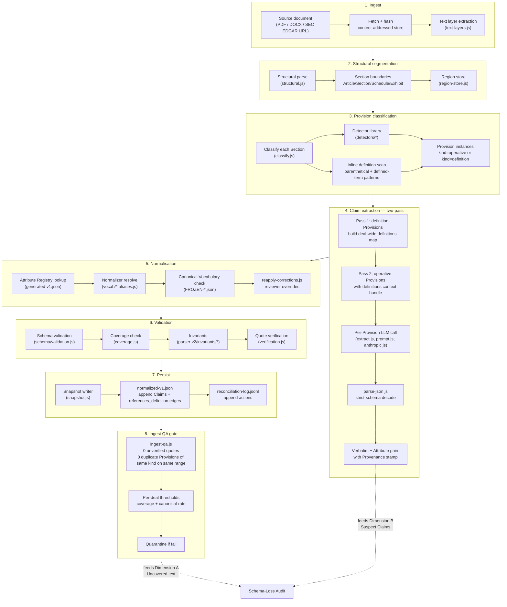

# Provision Processing Flow — Ingest to Claim

**Status:** Draft v2. Companion to `docs/schema-shape/provision-taxonomy-triple-model.md`.
**Rule:** Where this file describes runtime *behaviour*, the Taxonomy file governs the *shape* of the artefacts named here. If the two disagree on names or containment, the Taxonomy file wins.
**Scope:** Describes the end-to-end pipeline that turns one source document into a bag of Claims populating a Deal record. Uses Taxonomy vocabulary throughout — Deal, DealProfile, Section, Provision, Excerpt, Claim, Attribute, Verbatim, Canonical, Provenance, Normalizer, Attribute Registry, Canonical Vocabulary.

---

## 1. End-to-end pipeline

---

## 2. Stage-by-stage — what happens, what lands, what governs

| # | Stage | Reads | Writes | Governed by | Key files |
|---|---|---|---|---|---|
| 1 | **Ingest** | source URL / uploaded file | content-addressed blob + text layer | file-hash uniqueness | `ingest-agreements.js`, `text-layers.js`, `pages/api/ingest/from-url.js` |
| 2 | **Structural segmentation** | text layer | Section boundaries in Region store | topology detector | `structural.js`, `regions.js`, `region-store.js`, `topology-detector.js` |
| 3 | **Provision classification** | Sections | Provision instances of two kinds — `operative` and `definition`. Definitions may appear in a definitions Section (Article II typical) or inline within any other Section. Inline definitions are materialised as first-class definition-Provisions without removing text from the containing operative Provision's Excerpt. | Attribute Registry (which Provisions are known); inline-definition scanner (parenthetical `(the "X")`, italic-in-quotes, "means" clauses) | `classify.js`, `parser-v2/detectors/*`, `api/ingest/classify.js` |
| 4 | **Claim extraction — two-pass** | Provisions | Claim tuples (Attribute, Verbatim, Provenance); Canonical still empty. **Pass 1** extracts all definition-Provisions first and builds a deal-wide definitions map (`{term → definition-Provision-ID}`). **Pass 2** extracts operative-Provisions with the definitions bundle available in prompt context so cross-Section defined terms are resolvable. The operative prompt still sees the operative Excerpt in full — the definitions bundle is *additional* context, never a substitution. | prompt version + code SHA pinned in Provenance; two-pass ordering enforced by `run-extract.js` | `parser-v2/extract.js`, `run-extract.js`, `prompt.js`, `anthropic.js`, `parse-json.js` |
| 5 | **Normalisation** | Verbatim | Canonical | Attribute Registry (open) + Canonical Vocabulary (closed) + Normalizer rules | `lib/vocab/*-aliases.js`, `reapply-corrections.js`, `canonical-*.js` |
| 6 | **Validation** | Claims + Section text | pass/fail per-Claim | schema types, invariants, quote-tightness, `references_definition` targets exist | `schema/validation.js`, `parser-v2/invariants/*`, `verification.js`, `coverage.js` |
| 7 | **Persist** | validated Claims | `normalized-v1.json` (Claims + `references_definition` edges), `reconciliation-log.jsonl` | append-only for reconciliation log; snapshot pattern for normalized | `snapshot.js`, `store.js` |
| 8 | **Ingest QA gate** | persisted deal | quarantine flag or clean | 0 unverified quotes, 0 duplicate Provisions **of the same kind on the same byte-range** (overlapping Excerpts of *different-kind* Provisions are legal — that's how inline definitions coexist with their operative Provisions), per-deal thresholds | `ingest-qa.js` |

---

## 3. Where each Taxonomy node is born

| Taxonomy node | Created at stage | By what |
|---|---|---|
| **Deal** | 1 (Ingest) | first document creates the Deal record |
| **DealProfile** | 3 (Classify) — updated in 4 (Extract) | deal-level Claims extracted from cover pages, recitals, signature blocks |
| **Section** | 2 (Segment) | structural parser |
| **Provision (kind=operative)** | 3 (Classify) | classifier binds a known Attribute-Registry concept to a Section |
| **Provision (kind=definition)** | 3 (Classify) | classifier detects a defined-term pattern — either in a dedicated definitions Section or inline in any other Section |
| **`references_definition` edge** | 4 (Extract), pass 2 | operative extractor resolves cited terms against pass-1 definitions map |
| **Excerpt** | 4 (Extract) | LLM returns Verbatim + quote span → materialised as Excerpt (byte-range into source; overlaps across different-kind Provisions are legal) |
| **Claim** | 4 (Extract) → 5 (Normalise) — Canonical filled in stage 5 | extractor emits Attribute+Verbatim+Provenance; normaliser fills Canonical |
| **Attribute Registry entry** | out-of-band; governed via reviewer flow | `generate-registry.js`, `registry-review-suggestions.js` |
| **Canonical Vocabulary entry** | out-of-band; Freeze Gate PR only | `docs/vocab/FROZEN-*.json` |
| **Normalizer** | out-of-band; hand-authored or reviewer-approved | `lib/vocab/*-aliases.js` |
| **Provenance** | 4 (Extract) | stamped at LLM call; retained through 5–7 |

---

## 4. Gaps and improvements identified

Reading the pipeline against the Taxonomy surfaces the following weak points. Each is a candidate for a follow-up WP.

### G1. Provision-instance identity is implicit

**Problem.** A Provision is defined in the Taxonomy as "the instance in this deal of a named contractual concept". Today the classifier binds a concept to a Section but the resulting Provision has no stable ID separate from the Section. Re-ingestion can create a new Provision row even when the underlying concept is unchanged.
**Fix.** Give every Provision a deterministic ID = hash(deal_id, kind, concept_key, ordinal-within-section). Persist across re-ingestion. Enables Dimension-B "same Provision, different Claim over time" audits.
**Owning WP candidate:** `WP-PROVISION-ID-01`.

### G2. Excerpts are anonymous

**Problem.** Excerpts have Verbatim text and a Provenance location but no stable Excerpt ID. If an extractor is re-run and produces the same quote span, we can't tell whether it's the same Excerpt.
**Fix.** Excerpt ID = hash(document_hash, char_offset_start, char_offset_end). Deterministic. Lets re-runs be idempotent for Excerpt-scoped Claims.
**Owning WP candidate:** folds into G1 (`WP-PROVISION-ID-01`) — same PR.

### G3. Normalizer is scattered across `vocab/*-aliases.js` with no manifest

**Problem.** Taxonomy names Normalizer as a first-class governance surface. In code it's just files under `lib/vocab/`. No single manifest lists all Normalizers, their Attribute they apply to, or their version.
**Fix.** Add `lib/vocab/manifest.js` — one export listing `{ attribute, aliases_file, version, canonical_target_attribute }`. Load-time validated. Surface in `/admin/taxonomy` under the Normalizer node.
**Owning WP candidate:** `WP-NORMALIZER-MANIFEST-01`. Small.

### G4. Provenance is a bundle in the spec, a scatter of fields in code

**Problem.** Taxonomy Section 4 says Provenance is `{document, location, extractor, extracted_at, confidence}`. In practice these fields exist but not under one namespace — some live on the Claim row, some on the Excerpt, some in the reconciliation log.
**Fix.** Introduce a `provenance: {...}` sub-object on every persisted Claim. Migration writes existing fields into it; readers gain a stable path. Backwards-compatible via projection.
**Owning WP candidate:** `WP-PROVENANCE-BUNDLE-01`. Medium — touches persistence.

### G5. Extractor prompt version and code SHA are not systematically stamped

**Problem.** Provenance spec requires prompt version + code SHA. Some paths stamp them, some don't. Retrospective re-runs currently rely on file history rather than stamped Provenance.
**Fix.** Central `extractor-stamp.js` helper. Every LLM call routes through it. CI invariant refuses to persist a Claim without a fully populated Provenance.extractor.
**Owning WP candidate:** folds into G4.

### G6. Reconciliation log actions are string constants, not typed events

**Problem.** `reconciliation-log.jsonl` has 7 action types (MERGE, MOVE_FIELD, RECLASSIFY_FIELD, RECODE_FIELD, RESET_ENUM, SPLIT, SCHEMA_DEFERRED). No canonical mapping onto Taxonomy nodes/edges. Reviewers can't easily filter "all actions that moved a Claim's Attribute" vs "all actions that changed a Provision's Section-binding".
**Fix.** Add `taxonomy_target` field to each log entry: one of `{Deal, DealProfile, Section, Provision, Excerpt, Claim, Attribute, Canonical, Normalizer, Registry, ReferencesDefinitionEdge}`. Reviewers gain per-node filters.
**Owning WP candidate:** `WP-RECONCILIATION-TAG-01`. Additive, no schema break.

### G7. Ingest QA gate does not exercise the Normalizer

**Problem.** `ingest-qa.js` checks unverified quotes and duplicate clauses. Does not check "Verbatim resolved to a Canonical without invoking a Normalizer" (implicit identity mapping) vs "resolved via a specific Normalizer rule". Free-text drift can pass unnoticed.
**Fix.** Add QA check: every Canonical assignment must cite either identity (Verbatim == Canonical) or a Normalizer rule ID. Fail-open unresolved.
**Owning WP candidate:** `WP-NORMALIZER-CITATION-01`. Requires G3 first.

### G8. DealProfile Claims share their pipeline with Provision-scoped Claims

**Problem.** DealProfile Claims (parties, closing date, jurisdiction) go through the same extractor pipeline but they don't have an Excerpt — they're often synthesised from cover pages. In practice the pipeline sometimes attaches a spurious Excerpt to keep the schema happy.
**Fix.** Explicit DealProfile branch at stage 3: Attributes flagged `scope=deal` route to a lighter extractor that doesn't require an Excerpt (just Provenance). Update schema to make Excerpt nullable for `scope=deal` Attributes.
**Owning WP candidate:** `WP-DEALPROFILE-BRANCH-01`. Schema-touching. Fold into WP-DEFINITIONS-AS-PROVISIONS-01 in Phase 0.5 — both are "not every Provision-analogue has an Excerpt" changes.

### G9. No admin surface renders this flow

**Problem.** Taxonomy has `/admin/taxonomy` (WP-TAXONOMY-MAP-01). Runtime flow has nothing. New engineers or a handoff recipient can't see what stages a document goes through, or which files own each stage.
**Fix.** `/admin/processing-flow` — mermaid diagram from this document, click a stage to drill into the code paths and recent-run metrics (per-stage duration, per-stage failure counts). Deep-links to Provision-instance detail pages.
**Owning WP candidate:** `WP-PROCESSING-FLOW-MAP-01`. This is the picture-page. See Section 5 below.

### G10. Cross-Section definitions resolution is undefined

**Problem.** Extractor currently sees one Section's text at a time. When an operative Provision references a defined term whose definition-Provision lives in a different Section (e.g., operative clause in Article VII references "Superior Proposal" defined in Article II), there's no formal mechanism to resolve the term at extraction time.
**Fix.** Two-pass extraction (Section 2, stage 4). Pass 1 extracts all definition-Provisions first and builds a deal-wide definitions map. Pass 2 extracts operative-Provisions with the definitions bundle available as additional prompt context. **Inline definitions do not require pass ordering** — they live in the same Section as their operative Provision, so the operative extractor already sees the sentence including the parenthetical. Two-pass ordering matters only for cross-Section references.
**Owning WP candidate:** folds into `WP-DEFINITIONS-AS-PROVISIONS-01` in Phase 0.5.

### G11. Provision kind field is not persisted

**Problem.** Taxonomy v3 introduces `Provision.kind ∈ {operative, definition}` and the `references_definition` edge. Persisted schema does not yet carry these.
**Fix.** Add `kind` field to Provision; add `references_definition` edge array. Migration sets `kind=operative` on every existing Provision. Freeze Gate PR required.
**Owning WP candidate:** `WP-DEFINITIONS-AS-PROVISIONS-01` in Phase 0.5. This is the parent WP; G8 and G10 are sub-goals.

### GAP-A. Reprocess does not materialize claims (critical — corpus-blocking)

**Problem.** `scripts/reprocess.js` writes Provisions only (`ai_metadata.features` gets codes). It does not materialize `claims` — that is a separate step (`scripts/backfill/extract-to-cards.js` → `store-cards.js` → `storeClaimsForDeal`). Render reads Claims, so codes do not appear on screen until claims are re-materialized, even though extraction succeeded.
**Fix.** Build a robust post-reprocess claims-rematerialize step — either wire `reprocess.js` to call the claims writer directly, or ship a standalone claims-only rematerialize (`buildClaimRowsForCard` + `upsertClaims`, matching cards to provisions by `short_title==category`, no card rewrite). Must be tested on ≥3 deals before the corpus run in Section 8.
**Owning WP candidate:** `WP-CLAIMS-REMATERIALIZE-01`. Corpus-blocking — do not run the corpus reprocess unattended until this exists and is proven.

### GAP-B. `extract-to-cards.js` fails on NOSOL (region_hash collision)

**Problem.** `extract-to-cards.js` — the card-rewriting path referenced in GAP-A — fails on NOSOL provisions with the `provision_cards_deal_region_hash_unique` constraint. Verified on Metsera: provisions and cards were out of sync (15 provisions vs 22 cards, NULL region_ids). The claims-only rematerialize (bypasses card rewrite entirely) is the path that worked.
**Fix.** Either fix `extract-to-cards.js`'s region_hash handling for deals with NULL region_ids, or standardize on the claims-only rematerialize as the supported path — folds into GAP-A's fix.
**Owning WP candidate:** folds into `WP-CLAIMS-REMATERIALIZE-01`.

### GAP-C. NOSOL reprocess churns extraction

**Problem.** Repeated NOSOL reprocess runs on Metsera moved the QA nosol count across runs (22 → 16 → 15). Duplicate cards pre-exist (Change-of-Recommendation ×4, Disclosure ×3). Card/claim stability across repeated reprocess is not yet validated.
**Fix.** Validate card stability across repeated reprocess runs before scaling to the full corpus; likely needs NOSOL provision de-duplication.
**Owning WP candidate:** `WP-NOSOL-DEDUP-01`.

### GAP-E. Residual capture is silent-drop-to-fallback, with no feedback loop (proposed)

**Problem.** Forced categorization needs an escape hatch at both coding altitudes (§ 7): an `unclassified` / `other` outcome at the provision level, and an `OTHER` / no-code outcome at the feature level, for the cases where nothing in the vocabulary truly fits. Today the only escape hatch is the transition-safe regex fallback — a migration artefact that **silently degrades to prior text**. When the model sees a value that fits no code, that fact is not captured, not flagged, and not surfaced for review. Nothing feeds vocabulary expansion, so misfits are invisible and the vocabulary cannot learn what it is missing. A plausible-but-wrong forced code reads as correct and is worse than no code.
**Fix.** Make residuals first-class at both altitudes: an explicit `unclassified` provision bucket and an explicit `OTHER` / verbatim-only feature outcome, both **captured and flagged for review** rather than dropped. Add the feedback loop `residual → review → Freeze Gate PR to add frozen codes`, so recurring residual variants become new codes and the Canonical Vocabulary widens only through the freeze gate. See `provision-taxonomy-triple-model.md` § 8.5.
**Owning WP candidate:** `WP-RESIDUAL-CAPTURE-01`. Proposed — not yet built.

---

## 5. Proposed WP-PROCESSING-FLOW-MAP-01

**Sibling of WP-TAXONOMY-MAP-01 inside Phase 0-D.** Read-only reference page. No schema changes. No new writes.

**Ships:** `/admin/processing-flow`.

**Renders, top to bottom:**
1. **This document (`docs/schema-shape/provision-processing-flow.md`) top panel** — mermaid + prose, exactly like `/admin/taxonomy` renders the Taxonomy file.
2. **Stage cards** — one card per stage 1–8, each showing:
   - stage name and one-line description
   - owning file paths (links open in a repo browser modal)
   - last-run metrics (median duration, failure count last 24h, quarantine count)
   - per-stage Taxonomy nodes emitted/consumed
3. **Gap panel** — collapsed by default. Renders G1–G11 above with owning WP candidate. Marks each with status: `open | scheduled | in-progress | done`. Sourced from `docs/schema-shape/processing-flow-gaps.json`.
4. **Legend** — links out to Taxonomy page and to Master Brief Section 2.9.

**Files produced:**
- `pages/admin/processing-flow.js`
- `pages/api/admin/processing-flow/metrics.js`
- `components/admin/processing-flow/{StageDiagram,StageCard,GapPanel}.jsx`
- `docs/schema-shape/provision-processing-flow.md` (this file, Codex-read-only)
- `docs/schema-shape/processing-flow-gaps.json` (data behind gap panel)
- `tests/admin/processing-flow.spec.js`

**Preflight:** must exist on `origin/main` at start of the WP → `docs/schema-shape/provision-processing-flow.md` + `docs/schema-shape/provision-taxonomy-triple-model.md` + `docs/schema-shape/processing-flow-gaps.json`. Otherwise `BLOCKED-P0-D-flow-doc-missing.md`.

**Manifest additions to Section 2.5:** all files above, Codex-read-only for the two doc files and the gap-JSON.

**Merge order within Phase 0-D:** parallel with WP-TAXONOMY-MAP-01 after CLEANUP lands the nav-registry refactor — both are pure-read admin pages sharing the same nav registry.

---

## 6. Cross-reference

- **Taxonomy of artefacts** — `docs/schema-shape/provision-taxonomy-triple-model.md` (companion, static shape).
- **Master brief Section 2.9** — Phase 0-D structure. WP-PROCESSING-FLOW-MAP-01 slots here.
- **Phase 0.5 WP-DEFINITIONS-AS-PROVISIONS-01** — realises Provision `kind` field, `references_definition` edge, two-pass extraction, and DealProfile branch. Behind Freeze Gate PR.
- **Frozen status** — this document becomes FROZEN under G-0C once approved, alongside the Taxonomy file.

---

## 7. Canonical-coding pipeline (Section-B taxonomy)

Companion detail to Section 2's generic 8-stage pipeline. Canonical-coding is **not a new top-level stage** — it is a stricter mode of the stages already in Section 2. Its only real effect is to pull the normalization decision forward: instead of stage 4 extracting free text and stage 5 mapping it to a Canonical after the fact via a Normalizer, the closed codebook is handed to the model inside the stage-4 extraction call and the model assigns the Canonical itself. For a coded feature the code *is* the Canonical, and stage 5 degrades to a validation that the returned code is legal. Render (`labelForCode`) then sits after stage 8 in the review UI. See `provision-taxonomy-triple-model.md` § 8 for the full model.

**Two altitudes of categorization.** Coding happens at two distinct altitudes, which must not be conflated:

- **Altitude 1 — provision-type bucketing (stage 3, Classify).** Binds a Section to *which contractual concept it is* (No-Shop, MAC, termination fee, boilerplate). This picks the bucket, which determines the rubric — and therefore the coded features — that apply downstream.
- **Altitude 2 — feature coding (stage 4, Extract).** *Within* the chosen bucket, the rubric declares which features are coded via the `list-tagged` / `tagged` flag. Only flagged features get a codebook embedded in the prompt and a `{code, label, text}` return shape; everything else is free text.

Altitude 1 chooses the concept; the concept's rubric declares its coded features; altitude 2 fills the codes.

**Provision granularity (what altitude 1 operates on).** A Provision is the smallest independently-comparable contractual concept, not a structural container — so classification granularity is concept-driven, not pinned to the Article/Section the document happens to use. It cuts both ways: a Reps Section **explodes** into one Provision per individual rep (real: `splitUmbrellaRep` in `lib/parser-v2/extract.js`; the rubric carries one concept row per rep — `REP-T-ORG`, `REP-T-CAP`, …), whereas a no-shop **stays one Provision** with its variation captured as coded features inside (the `SOLICITATION_ACT` list, the superior-proposal determiner). Split to the level at which the comparison question is asked, no finer. Two orthogonal axes ride on each Provision: **scope** (`party` on the provision type — `REP-T`/`IOC-T` = target, `REP-B`/`IOC-B` = buyer) and **concept identity** (which rep/covenant). The persisted cross-deal identity is the pair `(provisions.type, provisions.category)` — there is no single `concept_key` column today; see `provision-taxonomy-triple-model.md` § 8.6 for the verified field mapping and § 8.7 for the enum-code vs numeric-normalization distinction.

Verified end-to-end on the Metsera deal (2026-07-10):

1. **Rubric declares the feature `type`** — `list-tagged` or `tagged` on the feature entry in `lib/rubric.js` is what makes a feature taxonomy-coded.
2. **Registry pipeline propagates the type** — `scripts/schema-inventory.js` → `scripts/generate-registry.js` → `lib/schema/features.generated.js` / `tags.generated.js`, drift-guarded by `tests/registry-generated-drift.test.js`. `lib/schema/features.js` (the persistence gate the prompt actually reads) is hand-curated and must be kept in sync by hand.
3. **Prompt requests codes** — `lib/schema/prompt.js` `valueShape` emits a coded-object shape (`{code,label,text}`, single or array) keyed on the rubric type, with the codebook embedded from the feature's taxonomy dictionary.
4. **Extraction assigns codes** — the model returns `{code,label,text}`, landing in `provisions.ai_metadata.features`.
5. **Claims materialization** — `store-claims.js` `atomicValues` reads `.code` off list, scalar, and citable-wrapped shapes into `claims.canonical`.
6. **Render** — `lib/queries/claims-adapter.js` calls `labelForCode(code, taxonomyForFeatureKey(key))` to produce the canonical pill, falling back to the prior text when no code is present yet.

## 8. Corpus plan (proposed)

Proposed plan for scaling canonical-coding from the proven Metsera case to the full corpus. Not yet executed — for review before the corpus reprocess runs.

**Prereq.** Build and test a robust claims-only rematerialize (GAP-A / GAP-B above) on approximately 3 deals, to validate that card↔provision matching by `short_title==category` holds beyond Metsera.

**Then, in order:**
1. `reprocess.js --all --types NOSOL,MISC,TERMF --apply` — extraction pass, writes codes into `provisions.ai_metadata`.
2. Claims-only rematerialize, run across all deals — moves codes from provisions into `claims.canonical`.
3. Verify code population and spot-check quality per deal.
4. Delete the render-time regex fallbacks named in `provision-taxonomy-triple-model.md` § 8.4 — only once corpus-wide code population is confirmed; the regexes stay as the transition-safe path until then.
