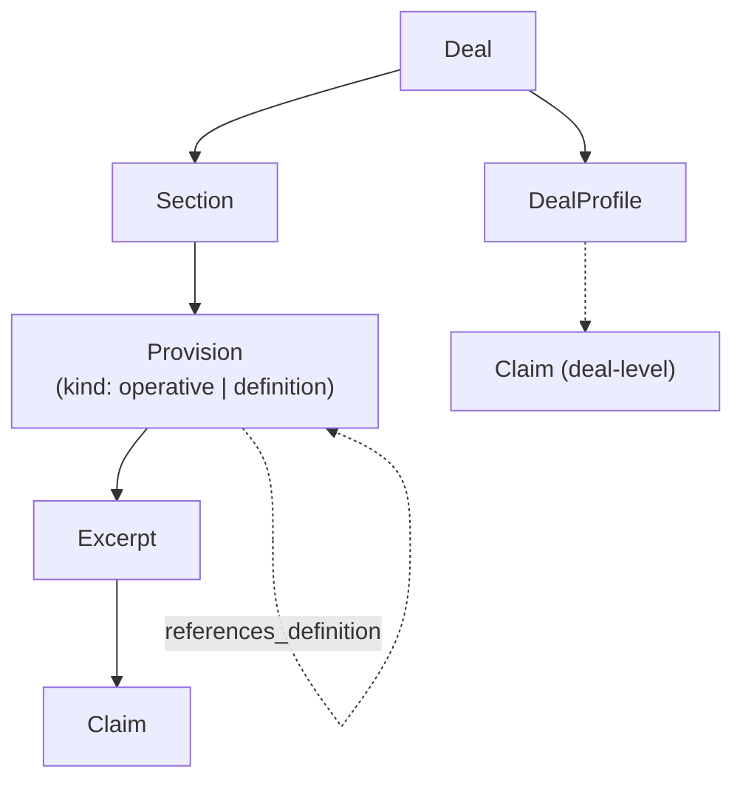
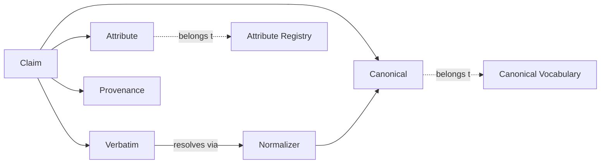

# Provision Taxonomy — Claim Model

**Status:** Draft v3. Supersedes v2 once approved and merged.
**Rule:** This file is the single source of truth for all schema-hierarchy language across specs, WPs, admin UI, and code. Where any spec disagrees with this file, this file wins.

---

## 1. Containment — how the deal record is structured



- **Deal** — the transaction record, aggregating all agreements and metadata for one M&A transaction.
- **DealProfile** — deal-level descriptive attributes (parties, closing date, jurisdiction, deal size, industry). Holds `Claim`s that describe the deal as a whole rather than any specific Provision.
- **Section** — a structural container as it appears in the source document, regardless of whether the document labels it Article, Section, Part, or Schedule.
- **Provision** — the instance in this deal of a named contractual concept (e.g., the MAC provision, the specific-performance provision, the fiduciary out, a defined term). Provision is the *instance*; the market-level concept lives in the Attribute Registry. Every Provision has a **kind** — see Section 2.
- **Excerpt** — the verbatim text quoted from the source document as evidence for the Claims made about the Provision. One Provision typically has one Excerpt but may have several, **including Excerpts drawn from different Sections of the same document** (e.g., a definition in Article II plus the operative clause in Article VII that uses it). Excerpts are byte-ranges into the immutable source document; overlapping Excerpts across different Provisions are legal.
- **Claim** — an extracted fact. Every Claim hangs off either an Excerpt (Provision-level Claim) or a DealProfile (deal-level Claim). See Section 3.

---

## 2. Provision kinds and the `references_definition` edge

Every Provision has a **kind**:

- **operative** — a substantive clause that does something contractual (No-Shop, MAC, fiduciary out, termination fee, specific performance, closing conditions, etc.). This is the default kind.
- **definition** — a Provision whose sole purpose is to define a term used elsewhere in the deal (e.g., "Company Proposal", "Material Adverse Effect", "Superior Proposal"). Its Excerpt is the text that defines the term. Its Claims describe the shape of the definition (what's included, what's carved out).

Definitions may appear in a dedicated definitions Section (Article II is typical) **or inline within another Section** — e.g., "…acquire the Company (a *Company Proposal*), except…" appearing inside the No-Shop Section. In both cases the definition-Provision is materialised as a first-class row.

**Non-destructive rule.** Materialising an inline definition as a definition-Provision **does not remove any text from the containing operative Provision's Excerpt**. The operative Excerpt is byte-preserved. The definition-Provision's Excerpt is an additional byte-range pointing at the same source document — often overlapping the operative Excerpt. Definitions are *copied by reference* (via an ID edge), never physically snipped out of source text.

**The `references_definition` edge.** Operative Provisions that use a defined term carry a typed edge `references_definition → Provision(kind=definition)`. Multiple references are allowed. The edge enables market-level queries such as "show me every deal where *Company Proposal* is defined to include tail-period triggers" without re-parsing source text.

**Schema realisation.** The Provision `kind` field and the `references_definition` edge are declared here in v3 for design alignment but are realised in the persisted schema in **Phase 0.5**, behind a Freeze Gate PR. Phase 0-D admin pages must render the concepts correctly and may show `kind=operative` as an implicit default for every existing Provision.

---

## 3. Claim structure — the anatomy of one extracted fact

A **Claim** is a 4-tuple:



- **Attribute** — the key that says what this Claim is about (e.g., `notice_period_days`, `mac_carveout_type`, `governing_law`). Attributes are appendable — new ones can be added by reviewers via the Attribute Registry.
- **Verbatim** — the value exactly as written in the Excerpt (e.g., `"thirty (30) business days"`, `"New York law"`). Byte-for-byte from the source; no normalisation.
- **Canonical** — the normalised enum value (e.g., `30`, `NY`, `MAC_CARVEOUT_MARKET_WIDE`). Canonicals are closed — new ones can only be added by opening a Freeze Gate PR.
- **Provenance** — a bundle describing where this Claim came from. See Section 4.

The mapping from Verbatim to Canonical is done by a **Normalizer** — a directional lookup rule of the form `(Verbatim pattern → Canonical value)`. Normalizers are reusable across Claims and are themselves versioned artefacts.

---

## 4. Provenance — the anatomy of one Claim's origin

Provenance is a bundle, not a single string. It records:

- **document** — file identity and content hash of the source document.
- **location** — page number plus character offset, or paragraph/section anchor. Must be precise enough to re-locate the Excerpt on re-ingestion.
- **extractor** — model name, prompt version, and code SHA of the extraction pipeline that produced this Claim. Enables retrospective re-runs when the extractor improves.
- **extracted_at** — UTC timestamp of extraction.
- **confidence** — the extractor's self-reported confidence in the Claim, if any. Nullable.

---

## 5. Governance surfaces

Two named governance layers control what Attributes and Canonicals are legal:

- **Attribute Registry** — the set of legal Attribute keys. Open and appendable. Reviewers can add new Attributes as new deal patterns emerge. Every Claim's Attribute must exist in the Registry at extraction time.
- **Canonical Vocabulary** — the set of legal Canonical values per Attribute. Closed and freeze-gated. New Canonicals can only be added via a Freeze Gate PR (see Section 2.7 of the master brief). Every Claim's Canonical must exist in the Vocabulary at extraction time.

Attributes without any Canonical Vocabulary entries (i.e., free-text Attributes) are permitted but must be explicitly flagged as free-text in the Registry.

---

## 6. Cross-reference — where these terms appear

- **Phase 0-D WP-TAXONOMY-MAP-01** — `/admin/taxonomy` page renders this document as its top panel, then shows live counts per node type from `normalized-v1.json`, then the legacy-code alias table.
- **Phase 0-D WP-PROCESSING-FLOW-MAP-01** — `/admin/processing-flow` page renders the companion document `provision-processing-flow.md` and shows which pipeline stage each node in this Taxonomy is born at.
- **Phase 0-D WP-SCHEMA-LOSS-AUDIT-01, Dimension B** — the six claim-integrity checks (B1–B6) map onto the nodes and edges of this diagram. See master brief Section 2.9.
- **Phase 0.5 WP-DEFINITIONS-AS-PROVISIONS-01** — realises the Provision `kind` field and the `references_definition` edge in the persisted schema; migrates existing normalized-v1.json to set `kind=operative` on every existing Provision; adds two-pass extraction so cross-Section defined terms are resolvable.
- **Frozen files** — this document is FROZEN under gate G-0C once approved. Codex must never edit it without a Freeze Gate PR.

---

## 7. Worked example — one Claim end to end

Source: `Merger Agreement, ACME/Widget, dated 2025-03-03`

- **Deal** = ACME/Widget merger
- **Section** = "Article VII — Termination"
- **Provision** = "Termination fee owed by Widget on superior-proposal exit" (kind: `operative`)
- **Excerpt** = "Widget shall pay to ACME a termination fee of $45,000,000 (the *Termination Fee*) in immediately available funds within two (2) Business Days after such termination…"
- **Claims** (three of many):
  - `Attribute = termination_fee_amount_usd` · `Verbatim = "$45,000,000"` · `Canonical = 45000000` · Provenance stamped
  - `Attribute = termination_fee_deadline_days` · `Verbatim = "two (2) Business Days"` · `Canonical = 2` · Provenance stamped
  - `Attribute = termination_fee_currency` · `Verbatim = "$"` · `Canonical = "USD"` · Provenance stamped
- **Additional Provision** = "Definition of Termination Fee" (kind: `definition`)
  - Same Section (Article VII, byte-range overlapping the operative Excerpt) — because the definition is inline as `(the "Termination Fee")`.
  - Excerpt = the parenthetical span, byte-preserved.
  - Claims describe the shape of the defined term.
- **Edge** — the operative Provision carries `references_definition → definition-Provision(Termination Fee)`.
- Nothing was removed from the operative Excerpt. Both Provisions coexist against the same source bytes.

---

## 8. Canonical-coding model — concept → code → render

Section 3 defines Canonical as "the normalised enum value" reached via a Normalizer resolving Verbatim text. The Section-B feature families below are a stricter case of the same idea: instead of a post-hoc regex/Normalizer resolving free text after the fact, the extraction model is asked to assign the Canonical **at extraction time**, from a fixed codebook embedded in the prompt. Concept, code, and render are one continuous chain with no separate normalization pass.

### 8.1 The six hops

```
1. Rubric declares the feature `type`.
   list-tagged (list of coded items) or tagged (single coded scalar) is what
   makes a feature taxonomy-coded. Plain list/text/string does NOT get codes.
   — lib/rubric.js

2. Pipeline propagates the type.
   scripts/schema-inventory.js scans rubric -> inventory;
   scripts/generate-registry.js reads the inventory + featureKeyMappings
   (key -> codebook) -> lib/schema/features.generated.js + tags.generated.js.
   Drift-guarded by tests/registry-generated-drift.test.js.
   NOTE: lib/schema/features.js (the persistence gate the prompt reads) is
   HAND-CURATED, not generated -- must be kept in sync by hand.

3. Prompt requests codes.
   lib/schema/prompt.js valueShape emits "array of tagged objects
   {code,label,text}" (list-tagged) / "tagged object {code,label,text}"
   (tagged), keyed on the rubric type via schemaFeatureFor's legacyType.
   Codebook embedded from TAGS.

4. Extraction assigns codes.
   Model returns {code,label,text}; lands in provisions.ai_metadata.features.

5. Claims materialization.
   store-claims.js atomicValues reads .code -> claims.canonical. Extracts
   codes from list, scalar, and citable-wrapped shapes.

6. Render.
   claims-adapter -> labelForCode(code, taxonomyForFeatureKey(key)) ->
   canonical pill. Transition-safe: falls back to prior text when code
   is absent.
```

### 8.2 What `list-tagged` / `tagged` means

A rubric feature's `type` is the gate. Only `list-tagged` (a list where each item is a coded object) and `tagged` (a single coded scalar) cause the prompt to request `{code, label, text}` and embed the feature's codebook. Every other rubric `type` — `list`, `text`, `string`, etc. — is extracted as free text only and never receives a Canonical code, regardless of whether a taxonomy dictionary exists for that key.

### 8.3 Coded Section-B feature families

The following feature keys are coded so far, each backed by a dictionary in `lib/taxonomy.js` and registered in `taxonomyForFeatureKey`:

- **INTEREST_RATE_BASIS** — rubric type `tagged`, feature key `interestRateBasis` (TERMF). WSJ/named-bank prime, Treasury, LIBOR, or fixed rate.
- **SOLICITATION_ACT** — rubric type `list-tagged`, 15 codes spanning prohibit / cease / change-of-recommendation acts. **Shared by two feature keys** on NOSOL: `ceaseDiscussionsProhibitedList` and `changeOfRecommendationItems`. The extraction prompt scopes each key to its own code subset (prohibit/cease codes for the no-shop list, COR codes for the change-of-recommendation list) — a COR item must never be tagged with a pure no-shop code or vice versa.
- **SUPERIOR_DETERMINER** — rubric type `tagged`, feature key `superiorProposalDeterminer` (NOSOL). Who decides a proposal is superior (Board only / Board with advisors) plus advisor tier. The qualifying threshold percentage is a separate scalar (`superiorProposalThresholdPct`), not part of this code.
- **GOVERNING_LAW** — rubric type `tagged`, feature key `governingLaw` (MISC).
- **ASSIGNMENT_PARENT_EXCEPTION** — rubric type `list-tagged`, feature key `parentAssignmentConditions` (MISC).

### 8.4 `labelForCode` — code to rendered pill

`lib/taxonomy.js`'s `labelForCode(code, dict)` looks up a code against the dictionary returned by `taxonomyForFeatureKey(key)` and returns the canonical label string. Review-table configs (e.g. `components/review/table-configs/nosol-noshop.config.js`, `misc-boilerplate.config.js`) call it to render a canonical pill instead of a regex-derived label. Every render site is **transition-safe**: if a provision's `claims.canonical` has no code yet (pre-reprocess, or extraction didn't populate one), the config falls back to the prior regex-derived text rather than showing nothing. The regex fallbacks are kept in place until a corpus-wide reprocess confirms codes are populated on all deals, at which point they can be deleted (see `provision-processing-flow.md` § 8, Corpus plan).
